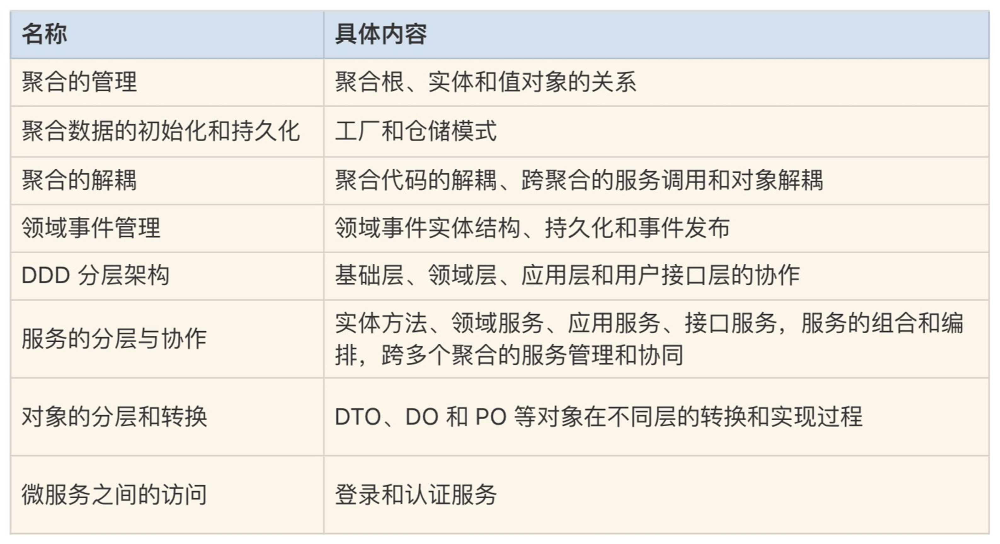

# 基于 DDD 的微服务设计实例代码详解

还记得我们在 [[第 18 讲]](../03/08.md) 中用事件风暴完成的「在线请假考勤」项目的领域建模和微服务设计吗？今天我们就在这个项目的基础上看看，用 DDD 方法设计和开发出来的微服务代码到底是什么样的？点击 [Github 获取完整代码](https://github.com/zq99299/leave-sample) ，接下来的内容是我对代码的一个详解，期待能帮助你更好地实践我们这个专栏所学到的知识。

::: tip

请参考 GitHub 代码阅读本章，笔者这里没有装 PostgreSQL 数据库，也就没有运行过该代码

:::

## 项目回顾

「在线请假考勤」项目中，请假的核心业务流程是：

1. 请假人填写请假单提交审批；

2. 根据请假人身份、请假类型和请假天数进行校验并确定审批规则；

3. 根据审批规则确定审批人，逐级提交上级审批，逐级核批通过则完成审批，否则审批不通过则退回申请人。

在 [第 18 讲] 的微服务设计中，我们已经拆分出了两个微服务：请假和考勤微服务。今天我们就围绕「请假微服务」来进行代码详解。微服务采用的开发语言和数据库分别是：Java、Spring boot 和 PostgreSQL。

## 请假微服务采用的 DDD 设计思想

请假微服务中用到了很多的 DDD 设计思想和方法，主要包括以下几个：



## 聚合中的对象

请假微服务包含请假（leave）、人员（person）和审批规则（rule）三个聚合。

- leave 聚合完成请假申请和审核核心逻辑；
- person 聚合管理人员信息和上下级关系；
- rule 是一个单实体聚合，提供请假审批规则查询。

Leave 是请假微服务的核心聚合，它有请假单聚合根 leave、审批意见实体 ApprovalInfo、请假申请人 Applicant 和审批人 Approver 值对象（它们的数据来源于 person 聚合），还有部分枚举类型，如请假类型 LeaveType，请假单状态 Status 和审批状态类型 ApprovalType 等值对象。

下面我们通过代码来了解一下聚合根、实体以及值对象之间的关系。

### 1. 聚合根

聚合根 leave 中有属性、值对象、关联实体和自身的业务行为。**Leave 实体采用充血模型** ，有自己的业务行为，具体就是聚合根实体类的方法，如代码中的 getDuration 和 addHistoryApprovalInfo 等方法。

聚合根引用实体和值对象，它可以组合聚合内的多个实体，在聚合根实体类方法中完成复杂的业务行为，这种复杂的业务行为也可以在聚合领域服务里实现。但为了职责和边界清晰，我建议聚合要根据自身的业务行为在实体类方法中实现，而涉及多个实体组合才能实现的业务能力由领域服务完成。下面是聚合根 leave 的实体类方法，它包含属性、对实体和值对象的引用以及自己的业务行为和方法。

```java

public class Leave {
    String id;
    Applicant applicant;
    Approver approver;
    LeaveType type;
    Status status;
    Date startTime;
    Date endTime;
    long duration;
    int leaderMaxLevel; //审批领导的最高级别
    ApprovalInfo currentApprovalInfo;
    List<ApprovalInfo> historyApprovalInfos; 

    public long getDuration() {
        return endTime.getTime() - startTime.getTime();
    }

    public Leave addHistoryApprovalInfo(ApprovalInfo approvalInfo) {
        if (null == historyApprovalInfos)
            historyApprovalInfos = new ArrayList<>();
        this.historyApprovalInfos.add(approvalInfo);
        return this;
    } 

    public Leave create(){
        this.setStatus(Status.APPROVING);
        this.setStartTime(new Date());
        return this;
}

//其它方法
}
```

### 2. 实体

审批意见实体 ApprovalInfo 被 leave 聚合根引用，用于记录审批意见，它有自己的属性和值对象，如 approver 等，业务逻辑相对简单。

```java

public class ApprovalInfo {
    String approvalInfoId;
    Approver approver;
    ApprovalType approvalType;
    String msg;
    long time;
}
```

### 3. 值对象

在 Leave 聚合有比较多的值对象。

我们先来看一下审批人值对象 Approver。这类值对象除了属性集之外，还可以有简单的数据查询和转换服务。**Approver 数据来源于 person 聚合** ，从 person 聚合获取审批人返回后，从 person 实体获取 personID、personName 和 level 等属性，**重新组合为 approver 值对象** ，因此需要数据转换和重新赋值。

Approver 值对象同时被聚合根 leave 和实体 approvalInfo 引用。这类值对象的数据来源于其它聚合，不可修改，可重复使用。将这种对象设计为值对象而不是实体，可以提高系统性能，降低数据库实体关联的复杂度，所以我一般建议优先设计为值对象。

```java

public class Approver {
    String personId;
    String personName;
    int level; //管理级别

    public static Approver fromPerson(Person person){
        Approver approver = new Approver();
        approver.setPersonId(person.getPersonId());
        approver.setPersonName(person.getPersonName());
        approver.setLevel(person.getRoleLevel());
        return approver;
    }
}
```

下面是枚举类型的值对象 Status 的代码。

```java

public enum Status {
    APPROVING, APPROVED, REJECTED
}
```

这里你要记住一点，**由于值对象只做整体替换、不可修改的特性，在值对象中基本不会有修改或新增的方法** 。

### 4. 领域服务

**如果一个业务行为由多个实体对象参与完成，我们就将这部分业务逻辑放在领域服务中实现。** 领域服务与实体方法的区别是：

- 实体方法完成单一实体自身的业务逻辑，是相对简单的原子业务逻辑
- 而领域服务则是多个实体组合出的相对复杂的业务逻辑。

两者都在领域层，实现领域模型的核心业务能力。

一个聚合可以设计一个领域服务类，管理聚合内所有的领域服务。

请假聚合的领域服务类是 LeaveDomainService。领域服务中会用到很多的 DDD 设计模式，比如：用工厂模式实现复杂聚合的实体数据初始化，用仓储模式实现领域层与基础层的依赖倒置和用领域事件实现数据的最终一致性等。

```java

public class LeaveDomainService {

    @Autowired
    EventPublisher eventPublisher;
    @Autowired
    LeaveRepositoryInterface leaveRepositoryInterface;
    @Autowired
    LeaveFactory leaveFactory;

    @Transactional
    public void createLeave(Leave leave, int leaderMaxLevel, Approver approver) {
            leave.setLeaderMaxLevel(leaderMaxLevel);
            leave.setApprover(approver);
            leave.create();
    leaveRepositoryInterface.save(leaveFactory.createLeavePO(leave));
    LeaveEvent event = LeaveEvent.create(LeaveEventType.CREATE_EVENT, leave);
    leaveRepositoryInterface.saveEvent(leaveFactory.createLeaveEventPO(event));
    eventPublisher.publish(event);
    }

    @Transactional
    public void updateLeaveInfo(Leave leave) {
    LeavePO po = leaveRepositoryInterface.findById(leave.getId());
        if (null == po) {
                throw new RuntimeException("leave does not exist");
         }
     leaveRepositoryInterface.save(leaveFactory.createLeavePO(leave));
    }

    @Transactional
    public void submitApproval(Leave leave, Approver approver) {
       LeaveEvent event;
       if (ApprovalType.REJECT == leave.getCurrentApprovalInfo().getApprovalType()) {
       leave.reject(approver);
       event = LeaveEvent.create(LeaveEventType.REJECT_EVENT, leave);
       } else {
             if (approver != null) {
                 leave.agree(approver);
                 event = LeaveEvent.create(LeaveEventType.AGREE_EVENT, leave); } else {
                    leave.finish();
                    event = LeaveEvent.create(LeaveEventType.APPROVED_EVENT, leave);
                    }
           }
      leave.addHistoryApprovalInfo(leave.getCurrentApprovalInfo());
      leaveRepositoryInterface.save(leaveFactory.createLeavePO(leave));
      leaveRepositoryInterface.saveEvent(leaveFactory.createLeaveEventPO(event));
      eventPublisher.publish(event);
    }

    public Leave getLeaveInfo(String leaveId) {
    LeavePO leavePO = leaveRepositoryInterface.findById(leaveId);
    return leaveFactory.getLeave(leavePO);
    }

    public List<Leave> queryLeaveInfosByApplicant(String applicantId) {
        List<LeavePO> leavePOList = leaveRepositoryInterface.queryByApplicantId(applicantId);
    return leavePOList.stream().map(leavePO -> leaveFactory.getLeave(leavePO)).collect(Collectors.toList());
    }

    public List<Leave> queryLeaveInfosByApprover(String approverId) {
    List<LeavePO> leavePOList = leaveRepositoryInterface.queryByApproverId(approverId);
    return leavePOList.stream().map(leavePO -> leaveFactory.getLeave(leavePO)).collect(Collectors.toList());
    }
}
```

**领域服务开发时的注意事项：**

在领域服务或实体方法中，**我们应尽量避免调用其它聚合的领域服务或引用其它聚合的实体或值对象** ，这种操作会增加聚合的耦合度。在微服务架构演进时，如果出现聚合拆分和重组，这种跨聚合的服务调用和对象引用，会变成跨微服务的操作，导致这种跨聚合的领域服务调用和对象引用失效，在聚合分拆时会增加你代码解耦和重构的工作量。

以下是一段 **不建议使用** 的代码。在这段代码里 Approver 是 leave 聚合的值对象，它作为对象参数被传到 person 聚合的 findNextApprover 领域服务。如果在同一个微服务内，这种方式是没有问题的。但在架构演进时，如果 person 和 leave 两个聚合被分拆到不同的微服务中，那么 leave 中的 Approver 对象以及它的 getPersonId() 和 fromPersonPO 方法在 person 聚合中就会失效，这时你就需要进行代码重构了。

```java

public class PersonDomainService {

   public Approver findNextApprover(Approver currentApprover, int leaderMaxLevel) {
   PersonPO leaderPO = personRepository.findLeaderByPersonId(currentApprover.getPersonId());
        if (leaderPO.getRoleLevel() > leaderMaxLevel) {
            return null;
        } else {
            return Approver.fromPersonPO(leaderPO);
        }
   }
}
```

那正确的方式是什么样的呢？在应用服务组合不同聚合的领域服务时，我们可以通过 ID 或者参数来传数，如单一参数 currentApproverId。这样聚合之间就解耦了，下面是修改后的代码，它可以不依赖其它聚合的实体，独立完成业务逻辑。

```java

public class PersonDomainService {
   
   public Person findNextApprover(String currentApproverId, int leaderMaxLevel) {
   PersonPO leaderPO = personRepository.findLeaderByPersonId(currentApproverId);
   if (leaderPO.getRoleLevel() > leaderMaxLevel) {
       return null;
    } else {
            return personFactory.createPerson(leaderPO);
      }
  }
}
```

## 领域事件

在创建请假单和请假审批过程中会产生领域事件。为了方便管理，我们将聚合内的领域事件相关的代码放在聚合的 event 目录中。领域事件实体在聚合仓储内完成持久化，但是事件实体的生命周期不受聚合根管理。

### 1. 领域事件基类 DomainEvent

你可以建立统一的领域事件基类 DomainEvent。基类包含：事件 ID、时间戳、事件源以及事件相关的业务数据。

```java
public class DomainEvent {
    String id;
    Date timestamp;
    String source;
    String data;
}
```

### 2. 领域事件实体

请假领域事件实体 LeaveEvent 继承基类 DomainEvent。可根据需要扩展属性和方法，如 leaveEventType。data 字段中存储领域事件相关的业务数据，可以是 XML 或 Json 等格式。

```java

public class LeaveEvent extends DomainEvent {
    LeaveEventType leaveEventType;
    public static LeaveEvent create(LeaveEventType eventType, Leave leave){
       LeaveEvent event = new LeaveEvent();
       event.setId(IdGenerator.nextId());
       event.setLeaveEventType(eventType);
       event.setTimestamp(new Date());
       event.setData(JSON.toJSONString(leave));
       return event;
    }
}
```

### 3. 领域事件的执行逻辑

一般来说，领域事件的执行逻辑如下：

1. 执行业务逻辑，产生领域事件。

2. 完成业务数据持久化。

   ```java
   leaveRepositoryInterface.save(leaveFactory.createLeavePO(leave));
   ```

3. 完成事件数据持久化。

   ```java
   leaveRepositoryInterface.saveEvent(leaveFactory.createLeaveEventPO(event));
   ```

4. 完成领域事件发布。

   ```java
   eventPublisher.publish(event); 
   ```

以上领域事件处理逻辑代码详见 LeaveDomainService 中 submitApproval 领域服务，里面有请假提交审批事件的完整处理逻辑。

### 4. 领域事件数据持久化

为了保证事件发布方与事件订阅方数据的最终一致性和数据审计，有些业务场景需要建立数据对账机制。数据对账主要通过对源端和目的端的持久化数据比对，从而发现异常数据并进一步处理，保证数据最终一致性。

对于需要对账的事件数据，我们需设计领域事件对象的持久化对象 PO，完成领域事件数据的持久化，如 LeaveEvent 事件实体的持久化对象 LeaveEventPO。再通过聚合的仓储完成数据持久化：

```java
leaveRepositoryInterface.saveEvent(leaveFactory.createLeaveEventPO(event))。
```

事件数据持久化对象 LeaveEventPO 格式如下：

```java
public class LeaveEventPO {
    @Id
    @GenericGenerator(name = "idGenerator", strategy = "uuid") 
    @GeneratedValue(generator = "idGenerator")
    int id;
    @Enumerated(EnumType.STRING)
    LeaveEventType leaveEventType;
    Date timestamp;
    String source;
    String data;
}
```

## 仓储模式

领域模型中 DO 实体的数据持久化是必不可少的，DDD 采用仓储模式实现数据持久化，使得业务逻辑与基础资源逻辑解耦，实现依赖倒置。持久化时先完成 DO 与 PO 对象的转换，然后在仓储服务中完成 PO 对象的持久化。

### 1. DO 与 PO 对象的转换

Leave 聚合根的 DO 实体除了自身的属性外，还会根据领域模型引用多个值对象，如 Applicant 和 Approver 等，它们包含多个属性，如：personId、personName 和 personType 等属性。

在持久化对象 PO 设计时，你可以将这些值对象属性嵌入 PO 属性中，或设计一个组合属性字段，以 Json 串的方式存储在 PO 中。

以下是 leave 的 DO 的属性定义：

```java

public class Leave {
    String id;
    Applicant applicant;
    Approver approver;
    LeaveType type;
    Status status;
    Date startTime;
    Date endTime;
    long duration;
    int leaderMaxLevel;
    ApprovalInfo currentApprovalInfo;
    List<ApprovalInfo> historyApprovalInfos;
}

public class Applicant {
    String personId;
    String personName;
    String personType;
}

public class Approver {
    String personId;
    String personName;
    int level;
}
```

为了减少数据库表数量以及表与表的复杂关联关系，我们将 leave 实体和多个值对象放在一个 LeavePO 中。如果以属性嵌入的方式，Applicant 值对象在 LeavePO 中会展开为：applicantId、applicantName 和 applicantType 三个属性。

以下为采用属性嵌入方式的持久化对象 LeavePO 的结构。

```java

public class LeavePO {
    @Id
    @GenericGenerator(name="idGenerator", strategy="uuid") 
    @GeneratedValue(generator="idGenerator")
    String id;
    String applicantId;
    String applicantName;
    @Enumerated(EnumType.STRING)
    PersonType applicantType;
    String approverId;
    String approverName;
    @Enumerated(EnumType.STRING)
    LeaveType leaveType;
    @Enumerated(EnumType.STRING)
    Status status;
    Date startTime;
    Date endTime;
    long duration;
    @Transient
    List<ApprovalInfoPO> historyApprovalInfoPOList;
}
```

### 2. 仓储模式

为了解耦业务逻辑和基础资源，我们可以在基础层和领域层之间增加一层仓储服务，实现依赖倒置。通过这一层可以实现业务逻辑和基础层资源的依赖分离。在变更基础层数据库的时候，你只要替换仓储实现就可以了，上层核心业务逻辑不会受基础资源变更的影响，从而实现依赖倒置。

一个聚合一个仓储，实现聚合数据的持久化。领域服务通过仓储接口来访问基础资源，由仓储实现完成数据持久化和初始化。仓储一般包含：仓储接口和仓储实现。

1. 仓储接口：仓储接口面向领域服务提供接口。

    ```java
 public interface LeaveRepositoryInterface {
       void save(LeavePO leavePO);
       void saveEvent(LeaveEventPO leaveEventPO);
       LeavePO findById(String id);
       List<LeavePO> queryByApplicantId(String applicantId);
       List<LeavePO> queryByApproverId(String approverId);
    }
    ```
   
2. 仓储实现：仓储实现完成数据持久化和数据库查询

   ```java
   
   @Repository
   public class LeaveRepositoryImpl implements LeaveRepositoryInterface {
   
       @Autowired
       LeaveDao leaveDao;
       @Autowired
       ApprovalInfoDao approvalInfoDao;
       @Autowired
       LeaveEventDao leaveEventDao;
   
       public void save(LeavePO leavePO) { 
           leaveDao.save(leavePO);
           approvalInfoDao.saveAll(leavePO.getHistoryApprovalInfoPOList());
       }
   
       public void saveEvent(LeaveEventPO leaveEventPO){
           leaveEventDao.save(leaveEventPO);
       }
   
       @Override
       public LeavePO findById(String id) {
           return leaveDao.findById(id)
                   .orElseThrow(() -> new RuntimeException("leave not found"));
       }
   
       @Override
       public List<LeavePO> queryByApplicantId(String applicantId) {
           List<LeavePO> leavePOList = leaveDao.queryByApplicantId(applicantId);
           leavePOList.stream()
                   .forEach(leavePO -> {
                       List<ApprovalInfoPO> approvalInfoPOList = approvalInfoDao.queryByLeaveId(leavePO.getId());
                       leavePO.setHistoryApprovalInfoPOList(approvalInfoPOList);
                   });
           return leavePOList;
       }
   
       @Override
       public List<LeavePO> queryByApproverId(String approverId) {
           List<LeavePO> leavePOList = leaveDao.queryByApproverId(approverId);
           leavePOList.stream()
                   .forEach(leavePO -> {
                       List<ApprovalInfoPO> approvalInfoPOList = approvalInfoDao.queryByLeaveId(leavePO.getId());
                       leavePO.setHistoryApprovalInfoPOList(approvalInfoPOList);
                   });
           return leavePOList;
       }
   }
   ```

   这里持久化组件采用了 Jpa

   ```java
   public interface LeaveDao extends JpaRepository<LeavePO, String> {
       List<LeavePO> queryByApplicantId(String applicantId);
       List<LeavePO> queryByApproverId(String approverId);
   }
   ```

3. 仓储执行逻辑：以创建请假单为例，仓储的执行步骤如下

   1. 仓储执行之前将聚合内 DO 会转换为 PO，这种转换在工厂服务中完成：

      ```java
      leaveFactory.createLeavePO(leave)
      ```

   2. 完成对象转换后，领域服务调用仓储接口

      ```java
      leaveRepositoryInterface.save
      ```

   3. 由仓储实现完成 PO 对象持久化

      ```java
      public void createLeave(Leave leave, int leaderMaxLevel, Approver approver) {
        leave.setLeaderMaxLevel(leaderMaxLevel);
        leave.setApprover(approver);
        leave.create();
        leaveRepositoryInterface.save(leaveFactory.createLeavePO(leave));
      }
      ```

      

## 工厂模式

对于大型的复杂领域模型，聚合内的聚合根、实体和值对象之间的依赖关系比较复杂，这种过于复杂的依赖关系，不适合通过根实体构造器来创建。为了协调这种复杂的领域对象的创建和生命周期管理，在 DDD 里引入了工厂模式（Factory），在工厂里封装复杂的对象创建过程。

当聚合根被创建时，聚合内所有依赖的对象将会被同时创建。

工厂与仓储模式往往结对出现，应用于数据的初始化和持久化两类场景。

- DO 对象的初始化：获取持久化对象 PO，通过工厂一次构建出聚合根所有依赖的 DO 对象，完数据初始化。
- DO 的对象持久化：将所有依赖的 DO 对象一次转换为 PO 对象，完成数据持久化。

下面代码是 leave 聚合的工厂类 LeaveFactory。其中 createLeavePO（leave）方法组织 leave 聚合的 DO 对象和值对象完成 leavePO 对象的构建。getLeave（leave）通过持久化对象 PO 构建聚合的 DO 对象和值对象，完成 leave 聚合 DO 实体的初始化。

```java

public class LeaveFactory {
   
   public LeavePO createLeavePO(Leave leave) {
   LeavePO leavePO = new LeavePO();
   leavePO.setId(UUID.randomUUID().toString());
   leavePO.setApplicantId(leave.getApplicant().getPersonId());
   leavePO.setApplicantName(leave.getApplicant().getPersonName());
   leavePO.setApproverId(leave.getApprover().getPersonId());
   leavePO.setApproverName(leave.getApprover().getPersonName());
   leavePO.setStartTime(leave.getStartTime());
   leavePO.setStatus(leave.getStatus());
   List<ApprovalInfoPO> historyApprovalInfoPOList = approvalInfoPOListFromDO(leave);
   leavePO.setHistoryApprovalInfoPOList(historyApprovalInfoPOList);
   return leavePO;
}


   public Leave getLeave(LeavePO leavePO) {
   Leave leave = new Leave();
   Applicant applicant = Applicant.builder()
       .personId(leavePO.getApplicantId())
       .personName(leavePO.getApplicantName())
       .build();
   leave.setApplicant(applicant);
   Approver approver = Approver.builder()
       .personId(leavePO.getApproverId())
       .personName(leavePO.getApproverName())
       .build();
   leave.setApprover(approver);
   leave.setStartTime(leavePO.getStartTime());
   leave.setStatus(leavePO.getStatus());
   List<ApprovalInfo> approvalInfos = getApprovalInfos(leavePO.getHistoryApprovalInfoPOList());
   leave.setHistoryApprovalInfos(approvalInfos);
   return leave;
   }


//其它方法
}
```

## 服务的组合与编排

应用层的应用服务完成领域服务的组合与编排。一个聚合的应用服务可以建立一个应用服务类，管理聚合所有的应用服务。比如 leave 聚合有 LeaveApplicationService，person 聚合有 PersonApplicationService。

在请假微服务中，有三个聚合：leave、person 和 rule。我们来看一下应用服务是如何跨聚合来进行服务的组合和编排的。以创建请假单 createLeaveInfo 应用服务为例，分为这样三个步骤：

1. 根据请假单定义的人员类型、请假类型和请假时长从 rule 聚合中获取请假审批规则。这一步通过 approvalRuleDomainService 类的 getLeaderMaxLevel 领域服务来实现。
2. 根据请假审批规则，从 person 聚合中获取请假审批人。这一步通过 personDomainService 类的 findFirstApprover 领域服务来实现。
3. 根据请假数据和从 rule 和 person 聚合获取的数据，创建请假单。这一步通过 leaveDomainService 类的 createLeave 领域服务来实现。

由于领域核心逻辑已经很好地沉淀到了领域层中，领域层的这些核心逻辑可以高度复用。应用服务只需要灵活地组合和编排这些不同聚合的领域服务，就可以很容易地适配前端业务的变化。因此应用层不会积累太多的业务逻辑代码，所以会变得很薄，代码维护起来也会容易得多。

以下是 leave 聚合的应用服务类。代码是不是非常得少？

```java

public class LeaveApplicationService{

    @Autowired
    LeaveDomainService leaveDomainService;
    @Autowired
    PersonDomainService personDomainService;
    @Autowired
    ApprovalRuleDomainService approvalRuleDomainService;
    
    public void createLeaveInfo(Leave leave){
    //get approval leader max level by rule
    int leaderMaxLevel = approvalRuleDomainService.getLeaderMaxLevel(leave.getApplicant().getPersonType(), leave.getType().toString(), leave.getDuration());
    //find next approver
    Person approver = personDomainService.findFirstApprover(leave.getApplicant().getPersonId(), leaderMaxLevel);
    leaveDomainService.createLeave(leave, leaderMaxLevel, Approver.fromPerson(approver));
    }

    public void updateLeaveInfo(Leave leave){
    leaveDomainService.updateLeaveInfo(leave);
    }

    public void submitApproval(Leave leave){
    //find next approver
    Person approver = personDomainService.findNextApprover(leave.getApprover().getPersonId(), leave.getLeaderMaxLevel());
    leaveDomainService.submitApproval(leave, Approver.fromPerson(approver));
    }
    
    public Leave getLeaveInfo(String leaveId){
        return leaveDomainService.getLeaveInfo(leaveId);
    }

    public List<Leave> queryLeaveInfosByApplicant(String applicantId){
    return leaveDomainService.queryLeaveInfosByApplicant(applicantId);
    }

    public List<Leave> queryLeaveInfosByApprover(String approverId){
    return leaveDomainService.queryLeaveInfosByApprover(approverId);
    }
}
```

应用服务开发注意事项：

为了聚合解耦和微服务架构演进，应用服务在对不同聚合领域服务进行编排时，**应避免不同聚合的实体对象，在不同聚合的领域服务中引用** ，这是因为一旦聚合拆分和重组，这些跨聚合的对象将会失效。

在 LeaveApplicationService 中，leave 实体和 Applicant 值对象分别作为参数被 rule 聚合和 person 聚合的领域服务引用，这样会增加聚合的耦合度。下面是 **不推荐使用的代码。**

```java
public class LeaveApplicationService{

  public void createLeaveInfo(Leave leave){
  //get approval leader max level by rule
  ApprovalRule rule = approvalRuleDomainService.getLeaveApprovalRule(leave);
  int leaderMaxLevel = approvalRuleDomainService.getLeaderMaxLevel(rule);
  leave.setLeaderMaxLevel(leaderMaxLevel);
  //find next approver
  Approver approver = personDomainService.findFirstApprover(leave.getApplicant(), leaderMaxLevel);
  leave.setApprover(approver);
  leaveDomainService.createLeave(leave);
  }
}
```

那如何实现聚合的解耦呢？我们可以将跨聚合调用时的对象传值调整为参数传值。一起来看一下调整后的代码，getLeaderMaxLevel 由 leave 对象传值调整为 personType，leaveType 和 duration 参数传值。findFirstApprover 中 Applicant 值对象调整为 personId 参数传值。

```java
public class LeaveApplicationService{

  public void createLeaveInfo(Leave leave){
  //get approval leader max level by rule
  int leaderMaxLevel = approvalRuleDomainService.getLeaderMaxLevel(leave.getApplicant().getPersonType(), leave.getType().toString(), leave.getDuration());
  //find next approver
  Person approver = personDomainService.findFirstApprover(leave.getApplicant().getPersonId(), leaderMaxLevel);
  leaveDomainService.createLeave(leave, leaderMaxLevel, Approver.fromPerson(approver));
  }
}
```

在微服务演进和聚合重组时，就不需要进行聚合解耦和代码重构了。

## 微服务聚合拆分时的代码演进

如果请假微服务未来需要演进为人员和请假两个微服务，我们可以基于请假 leave 和人员 person 两个聚合来进行拆分。由于两个聚合已经完全解耦，领域逻辑非常稳定，在微服务聚合代码拆分时，聚合领域层的代码基本不需要调整。调整主要集中在微服务的应用服务中。

我们以应用服务 createLeaveInfo 为例，当一个微服务拆分为两个微服务时，看看代码需要做什么样的调整？

### 1. 微服务拆分前

createLeaveInfo 应用服务的代码如下：

```java
public void createLeaveInfo(Leave leave){
    
    //get approval leader max level by rule
    int leaderMaxLevel = approvalRuleDomainService.getLeaderMaxLevel(leave.getApplicant().getPersonType(), leave.getType().toString(), leave.getDuration());
    //find next approver
    Person approver = personDomainService.findFirstApprover(leave.getApplicant().getPersonId(), leaderMaxLevel);
    leaveDomainService.createLeave(leave, leaderMaxLevel, Approver.fromPerson(approver));
}
```

### 2. 微服务拆分后

leave 和 person 两个聚合随微服务拆分后，createLeaveInfo 应用服务中下面的代码将会变成跨微服务调用。

```java
Person approver = personDomainService.findFirstApprover(leave.getApplicant().getPersonId(), leaderMaxLevel);
```

由于跨微服务的调用是在应用层完成的，我们只需要调整 createLeaveInfo 应用服务代码，将原来微服务内的服务调用 personDomainService.findFirstApprover 修改为跨微服务的服务调用：personFeignService. findFirstApprover。

同时新增 ApproverAssembler 组装器和 PersonResponse 的 DTO 对象，以便将 person 微服务返回的 person DTO 对象转换为 approver 值对象。

```java
// PersonResponse为调用微服务返回结果的封装
//通过personFeignService调用Person微服务用户接口层的findFirstApprover facade接口
PersonResponse approverResponse = personFeignService. findFirstApprover(leave.getApplicant().getPersonId(), leaderMaxLevel);
Approver approver = ApproverAssembler.toDO(approverResponse);
```

在原来的 person 聚合中，由于 findFirstApprover 领域服务已经逐层封装为用户接口层的 Facade 接口，所以 person 微服务不需要做任何代码调整，只需将 PersonApi 的 findFirstApprover Facade 服务，发布到 API 网关即可。

如果拆分前 person 聚合的 findFirstApprover 领域服务，没有被封装为 Facade 接口，我们只需要在 person 微服务中按照以下步骤调整即可：

1. 将 person 聚合 PersonDomainService 类中的领域服务 findFirstApprover 封装为应用服务 findFirstApprover

   ```java
   
   @Service
   public class PersonApplicationService {
   
     @Autowired
     PersonDomainService personDomainService;
     
     public Person findFirstApprover(String applicantId, int leaderMaxLevel) {
     return personDomainService.findFirstApprover(applicantId, leaderMaxLevel);
     }
   }
   ```

2. 将应用服务封装为 Facade 服务，并发布到 API 网关

   ```java
   @RestController
   @RequestMapping("/person")
   @Slf4j
   public class PersonApi {
     
     @Autowired
     @GetMapping("/findFirstApprover")
     public Response findFirstApprover(@RequestParam String applicantId, @RequestParam int leaderMaxLevel) {
     Person person = personApplicationService.findFirstApprover(applicantId, leaderMaxLevel);
             return Response.ok(PersonAssembler.toDTO(person));
     }
   }
   ```

   

## 服务接口的提供

用户接口层是前端应用与微服务应用层的桥梁，通过 Facade 接口封装应用服务，适配前端并提供灵活的服务，完成 DO 和 DTO 相互转换。

当应用服务接收到前端请求数据时，组装器会将 DTO 转换为 DO。当应用服务向前端返回数据时，组装器会将 DO 转换为 DTO。

### 1. facade 接口

facade 接口可以是一个门面接口实现类，也可以是门面接口加一个门面接口实现类。项目可以根据前端的复杂度进行选择，由于请假微服务前端功能相对简单，我们就直接用一个门面接口实现类来实现就可以了。

```java

public class LeaveApi {   
  @PostMapping
  public Response createLeaveInfo(LeaveDTO leaveDTO){
          Leave leave = LeaveAssembler.toDO(leaveDTO);
          leaveApplicationService.createLeaveInfo(leave);
          return Response.ok();
  }
  
  @PostMapping("/query/applicant/{applicantId}")
  public Response queryByApplicant(@PathVariable String applicantId){
  List<Leave> leaveList = leaveApplicationService.queryLeaveInfosByApplicant(applicantId);
  List<LeaveDTO> leaveDTOList = leaveList.stream().map(leave -> LeaveAssembler.toDTO(leave)).collect(Collectors.toList());
          return Response.ok(leaveDTOList);
  }

//其它方法
}
```

### 2. DTO 数据组装

组装类（Assembler）：负责将应用服务返回的多个 DO 对象组装为前端 DTO 对象，或将前端请求的 DTO 对象转换为多个 DO 对象，供应用服务作为参数使用。组装类中不应有业务逻辑，主要负责格式转换、字段映射等。Assembler 往往与 DTO 同时存在。LeaveAssembler 完成请假 DO 和 DTO 数据相互转换。

```java

public class LeaveAssembler {

    public static LeaveDTO toDTO(Leave leave){
        LeaveDTO dto = new LeaveDTO();
        dto.setLeaveId(leave.getId());
        dto.setLeaveType(leave.getType().toString());
        dto.setStatus(leave.getStatus().toString());
        dto.setStartTime(DateUtil.formatDateTime(leave.getStartTime()));
        dto.setEndTime(DateUtil.formatDateTime(leave.getEndTime()));
        dto.setCurrentApprovalInfoDTO(ApprovalInfoAssembler.toDTO(leave.getCurrentApprovalInfo()));
        List<ApprovalInfoDTO> historyApprovalInfoDTOList = leave.getHistoryApprovalInfos()
                .stream()
                .map(historyApprovalInfo -> ApprovalInfoAssembler.toDTO(leave.getCurrentApprovalInfo()))
                .collect(Collectors.toList());
        dto.setHistoryApprovalInfoDTOList(historyApprovalInfoDTOList);
        dto.setDuration(leave.getDuration());
        return dto;
    }

    public static Leave toDO(LeaveDTO dto){
        Leave leave = new Leave();
        leave.setId(dto.getLeaveId());
        leave.setApplicant(ApplicantAssembler.toDO(dto.getApplicantDTO()));
        leave.setApprover(ApproverAssembler.toDO(dto.getApproverDTO()));
        leave.setCurrentApprovalInfo(ApprovalInfoAssembler.toDO(dto.getCurrentApprovalInfoDTO()));
        List<ApprovalInfo> historyApprovalInfoDTOList = dto.getHistoryApprovalInfoDTOList()
                .stream()
                .map(historyApprovalInfoDTO -> ApprovalInfoAssembler.toDO(historyApprovalInfoDTO))
                .collect(Collectors.toList());
        leave.setHistoryApprovalInfos(historyApprovalInfoDTOList);
        return leave;
    }
}
```

DTO 类：包括 requestDTO 和 responseDTO 两部分。

DTO 应尽量根据前端展示数据的需求来定义，避免过多地暴露后端业务逻辑。尤其对于多渠道场景，可以根据渠道属性和要求，为每个渠道前端应用定义个性化的 DTO。由于请假微服务相对简单，我们可以用 leaveDTO 代码做个示例。

```java

@Data
public class LeaveDTO {
    String leaveId;
    ApplicantDTO applicantDTO;
    ApproverDTO approverDTO;
    String leaveType;
    ApprovalInfoDTO currentApprovalInfoDTO;
    List<ApprovalInfoDTO> historyApprovalInfoDTOList;
    String startTime;
    String endTime;
    long duration;
    String status;
}
```

## 总结

今天我们了解了用 DDD 开发出来的微服务代码到底是什么样的。你可以将这些核心设计思想逐步引入到项目中去，慢慢充实自己的 DDD 知识体系。我还想再重点强调的是：由于架构的演进，微服务与生俱来就需要考虑聚合的未来重组。因此微服务的设计和开发要做到未雨绸缪，而这最关键的就是解耦了。

**聚合与聚合的解耦：** 当多个聚合在同一个微服务时，很多传统架构开发人员会下意识地引用其他聚合的实体和值对象，或者调用其它聚合的领域服务。因为这些聚合的代码在同一个微服务内，运行时不会有问题，开发效率似乎也更高，但这样会不自觉地增加聚合之间的耦合。在微服务架构演进时，如果聚合被分别拆分到不同的微服务中，原来微服务内的关系就会变成跨微服务的关系，原来微服务内的对象引用或服务调用将会失效。最终你还是免不了要花大量的精力去做聚合解耦。虽然前期领域建模和边界划分得很好，但可能会因为开发稍不注意，而导致解耦工作前功尽弃。

**微服务内各层的解耦：** 微服务内有四层，在应用层和领域层组成核心业务领域的两端，有两个缓冲区或数据转换区。前端与应用层通过组装器实现 DTO 和 DO 的转换，这种适配方式可以更容易地响应前端需求的变化，隐藏核心业务逻辑的实现，保证核心业务逻辑的稳定，实现核心业务逻辑与前端应用的解耦。而领域层与基础层通过仓储和工厂模式实现 DO 和 PO 的转换，实现应用逻辑与基础资源逻辑的解耦。

最后我想说，DDD 知识体系虽大，但你可以根据企业的项目场景和成本要求，逐步引入适合自己的 DDD 方法和技术，建立适合自己的 DDD 开发模式和方法体系。

## 笔者总结

整个学习来看：

1. DDD 似乎聚焦领取边界，其中的聚合只用来解决单个子域（可以看成 3 层架构中的数据库实体）的 CRUD，在领取边界中将某个「业务」聚合在一起，程序中围绕这个领域（业务）进行操作，如编排领域服务
2. 使用仓储层：将数据库表结构与领域中的聚合解耦（虽然大部分情况下可能还是一对一的关系），但是这种从底层上的转变，在程序中可操作性就增强了很多
3. 使用应用服务层：来编排各个领域服务，达到快速响应前端业务的目的，而领域是高度内聚的，可高度重复组合使用

那么对于复杂的数据查询等场景，不适合使用领域服务来做一样，因为笔者没有 DDD 的开发经验，很难想通，那种跨领域多表关联的场景下要如何来组织代码，会不会到最后只有 CRUD 的简单操作会存在领域中，而这种复制的操作全是三层架构的模式存在呢？

## 拓展阅读

问：这样搞的太复杂了，感觉就是把简单的事情复杂化了。
DDD 核心就是那几个概念的理解，微服务不一定要 DDD 才行，DDD 只是帮助我们做领域划分，避免业务的变化导致服务的不稳定；DDD 是想解决 ORM 的 CRUD 的问题，避免干尸式的贫血模型，它本质是一种面向对象分析和设计方法，它把业务模型转换为对象模型，通过业务模型绑定系统模型来控制业务变化带来的复杂度从而保持系统的稳定性、可扩展性、可维护性。而示例代码在这方面感觉完全为分层而分层，为 DDD 而 DDD，可维护性，可理解性都比较差。

答：是的，你说的没错，DDD 是一种设计方法，不要为了 DDD 而 DDD，我前面章节里面也多次强调。这个案例相对简单，直接用 CRUD 可能更方便。为什么显得复杂？我主要是想在这个案例里面尽量把 DDD 的一些设计思想体现出来。具体到实际项目落地的时候，你可以根据具体场景选择合适的方法来完成设计，最终以相对较小的代价解决实际问题为宜。