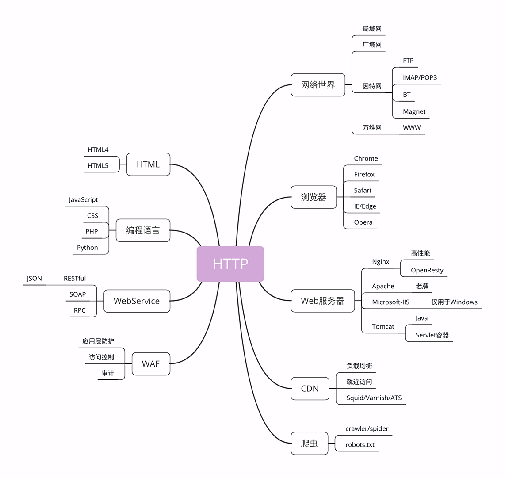
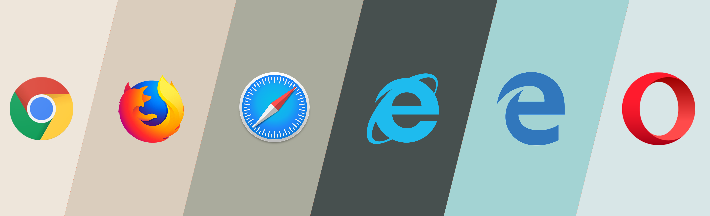

# 03 | HTTP 世界全览：与 HTTP 相关的各种概念

在上一讲的末尾，我画了一张图，里面是与 HTTP 关联的各种技术和知识点，也可以说是这个专栏的总索引，不知道你有没有认真看过呢？

那张图左边的部分是与 HTTP 有关系的各种协议，比较偏向于理论；而右边的部分是与 HTTP 有关系的各种应用技术，偏向于实际应用。

我希望借助这张图帮你澄清与 HTTP 相关的各种概念和角色，让你在实际工作中清楚它们在链路中的位置和作用，知道发起一个 HTTP 请求会有哪些角色参与，会如何影响请求的处理，做到手中有粮，心中不慌。

因为那张图比较大，所以我会把左右两部分拆开来分别讲，今天先讲右边的部分，也就是与 HTTP 相关的各种应用，着重介绍互联网、浏览器、Web 服务器等常见且重要的概念。

为了方便你查看，我又把这部分重新画了一下，比那张大图小了一些，更容易地阅读，你可以点击查看。

## 网络世界

你一定已经习惯了现在的网络生活，甚至可能会下意识地认为网络世界就应该是这个样子的：一张平坦而且一望无际的巨大网络，每一台电脑就是网络上的一个节点，均匀地点缀在这张网上。

这样的理解既对，又不对。从抽象的、虚拟的层面来看，网络世界确实是这样的，我们可以从一个节点毫无障碍地访问到另一个节点。

但现实世界的网络却远比这个抽象的模型要复杂得多。实际的互联网是由许许多多个 **规模略小的网络** 连接而成的，这些「小网络」可能是只有几百台电脑的局域网，可能是有几万、几十万台电脑的广域网，可能是用电缆、光纤构成的固定网络，也可能是用基站、热点构成的移动网络……

互联网世界更像是由数不清的大小岛屿组成的「千岛之国」

互联网的正式名称是 Internet，里面存储着无穷无尽的信息资源，我们通常所说的 **上网** 实际上访问的只是互联网的一个子集 「万维网（World Wide Web）」，**它基于 HTTP 协议** ，传输 HTML 等超文本资源，能力也就被限制在 HTTP 协议之内。

互联网上还有许多万维网之外的资源，例如常用的电子邮件、BT 和 Magnet 点对点下载、FTP 文件下载、SSH 安全登录、各种即时通信服务等等，它们需要用各自的专有协议来访问。

不过由于 HTTP 协议非常灵活、易于扩展，而且「超文本」的表述能力很强，所以很多其他原本不属于 HTTP 的资源也可以「包装」成 HTTP 来访问，这就是我们为什么能够总看到各种网页应用——例如微信网页版、邮箱网页版——的原因。

综合起来看，现在的互联网 90% 以上的部分都被万维网，也就是 HTTP 所覆盖，所以把互联网约等于万维网或 HTTP 应该也不算大错。

## 浏览器

上网就要用到浏览器，常见的浏览器有 Google 的 Chrome、Mozilla 的 Firefox、Apple 的 Safari、Microsoft 的 IE 和 Edge，还有小众的 Opera 以及国内的各种换壳的极速、安全浏览器。

那么你想过没有，所谓的「浏览器」到底是个什么东西呢？

浏览器的正式名字叫 **Web Browser** ，顾名思义，就是检索、查看互联网上网页资源的应用程序，名字里的 Web，实际上指的就是 `World Wide Web`，也就是万维网。

浏览器本质上是一个 HTTP 协议中的 **请求方**，使用 HTTP 协议获取网络上的各种资源。当然，为了让我们更好地检索查看网页，它还集成了很多额外的功能。

例如，HTML 排版引擎用来展示页面，JavaScript 引擎用来实现动态化效果，甚至还有开发者工具用来调试网页，以及五花八门的各种插件和扩展。

在 HTTP 协议里，浏览器的角色被称为 `User Agent` 即 **用户代理** ，意思是作为访问者的「代理」来发起 HTTP 请求。不过在不引起混淆的情况下，我们通常都简单地称之为 **客户端** 。

## Web 服务器

刚才说的浏览器是 HTTP 里的请求方，那么在协议另一端的  **应答方**（响应方）又是什么呢？

这个你一定也很熟悉，答案就是 **服务器** ，**Web Server** 。

Web 服务器是一个很大也很重要的概念，它是 HTTP 协议里响应请求的主体，通常也把控着绝大多数的网络资源，在网络世界里处于强势地位。

当我们谈到 「Web 服务器」 时有两个层面的含义：硬件和软件。

- **硬件**

  含义就是物理形式或「云」形式的机器，在大多数情况下它可能不是一台服务器，而是利用反向代理、负载均衡等技术组成的庞大集群。但从外界看来，它仍然表现为一台机器，但这个形象是「虚拟的」。

- **软件**

  含义的 Web 服务器可能我们更为关心，它就是提供 Web 服务的应用程序，通常会运行在硬件含义的服务器上。它利用强大的硬件能力响应海量的客户端 HTTP 请求，处理磁盘上的网页、图片等静态文件，或者把请求转发给后面的 Tomcat、Node.js 等业务应用，返回动态的信息。

比起层出不穷的各种 Web 浏览器，Web 服务器就要少很多了，一只手的手指头就可以数得过来。

Apache 是老牌的服务器，到今天已经快 25 年了，功能相当完善，相关的资料很多，学习门槛低，是许多创业者建站的入门产品。

Nginx 是 Web 服务器里的后起之秀，特点是高性能、高稳定，且易于扩展。自 2004 年推出后就不断蚕食 Apache 的市场份额，在高流量的网站里更是不二之选。

此外，还有 Windows 上的 IIS、Java 的 Jetty/Tomcat 等，因为性能不是很高，所以在互联网上应用得较少。

## CDN

浏览器和服务器是 HTTP 协议的两个端点，那么，在这两者之间还有别的什么东西吗？

当然有了。 **浏览器通常不会直接连到服务器** ，中间会经过「重重关卡」，其中的一个重要角色就叫做 CDN。

**CDN**，全称是 `Content Delivery Network` ，翻译过来就是 **内容分发网络** 。它应用了 **HTTP 协议里的缓存和代理技术，代替源站响应客户端的请求** 。

CDN 有什么好处呢？

简单来说，它可以缓存源站的数据，让浏览器的请求不用千里迢迢地到达源站服务器，直接在半路就可以获取响应。如果 CDN 的调度算法很优秀，更可以找到离用户最近的节点，大幅度缩短响应时间。

打个比方，就好像唐僧西天取经，刚出长安城，就看到阿难与迦叶把佛祖的真经递过来了，是不是很省事？

CDN 也是现在互联网中的一项重要基础设施，除了基本的网络加速外，还提供负载均衡、安全防护、边缘计算、跨运营商网络等功能，能够成倍地「放大」源站服务器的服务能力，很多云服务商都把 CDN 作为产品的一部分，我也会在后面用一讲的篇幅来专门讲解 CDN。

## 爬虫

前面说到过浏览器，它是一种用户代理，代替我们访问互联网。

但 HTTP 协议并没有规定用户代理后面必须是「真正的人类」，它也完全可以是「机器人」，这些「机器人」的正式名称就叫做 **爬虫**（Crawler），实际上是一种可以自动访问 Web 资源的应用程序。

爬虫这个名字非常形象，它们就像是一只只不知疲倦的、辛勤的蚂蚁，在无边无际的网络上爬来爬去，不停地在网站间奔走，搜集抓取各种信息。

据估计，互联网上至少有 50% 的流量都是由爬虫产生的，某些特定领域的比例还会更高，也就是说，如果你的网站今天的访问量是十万，那么里面至少有五六万是爬虫机器人，而不是真实的用户。

爬虫是怎么来的呢？

绝大多数是由各大搜索引擎「放」出来的，抓取网页存入庞大的数据库，再建立关键字索引，这样我们才能够在搜索引擎中快速地搜索到互联网角落里的页面。

爬虫也有不好的一面，它会过度消耗网络资源，占用服务器和带宽，影响网站对真实数据的分析，甚至导致敏感信息泄漏。所以，又出现了「反爬虫」技术，通过各种手段来限制爬虫。其中一项就是「君子协定」robots.txt，约定哪些该爬，哪些不该爬。

无论是爬虫还是反爬虫，用到的基本技术都是两个，一个是 HTTP，另一个就是 HTML。

## HTML/WebService/WAF

到现在我已经说完了图中右边的五大部分，而左边的 HTML、WebService、WAF 等由于与 HTTP 技术上实质关联不太大，所以就简略地介绍一下，不再过多展开。

**HTML** 是 HTTP 协议传输的主要内容之一，它描述了超文本页面，用各种「标签」定义文字、图片等资源和排版布局，最终由浏览器「渲染」出可视化页面。

HTML 目前有两个主要的标准，HTML4 和 HTML5。广义上的 HTML 通常是指 HTML、JavaScript、CSS 等前端技术的组合，能够实现比传统静态页面更丰富的动态页面。

接下来是 **Web Service** ，它的名字与 Web Server 很像，但却是一个完全不同的东西。

Web Service 是一种由 W3C 定义的应用服务开发规范，使用 client-server 主从架构，通常使用 WSDL 定义服务接口，使用 HTTP 协议传输 XML 或 SOAP 消息，也就是说，它是 **一个基于 Web（HTTP）的服务架构技术** ，既可以运行在内网，也可以在适当保护后运行在外网。

因为采用了 HTTP 协议传输数据，所以在 Web Service 架构里服务器和客户端可以采用不同的操作系统或编程语言开发。例如服务器端用 Linux+Java，客户端用 `Windows+C#`，具有跨平台跨语言的优点。

**WAF** 是近几年比较火的一个词，意思是 **网络应用防火墙** 。与硬件防火墙类似，它是应用层面的防火墙，专门检测 HTTP 流量，是防护 Web 应用的安全技术。

WAF 通常位于 Web 服务器之前，可以阻止如 SQL 注入、跨站脚本等攻击，目前应用较多的一个开源项目是 ModSecurity，它能够完全集成进 Apache 或 Nginx。

## 小结

今天我详细介绍了与 HTTP 有关系的各种应用技术，在这里简单小结一下要点。

1. 互联网上绝大部分资源都使用 HTTP 协议传输；
2. 浏览器是 HTTP 协议里的请求方，即 User Agent；
3. 服务器是 HTTP 协议里的应答方，常用的有 Apache 和 Nginx；
4. CDN 位于浏览器和服务器之间，主要起到缓存加速的作用；
5. 爬虫是另一类 User Agent，是自动访问网络资源的程序。

希望通过今天的讲解，你能够更好地理解这些概念，也利于后续的课程学习。

## 课下作业

1. 你觉得 CDN 在对待浏览器和爬虫时会有差异吗？为什么？

   笔者觉得没有什么差异，除非能分辨是爬虫

2. 你怎么理解 WebService 与 Web Server 这两个非常相似的词？

   笔者认为：WebService  是使用 HTTP 协议传输 XML 或 SOAP 消息的一种技术架构或则说是一种框架技术，而 Web Server 则泛指能响应 http 请求的服务端

   他们则一致认为：WebService  是应用技术，WebServer 是服务器

## 课外小贴士

- 第一个网页浏览器也是 蒂姆伯纳斯李 发明的，名字叫做 `WorldWideWeb`
- 第一个 Web 服务器由 蒂姆伯纳斯李 设计并参与开发，名字叫做 CERN httpd
- Linux 上的 wget、curl 等命令行工具基于 http，所以也是一种 user agent
- Nginx 的正确发音是 `engine eks` ，不过更愿意想 UNIX/LINUX 那样称它为 `engineks` ，虽然这是一个错误的发音，但是简洁明快
- 你也许在浏览某些网站时遇到过要求验证你不是机器人的页面，这其实就是一种反爬虫手段
