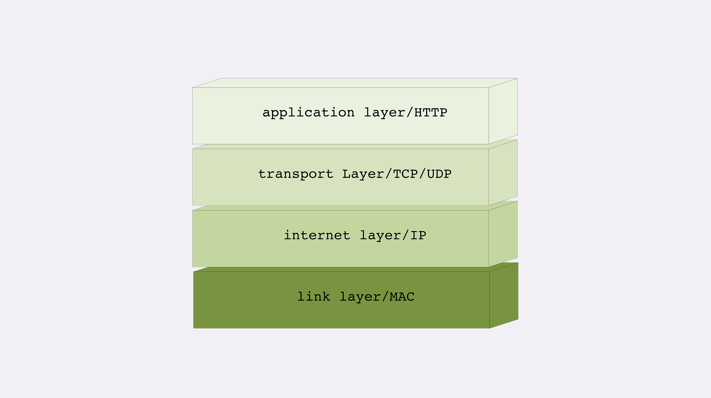

# 05 | 常说的四层和七层到底是什么？五层、六层哪去了？

在上一讲中，我简单提到了 TCP/IP 协议，它是 HTTP 协议的下层协议，负责具体的数据传输工作。并且还特别说了，TCP/IP 协议是一个 **有层次的协议栈** 。

在工作中你一定经常听别人谈起什么四层负载均衡、七层负载均衡，什么二层转发、三层路由，那么你真正理解这些层次的含义吗？

网络分层的知识教科书上都有，但很多都是泛泛而谈，只有学术价值，于是就容易和实际应用脱节，造成的后果就是似懂非懂，真正用的时候往往会一头雾水。

所以，今天我就从 HTTP 应用的角度，帮你把这些模糊的概念弄清楚。

## TCP/IP 网络分层模型

还是先从 TCP/IP 协议开始讲起，一是因为它非常经典，二是因为它是目前事实上的网络通信标准，研究它的实用价值最大。

TCP/IP 当初的设计者真的是非常聪明，创造性地提出了 **分层** 的概念，把复杂的网络通信划分出多个层次，再给每一个层次分配不同的职责，层次内只专心做自己的事情就好，用分而治之的思想把一个大麻烦拆分成了数个小麻烦，从而解决了网络通信的难题。

你应该对 TCP/IP 的协议栈有所了解吧，这里我再贴一下层次图。

TCP/IP 协议总共有四层，就像搭积木一样，每一层需要下层的支撑，同时又支撑着上层，任何一层被抽掉都可能会导致整个协议栈坍塌。

我们来仔细地看一下这个精巧的积木架构，注意它的层次顺序是 **从下往上** 数的，所以第一层就是最下面的一层。

第一层叫 **链接层** （link layer），负责在以太网、WiFi 这样的底层网络上发送原始数据包，工作在网卡这个层次，使用 **MAC 地址来标记网络上的设备** ，所以有时候也叫 MAC 层。

第二层叫 **网际层** 或者 **网络互连层** （internet layer），IP 协议就处在这一层。因为 IP 协议定义了 **IP 地址** 的概念，所以就可以在 **链接层** 的基础上，**用 IP 地址取代 MAC 地址** ，把许许多多的局域网、广域网连接成一个虚拟的巨大网络，在这个网络里找设备时只要把 IP 地址再「翻译」成 MAC 地址就可以了。

第三层叫 **传输层**（transport layer），这个层次协议的职责是保证数据在 IP 地址标记的两点之间可靠地传输，是 TCP 协议工作的层次，另外还有它的一个小伙伴 UDP。

**TCP 是一个有状态的协议，需要先与对方建立连接然后才能发送数据** ，而且保证数据不丢失不重复。而 UDP 则比较简单，它无状态，不用事先建立连接就可以任意发送数据，但不保证数据一定会发到对方。两个协议的另一个重要区别在于数据的形式。TCP 的数据是连续的字节流，有先后顺序，而 UDP 则是分散的小数据包，是顺序发，乱序收。

关于 TCP 和 UDP 可以展开讨论的话题还有很多，比如最经典的「三次握手」和「四次挥手」，一时半会很难说完，好在与 HTTP 的关系不是太大，以后遇到了再详细讲解。

协议栈的第四层叫 **应用层** （application layer），由于下面的三层把基础打得非常好，所以在这一层就百花齐放了，有各种面向具体应用的协议。例如 Telnet、SSH、FTP、SMTP 等等，当然还有我们的 HTTP。

- MAC 层的传输单位是帧（frame）
- IP 层的传输单位是包（packet）
- TCP 层的传输单位是段（segment）
- HTTP 的传输单位则是消息或报文（message）

但这些名词并没有什么本质的区分，可以统称为数据包。

## OSI 网络分层模型

看完 TCP/IP 协议栈，你可能要问了，它只有四层，那常说的七层怎么没见到呢？

别着急，这就是今天要说的第二个网络分层模型：**OSI** ，全称是 **开放式系统互联通信参考模型** （Open System Interconnection Reference Model）。

TCP/IP 发明于 1970 年代，当时除了它还有很多其他的网络协议，整个网络世界比较混乱。

这个时候国际标准组织（ISO）注意到了这种现象，感觉野路子太多，就想要来个大一统。于是设计出了一个新的网络分层模型，想用这个新框架来统一既存的各种网络协议。

OSI 模型分成了七层，部分层次与 TCP/IP 很像，从下到上分别是：

1. 第一层：物理层，网络的物理形式，例如电缆、光纤、网卡、集线器等等；
2. 第二层：数据链路层，它基本相当于 TCP/IP 的链接层；
3. 第三层：网络层，相当于 TCP/IP 里的网际层；
4. 第四层：传输层，相当于 TCP/IP 里的传输层；
5. 第五层：会话层，维护网络中的连接状态，即保持会话和同步；
6. 第六层：表示层，把数据转换为合适、可理解的语法和语义；
7. 第七层：应用层，面向具体的应用传输数据。

至此，我们常说的「四层」、「七层」就出现了。

不过国际标准组织心里也很清楚，TCP/IP 等协议已经在许多网络上实际运行，再推翻重来是不可能的。所以，OSI 分层模型在发布的时候就明确地表明是一个「参考」，不是强制标准，意思就是说，「你们以后该干什么还干什么，我不管，但面子上还是要按照我说的来」。

但 OSI 模型也是有优点的。对比一下就可以看出，TCP/IP 是一个纯软件的栈，没有网络应有的最根基的电缆、网卡等物理设备的位置。而 OSI 则补足了这个缺失，在理论层面上描述网络更加完整。

还有一个重要的形式上的优点：OSI 为每一层标记了明确了编号，最底层是一层，最上层是七层，而 TCP/IP 的层次从来只有名字而没有编号。显然，在交流的时候说「七层」要比「应用层」更简单快捷，特别是英文，对比一下 `Layer seven` 与 `application layer` 。

综合以上几点，在 OSI 模型之后，四层、七层这样的说法就逐渐流行开了。不过在实际工作中你一定要注意，这种说法只是 **理论上** 的层次，并不是与现实完全对应。

## 两个分层模型的映射关系

现在我们有了两个网络分层模型：TCP/IP 和 OSI，新的问题又出现了，一个是四层模型，一个是七层模型，这两者应该如何互相映射或者说互相解释呢？

好在 OSI 在设计之初就参考了 TCP/IP 等多个协议，可以比较容易但不是很精确地实现对应关系。

1. 第一层：物理层，TCP/IP 里无对应；
2. 第二层：数据链路层，对应 TCP/IP 的链接层；
3. 第三层：网络层，对应 TCP/IP 的网际层；
4. 第四层：传输层，对应 TCP/IP 的传输层；
5. 第五、六、七层：统一对应到 TCP/IP 的应用层。

所以你看，这就是理想与现实之间的矛盾。理想很美好，有七层，但现实很残酷，只有四层，「多余」的五层、六层就这样「消失」了。

但这也有一定的实际原因。

OSI 的分层模型在四层以上分的太细，而 TCP/IP 实际应用时的会话管理、编码转换、压缩等和具体应用经常联系的很紧密，很难分开。例如，HTTP 协议就同时包含了连接管理和数据格式定义。

到这里，你应该能够明白一开始那些某某层的概念了。

所谓的 **四层负载均衡** 就是指工作在传输层上，基于 TCP/IP 协议的特性，例如 IP 地址、端口号等实现对后端服务器的负载均衡。

所谓的 **七层负载均衡** 就是指工作在应用层上，看到的是 HTTP 协议，解析 HTTP 报文里的 URI、主机名、资源类型等数据，再用适当的策略转发给后端服务器。

## TCP/IP 协议栈的工作方式

TCP/IP 协议栈是如何工作的呢？

你可以把 HTTP 利用 TCP/IP 协议栈传输数据想象成一个发快递的过程。

假设你想把一件毛绒玩具送给朋友，但你要先拿个塑料袋套一下，这件玩具就相当于 HTTP 协议里要传输的内容，比如 HTML，然后 HTTP 协议为它加一个 HTTP 专用附加数据。

你把玩具交给快递小哥，为了保护货物，他又加了层包装再贴了个标签，相当于在 TCP 层给数据再次打包，加上了 TCP 头。

接着快递小哥下楼，把包裹放进了三轮车里，运到集散点，然后再装进更大的卡车里，相当于在 IP 层、MAC 层对 TCP 数据包加上了 IP 头、MAC 头。

之后经过漫长的运输，包裹到达目的地，要卸货再放进另一位快递员的三轮车，就是在 IP 层、MAC 层传输后拆包。

快递员到了你朋友的家门口，撕掉标签，去除了 TCP 层的头，你朋友再拆掉塑料袋包装，也就是 HTTP 头，最后就拿到了玩具，也就是真正的 HTML 页面。

这个比喻里省略了很多 TCP/IP 协议里的细节，比如建连、路由、数据切分与重组、错误检查等，但核心的数据传输过程是差不多的。

HTTP 协议的传输过程就是这样通过协议栈逐层向下，每一层都添加本层的专有数据，层层打包，然后通过下层发送出去。

接收数据是则是相反的操作，从下往上穿过协议栈，逐层拆包，每层去掉本层的专有头，上层就会拿到自己的数据。

但下层的传输过程对于上层是完全 「透明」的，上层也不需要关心下层的具体实现细节，所以就 HTTP 层次来看，它不管下层是不是 TCP/IP 协议，看到的只是一个可靠的传输链路，只要把数据加上自己的头，对方就能原样收到。

我为这个过程画了一张图，你可以对照着加深理解。

## 小结

这次我们学习了 HTTP 所在的网络分层模型，它是工作中常用的交流语言，在这里简单小结一下今天的内容。

1. TCP/IP 分为四层，核心是二层的 IP 和三层的 TCP，HTTP 在第四层；
2. OSI 分为七层，基本对应 TCP/IP，TCP 在第四层，HTTP 在第七层；
3. OSI 可以映射到 TCP/IP，但这期间一、五、六层消失了；
4. 日常交流的时候我们通常使用 OSI 模型，用四层、七层等术语；
5. HTTP 利用 TCP/IP 协议栈逐层打包再拆包，实现了数据传输，但下面的细节并不可见。

有一个辨别四层和七层比较好的（但不是绝对的）小窍门，**两个凡是**：

- 凡是由操作系统负责处理的就是四层或四层以下，
- 否则，凡是需要由应用程序（也就是你自己写代码）负责处理的就是七层。

## 课下作业

1. 你能用自己的话解释一下二层转发、三层路由吗？

   -  二层转发：设备工作在链路层，帧在经过交换机设备时，检查帧的头部信息，拿到目标 mac 地址，进行本地转发和广播
   - 三层路由：设备工作在 ip 层，报文经过有路由功能的设备时，设备分析报文中的头部信息，拿到 ip 地址，根据网段范围，进行本地转发或选择下一个网关

2. 你认为上一讲中的 DNS 协议位于哪一层呢？

   网络请求的第一步是域名解析，所以工作在应用层

3. 你认为 CDN 工作在那一层呢？

   应用层

## 课外小贴士

- MAC 地址（Media Access Control Address），也称为区域网地址，可以唯一地标识一个网卡，也就同时标识了此网卡所属的设备
- 在 TCP/IP 协议栈之外，还是有一些协议位于 OSI 5 层 和 6 层的，例如 UNIX 域套接字就可以认为在 5 层