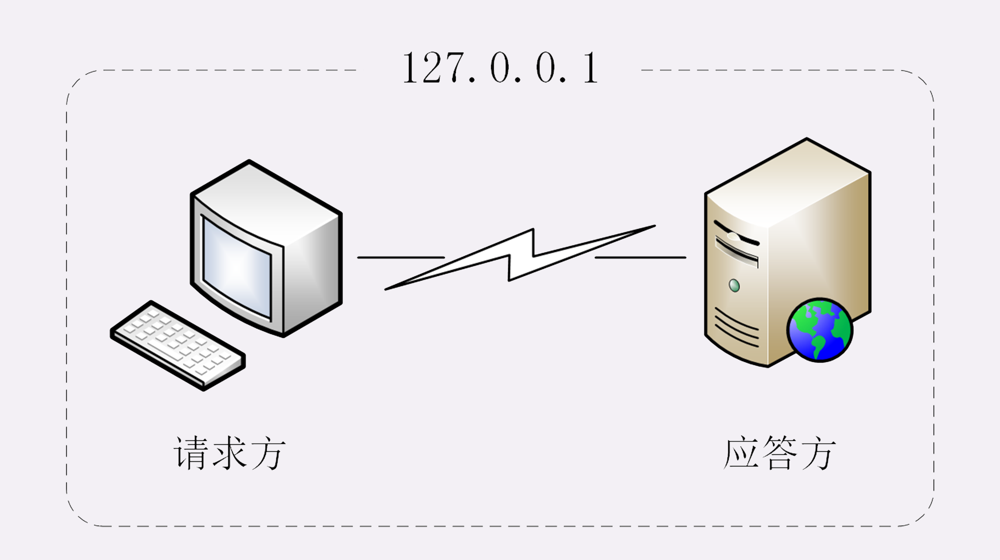
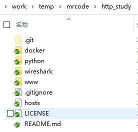
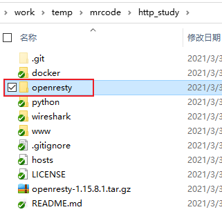
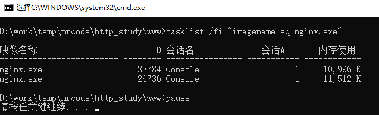
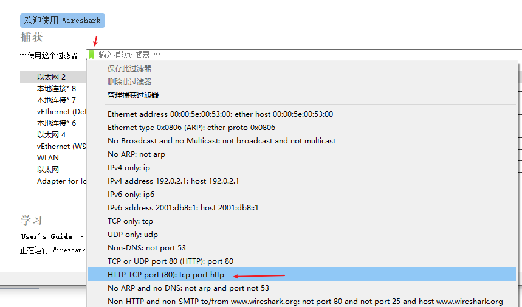

# 07 | 自己动手，搭建 HTTP 实验环境

这一讲是「破冰篇」的最后一讲，我会先简单地回顾一下之前的内容，然后在 Windows 系统上实际操作，用几个应用软件搭建出一个「最小化」的 HTTP 实验环境，方便后续的基础篇、进阶篇、安全篇的学习。

## 破冰篇回顾

HTTP 协议诞生于 30 年前，设计之初的目的是用来传输纯文本数据。但由于形式灵活，搭配 URI、HTML 等技术能够把互联网上的资源都联系起来，构成一个复杂的超文本系统，让人们自由地获取信息，所以得到了迅猛发展。

HTTP 有多个版本，目前应用的最广泛的是 HTTP/1.1，它几乎可以说是整个互联网的基石。但 HTTP/1.1 的性能难以满足如今的高流量网站，于是又出现了 HTTP/2 和 HTTP/3。不过这两个新版本的协议还没有完全推广开。在可预见的将来，HTTP/1.1 还会继续存在下去。

HTTP 翻译成中文是 **超文本传输协议** ，是一个应用层的协议，通常基于 TCP/IP，能够在网络的任意两点之间传输文字、图片、音频、视频等数据。

HTTP 协议中的两个端点称为 **请求方** 和 **应答方** 。请求方通常就是 Web 浏览器，也叫 user agent，应答方是 Web 服务器，存储着网络上的大部分静态或动态的资源。

在浏览器和服务器之间还有一些 **中间人** 的角色，如 CDN、网关、代理等，它们也同样遵守 HTTP 协议，可以帮助用户更快速、更安全地获取资源。

HTTP 协议不是一个孤立的协议，需要下层很多其他协议的配合。最基本的是 TCP/IP，实现寻址、路由和可靠的数据传输，还有 DNS 协议实现对互联网上主机的定位查找。

对 HTTP 更准确的称呼是 **HTTP over TCP/IP** ，而另一个 **HTTP over SSL/TLS** 就是增加了安全功能的 HTTPS。

## 软件介绍

常言道实践出真知，又有俗语光说不练是假把式。要研究 HTTP 协议，最好有一个实际可操作、可验证的环境，通过实际的数据、现象来学习，肯定要比单纯的“动嘴皮子”效果要好的多。

现成的环境当然有，只要能用浏览器上网，就会有 HTTP 协议，就可以进行实验。但现实的网络环境又太复杂了，有很多无关的干扰因素，这些噪音会淹没真正有用的信息。

所以，我给你的建议是：搭建一个 **最小化** 的环境，在这个环境里仅有 HTTP 协议的两个端点：请求方和应答方，去除一切多余的环节，从而可以抓住重点，快速掌握 HTTP 的本质。



简单说一下这个「最小化」环境用到的应用软件：

- Wireshark

  著名的网络抓包工具，能够截获在 TCP/IP 协议栈中传输的所有流量，并按协议类型、地址、端口等任意过滤，功能非常强大，是学习网络协议的必备工具。

  它就像是网络世界里的一台「高速摄像机」，把只在一瞬间发生的网络传输过程如实地「拍摄」下来，事后再「慢速回放」，让我们能够静下心来仔细地分析那一瞬到底发生了什么。

- Chrome/Firefox

  Google 开发的浏览器，是目前的主流浏览器之一。它不仅上网方便，也是一个很好的调试器，对 HTTP/1.1、HTTPS、HTTP/2、QUIC 等的协议都支持得非常好，用 F12 打开「开发者工具」还可以非常详细地观测 HTTP 传输全过程的各种数据。

  如果你更习惯使用 **Firefox**，那也没问题，其实它和 Chrome 功能上都差不太多，选择自己喜欢的就好。

  与 Wireshark 不同，Chrome 和 Firefox 属于事后诸葛亮，不能观测 HTTP 传输的过程，只能看到结果。

- Telnet

  是一个经典的虚拟终端，基于 TCP 协议远程登录主机，我们可以使用它来模拟浏览器的行为，连接服务器后手动发送 HTTP 请求，把浏览器的干扰也彻底排除，能够从最原始的层面去研究 HTTP 协议。

- OpenResty

  你可能比较陌生，它是基于 Nginx 的一个强化包，里面除了 Nginx 还有一大堆有用的功能模块，不仅支持 HTTP/HTTPS，还特别集成了脚本语言 Lua 简化 Nginx 二次开发，方便快速地搭建动态网关，更能够当成应用容器来编写业务逻辑。

  选择 OpenResty 而不直接用 Nginx 的原因是它相当于 Nginx 的超集，功能更丰富，安装部署更方便。我也会用 Lua 编写一些服务端脚本，实现简单的 Web 服务器响应逻辑，方便实验。

## 安装过程

使用的是 win10 系统，如果不是可能需要使用虚拟机安装一个 win10 系统来进行测试。（如果你会其他的技术能替代下面的软件也可以）

首先使用到的一些测试脚本在该仓库可以下载到，先 clone 下来

```bash
git clone https://github.com/chronolaw/http_study.git
```



- [Wireshark](https://www.wireshark.org/download.html)  v3.0.0

  基本上就是下一步下一步就可以安装完成

  这个最好使用相同的版本，防止与课程中讲解的不一致的问题，有专研精神的可以使用最新版本

- Chrome v73：可以使用最新版本

前两个自行下载安装包安装，可以使用新版本，安装较为简单。

### Telnet 

Telnet win10 自带，默认不启用，开启方式如下：

打开 Windows 的设置窗口，搜索「Telnet」，就会找到「启用或关闭 Windows 功能」，在这个窗口里找到「Telnet 客户端」，打上对钩就可以了，可以参考截图。


### OpenResty

版本：64 位 1.15.81，下载地址：[官网](http://openresty.org/cn/download.html)，[openresty-1.15.8.1.zip](https://openresty.org/download/openresty-1.15.8.1-win64.zip) 

解压到刚刚 clone 下来的仓库目录，如下图所示（途中下载的是 tar.gz 包，下错了，后来已经修正为 zip 包了）



因为 www 目录里面的脚本路径写的是这个目录下的路径。

### 修改本机 hosts 文件

为了能够让浏览器能够使用 DNS 域名访问我们的实验环境，还要改一下本机的 hosts 文件，位置在 `C:\WINDOWS\system32\drivers\etc\hosts`

```
# http 协议实验室域名
127.0.0.1 www.chrono.com
127.0.0.1 www.metroid.net
127.0.0.1 origin.io
# ======================
```

注意修改 hosts 文件需要管理员权限，直接用记事本编辑是不行的，可以切换管理员身份，或者改用其他高级编辑器，比如 Notepad++，而且改之前最好做个备份。

到这里，我们的安装工作就完成了！之后你就可以用 Wireshark、Chrome、Telnet 在这个环境里随意折腾，弄坏了也不要紧，只要把目录删除，再来一遍操作就能复原。

## 测试验证

实验环境搭建完了，但还需要把它运行起来，做一个简单的测试验证，看是否运转正常。

首先我们要启动 Web 服务器，也就是 OpenResty。

在 http_study 的 www 目录下有四个批处理文件，分别是：

- start：启动 OpenResty 服务器；
- stop：停止 OpenResty 服务器；
- reload：重启 OpenResty 服务器；
- list：列出已经启动的 OpenResty 服务器进程。

使用鼠标双击 start 批处理文件，就会启动 OpenResty 服务器在后台运行，这个过程可能会有 Windows 防火墙的警告，选择「允许」即可。

运行后，鼠标双击 list 可以查看 OpenResty 是否已经正常启动，应该会有两个 nginx.exe 的后台进程，大概是下图的样子。



因为我们的实验环境运行在本机的 127.0.0.1 上，也就是 loopback 环回地址。所以，在 Wireshark 里要选择「Npcap loopback Adapter」，过滤器选择 `HTTP TCP port(80)` ，即只抓取 HTTP 相关的数据包。鼠标双击开始界面里的「Npcap loopback Adapter」 即可开始抓取本机上的网络数据。

关于 Npcap loopback Adapter 这个的说明，笔者还记得的是 Wireshark 自带的是没有这个接口的，在安装的时候不要选择自带的 Npcap，要自己去下载独立的软件包，安装之后才会有。

但是最新版本的 Wireshark 提供的 Adapter for loopback traffic capture 接口已经可以能捕获到本机回环的流量了


选择接口后，在下图的过滤中只过滤 80 端口的流量

```
tcp.port == 80
```

本机 80 端口一般不会被使用，这样过滤出来的才是我们想要的信息，否则将会看到类似刷屏的信息，看不过来的

关于这个过滤器的使用，前面说到在选择回环接口之前选择 `HTTP TCP port(80)` 这个操作是下面这个图，它相当于是一个快捷功能吧，上面我们直接填写的过滤条件，过滤结果是一样的。



然后我们打开 Chrome，在地址栏输入 http://localhost/，访问刚才启动的 OpenResty 服务器，就会看到一个简单的欢迎界面，如下图所示。


然后查看 wireshark 界面，就看到了有几条数据出现了


至于这些数据是什么，表示什么含义，我会在下一讲再详细介绍。

如果你能够在自己的电脑上走到这一步，就说明「最小化」的实验环境已经搭建成功了，不要忘了实验结束后运行批处理 stop 停止 OpenResty 服务器。

## 小结

这次我们学习了如何在自己的电脑上搭建 HTTP 实验环境，在这里简单小结一下今天的内容。

1. 现实的网络环境太复杂，有很多干扰因素，搭建「最小化」的环境可以快速抓住重点，掌握 HTTP 的本质；
2. 我们选择 Wireshark 作为抓包工具，捕获在 TCP/IP 协议栈中传输的所有流量；
3. 我们选择 Chrome 或 Firefox 浏览器作为 HTTP 协议中的 user agent；
4. 我们选择 OpenResty 作为 Web 服务器，它是一个 Nginx 的强化包，功能非常丰富；
5. Telnet 是一个命令行工具，可用来登录主机模拟浏览器操作；
6. 在 GitHub 上可以下载到本专栏的专用项目源码，只要把 OpenResty 解压到里面即可完成实验环境的搭建。

## 课下作业

1. 按照今天所学的，在你自己的电脑上搭建出这个 HTTP 实验环境并测试验证。

2. 由于篇幅所限，我无法详细介绍 Wireshark，你有时间可以再上网搜索 Wireshark 相关的资料，了解更多的用法。

## 课外小贴士

- 如果你会编程，还可以选择一种自己擅长的语言（如 Python），调用专用库，去访问 OpenResty 服务器

- 在 Linux 上可以直接从源码编译 OpenResty，用 curl 发送测试命令，用 tcpdump 抓包

- 除了经典的 Wireshark 抓包工具外，还有一个专门抓 HTTP 包的工具 Fiddler

- 如果无法正常启动 OpenResty，最大的可能就是端口 80 或 443 被占用了（比如安装了 WMWare workstation）

  先看 `www/logs` 里的错误日志，然后在命令行中用

  ```
  netstat -aon | findstr :443
  ```

  找到占用的进程或服务，手动停止就可以了

- 有时候可能 stop 批处理脚本无法正确停止 OpenResty，可以使用「任务管理器」查找 nginx.exe 进程，强制关闭

- 话说 OpenResty 和同级目录下的 www 是如何关联上的，笔者还不清楚

  但是 www/conf/http/servers 下的 nginx  xx.conf 配置文件是使用了的