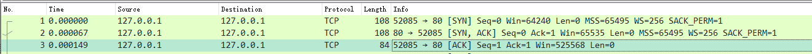
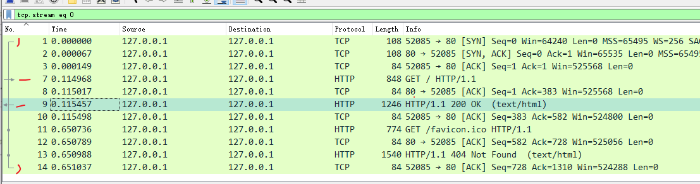
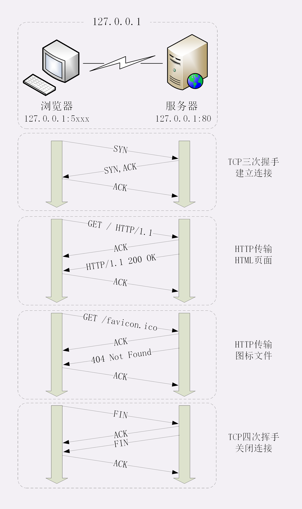
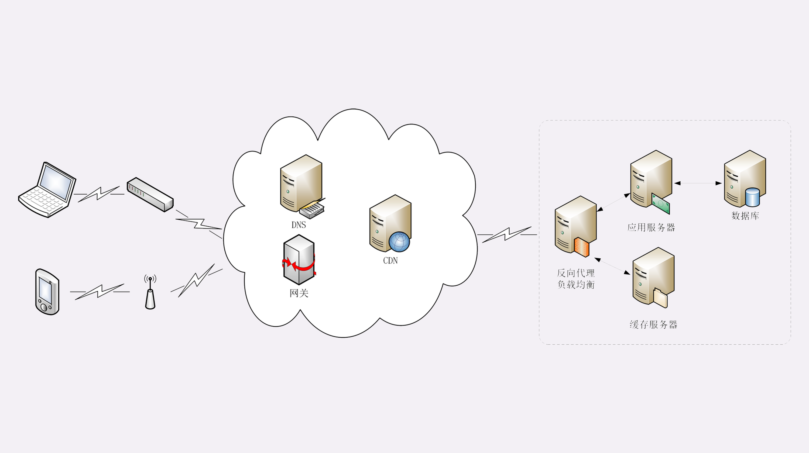

# 01 | 键入网址再按下回车，后面究竟发生了什么？

经过上一讲的学习，你是否已经在自己的电脑上搭建好了最小化的 HTTP 实验环境呢？

我相信你的答案一定是 Yes，那么，让我们立刻开始「螺蛳壳里做道场」，在这个实验环境里看一下 HTTP 协议工作的全过程。

## 使用 IP 地址访问 Web 服务器

首先我们运行 www 目录下的 start 批处理程序，启动本机的 OpenResty 服务器，启动后可以用 list 批处理确认服务是否正常运行（两个 nginx 进程）。

然后我们打开 Wireshark，选择 HTTP TCP port(80) 过滤器，再鼠标双击 Npcap loopback Adapter ，开始抓取本机 127.0.0.1 地址上的网络数据。

第三步，在 Chrome 浏览器的地址栏里输入 http://127.0.0.1/ ，再按下回车键，等欢迎页面显示出来后 Wireshark 里就会有捕获的数据包，如下图所示。


08-1.pcapng

::: tip

有关 wireshark 的用法，这里不深入，自己百度.

图上的过滤器 tcp.stream eq 0 和前面选择的 HTTP TCP port(80)  含义是不一样的，

另外对于上图这个请求数据来说，不一定每次都是一样的，但是流程是相同的，如果是自己跟着测试，只需要关注核心流程，想要数据完全一致的话在前面搭建的实验环境目录下 `http_study\wireshark` 有对应的 *.pcapng 文件，可以加载到 wireshark 中

此提示后面不再赘述，每张数据图下面都会写上对应的文件，如果没有写，那说明是笔者自己实验环境的截图，原书有的截图一定会有，自己的就按照笔记上的解释去理解。

:::

## 抓包分析

在 Wireshark 里你可以看到，这次一共抓到了 11 个包（这里用了滤包功能，滤掉了 3 个包，原本是 14 个包），耗时 0.65 秒，下面我们就来一起分析一下 **键入网址按下回车** 后数据传输的全过程。

::: tip

08-1.pcapng 文件中一共 14 个包，使用过滤器  tcp.stream eq 0 过滤掉了三个包

tcp.stream eq 0 是什么意思呢？笔者短时间没有找到答案，唯一能猜想到的应该是：建立起来的这一次链接，在该链接上发出和响应的请求数据包

所以这里过滤之后看到的就是一次网址发出去发生的数据包

网络上搜到的是选择第 0 号 tcp 流的含义，这里应该就是说的是第几个连接的意思。

:::


通过前面破冰篇的讲解，你应该知道 HTTP 协议是运行在 TCP/IP 基础上的，依靠 TCP/IP 协议来实现数据的可靠传输。所以浏览器要用 HTTP 协议收发数据，首先要做的就是建立 TCP 连接。

因为我们在地址栏里直接输入了 IP 地址 `127.0.0.1`，而 Web 服务器的默认端口是 80，所以浏览器就要依照 TCP 协议的规范，使用 **三次握手** 建立与 Web 服务器的连接。

对应到 Wireshark 里，就是最开始的三个抓包，浏览器使用的端口是 52085，服务器使用的端口是 80，经过 SYN、SYN/ACK、ACK 的三个包之后，浏览器与服务器的 TCP 连接就建立起来了。



有了可靠的 TCP 连接通道后，HTTP 协议就可以开始工作了。于是，浏览器按照 HTTP 协议规定的格式，通过 TCP 发送了一个 `GET / HTTP/1.1` 请求报文，也就是 Wireshark 里的第四个包。至于包的内容具体是什么现在先不用管，我们下一讲再说。

随后，Web 服务器回复了第五个包，在 TCP 协议层面确认：「刚才的报文我已经收到了」，不过这个 TCP 包 HTTP 协议是看不见的。

Web 服务器收到报文后在内部就要处理这个请求。同样也是依据 HTTP 协议的规定，解析报文，看看浏览器发送这个请求想要干什么。

它一看，原来是要求获取根目录下的默认文件，好吧，那我就从磁盘上把那个文件全读出来，再拼成符合 HTTP 格式的报文，发回去吧。这就是 Wireshark 里的第六个包 `HTTP/1.1 200 OK`，底层走的还是 TCP 协议。

同样的，浏览器也要给服务器回复一个 TCP 的 ACK 确认，「你的响应报文收到了，多谢。」，即第七个包。

这时浏览器就收到了响应数据，但里面是什么呢？所以也要解析报文。一看，服务器给我的是个 HTML 文件，好，那我就调用排版引擎、JavaScript 引擎等等处理一下，然后在浏览器窗口里展现出了欢迎页面。

这之后还有两个来回，共四个包，重复了相同的步骤。这是浏览器自动请求了作为网站图标的 `favicon.ico` 文件，与我们输入的网址无关。但因为我们的实验环境没有这个文件，所以服务器在硬盘上找不到，返回了一个 `404 Not Found`。

至此，**键入网址再按下回车** 的全过程就结束了。

笔者这里还发现一个小技巧，如下图所示



他的一个发起请求，和响应在最前面都有箭头示意，也可以通过这个来方便确认

我为这个过程画了一个交互图，你可以对照着看一下。不过要提醒你，图里 TCP 关闭连接的 **四次挥手** 在抓包里没有出现，这是因为 HTTP/1.1 长连接特性，默认不会立即关闭连接。



再简要叙述一下这次最简单的浏览器 HTTP 请求过程：

1. 浏览器从地址栏的输入中获得服务器的 IP 地址和端口号；
2. 浏览器用 TCP 的三次握手与服务器建立连接；
3. 浏览器向服务器发送拼好的报文；
4. 服务器收到报文后处理请求，同样拼好报文再发给浏览器；
5. 浏览器解析报文，渲染输出页面。

## 使用域名访问 Web 服务器

刚才我们是在浏览器地址栏里直接输入 IP 地址，但绝大多数情况下，我们是不知道服务器 IP 地址的，使用的是域名，那么改用域名后这个过程会有什么不同吗？

还是实际动手试一下吧，把地址栏的输入改成 `http://www.chrono.com/`

重复 Wireshark 抓包过程，你会发现，好像没有什么不同，浏览器上同样显示出了欢迎界面，抓到的包也同样是 11 个：先是三次握手，然后是两次 HTTP 传输。

这里就出现了一个问题：浏览器是如何从网址里知道  `http://www.chrono.com/` 的 IP 地址就是 `127.0.0.1` 的呢？

还记得我们之前讲过的 DNS 知识吗？浏览器看到了网址里的 `http://www.chrono.com/`，发现它不是数字形式的 IP 地址，那就肯定是域名了，于是就会发起域名解析动作，通过访问一系列的域名解析服务器，试图把这个域名翻译成 TCP/IP 协议里的 IP 地址。

不过因为域名解析的全过程实在是太复杂了，如果每一个域名都要大费周折地去网上查一下，那我们上网肯定会慢得受不了。

所以，在域名解析的过程中会有多级的缓存，浏览器首先看一下自己的缓存里有没有，如果没有就向操作系统的缓存要，还没有就检查本机域名解析文件 hosts，也就是上一讲中我们修改的  `C:\WINDOWS\system32\drivers\etc\hosts`

刚好，里面有一行映射关系

```
127.0.0.1 www.chrono.com
```

于是浏览器就知道了域名对应的 IP 地址，就可以愉快地建立 TCP 连接发送 HTTP 请求了。

我把这个过程也画出了一张图，但省略了 TCP/IP 协议的交互部分，里面的浏览器多出了一个访问 hosts 文件的动作，也就是本机的 DNS 解析。


## 真实的网络世界

通过上面两个在最小化环境里的实验，你是否已经对 HTTP 协议的工作流程有了基本的认识呢？

第一个实验是最简单的场景，只有两个角色：浏览器和服务器，浏览器可以直接用 IP 地址找到服务器，两者直接建立 TCP 连接后发送 HTTP 报文通信。

第二个实验在浏览器和服务器之外增加了一个 DNS 的角色，浏览器不知道服务器的 IP 地址，所以必须要借助 DNS 的域名解析功能得到服务器的 IP 地址，然后才能与服务器通信。

真实的互联网世界要比这两个场景要复杂的多，我利用下面的这张图来做一个详细的说明。



如果你用的是电脑台式机，那么你可能会使用带水晶头的双绞线连上网口，由交换机接入固定网络。如果你用的是手机、平板电脑，那么你可能会通过蜂窝网络、WiFi，由电信基站、无线热点接入移动网络。

接入网络的同时，网络运行商会给你的设备分配一个 IP 地址，这个地址可能是静态分配的，也可能是动态分配的。静态 IP 就始终不变，而动态 IP 可能你下次上网就变了。

假设你要访问的是 Apple 网站，显然你是不知道它的真实 IP 地址的，在浏览器里只能使用域名 `www.apple.com` 访问，那么接下来要做的必然是域名解析。这就要用 DNS 协议开始从操作系统、本地 DNS、根 DNS、顶级 DNS、权威 DNS 的层层解析，当然这中间有缓存，可能不会费太多时间就能拿到结果。

别忘了互联网上还有另外一个重要的角色 CDN，它也会在 DNS 的解析过程中「插上一脚」。DNS 解析可能会给出 CDN 服务器的 IP 地址，这样你拿到的就会是 CDN 服务器而不是目标网站的实际地址。

因为 CDN 会缓存网站的大部分资源，比如图片、CSS 样式表，所以有的 HTTP 请求就不需要再发到 Apple，CDN 就可以直接响应你的请求，把数据发给你。

由 PHP、Java 等后台服务动态生成的页面属于「动态资源」，CDN 无法缓存，只能从目标网站获取。于是你发出的 HTTP 请求就要开始在互联网上的漫长跋涉，经过无数的路由器、网关、代理，最后到达目的地。

目标网站的服务器对外表现的是一个 IP 地址，但为了能够扛住高并发，在内部也是一套复杂的架构。通常在入口是负载均衡设备，例如三层（ip 层）的 LVS 或者七层的 Nginx，在后面是许多的服务器，构成一个更强更稳定的集群。

负载均衡设备会先访问系统里的缓存服务器，通常有 memory 级缓存 Redis 和 disk 级缓存 Varnish，它们的作用与 CDN 类似，不过是工作在内部网络里，把最频繁访问的数据缓存几秒钟或几分钟，减轻后端应用服务器的压力。

如果缓存服务器里也没有，那么负载均衡设备就要把请求转发给应用服务器了。这里就是各种开发框架大显神通的地方了，例如 Java 的 Tomcat/Netty/Jetty，Python 的 Django，还有 PHP、Node.js、Golang 等等。它们又会再访问后面的 MySQL、PostgreSQL、MongoDB 等数据库服务，实现用户登录、商品查询、购物下单、扣款支付等业务操作，然后把执行的结果返回给负载均衡设备，同时也可能给缓存服务器里也放一份。

应用服务器的输出到了负载均衡设备这里，请求的处理就算是完成了，就要按照原路再走回去，还是要经过许多的路由器、网关、代理。如果这个资源允许缓存，那么经过 CDN 的时候它也会做缓存，这样下次同样的请求就不会到达源站了。

最后网站的响应数据回到了你的设备，它可能是 HTML、JSON、图片或者其他格式的数据，需要由浏览器解析处理才能显示出来，如果数据里面还有超链接，指向别的资源，那么就又要重走一遍整个流程，直到所有的资源都下载完。

## 小结

今天我们在本机的环境里做了两个简单的实验，学习了 HTTP 协议请求 - 应答的全过程，在这里做一个小结。

1. HTTP 协议基于底层的 TCP/IP 协议，所以必须要用 IP 地址建立连接；
2. 如果不知道 IP 地址，就要用 DNS 协议去解析得到 IP 地址，否则就会连接失败；
3. 建立 TCP 连接后会顺序收发数据，请求方和应答方都必须依据 HTTP 规范构建和解析报文；
4. 为了减少响应时间，整个过程中的每一个环节都会有缓存，能够实现「短路」操作；
5. 虽然现实中的 HTTP 传输过程非常复杂，但理论上仍然可以简化成实验里的「两点」模型。

## 课下作业

1. 你能试着解释一下在浏览器里点击页面链接后发生了哪些事情吗？

   笔者认为：点击页面链接后发生的事情和浏览器里面输入的主要流程是一样的

2. 这一节课里讲的都是正常的请求处理流程，如果是一个不存在的域名，那么浏览器的工作流程会是怎么样的呢？

    笔者认为：首先去找域名对应的 ip，如果找不到则浏览器里面显示无法访问了

## 课外小贴士

- 除了 80 端口，HTTP 协议还经常使用 8000 和 8080
- 因为 Chrome 浏览器会缓存之前访问过的网站，所以当你再次访问 `127.0.0.1` 的时候它可能会直接从本地缓存而不是服务器获取数据，这样就无法用 Wireshark 捕获网络流量，解决办法是在 Chrome 的开发者工具或则设置里面清除相关的缓存
- 现代浏览器通常都会自动且秘密的发送 favicon.ico 请求

## 拓展阅读

- 通过 `tcp.stream eq 0`  过滤出第一个连接的数据包，那么不过滤的时候出现的 52086 端口是什么？

  这个是浏览器为了提高传输效率，创建的一个连接，后面讲解到 **长连接**  章节会说这个知识，这里只是打开了连接，但是没有使用

- 输入一个地址按下回车，浏览器把页面请求发送出去，服务器响应后返回 html，浏览器在接受到 html 后就会立即发生四次挥手吗？还是说会延迟一会，遇到 link、img 等这些带外链的标签后继续去发送请求(省去 dns 解析和 ip 寻址？)，最终确定 html 中没有外链请求了才会断开链接呢？

  现在的 http 都是长连接，不会立即断开连接，尽量复用，因为握手和挥手的成本太高了。

  另外，浏览器解析和渲染的策略是浏览器决定的，一般是边解析就边发起请求加载了