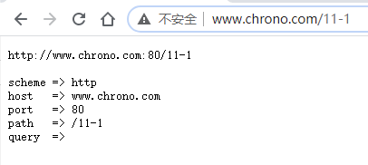
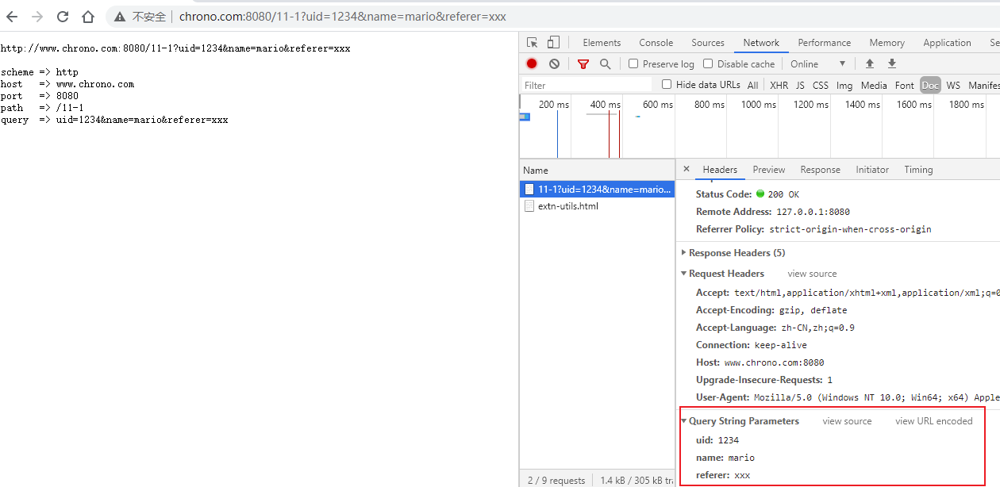
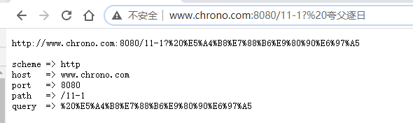

# 04 | 你能写出正确的网址吗？

上一讲里我们一起学习了 HTTP 协议里的请求方法，其中最常用的一个是 GET，它用来从服务器上某个资源获取数据，另一个是 POST，向某个资源提交数据。

那么，应该用什么来标记服务器上的资源呢？怎么区分「这个」资源和「那个」资源呢？

经过前几讲的学习，你一定已经知道了，用的是 URI，也就是 **统一资源标识符**（Uniform Resource Identifier）。因为它经常出现在浏览器的地址栏里，所以俗称为网络地址，简称网址。

严格地说，URI 不完全等同于网址，**它包含有 URL 和 URN 两个部分** ，在 HTTP 世界里用的网址实际上是 URL—— **统一资源定位符**（Uniform Resource Locator）。但因为 URL 实在是太普及了，所以常常把这两者简单地视为相等。

不仅我们生活中的上网要用到 URI，平常的开发、测试、运维的工作中也少不了它。

如果你在客户端做 iOS、 Android 或者某某小程序开发，免不了要连接远程服务，就会调用底层 API 用 URI 访问服务。

如果你使用 Java、PHP 做后台 Web 开发，也会调用 getPath()、parse_url() 等函数来处理 URI，解析里面的各个要素。

在测试、运维配置 Apache、Nginx 等 Web 服务器的时候也必须正确理解 URI，分离静态资源与动态资源，或者设置规则实现网页的重定向跳转。

总之一句话，URI 非常重要，要搞懂 HTTP 甚至网络应用，就必须搞懂 URI。

## URI 的格式

不知道你平常上网的时候有没有关注过地址栏里的那一长串字符，有的比较简短，有的则一行都显示不下，有的意思大概能看明白，而有的则带着各种怪字符，有如天书。

其实只要你弄清楚了 URI 的格式，就能够轻易地「破解」这些难懂的「天书」了。

URI 本质上是一个字符串，这个字符串的作用是 **唯一地标记资源的位置或者名字** 。

这里我要提醒你注意，它不仅能够标记万维网的资源，也可以标记其他的，如邮件系统、本地文件系统等任意资源。而 **资源** 既可以是存在磁盘上的静态文本、页面数据，也可以是由 Java、PHP 提供的动态服务。

下面的这张图显示了 URI 最常用的形式，由 scheme、host:port、path 和 query 四个部分组成，但有的部分可以视情况省略。


## URI 的基本组成

URI 第一个组成部分叫 **scheme** ，翻译成中文叫 **方案名** 或者 **协议名** ，表示 **资源应该使用哪种协议** 来访问。

最常见的当然就是 http 了，表示使用 HTTP 协议。另外还有 https ，表示使用经过加密、安全的 HTTPS 协议。此外还有其他不是很常见的 scheme，例如 ftp、ldap、file、news 等。

浏览器或者你的应用程序看到 URI 里的 scheme，就知道下一步该怎么走了，会调用相应的 HTTP 或者 HTTPS 下层 API。显然，如果一个 URI 没有提供 scheme，即使后面的地址再完善，也是无法处理的。

在 scheme 之后，必须是 **三个特定的字符 「://」** ，它把 scheme 和后面的部分分离开。

实话实说，这个设计非常的怪异，我最早上网的时候看见地址栏里的 `://` 就觉得很别扭，直到现在也还是没有太适应。URI 的创造者蒂姆·伯纳斯 - 李也曾经私下承认 `://` 并非必要，当初有些过于草率了。

不过这个设计已经有了三十年的历史，不管我们愿意不愿意，只能接受。

在 `://` 之后，是被称为 **authority** 的部分，表示 **资源所在的主机名** ，通常的形式是 `host:port` ，即主机名加端口号。

主机名可以是 IP 地址或者域名的形式，必须要有，否则浏览器就会找不到服务器。但端口号有时可以省略，浏览器等客户端会依据 scheme 使用默认的端口号，例如 HTTP 的默认端口号是 80，HTTPS 的默认端口号是 443。

有了协议名和主机地址、端口号，再加上后面 **标记资源所在位置** 的 **path** ，浏览器就可以连接服务器访问资源了。

URI 里 path 采用了类似文件系统 **目录路径** 的表示方式，因为早期互联网上的计算机多是 UNIX 系统，所以采用了 UNIX 的 `/` 风格。其实也比较好理解，它与 scheme 后面的 `://` 是一致的。

这里我也要再次提醒你注意，URI 的 path 部分必须以 `/` 开始，也就是必须包含 `/` ，不要把 `/` 误认为属于前面 authority。

说了这么多理论，来看几个实例。

```
http://nginx.org
http://www.chrono.com:8080/11-1
https://tools.ietf.org/html/rfc7230
file:///D:/http_study/www/
```

第一个 URI 算是最简单的了，协议名是 `http` ，主机名是 `nginx.org`，端口号省略，所以是默认的 80，而路径部分也被省略了，默认就是一个 `/` ，表示根目录。

第二个 URI 是在实验环境里这次课程的专用 URI，主机名是 `www.chrono.com` ，端口号是 8080，后面的路径是 `/11-1` 。

第三个是 HTTP 协议标准文档 RFC7230 的 URI，主机名是 `tools.ietf.org` ，路径是 `/html/rfc7230` 。

最后一个 URI 要注意了，它的协议名不是 `http` ，而是 `file` ，表示这是本地文件，而后面居然有三个斜杠，这是怎么回事？

如果你刚才仔细听了 scheme 的介绍就能明白，这三个斜杠里的 **前两个属于 URI 特殊分隔符** `://` ，然后后面的 `/D:/http_study/www/` 是路径，而中间的主机名被  **省略** 了。这实际上是 file 类型 URI 的「特例」，它允许省略主机名，默认是本机 localhost。比如下面这个完整的地址，你在浏览器中访问一下，就能显示你本地 D 盘的文件了

```
file://localhost/D:/
```

但对于 HTTP 或 HTTPS 这样的网络通信协议，主机名是绝对不能省略的。原因之前也说了，会导致浏览器无法找到服务器。

我们可以在实验环境里用 Chrome 浏览器再仔细观察一下 HTTP 报文里的 URI。

运行 Chrome，用 F12 打开开发者工具，然后在地址栏里输入 `http://www.chrono.com/11-1` 得到的结果如下图




笔者第一次知道还可以看原始请求头：最核心的是 Request Headers 后面的按钮 `view source` 点击后就能看到原始的请求头了

发现了什么特别的没有？

在 HTTP 报文里的 URI `/11-1` 与浏览器里输入的 `http://www.chrono.com/11-1` 有很大的不同，**协议名和主机名都不见了，只剩下了后面的部分** 。

这是因为协议名和主机名已经分别出现在了请求行的版本号和请求头的 Host 字段里，没有必要再重复。当然，在请求行里使用完整的 URI 也是可以的，你可以在课后自己试一下。

通过这个小实验，我们还得到了一个结论：客户端和服务器看到的 URI 是不一样的。客户端看到的必须是完整的 URI，使用特定的协议去连接特定的主机，而服务器看到的只是报文请求行里被删除了协议名和主机名的 URI。

如果你配置过 Nginx，你就应该明白了，Nginx 作为一个 Web 服务器，它的 location、rewrite 等指令操作的 URI 其实指的是真正 URI 里的 path 和后续的部分。

## URI 的查询参数

使用 `协议名 + 主机名 + 路径` 的方式，已经可以精确定位网络上的任何资源了。但这还不够，很多时候我们还想在操作资源的时候附加一些额外的修饰参数。

举几个例子：获取商品图片，但想要一个 32×32 的缩略图版本；获取商品列表，但要按某种规则做分页和排序；跳转页面，但想要标记跳转前的原始页面。

仅用 `协议名 + 主机名 + 路径` 的方式是无法适应这些场景的，所以 URI 后面还有一个 **query** 部分，它在 path 之后，用一个 `?` 开始，但不包含 `?` ，表示对资源附加的额外要求。这是个很形象的符号，比 `://` 要好的多，很明显地表示了 **查询** 的含义。

查询参数 query 有一套自己的格式，是多个 **key=value** 的字符串，这些 KV 值用字符 **&** 连接，浏览器和客户端都可以按照这个格式把长串的查询参数解析成可理解的字典或关联数组形式。

你可以在实验环境里用 Chrome 试试下面这个加了 query 参数的 URI：

```
http://www.chrono.com:8080/11-1?uid=1234&name=mario&referer=xxx
```



Chrome 的开发者工具也能解码出 query 里的 KV 对，省得我们「人肉」分解。

还可以再拿一个实际的 URI 来看一下，这个 URI 是某电商网站的一个商品查询 URI，比较复杂，但相信现在的你能够毫不费力地区分出里面的协议名、主机名、路径和查询参数。

```
https://search.jd.com/Search?keyword=openresty&enc=utf-8&qrst=1&rt=1&stop=1&vt=2&wq=openresty&psort=3&click=0
```

你也可以把这个 URI 输入到 Chrome 的地址栏里，再用开发者工具仔细检查它的组成部分。

## URI 的完整格式

讲完了 query 参数，URI 就算完整了，HTTP 协议里用到的 URI 绝大多数都是这种形式。

不过必须要说的是，URI 还有一个「真正」的完整形态，如下图所示。


这个真正形态比基本形态多了两部分。

- **身份信息**

  第一个多出的部分是协议名之后、主机名之前的 **身份信息** `user:passwd@`，表示登录主机时的用户名和密码，但现在已经不推荐使用这种形式了（RFC7230），因为它把敏感信息以明文形式暴露出来，存在严重的安全隐患。

- **片段标识符**

  第二个多出的部分是查询参数后的 **片段标识符** `#fragment`，它是 URI 所定位的资源内部的一个 **锚点** 或者说是 **标签**，浏览器可以在获取资源后直接 **跳转到它指示的位置** 。

但片段标识符仅能由浏览器这样的客户端使用，服务器是看不到的。也就是说，浏览器永远不会把带 `#fragment` 的 URI 发送给服务器，服务器也永远不会用这种方式去处理资源的片段。

## URI 的编码

刚才我们看到了，**在 URI 里只能使用 ASCII 码** ，但如果要在 URI 里使用英语以外的汉语、日语等其他语言该怎么办呢？

还有，某些特殊的 URI，会在 path、query 里出现 `@&?` 等起界定符作用的字符，会导致 URI 解析错误，这时又该怎么办呢？

所以，URI 引入了 **编码机制**，对于 ASCII 码以外的字符集和特殊字符做一个特殊的操作，把它们转换成与 URI 语义不冲突的形式。这在 RFC 规范里称为 `escape` 和 `unescape` ，俗称 **转义** 。

URI 转义的规则有点「简单粗暴」，**直接把非 ASCII 码或特殊字符转换成十六进制字节值** ，然后前面再加上一个 `%` 。

例如，空格被转义成 `%20`，`?` 被转义成 `%3F` 。而中文、日文等则通常使用 UTF-8 编码后再转义，例如 `银河` 会被转义 `%E9%93%B6%E6%B2%B3` 。

有了这个编码规则后，URI 就更加完美了，可以支持任意的字符集用任何语言来标记资源。

不过我们在浏览器的地址栏里通常是不会看到这些转义后的 「乱码」的，这实际上是浏览器一种友好表现，隐藏了 URI 编码后的「丑陋一面」，不信你可以试试下面的这个 URI。

```
http://www.chrono.com:8080/11-1? 夸父逐日
```



先在 Chrome 的地址栏里输入这个 query 里含有中文的 URI，然后点击地址栏，把它再拷贝到其他的编辑器里，它就会「现出原形」：

```
http://www.chrono.com:8080/11-1?%E5%A4%B8%E7%88%B6%E9%80%90%E6%97%A5
```

## 小结

今天我们学习了网址也就是 URI 的知识，在这里小结一下今天的内容。

1. URI 是用来唯一标记服务器上资源的一个字符串，通常也称为 URL；
2. URI 通常由 scheme、host:port、path 和 query 四个部分组成，有的可以省略；
3. scheme 叫方案名或者协议名，表示资源应该使用哪种协议来访问；
4. `host:port` 表示资源所在的主机名和端口号；
5. path 标记资源所在的位置；
6. query 表示对资源附加的额外要求；
7. 在 URI 里对 `@&/` 等特殊字符和汉字必须要做编码，否则服务器收到 HTTP 报文后会无法正确处理。

## 课下作业

1. HTTP 协议允许在在请求行里使用完整的 URI，但为什么浏览器没有这么做呢？

   笔者认为：节省带宽资源，协议里起始行和 host 已经包含了

2. URI 的查询参数和头字段很相似，都是 key-value 形式，都可以任意自定义，那么它们在使用时该如何区别呢？

## 课外小贴士

- 可以直接把文件或目录从资源管理器「拖入」浏览器窗口，地址栏就会显示出对应的 URl
- 查询参数 query 也可以不适用 `key=value` 的形式，只是单纯的使用 `key`，这样 `value` 就是空字符串
- 如果查询参数 query 太长，也可以使用 POST 方法，放在 body 里发送给服务器
- URL 还有「绝对 URL」和「相对 URL」之分，多用在 HTML 页面里标记引用其他资源，而在 HTTP 请求行里则不会出现
- 需要注意 URI 编码转义与 HTML 里的编码转义是不同的，URI 转义使用的是 `%`，而 HTML 转义使用的是 `&#` ，不要混淆

## 拓展阅读

- DNS 域名解析会优先解析到最近的 IP，如何实现最近的？

  判断远近很复杂，也是 cdn 的核心技术之一，术语叫 GSLB。简单来说，就是看 ip 地址，然后有一个对照表，就知道在哪里了。

- URN 代表什么的？

  统一资源名，现在用的很少。