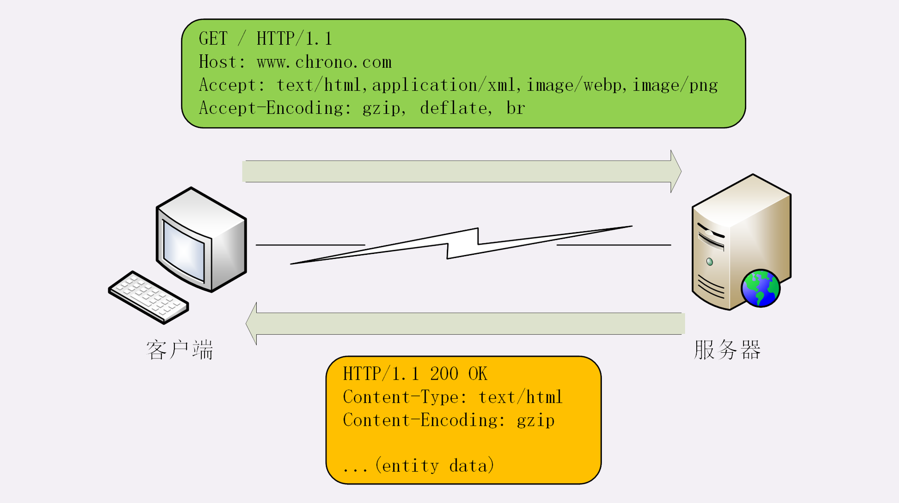
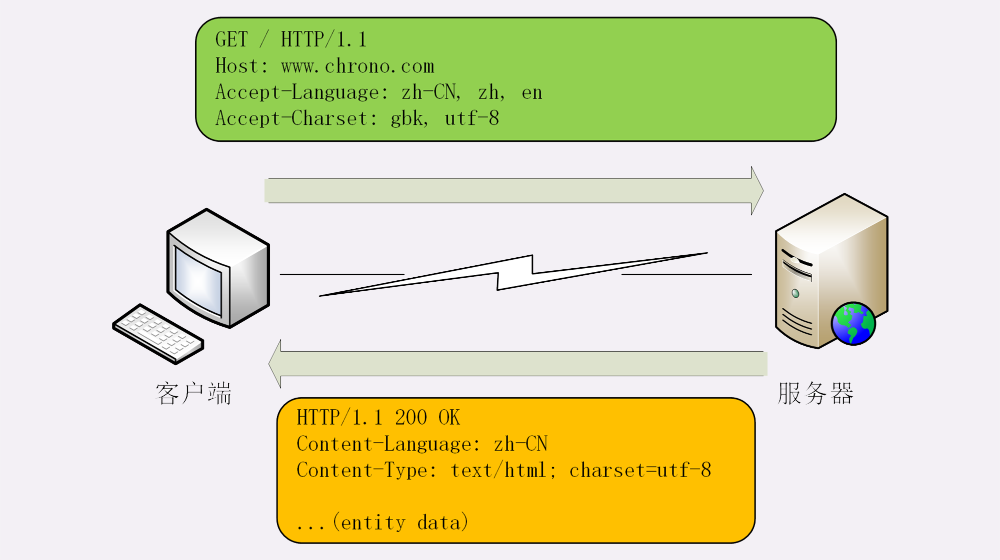
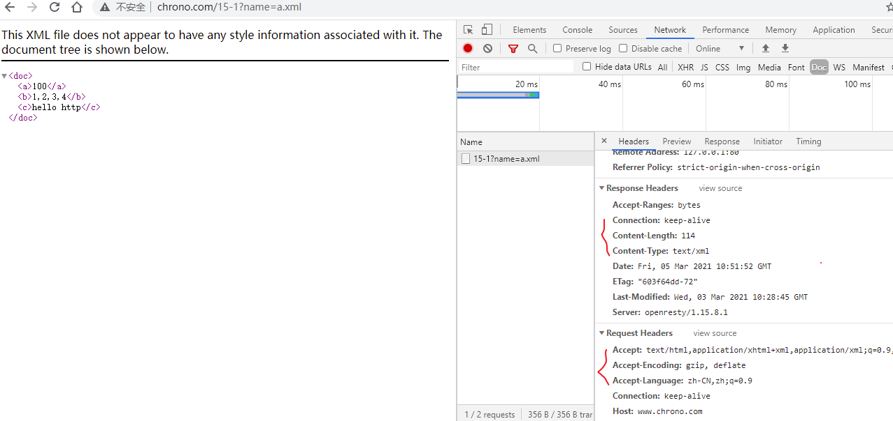

# 01 | 海纳百川：HTTP 的实体数据

这一讲是进阶篇的第一讲，从今天开始，我会用连续的 8 讲的篇幅来详细解析 HTTP 协议里的各种头字段，包括定义、功能、使用方式、注意事项等等。学完了这些课程，你就可以完全掌握 HTTP 协议。

在前面的基础篇里我们了解了 HTTP 报文的结构，知道一个 HTTP 报文是由 `header+body` 组成的。但那时我们主要研究的是 header，没有涉及到 body。所以，进阶篇的第一讲就从 HTTP 的 body 谈起。

## 数据类型与编码

在 TCP/IP 协议栈里，传输数据基本上都是 `header+body` 的格式。但 TCP、UDP 因为是传输层的协议，它们不会关心 body 数据是什么，只要把数据发送到对方就算是完成了任务。

而 HTTP 协议则不同，它是应用层的协议，数据到达之后工作只能说是完成了一半，还必须要告诉上层应用这是什么数据才行，否则上层应用就会「不知所措」。

你可以设想一下，假如 HTTP 没有告知数据类型的功能，服务器把一大坨数据发给了浏览器，浏览器看到的是一个黑盒子，这时候该怎么办呢？

当然，它可以猜。因为很多数据都是有固定格式的，所以通过检查数据的前几个字节也许就能知道这是个 GIF 图片、或者是个 MP3 音乐文件，但这种方式无疑十分低效，而且有很大几率会检查不出来文件类型。

幸运的是，早在 HTTP 协议诞生之前就已经有了针对这种问题的解决方案，不过它是用在电子邮件系统里的，让电子邮件可以发送 ASCII 码以外的任意数据，方案的名字叫做 **多用途互联网邮件扩展**（Multipurpose Internet Mail Extensions），简称为 MIME。

MIME 是一个很大的标准规范，但 HTTP 只是顺手牵羊取了其中的一部分，**用来标记 body 的数据类型** ，这就是我们平常总能听到的 **MIME type**。

MIME 把数据分成了 **八大类** ，每个大类下再细分出多个子类，形式是 `type/subtype`  的字符串，巧得很，刚好也符合了 HTTP 明文的特点，所以能够很容易地纳入 HTTP 头字段里。

这里简单列举一下在 HTTP 里经常遇到的几个类别：

1. text：即文本格式的可读数据，我们最熟悉的应该就是 `text/html` 了，表示超文本文档，此外还有纯文本 `text/plain`、样式表 `text/css` 等。
2. image：即图像文件，有 `image/gif`、`image/jpeg`、`image/png` 等。
3. `audio/video`：音频和视频数据，例如 `audio/mpeg`、`video/mp4` 等。
4. application：数据格式不固定，可能是文本也可能是二进制，必须由上层应用程序来解释。常见的有 `application/json`，`application/javascript`、`application/pdf` 等，另外，如果实在是不知道数据是什么类型，像刚才说的黑盒，就会是 `application/octet-stream`，**即不透明的二进制数据** 。

但仅有 MIME type 还不够，因为 HTTP 在传输时为了节约带宽，有时候还会 **压缩数据** ，为了不要让浏览器继续猜，还需要有一个 `Encoding type` ，告诉数据是用的什么编码格式，这样对方才能正确解压缩，还原出原始的数据。

比起 MIME type 来说，Encoding type 就少了很多，常用的只有下面三种：

1. gzip：GNU zip 压缩格式，也是互联网上最流行的压缩格式；
2. deflate：zlib（deflate）压缩格式，流行程度仅次于 gzip；
3. br：一种专门为 HTTP 优化的新压缩算法（Brotli）。

## 数据类型使用的头字段

有了 MIME type 和 Encoding type，无论是浏览器还是服务器就都可以轻松识别出 body 的类型，也就能够正确处理数据了。

HTTP 协议为此定义了两个 `Accept`  请求头字段和两个 `Content` 实体头字段，用于客户端和服务器进行 **内容协商**。也就是说，**客户端用 Accept 头告诉服务器希望接收什么样的数据** ，**而服务器用 Content 头告诉客户端实际发送了什么样的数据**。



**Accept** 字段标记的是 **客户端可理解的 MIME type** ，可以用 `,` 做分隔符列出多个类型，让服务器有更多的选择余地，例如下面的这个头：

```
Accept: text/html,application/xml,image/webp,image/png
```

这就是告诉服务器：我能够看懂 HTML、XML 的文本，还有 webp 和 png 的图片，请给我这四类格式的数据。

相应的，服务器会在响应报文里用头字段 `Content-Type` 告诉实体数据的真实类型：

```
Content-Type: text/html
Content-Type: image/png
```

这样浏览器看到报文里的类型是 `text/html` 就知道是 HTML 文件，会调用排版引擎渲染出页面，看到 `image/png` 就知道是一个 PNG 文件，就会在页面上显示出图像。

**Accept-Encoding** 字段标记的是 **客户端支持的压缩格式** ，例如上面说的 gzip、deflate 等，同样也可以用 `,` 列出多个，服务器可以选择其中一种来压缩数据，实际使用的压缩格式放在响应头字段  **Content-Encoding** 里。

```
Accept-Encoding: gzip, deflate, br
Content-Encoding: gzip
```

不过这两个字段是可以省略的，如果请求报文里没有 Accept-Encoding 字段，就表示客户端不支持压缩数据；如果响应报文里没有 Content-Encoding 字段，就表示响应数据没有被压缩。

::: tip

Content-Type 字段不仅仅用在响应中，它是实体（body）字段，标识 body 中的内容是什么，也就是说可以在请求头和响应头中使用

:::

## 语言类型与编码

MIME type 和 Encoding type 解决了计算机理解 body 数据的问题，但互联网遍布全球，不同国家不同地区的人使用了很多不同的语言，虽然都是 `text/html` ，但如何让浏览器显示出每个人都可理解可阅读的语言文字呢？

这实际上就是 **国际化** 的问题。HTTP 采用了与数据类型相似的解决方案，又引入了两个概念：语言类型与字符集。

所谓的 **语言类型** 就是人类使用的自然语言，例如英语、汉语、日语等，而这些自然语言可能还有下属的地区性方言，所以在需要明确区分的时候也要使用 `type-subtype` 的形式，不过这里的格式与数据类型不同， **分隔符不是 `/` ， 而是 `-`** 。

举几个例子：en 表示任意的英语，en-US 表示美式英语，en-GB 表示英式英语，而 zh-CN 就表示我们最常使用的汉语。

关于自然语言的计算机处理还有一个更麻烦的东西叫做 **字符集** 。

在计算机发展的早期，各个国家和地区的人们「各自为政」，发明了许多字符编码方式来处理文字，比如英语世界用的 ASCII、汉语世界用的 GBK、BIG5，日语世界用的 Shift_JIS 等。同样的一段文字，用一种编码显示正常，换另一种编码后可能就会变得一团糟。

所以后来就出现了 Unicode 和 UTF-8，把世界上所有的语言都容纳在一种编码方案里，UTF-8 编码 的 Unicode 也成为了互联网上的标准字符集。

## 语言类型使用的头字段

同样的，HTTP 协议也使用 Accept 请求头字段和 Content 实体头字段，用于客户端和服务器就语言与编码进行 **内容协商** 。

**Accept-Language** 字段标记了 **客户端可理解的自然语言** ，也允许用 ` ,` 做分隔符列出多个类型，例如：

```
Accept-Language: zh-CN, zh, en
```

这个请求头会告诉服务器：最好给我 zh-CN 的汉语文字，如果没有就用其他的汉语方言，如果还没有就给英文。

相应的，服务器应该在响应报文里用头字段 **Content-Language** 告诉客户端实体数据使用的实际语言类型：

```
Content-Language: zh-CN
```

字符集在 HTTP 里使用的请求头字段是 **Accept-Charset** ，但响应头里却没有对应的 Content-Charset，而是在**Content-Type** 字段的数据类型后面用 `charset=xxx` 来表示，这点需要特别注意。

例如，浏览器请求 GBK 或 UTF-8 的字符集，然后服务器返回的是 UTF-8 编码，就是下面这样：

```
Accept-Charset: gbk, utf-8
Content-Type: text/html; charset=utf-8
```

不过现在的浏览器都支持多种字符集，通常不会发送 Accept-Charset，而服务器也不会发送 Content-Language，因为使用的语言完全可以由字符集推断出来，所以在请求头里一般只会有 `Accept-Language`  字段，响应头里只会有 `Content-Type`  字段。



## 内容协商的质量值

在 HTTP 协议里用 Accept、Accept-Encoding、Accept-Language 等请求头字段进行内容协商的时候，还可以用一种特殊的 `q` 参数表示权重来设定优先级，这里的 `q` 是 `quality factor`的意思。

权重的最大值是 1，最小值是 0.01，默认值是 1，如果值是 0 就表示拒绝。具体的形式是在数据类型或语言代码后面加一个 `;` ，然后是 `q=value` 。

这里要提醒的是 `;` 的用法，在大多数编程语言里 `;` 的断句语气要强于 `,` ，而在 HTTP 的内容协商里却恰好反了过来，`;` 的意义是小于 `,` 的。

例如下面的 Accept 字段：

```
Accept: text/html,application/xml;q=0.9,*/*;q=0.8
```

它表示浏览器最希望使用的是 HTML 文件，权重是 1，其次是 XML 文件，权重是 0.9，最后是任意数据类型，权重是 0.8。服务器收到请求头后，就会计算权重，再根据自己的实际情况优先输出 HTML 或者 XML。

## 内容协商的结果

内容协商的过程是不透明的，每个 Web 服务器使用的算法都不一样。但有的时候，服务器会在响应头里多加一个**Vary** 字段，记录服务器在内容协商时参考的请求头字段，给出一点信息，例如：

```
Vary: Accept-Encoding,User-Agent,Accept
```

这个 Vary 字段表示服务器依据了 Accept-Encoding、User-Agent 和 Accept 这三个头字段，然后决定了发回的响应报文。

Vary 字段可以认为是响应报文的一个特殊的 **版本标记** 。每当 Accept 等请求头变化时，Vary 也会随着响应报文一起变化。也就是说，同一个 URI 可能会有多个不同的「版本」，**主要用在传输链路中间的代理服务器实现缓存服务** ，这个之后讲 HTTP 缓存 时还会再提到。

## 动手实验

上面讲完了理论部分，接下来就是实际动手操作了。可以用我们的实验环境，在 www 目录下有一个 mime 目录，里面预先存放了几个文件，可以用 URI `/15-1?name=file` 的形式访问，例如：

在 Chrome 里打开开发者工具，就能够看到 Accept 和 Content 头：

```
http://www.chrono.com/15-1?name=a.json
http://www.chrono.com/15-1?name=a.xml
```




你也可以把任意的文件拷贝到 mime 目录下，比如压缩包、MP3、图片、视频等，再用 Chrome 访问，观察更多的 MIME type。

有了这些经验后，你还可以离开实验环境，直接访问各大门户网站，看看真实网络世界里的 HTTP 报文是什么样子的。

## 小结

今天我们学习了 HTTP 里的数据类型和语言类型，在这里为今天的内容做个小结。


1. 数据类型表示实体数据的内容是什么，使用的是 MIME type，相关的头字段是 Accept 和 Content-Type；
2. 数据编码表示实体数据的压缩方式，相关的头字段是 Accept-Encoding 和 Content-Encoding；
3. 语言类型表示实体数据的自然语言，相关的头字段是 Accept-Language 和 Content-Language；
4. 字符集表示实体数据的编码方式，相关的头字段是 Accept-Charset 和 Content-Type；
5. 客户端需要在请求头里使用 Accept 等头字段与服务器进行内容协商，要求服务器返回最合适的数据；
6. Accept 等头字段可以用 `,` 顺序列出多个可能的选项，还可以用 `;q=` 参数来精确指定权重。

::: tip

- Accept、Accept-xx 是告诉 **服务端** ，我能解释什么

  这里也不一定是对的，就像后面讲解的 **Accept-Ranges: bytes** 分块请求，就是服务器端响应给客户端的

- Content-xxx：告诉 **对方** ，我给你的是什么，也就是说，可以在请求和响应中使用

:::

## 课下作业

1. 试着解释一下这个请求头 `Accept-Encoding: gzip, deflate;q=1.0, *;q=0.5, br;q=0`，再模拟一下服务器的响应头。

   笔者认为：优先使用 gzip 压缩，其次 deflate，其他的压缩方式，br 方式我不能识别

   响应头：
   
   ```
   Content-Encodeing: gzip;
   ```

2. 假设你要使用 POST 方法向服务器提交一些 JSON 格式的数据，里面包含有中文，请求头应该是什么样子的呢？

   注意题意，问的是提交，不是接受服务端的结果

   ```
   Content-Length: 92
   Content-Type: application/json; charset=utf-8
   ```

   charset 可以省略，大部分的应用服务器都默认是 utf8

3. 试着用快递发货收货比喻一下 MIME、Encoding 等概念。

   比如你的商品类别（MIME）是文件，快递人员可以给你发航空，但是得用包裹把你的文件包装起来，也就是文件封（Encoding）

   