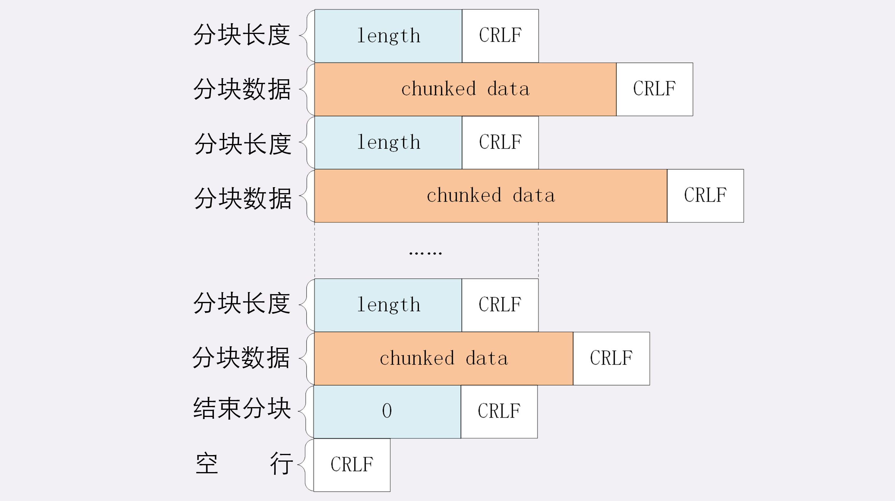
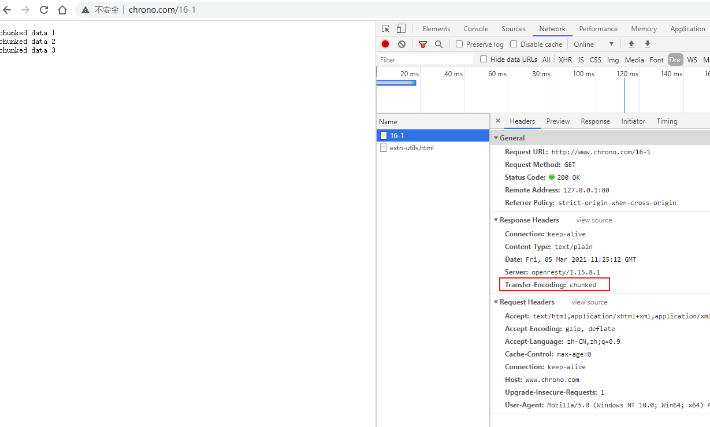
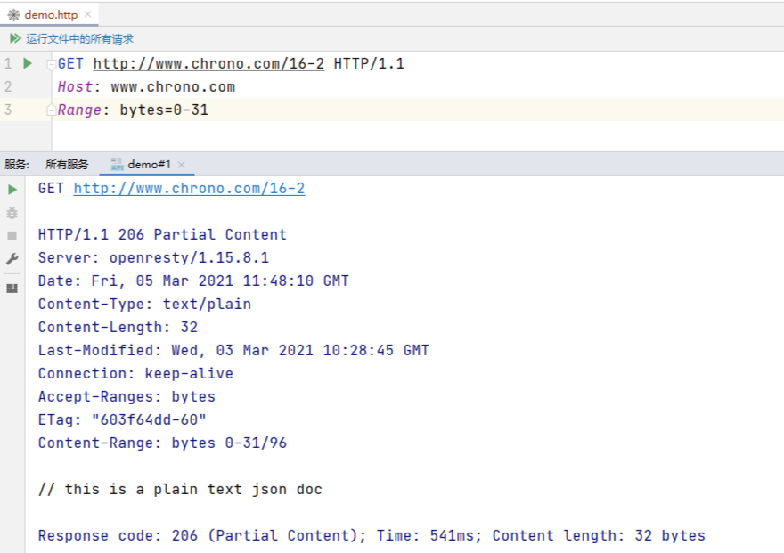
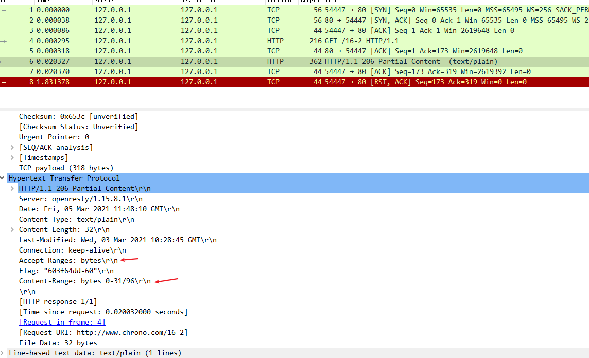
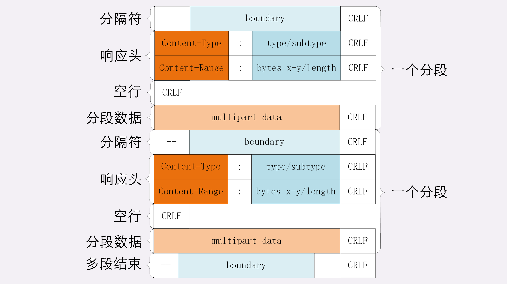

# 02 | 把大象装进冰箱：HTTP 传输大文件的方法

上次我们谈到了 HTTP 报文里的 body，知道了 HTTP 可以传输很多种类的数据，不仅是文本，也能传输图片、音频和视频。

早期互联网上传输的基本上都是只有几 K 大小的文本和小图片，现在的情况则大有不同。网页里包含的信息实在是太多了，随随便便一个主页 HTML 就有可能上百 K，高质量的图片都以 M 论，更不要说那些电影、电视剧了，几 G、几十 G 都有可能。

相比之下，100M 的光纤固网或者 4G 移动网络在这些大文件的压力下都变成了 「小水管」，无论是上传还是下载，都会把网络传输链路挤的「满满当当」。

所以，**如何在有限的带宽下高效快捷地传输这些大文件就成了一个重要的课题** 。这就好比是已经打开了冰箱门（建立连接），该怎么把大象（文件）塞进去再关上门（完成传输）呢？

今天我们就一起看看 HTTP 协议里有哪些手段能解决这个问题。

## 数据压缩

还记得上一讲中说到的 **数据类型与编码** 吗？如果你还有印象的话，肯定能够想到一个最基本的解决方案，那就是 **数据压缩** ，把大象变成小猪佩奇，再放进冰箱。

通常浏览器在发送请求时都会带着 **Accept-Encoding** 头字段，里面是 **浏览器支持的压缩格式列表** ，例如 gzip、deflate、br 等，这样服务器就可以从中选择一种压缩算法，放进 **Content-Encoding** 响应头里，再把原数据压缩后发给浏览器。

如果压缩率能有 50%，也就是说 100K 的数据能够压缩成 50K 的大小，那么就相当于在带宽不变的情况下网速提升了一倍，加速的效果是非常明显的。

不过这个解决方法也有个缺点，gzip 等压缩算法通常只对文本文件有较好的压缩率，而图片、音频视频等多媒体数据本身就已经是高度压缩的，再用 gzip 处理也不会变小（甚至还有可能会增大一点），所以它就失效了。

不过数据压缩在处理文本的时候效果还是很好的，所以各大网站的服务器都会使用这个手段作为保底。例如，在 Nginx 里就会使用 `gzip on` 指令，启用对 `text/html` 的压缩。

## 分块传输

在数据压缩之外，还能有什么办法来解决大文件的问题呢？

压缩是把大文件整体变小，我们可以反过来思考，如果大文件整体不能变小，那就把它 **拆开** ，分解成多个小块，把这些小块分批发给浏览器，浏览器收到后再组装复原。

这样浏览器和服务器都不用在内存里保存文件的全部，每次只收发一小部分，网络也不会被大文件长时间占用，内存、带宽等资源也就节省下来了。

这种 **化整为零** 的思路在 HTTP 协议里就是 **chunked** 分块传输编码，在响应报文里用头字段 **Transfer-Encoding: chunked** 来表示，意思是报文里的 body 部分不是一次性发过来的，而是分成了许多的块（chunk）逐个发送。

这就好比是用魔法把大象变成乐高积木，拆散了逐个装进冰箱，到达目的地后再施法拼起来满血复活。

**分块传输也可以用于流式数据** ，例如由数据库动态生成的表单页面，这种情况下 **body 数据的长度是未知的** ，无法在头字段 **Content-Length** 里给出确切的长度，所以也只能用 chunked 方式分块发送。

`Transfer-Encoding: chunked` 和 `Content-Length` 这两个字段是 **互斥的** ，也就是说响应报文里这两个字段不能同时出现，一个响应报文的传输要么是长度已知，要么是长度未知（chunked），这一点你一定要记住。

下面我们来看一下分块传输的编码规则，其实也很简单，同样采用了明文的方式，很类似响应头。

1. 每个分块包含两个部分，长度头和数据块；
2. 长度头是以 CRLF（回车换行，即 `\r\n` ）结尾的一行明文，用 16 进制数字表示长度；
3. 数据块紧跟在长度头后，最后也用 CRLF 结尾，但数据不包含 CRLF；
4. 最后用一个长度为 0 的块表示结束，即 `0\r\n\r\n`。

听起来好像有点难懂，看一下图就好理解了：



实验环境里的 URI `/16-1` 简单地模拟了分块传输，可以用 Chrome 访问这个地址看一下效果：



不过浏览器在收到分块传输的数据后会自动按照规则去掉分块编码，重新组装出内容，所以想要看到服务器发出的原始报文形态就得用 Telnet 手工发送请求（或者用 Wireshark 抓包）：

```
GET /16-1 HTTP/1.1
Host: www.chrono.com
```

因为 Telnet 只是收到响应报文就完事了，不会解析分块数据，所以可以很清楚地看到响应报文里的 chunked 数据格式：先是一行 16 进制长度，然后是数据，然后再是 16 进制长度和数据，如此重复，最后是 0 长度分块结束。


通抓包的格式如下


可以简单验证下，响应的包，如下图所示：从响应的快中来看，的确是第二条数据


笔者还是很好奇分块传输后端是如何做的呢？看看对应的 lua 代码

```lua
-- Copyright (C) 2019 by chrono

-- chunked

--ngx.header['Content-Type'] = 'text/plain'
--ngx.header['Transfer-Encoding'] = 'chunked'

for i=1,3 do
    ngx.print('chunked data ' .. i .. '\n')
    ngx.flush(true)
end

```

可以看到，直接写入 body 中的，然后刷新，对应的具体 java 代码笔者暂时就猜不到了。后续有实战后再来补充说明

## 范围请求

有了分块传输编码，服务器就可以轻松地收发大文件了，但对于上 G 的超大文件，还有一些问题需要考虑。

比如，你在看当下正热播的某穿越剧，想跳过片头，直接看正片，或者有段剧情很无聊，想拖动进度条快进几分钟，**这实际上是想获取一个大文件其中的片段数据** ，而分块传输并没有这个能力。

HTTP 协议为了满足这样的需求，提出了 **范围请求** （range requests）的概念，允许客户端在请求头里使用专用字段来表示只获取文件的一部分，相当于是 **客户端的「化整为零**」 。

范围请求不是 Web 服务器必备的功能，可以实现也可以不实现，所以服务器必须在响应头里使用字段 **Accept-Ranges: bytes** 明确告知客户端：「我是支持范围请求的」。

如果不支持的话该怎么办呢？服务器可以发送 `Accept-Ranges: none` ，或者干脆不发送 `Accept-Ranges` 字段，这样客户端就认为服务器没有实现范围请求功能，只能老老实实地收发整块文件了。

请求头 **Range** 是 HTTP 范围请求的专用字段，格式是 **bytes=x-y**，其中的 x 和 y 是以字节为单位的数据范围。

要注意 x、y 表示的是 **偏移量** ，范围必须从 0 计数，例如前 10 个字节表示为 `0-9`，第二个 10 字节表示为 `10-19` ，而 `0-10` 实际上是前 11 个字节。

Range 的格式也很灵活，起点 x 和终点 y 可以省略，能够很方便地表示正数或者倒数的范围。**假设文件是 100 个字节** ，那么：

- `0-` 表示从文档起点到文档终点，相当于 `0-99` ，即整个文件；
- `10-` 是从第 10 个字节开始到文档末尾，相当于 `10-99`；
- `-1` 是文档的最后一个字节，相当于 `99-99` ；
- `-10` 是从文档末尾倒数 10 个字节，相当于 `90-99` 。

服务器收到 Range 字段后，需要做四件事。

1. 第一，它必须检查范围是否合法

   比如文件只有 100 个字节，但请求 `200-300` ，这就是范围越界了。服务器就会返回状态码 **416**，意思是「你的范围请求有误，我无法处理，请再检查一下」。

2. 第二，如果范围正确，服务器就可以根据 Range 头计算偏移量，读取文件的片段了，返回状态码 **206 Partial Content** ，和 200 的意思差不多，但表示 body 只是原数据的一部分。

3. 第三，服务器要添加一个响应头字段 **Content-Range** 

   告诉片段的实际偏移量和资源的总大小，格式是 **bytes x-y/length** ，与 Range 头区别在没有 `=`，范围后多了总长度。例如，对于 `0-10` 的范围请求，值就是 `bytes 0-10/100` 。

4. 最后剩下的就是发送数据了，直接把片段用 TCP 发给客户端，一个范围请求就算是处理完了。

你可以用实验环境的 URI `/16-2` 来测试范围请求，它处理的对象是 `/mime/a.txt` 。不过我们不能用 Chrome 浏览器，因为它没有编辑 HTTP 请求头的功能（这点上不如 Firefox 方便），所以还是要用 Telnet。

例如下面的这个请求使用 Range 字段获取了文件的前 32 个字节：

```
GET /16-2 HTTP/1.1
Host: www.chrono.com
Range: bytes=0-31
```

返回的数据是（去掉了几个无关字段）：

```
HTTP/1.1 206 Partial Content
Content-Length: 32
Accept-Ranges: bytes
Content-Range: bytes 0-31/96
 
// this is a plain text json doc
```


笔者这里还介绍一种工具，idea 的 xx.http 文件功能，



文件内容如下

```http
GET http://www.chrono.com/16-2 HTTP/1.1
Host: www.chrono.com
Range: bytes=0-31
```

通过抓包如下图所示



有了范围请求之后，HTTP 处理大文件就更加轻松了，看视频时可以根据时间点计算出文件的 Range，不用下载整个文件，直接精确获取片段所在的数据内容。

不仅看视频的拖拽进度需要范围请求，常用的下载工具里的多段下载、断点续传也是基于它实现的，要点是：

- 先发个 HEAD，看服务器是否支持范围请求，同时获取文件的大小；
- 开 N 个线程，每个线程使用 Range 字段划分出各自负责下载的片段，发请求传输数据；
- 下载意外中断也不怕，不必重头再来一遍，只要根据上次的下载记录，用 Range 请求剩下的那一部分就可以了。

后端代码是如何处理的呢？

```lua
-- Copyright (C) 2019 by chrono

-- 使用 ngx_http_range_filter_module 模块来处理范围请求

local path = "/mime/a.txt"

-- Accept-Ranges: bytes
if ngx.var.http_range then
    ngx.header['Accept-Ranges'] = 'bytes'
end

return ngx.exec(path)

-- 我们自己解析处理范围请求的简单逻辑如下

--[==[
-- 获取 range 头
local range = ngx.var.http_range

ngx.status = 400
str = "only test for range request\n"

-- 检查 range header 头部
if not range then
    ngx.header['Content-Length'] = #str

    return ngx.print(str)
end
--ngx.log(ngx.ERR, "range is: ", range)

str = "range field error\n"

-- 检查 range 格式，bytes 0-10/100
local m = ngx.re.match(range, [[bytes=(\d+)-(\d+)]], "ijo")
--ngx.log(ngx.ERR, "re is: ", m[0] or 'no re')
if not m then
    ngx.header['Content-Length'] = #str
    return ngx.print(str)
end

-- 获取 a-b 中的 a 和 b； 0-10
local start_pos = tonumber(m[1])
local end_pos = tonumber(m[2])

-- 这两个值必须存在
if not start_pos or not end_pos or
   start_pos > end_pos then

    ngx.header['Content-Length'] = #str
    return ngx.print(str)
end

-- 计算要给出的文件大小（当次请求需要给出的块大小）
local range_num = end_pos - start_pos + 1
--local fake_content_length = range_num + 500

ngx.status = 416
str = "range too huge for test\n"

if range_num > 1000 then
    ngx.header['Content-Length'] = #str
    return ngx.print(str)
end

ngx.status = 206    -- partial content
ngx.header['Accept-Range'] = 'bytes'
ngx.header['Content-Range'] = 'bytes ' ..
                              start_pos ..
                              '-' ..
                              end_pos ..
                              '/' ..
                              range_num + 500

str = 'data:' .. string.rep('x', range_num - 5)
ngx.header['Content-Length'] = #str

ngx.print(str)
--]==]

```

笔者对 lua 代码也不是特别的熟悉，可以看懂部分代码，上面给出了注释，下面再总结下该代码的主要处理流程如下（不包含检查边界逻辑）：

1. 获取 `Range: bytes=0-31` 头中的范围， 0 和 31
2. 计算出当次要给出的文件大小，也就是 31- 0 + 1，将文件按照此偏移量，截取出二进制数据（此例中，应该是用字符串?）放入 body 中
3. 计算文件的总大小
4. 写响应头
   - 状态：HTTP/1.1 206 Partial Content
   - 此次 body 的内容大小：Content-Length: 32   
   - 响应客户端支持范围请求：Accept-Ranges: bytes
   - 响应此次给出的文件偏移量和总大小：Content-Range: bytes 0-31/96

## 多段数据

刚才说的范围请求一次只获取一个片段，其实它还支持在 Range 头里使用多个 `x-y`，一次性获取多个片段数据。

这种情况需要使用一种特殊的 MIME 类型：**multipart/byteranges**，表示报文的 body 是由多段字节序列组成的，并且还要用一个参数 **boundary=xxx** 给出段之间的分隔标记。

多段数据的格式与分块传输也比较类似，但它需要用分隔标记 boundary 来区分不同的片段，可以通过图来对比一下。



每一个分段必须以 `--boundary` 开始（前面加两个 `-` ），之后要用 `Content-Type` 和 `Content-Range` 标记这段数据的类型和所在范围，然后就像普通的响应头一样以回车换行结束，再加上分段数据，最后用一个 `--boundary- -`（前后各有两个 `-`）表示所有的分段结束。

例如，我们在实验环境里用 Telnet 发出有两个范围的请求：

```http
GET /16-2 HTTP/1.1
Host: www.chrono.com
Range: bytes=0-9, 20-29
```

得到的结果是下面这样

```http
HTTP/1.1 206 Partial Content
Content-Type: multipart/byteranges; boundary=00000000001
Content-Length: 189
Connection: keep-alive
Accept-Ranges: bytes
 
 
--00000000001
Content-Type: text/plain
Content-Range: bytes 0-9/96
 
// this is
--00000000001
Content-Type: text/plain
Content-Range: bytes 20-29/96
 
ext json d
--00000000001--
```

报文里的 `--00000000001` 就是多段的分隔符，使用它客户端就可以很容易地区分出多段 Range 数据。

这块代码的后端代码是上面范围请求里面的代码，它使用了 ngx_http_range_filter_module 来处理该请求，如果要自己处理也如同上面讲解的那样将数据拼接好即可。

## 小结

今天我们学习了 HTTP 传输大文件相关的知识，在这里做一下简单小结：

1. 压缩 HTML 等文本文件是传输大文件最基本的方法；
2. 分块传输可以流式收发数据，节约内存和带宽，使用响应头字段 `Transfer-Encoding: chunked` 来表示，分块的格式是 16 进制长度头 + 数据块；
3. 范围请求可以只获取部分数据，即 **分块请求**，实现视频拖拽或者断点续传，使用请求头字段 `Range` 和响应头字段 `Content-Range` ，响应状态码必须是 206；
4. 也可以一次请求多个范围，这时候响应报文的数据类型是 `multipart/byteranges` ，body 里的多个部分会用 boundary 字符串分隔。

要注意这四种方法不是互斥的，而是可以混合起来使用，例如压缩后再分块传输，或者分段后再分块，实验环境的 URI `/16-3` 就模拟了后一种的情形，你可以自己用 Telnet 试一下。

```http
GET http://www.chrono.com/16-3 HTTP/1.1
Host: www.chrono.com
Range: bytes=0-9, 20-29
```

响应如下

```http
GET http://www.chrono.com/16-3

HTTP/1.1 200 OK
Server: openresty/1.15.8.1
Date: Sat, 06 Mar 2021 01:55:17 GMT
Content-Type: multipart/byteranges; boundary=xyz
Transfer-Encoding: chunked				// 这里使用了 chunked 分开 和 范围请求
Connection: keep-alive
Accept-Ranges: bytes

--xyz
Content-Type: text/plain
Content-Range: bytes 0-9/90

// this is
--xyz
Content-Type: text/plain
Content-Range: bytes 20-29/90

ext json d
--xyz--


Response code: 200 (OK); Time: 133ms; Content length: 152 bytes

```

后端代码实现

```lua
-- Copyright (C) 2019 by chrono

-- chunked range

--[[
GET /16-2 HTTP/1.1
Host: www.chrono.com
Range: bytes=0-9, 20-29

--xyz
Content-Type: text/plain
Content-Range: bytes 0-9/90

// this is
--xyz
Content-Type: text/plain
Content-Range: bytes 20-29/90

ext json d
--xyz--
--]]

--ngx.header['Content-Type'] = 'text/plain'
--ngx.header['Transfer-Encoding'] = 'chunked'

-- 响应支持范围请求
ngx.header['Accept-Ranges'] = 'bytes'
-- 分段响应
ngx.header['Content-Type'] = 'multipart/byteranges; boundary=xyz'

-- 模拟 multipart 响应
local strs = {
-- 1st part
[[
--xyz
Content-Type: text/plain
Content-Range: bytes 0-9/90

// this is
]],

-- 2nd part
[[
--xyz
Content-Type: text/plain
Content-Range: bytes 20-29/90

ext json d
]],

-- last part
[[
--xyz--
]]
}

-- flush for chunked
for _,v in ipairs(strs) do
    ngx.print(v)
    ngx.flush(true)
end


```

## 课下作业

1. 分块传输数据的时候，如果数据里含有回车换行（`\r\n`）是否会影响分块的处理呢？

   由于分块响应时，报文结构给出了当前块的数据长度，所以不影响

2. 如果对一个被 gzip 的文件执行范围请求，比如 `Range: bytes=10-19` ，那么这个范围是应用于原文件还是压缩后的文件呢？

   记住一个规则：**range 是针对原文件的**

## 课外小贴士

- gzip 的压缩率通常能够超过 60%，而 br 算法是专门为 HTML 设计的，压缩效率和性能比 gzip 还要好，能够再提高 20% 的压缩密度
- Nginx 的 `gzip on` 指令很智能，只会压缩文本数据，不会压缩图片、音频、视频
- `Transfer-Encoding` 字段最常见的值是 chunked，但也可以用 gzip、deflate 等，表示传输时使用了压缩编码。注意这与 `Content-Encoding` 不同，`Transfer-Encoding` 在传输后会被自动解码还原出原始数据，而 `Content-Encoding` 则必须由应用自行解码
- 分块传输在末尾还允许有 「拖尾数据」，由响应字段 Trailer 指定
- 与 Range 有关的还有一个 `If-Range` ，即条件范围请求，将在后续章节讲解

## 拓展阅读

- http 交给 tcp 进行传输的时候本来就会分块，那 http 分块的意义是什么呢？

  在 http 层是看不到 tcp 的，它不知道下层协议是否会分块，下层是否分块对它来说没有意义，不关心。

  在 http 里一个报文必须是完整交付，在处理大文件的时候就很不方便，所以就要分块，在 http 层面方便处理。

  chunked 主要是在 http 的层次来解决问题。

- 客户端上传也可以使用 chunked、gzip，但不能用 range，注意这些字段的类型，只要是 **实体字段**，那就在请求响应里都可以用。

- 分块传输、分段传输，用的一个 tcp 连接吗？

   一个 http 请求必定是在一个 tcp 连接里收发的，虽然是分块，但也是用一个 tcp，所以在范围请求的时候，可以使用多线程建立多个 tcp 连接获取，最后拼接起来原文件

- 区分一个字段是什么类型？比如请求字段、响应字段还是通用字段

   rfc 里有说明，其次多看看 http 抓包就能熟悉，不需要刻意去记
   
- `Transfer-Encoding: chunked` 表示分段传输，改成 `Transfer-Encoding: gzip` 以后会自动解压，分段传输的语意还在么

   看字段的值，没有 chunked，那就不是分块，只是压缩。

   `Transfer-Encoding: chunked,gzip` 这样的多种组合理论上是可行的，但一般用的比较少。

    

    