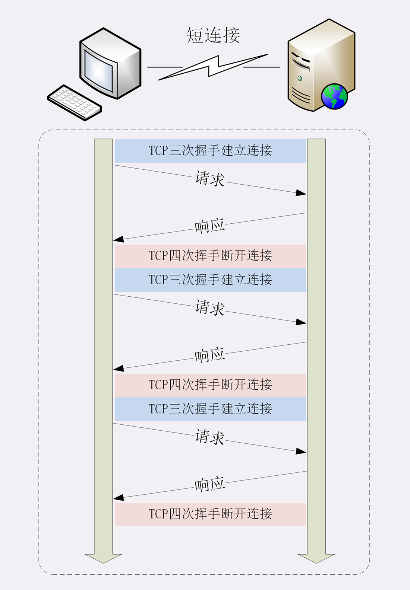
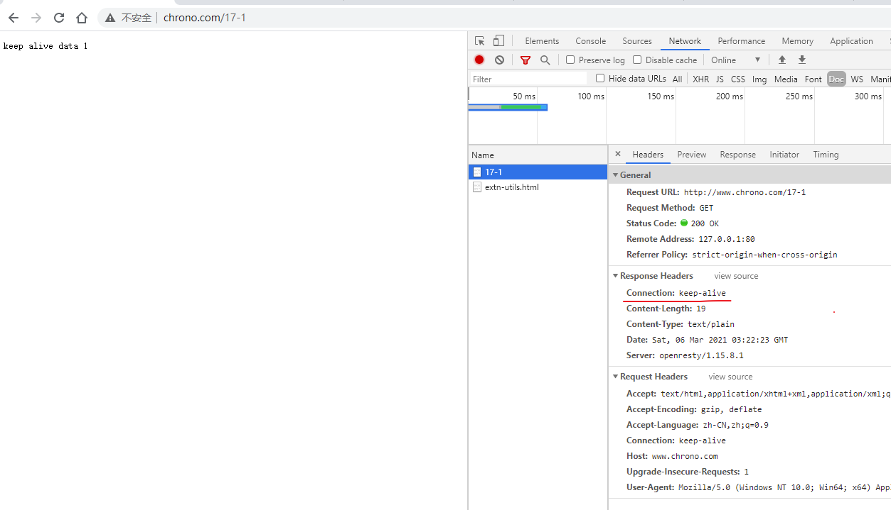
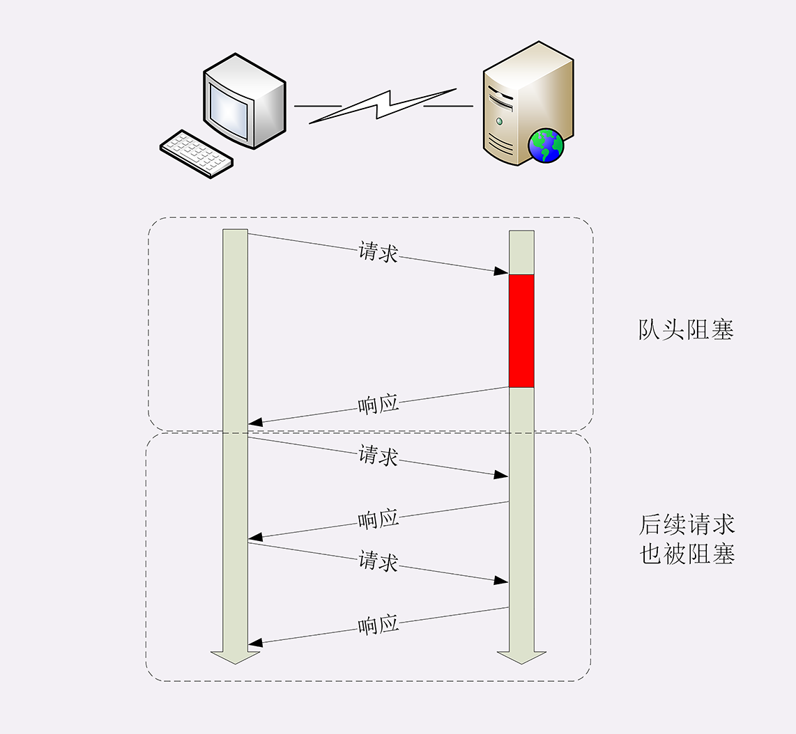

# 03 | 排队也要讲效率：HTTP 的连接管理

在 [HTTP 优缺点章节中讲到](../03/07.md)  HTTP 的性能问题，用了六个字来概括：**不算差，不够好** 。同时，我也谈到了 **队头阻塞** ，但由于时间的限制没有展开来细讲，这次就来好好地看看 HTTP 在连接这方面的表现。

HTTP 的连接管理也算得上是个老生常谈的话题了，你一定曾经听说过 **短连接**、**长连接** 之类的名词，今天让我们一起来把它们弄清楚。

## 短连接

HTTP 协议最初（0.9/1.0）是个非常简单的协议，通信过程也采用了简单的 **请求 - 应答** 方式。

它底层的数据传输基于 TCP/IP，每次发送请求前需要先与服务器建立连接，收到响应报文后会立即关闭连接。

因为客户端与服务器的整个连接过程很短暂，不会与服务器保持长时间的连接状态，所以就被称为 **短连接** （short-lived connections）。早期的 HTTP 协议也被称为是 **无连接** 的协议。

短连接的缺点相当严重，因为在 TCP 协议里，建立连接和关闭连接都是非常“昂贵”的操作。TCP 建立连接要有 **三次握手**，发送 3 个数据包，需要 1 个 RTT；关闭连接是 **四次挥手**，4 个数据包需要 2 个 RTT（一个来回就是 1 RTT）。

而 HTTP 的一次简单请求 - 响应通常只需要 4 个包，如果不算服务器内部的处理时间，最多是 2 个 RTT。这么算下来，浪费的时间就是`3÷5=60%` ，有三分之二的时间被浪费掉了，传输效率低得惊人。



单纯地从理论上讲，TCP 协议你可能还不太好理解，我就拿打卡考勤机来做个形象的比喻吧。

假设你的公司买了一台打卡机，放在前台，因为这台机器比较贵，所以专门做了一个保护罩盖着它，公司要求每次上下班打卡时都要先打开盖子，打卡后再盖上盖子。

可是偏偏这个盖子非常牢固，打开关闭要费很大力气，打卡可能只要 1 秒钟，而开关盖子却需要四五秒钟，**大部分时间都浪费在了毫无意义的开关盖子操作上了** 。

可想而知，平常还好说，一到上下班的点在打卡机前就会排起长队，每个人都要重复“开盖 - 打卡 - 关盖”的三个步骤，你说着急不着急。

在这个比喻里，打卡机就相当于服务器，盖子的开关就是 TCP 的连接与关闭，而每个打卡的人就是 HTTP 请求，很显然，短连接的缺点严重制约了服务器的服务能力，导致它无法处理更多的请求。

## 长连接

针对短连接暴露出的缺点，HTTP 协议就提出了 **长连接** 的通信方式，也叫 **持久连接** （persistent connections）、**连接保活**（keep alive）、**连接复用**（connection reuse）。

其实解决办法也很简单，用的就是 **成本均摊** 的思路，既然 TCP 的连接和关闭非常耗时间，那么就把这个时间成本由原来的一个请求 - 应答均摊到多个请求 - 应答上。

这样虽然不能改善 TCP 的连接效率，但基于 **分母效应** ，每个请求 - 应答的无效时间就会降低不少，整体传输效率也就提高了。

这里我画了一个短连接与长连接的对比示意图。


在短连接里发送了三次 HTTP请求 - 应答，每次都会浪费 60% 的 RTT 时间。而在长连接的情况下，同样发送三次请求，因为只在第一次时建立连接，在最后一次时关闭连接，所以浪费率就是 `3÷9≈33%` ，降低了差不多一半的时间损耗。显然，如果在这个长连接上发送的请求越多，分母就越大，利用率也就越高。

继续用刚才的打卡机的比喻，公司也觉得这种反复「开盖 - 打卡 - 关盖」的操作太反人类了，于是颁布了新规定，早上打开盖子后就不用关上了，可以自由打卡，到下班后再关上盖子。

这样打卡的效率（即服务能力）就大幅度提升了，原来一次打卡需要五六秒钟，现在只要一秒就可以了，上下班时排长队的景象一去不返，大家都开心。

## 连接相关的头字段

由于长连接对性能的改善效果非常显著，所以在 HTTP/1.1 中的连接都会 **默认启用长连接** 。不需要用什么特殊的头字段指定，只要向服务器发送了第一次请求，后续的请求都会重复利用第一次打开的 TCP 连接，也就是长连接，在这个连接上收发数据。

当然，我们也可以在请求头里明确地要求使用长连接机制，使用的字段是 **Connection** ，值是 **keep-alive** 。

不过不管客户端是否显式要求长连接，如果服务器支持长连接，它总会在响应报文里放一个 **Connection: keep-alive** 字段，告诉客户端：我是支持长连接的，接下来就用这个 TCP 一直收发数据吧。

你可以在实验环境里访问 URI `/17-1`，用 Chrome 看一下服务器返回的响应头：



不过长连接也有一些小缺点，问题就出在它的 **长** 字上。

因为 TCP 连接长时间不关闭，服务器必须在内存里保存它的状态，这就占用了服务器的资源。如果有大量的空闲长连接只连不发，就会很快耗尽服务器的资源，导致服务器无法为真正有需要的用户提供服务。

所以，长连接也需要在恰当的时间关闭，不能永远保持与服务器的连接，这在客户端或者服务器都可以做到。

在客户端，可以在请求头里加上 **Connection: close** 字段，告诉服务器：这次通信后就关闭连接。服务器看到这个字段，就知道客户端要主动关闭连接，于是在响应报文里也加上这个字段，发送之后就调用 Socket API 关闭 TCP 连接。

**服务器端通常不会主动关闭连接** ，但也可以使用一些策略。拿 Nginx 来举例，它有两种方式：

1. 使用 `keepalive_timeout` 指令，设置长连接的超时时间，如果在一段时间内连接上没有任何数据收发就主动断开连接，避免空闲连接占用系统资源。
2. 使用 `keepalive_requests` 指令，设置长连接上可发送的最大请求次数。比如设置成 1000，那么当 Nginx 在这个连接上处理了 1000 个请求后，也会主动断开连接。

另外，客户端和服务器都可以在报文里附加通用头字段 `Keep-Alive: timeout=value` ，限定长连接的超时时间。但这个字段的约束力并不强，通信的双方可能并不会遵守，所以不太常见。

我们的实验环境配置了 `keepalive_timeout 60` 和 `keepalive_requests 5` ，意思是空闲连接最多 60 秒，最多发送 5 个请求。所以，如果连续刷新五次页面，就能看到响应头里的 `Connection: close` 了。

该配置路径为 `www/conf/http/common.conf`

```
keepalive_timeout  60;
keepalive_requests 5;
```


浏览器和抓包里面访问到第 5 次时，响应头里面就返回 close 了。

lua 中并没有什么特殊的处理

```lua
local misc = ngx.shared.misc

--local close = ngx.var.arg_close or '0'

local counter = 1

if misc then
    counter = misc:incr("counter", 1, 0, 30)
end

local str = "keep alive data ".. counter .." \n"

--if close == '1' then
--    misc:set("counter", 0)
--    ngx.header['Connection'] = 'close'
--end

ngx.header['Content-Length'] = #str
--ngx.header['Content-Type'] = 'text/plain'

ngx.print(str)
```

开辟了一个缓存，有效时间是 30 秒。每次请求自增 1

## 队头阻塞

看完了短连接和长连接，接下来就要说到著名的 **队头阻塞**（Head-of-line blocking，也叫队首阻塞）了。

**队头阻塞与短连接和长连接无关** ，而是由 HTTP 基本的 **请求 - 应答** 模型所导致的。

因为 HTTP 规定报文必须是 **一发一收** ，这就形成了一个先进先出的  **串行队列** 。队列里的请求没有轻重缓急的优先级，只有入队的先后顺序，排在最前面的请求被最优先处理。

如果队首的请求因为处理的太慢耽误了时间，那么队列里后面的所有请求也不得不跟着一起等待，结果就是其他的请求承担了不应有的时间成本。



还是用打卡机做个比喻。

上班的时间点上，大家都在排队打卡，可这个时候偏偏最前面的那个人遇到了打卡机故障，怎么也不能打卡成功，急得满头大汗。等找人把打卡机修好，后面排队的所有人全迟到了。

## 性能优化

因为 **请求 - 应答** 模型不能变，所以队头阻塞问题在 HTTP/1.1 里无法解决，只能缓解，有什么办法呢？

公司里可以再多买几台打卡机放在前台，这样大家可以不用挤在一个队伍里，分散打卡，一个队伍偶尔阻塞也不要紧，可以改换到其他不阻塞的队伍。

这在 HTTP 里就是 **并发连接**（concurrent connections），**也就是同时对一个域名发起多个长连接，用数量来解决质量的问题** 。

但这种方式也存在缺陷。如果每个客户端都想自己快，建立很多个连接，用户数×并发数就会是个天文数字。服务器的资源根本就扛不住，或者被服务器认为是恶意攻击，反而会造成拒绝服务。

所以，HTTP 协议建议客户端使用并发，但不能「滥用」并发。RFC2616 里明确限制每个客户端最多并发 2 个连接。不过实践证明这个数字实在是太小了，众多浏览器都「无视」标准，把这个上限提高到了 6~8。后来修订的 RFC7230 也就顺水推舟，取消了这个 2 的限制。

但并发连接所压榨出的性能也跟不上高速发展的互联网无止境的需求，还有什么别的办法吗？

公司发展的太快了，员工越来越多，上下班打卡成了迫在眉睫的大问题。前台空间有限，放不下更多的打卡机了，怎么办？那就多开几个打卡的地方，每个楼层、办公区的入口也放上三四台打卡机，把人进一步分流，不要都往前台挤。

这个就是 **域名分片**（domain sharding）技术，还是用数量来解决质量的思路。

HTTP 协议和浏览器不是限制并发连接数量吗？好，那我就多开几个域名，比如 shard1.chrono.com、shard2.chrono.com，而这些域名都指向同一台服务器 `www.chrono.com` ，这样实际长连接的数量就又上去了，真是美滋滋。不过实在是有点上有政策，下有对策的味道。

## 小结

这一讲中我们学习了 HTTP 协议里的短连接和长连接，简单小结一下今天的内容：

1. 早期的 HTTP 协议使用短连接，收到响应后就立即关闭连接，效率很低；
2. HTTP/1.1 默认启用长连接，在一个连接上收发多个请求响应，提高了传输效率；
3. 服务器会发送 `Connection: keep-alive` 字段表示启用了长连接；
4. 报文头里如果有 `Connection: close` 就意味着长连接即将关闭；
5. 过多的长连接会占用服务器资源，所以服务器会用一些策略有选择地关闭长连接；
6. 队头阻塞问题会导致性能下降，可以用 **并发连接** 和 **域名分片** 技术缓解。

## 课下作业

1. 在开发基于 HTTP 协议的客户端时应该如何选择使用的连接模式呢？短连接还是长连接？

   根据使用场景来规划：

   1. 密集的请求：使用长链接
   2. 不密集的请求：使用短连接

2. 应当如何降低长连接对服务器的负面影响呢？

   超时时间不要设置得太长或则太短，应该根据服务器性能设置连接数和长连接超时时间，保证服务器 TCP 资源使用处于正常范围。

## 课外小贴士

- 因为 TCP 协议还有慢启动、拥塞窗口等特性，通常新建立的「冷链接」会比打开了一段时间的「热连接」要慢一些，所以长链接比短连接还多了这一层优势
- 在长链接中的一个重要问题是如何正确区分多个报文的开始和结束，所以最好总使用 `Content-Length` 头明确响应实体的长度，正确标记报文结束。如果是流式传输，body 长度不能立即确定，就必须用分块传输编码。
- 利用 HTTP 的长连接特性对服务器发起大量请求，导致服务器最终耗尽资源，拒绝服务，这就是常说的 DDos 攻击
- HTTP 的连接管理还有第三种方式 pipeline（管道或流水线），它在长连接的基础上又进了一步，可以批量发送请求批量接收响应，但因为存在一些问题，Chrome、Firefox 等浏览器都没有实现它，已经被事实上废弃了
- Connection 字段还有一个取值： `Connection: Upgrade` 配合状态码 101 表示协议升级，例如从 HTTP 切换到 WebSocket

## 拓展阅读

- 一个连接究竟是什么？

  http 里的连接通常就是 tcp 连接，也就是调用 socket api 打开的一个套接字，可以理解成一个流式文件的句柄，可读可写，但数据都是在网络上。

  想要理解清楚应该去看一下 tcp/ip 相关的资料。

- 一个长链接，同一时间只能发送一个请求是么?

  是的，http 是 **半双工**，只能一来一回收发数据，这就是队头阻塞的根源。

- 为什么 tcp 握手 1 个 rtt，挥手 2 个 rtt ？

  一个来回就是 1 rtt，三次回收准确来说是 1.5 个 rtt，四次挥手是两个来回，所以是 2 rtt。

- 如果不写 `Connection: Keep-Alive` HTTP/1.1 默认则是 Keep-Alive