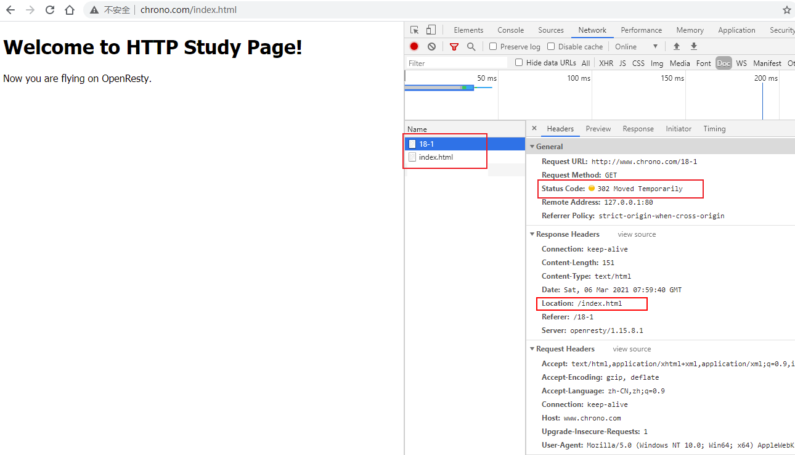
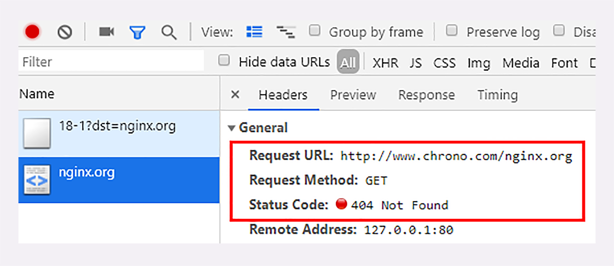

# 04 | 四通八达：HTTP 的重定向和跳转

为了实现在互联网上构建超链接文档系统的设想，蒂姆·伯纳斯 - 李发明了万维网，使用 HTTP 协议传输 **超文本** ，让全世界的人都能够自由地共享信息。

**超文本** 里含有 **超链接** ，可以从一个超文本跳跃到另一个超文本，对线性结构的传统文档是一个根本性的变革。

**能够使用超链接在网络上任意地跳转** 也是万维网的一个关键特性。它把分散在世界各地的文档连接在一起，形成了复杂的网状结构，用户可以在查看时随意点击链接、转换页面。再加上浏览器又提供了前进、后退、书签等辅助功能，让用户在文档间跳转时更加方便，有了更多的主动性和交互性。

那么，点击页面「链接」时的跳转是怎样的呢？具体一点，比如在 Nginx 的主页上点了一下 download 链接，会发生什么呢？

结合之前的课程，稍微思考一下你就能得到答案：浏览器首先要解析链接文字里的 URI。

```
http://nginx.org/en/download.html
```

再用这个 URI 发起一个新的 HTTP 请求，获取响应报文后就会切换显示内容，渲染出新 URI 指向的页面。

这样的跳转动作是由浏览器的使用者主动发起的，可以称为 **主动跳转** ，但还有一类跳转是由服务器来发起的，浏览器使用者无法控制，相对地就可以称为 **被动跳转** ，这在 HTTP 协议里有个专门的名词，叫做 **重定向**（Redirection）。

## 重定向的过程

其实之前我们就已经见过重定向了，在 [响应状态码该怎么使用中的 3xx](../03/05.md#_3××) 里就说过，301 是 **永久重定向** ，302 是 **临时重定向** ，浏览器收到这两个状态码就会跳转到新的 URI。

那么，它们是怎么做到的呢？难道仅仅用这两个代码就能够实现跳转页面吗？

先在实验环境里看一下重定向的过程吧，用 Chrome 访问 URI `http://www.chrono.com/18-1` ，它会使用 302 立即跳转到 `/index.html` 。



该请求一共发起了两个 HTTP 请求：

1. 第一个返回了 302 状态码
2. 第二个请求就被从定向到了 `/index.html`

如果不适用开发者工具查看的话，你很难感知到这个跳转过程，也就是说，重定向是 **用户无感知** 的。

另外，第一个请求中的响应头出现了一个新的 `Location: /index.html` 字段，它就是 301/302 重定向跳转的秘密所在。

**Location** 字段属于响应字段，必须出现在响应报文里。但只有配合 301/302 状态码才有意义，它 **标记了服务器要求重定向的 URI** ，这里就是要求浏览器跳转到 `index.html` 。

浏览器收到 301/302 报文，会检查响应头里有没有 `Location` 。如果有，就从字段值里提取出 URI，发出新的 HTTP 请求，相当于自动替我们点击了这个链接。

在 `Location` 里的 URI 既可以使用 **绝对 URI**，也可以使用 **相对 URI** ：

- 所谓绝对 URI，就是完整形式的 URI，包括 scheme、host:port、path 等。
- 所谓相对 URI，就是省略了 scheme 和 host:port，只有 path 和 query 部分，是不完整的，但可以从请求上下文里计算得到。

例如，刚才的实验例子里的 `Location: /index.html` 用的就是相对 URI。它没有说明访问 URI 的协议和主机，但因为是由 `http://www.chrono.com/18-1` 重定向返回的响应报文，所以浏览器就可以拼出完整的 URI：

```
http://www.chrono.com/index.html
```

实验环境的 URI `/18-1` 还支持使用 query 参数 `dst=xxx` ，指明重定向的 URI，你可以用这种形式再多试几次重定向，看看浏览器是如何工作的。

```
http://www.chrono.com/18-1?dst=https://www.baidu.com
http://www.chrono.com/18-1?dst=/15-1?name=a.json
http://www.chrono.com/18-1?dst=/17-1
```

::: tip dst 参数说明

该参数并不是 HTTP 协议原生功能

:::

看看 dst 是如何实现 query 中自定义跳转的

```lua
-- Copyright (C) 2019 by chrono

-- dst 从 query 中获取，如果没有定义，则赋值为  /index.html
local dst = ngx.var.arg_dst or '/index.html'

local code = tonumber(ngx.var.arg_code or 302)

if code ~= 301 and code ~= 302 then
    code = 302
end

-- url 编码 dst
local new_uri = ngx.unescape_uri(dst)
--ngx.log(ngx.ERR, "new_uri = ", new_uri)

-- HTTP header Injection
if string.find(new_uri, '\r') then
    ngx.exit(400)
end

--if string.byte(new_uri) ~= string.byte('/') then
--    new_uri = '/' .. new_uri
--end

-- 设置 Referer 头 Referer: /18-1?dst=https://www.baidu.com
ngx.header['Referer'] = ngx.var.request_uri

return ngx.redirect(new_uri, code)


```

大概的实现流程为：

1. 从 dst 从获取值
2. 给 dst 进行 url 编码，防止是特殊字符
3. 设置 302 状态 和 **Location**  头

注意，在重定向时如果只是在站内跳转，你可以放心地使用相对 URI。但如果要跳转到站外，就必须用绝对 URI。

例如，如果想跳转到 Nginx 官网，就必须在 `nginx.org` 前把 `http://` 都写出来，否则浏览器会按照相对 URI 去理解，得到的就会是一个不存在的 URI `http://www.chrono.com/nginx.org`



那么，如果 301/302 跳转时没有 Location 字段会怎么样呢？

这个你也可以自己试一下，使用第 12 讲里的 URI `/12-1` ，查询参数用 `code=302` ：

```http
http://www.chrono.com/12-1?code=302
```


响应之后，不会跳转

## 重定向状态码

刚才我把重定向的过程基本讲完了，现在来说一下重定向用到的状态码。

最常见的重定向状态码就是 301 和 302，另外还有几个不太常见的，例如 303、307、308 等。它们最终的效果都差不多，让浏览器跳转到新的 URI，但语义上有一些细微的差别，使用的时候要特别注意。

- **301** 俗称 **永久重定向**（Moved Permanently）

  意思是原 URI 已经「永久」性地不存在了，今后的所有请求都必须改用新的 URI。

  浏览器看到 301，就知道原来的 URI「过时」了，就会做适当的优化。比如历史记录、更新书签，下次可能就会直接用新的 URI 访问，省去了再次跳转的成本。搜索引擎的爬虫看到 301，也会更新索引库，不再使用老的 URI。

- **302** 俗称 **临时重定向**（Moved Temporarily），意思是原 URI 处于 **临时维护** 状态，新的 URI 是起顶包作用的临时工。

  浏览器或者爬虫看到 302，会认为原来的 URI 仍然有效，但暂时不可用，所以只会执行简单的跳转页面，不记录新的 URI，也不会有其他的多余动作，下次访问还是用原 URI。

301/302 是最常用的重定向状态码，在 3×× 里剩下的几个还有：

- 303 See Other：类似 302，但要求重定向后的请求改为 GET 方法，访问一个结果页面，避免 POST/PUT 重复操作；
- 307 Temporary Redirect：类似 302，但重定向后请求里的方法和实体不允许变动，含义比 302 更明确；
- 308 Permanent Redirect：类似 307，不允许重定向后的请求变动，但它是 301 永久重定向的含义。

不过这三个状态码的接受程度较低，有的浏览器和服务器可能不支持，开发时应当慎重，测试确认浏览器的实际效果后才能使用。

## 重定向的应用场景

理解了重定向的工作原理和状态码的含义，我们就可以 **在服务器端拥有主动权** ，控制浏览器的行为，不过要怎么利用重定向才好呢？

使用重定向跳转，核心是要理解 **重定向** 和 **永久 / 临时** 这两个关键词。

先来看什么时候需要重定向。

一个最常见的原因就是 **资源不可用**，需要用另一个新的 URI 来代替。

至于不可用的原因那就很多了。例如域名变更、服务器变更、网站改版、系统维护，这些都会导致原 URI 指向的资源无法访问，为了避免出现 404，就需要用重定向跳转到新的 URI，继续为网民提供服务。

另一个原因就是 **避免重复**，让多个网址都跳转到一个 URI，增加访问入口的同时还不会增加额外的工作量。

例如，有的网站都会申请多个名称类似的域名，然后把它们再重定向到主站上。比如，你可以访问一下 `qq.com`、`github.com`、`bing.com`（记得事先清理缓存），看看它是如何重定向的。

决定要实行重定向后接下来要考虑的就是 **永久** 和 **临时** 的问题了，也就是选择 301 还是 302。

301 的含义是 **永久** 的。

如果域名、服务器、网站架构发生了大幅度的改变，比如启用了新域名、服务器切换到了新机房、网站目录层次重构，这些都算是 **永久性** 的改变。原来的 URI 已经不能用了，必须用 301 永久重定向，通知浏览器和搜索引擎更新到新地址，这也是搜索引擎优化（SEO）要考虑的因素之一。

302 的含义是 **临时** 的。

原来的 URI 在将来的某个时间点还会恢复正常，常见的应用场景就是系统维护，把网站重定向到一个通知页面，告诉用户过一会儿再来访问。另一种用法就是“服务降级”，比如在双十一促销的时候，把订单查询、领积分等不重要的功能入口暂时关闭，保证核心服务能够正常运行。

## 重定向的相关问题

重定向的用途很多，掌握了重定向，就能够在架设网站时获得更多的灵活性，不过在使用时还需要注意两个问题。

第一个问题是 **性能损耗** 。很明显，重定向的机制决定了一个跳转会有两次请求 - 应答，比正常的访问多了一次。

虽然 301/302 报文很小，但大量的跳转对服务器的影响也是不可忽视的。站内重定向还好说，可以长连接复用，站外重定向就要开两个连接，如果网络连接质量差，那成本可就高多了，会严重影响用户的体验。

所以重定向应当适度使用，决不能滥用。

第二个问题是 **循环跳转** 。如果重定向的策略设置欠考虑，可能会出现 `A=>B=>C=>A` 的无限循环，不停地在这个链路里转圈圈，后果可想而知。

所以 HTTP 协议特别规定，浏览器必须具有检测 **循环跳转** 的能力，在发现这种情况时应当停止发送请求并给出错误提示。

实验环境的 URI `/18-2` 就模拟了这样的一个循环跳转，它跳转到 `/18-1` ，并用参数 `dst=/18-2` 再跳回自己，实现了两个 URI 的无限循环。

使用 Chrome 访问这个地址，会得到 「该网页无法正常运作」的结果：

```http
http://www.chrono.com/18-2
http://www.chrono.com/18-1?dst=18-2
```


可以看到两个地址来回跳转，跳转很多次后，浏览器报错了

## 小结

今天我们学习了 HTTP 里的重定向和跳转，简单小结一下这次的内容：

1. 重定向是服务器发起的跳转，要求客户端改用新的 URI 重新发送请求，通常会自动进行，用户是无感知的；
2. 301/302 是最常用的重定向状态码，分别是 **永久重定向** 和 **临时重定向** ；
3. 响应头字段 Location 指示了要跳转的 URI，可以用绝对或相对的形式；
4. 重定向可以把一个 URI 指向另一个 URI，也可以把多个 URI 指向同一个 URI，用途很多；
5. 使用重定向时需要当心性能损耗，还要避免出现循环跳转。

## 课下作业

1. 301 和 302 非常相似，试着结合 [响应状态码该怎么使用中的 3xx](../03/05.md) ，用自己的理解再描述一下两者的异同点。

   相同点：

   - 都需要配合 Location 字段跳转
   - 都是跳转到另外一个地址

   不同点：

   - 语义不同， 301 永久性，302 临时的

2. 你能结合自己的实际情况，再列出几个应当使用重定向的场景吗？

## 拓展阅读

- 网页的 **入链接** 和 **出链接** 也是标记网页重要性的关键指标，最著名的就是 Google 发明的 PageRank
- `300 Multiple Choices`  也是一个特殊的重定向状态码，它会返回一个有多个链接选项的页面，由用户自行选择要跳转的链接，用得较少
- 重定向报文里还可以用 `Refresh` 字段，实现延时重定向，例如 `Refresh: 5; url=xxx` 告诉浏览器 5 秒后再跳转
- 与跳转有关的还有一个 `Referer` 和 `Referrer-Policy` （注意前者是拼写错误的单词，但是已经将错就错），表示浏览器跳转的来源（引用地址），可用于统计分析和防盗链
- 301/302 重定向是由浏览器执行的，对于服务器来说可以称为 **外部重定向**，相应的也就有服务器的 **内部重定向**，直接在服务器内部跳转 URI，因为不会发出 HTTP 请求，所以没有额外的性能损失
- 