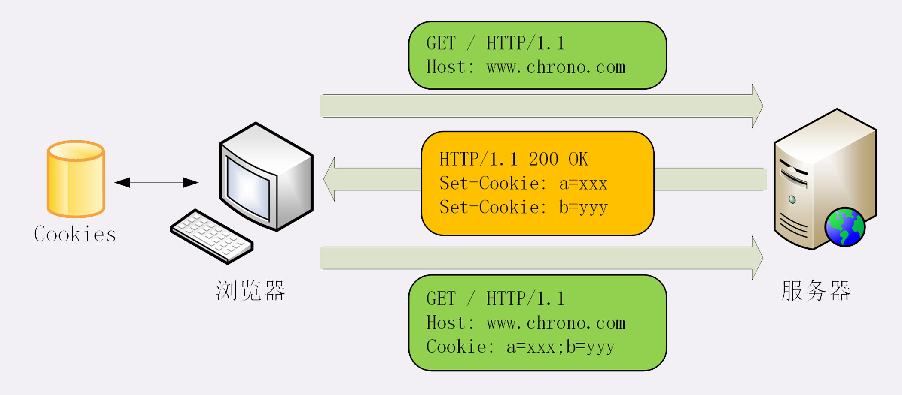
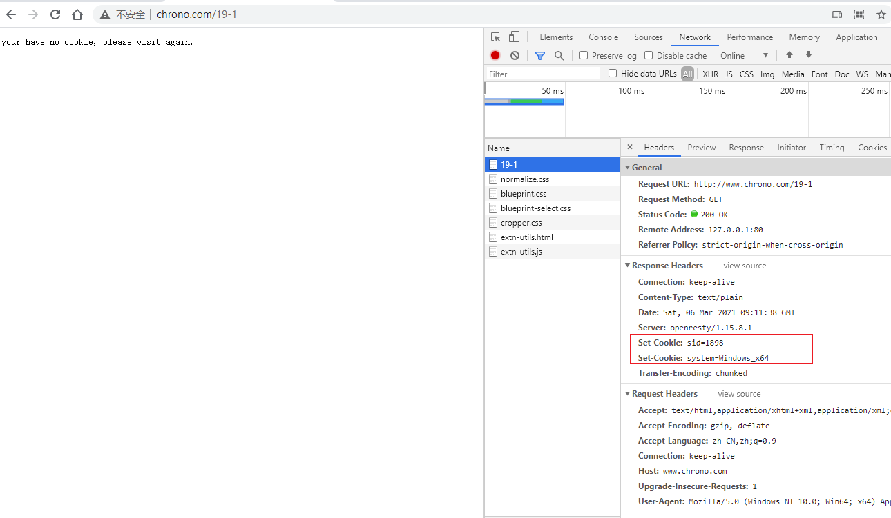
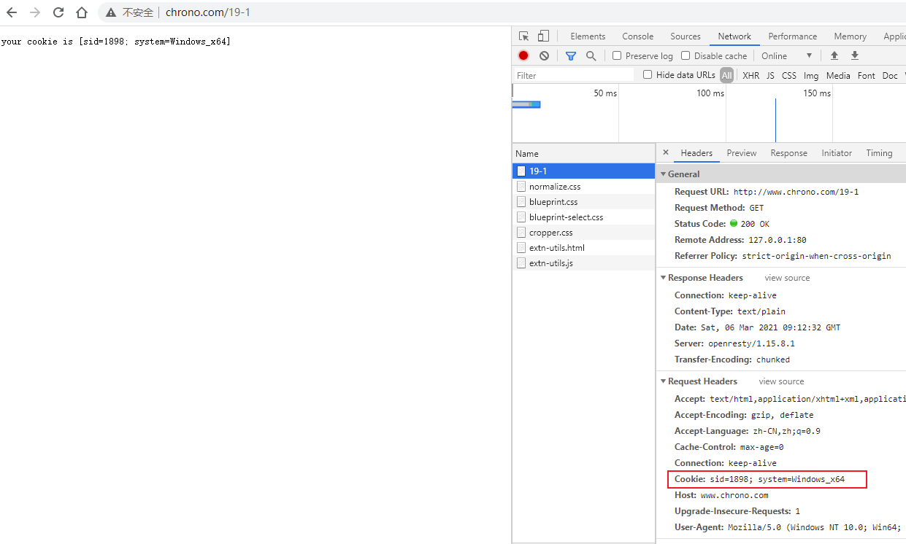
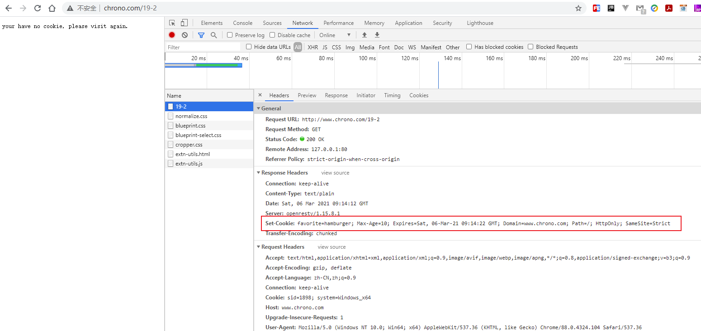
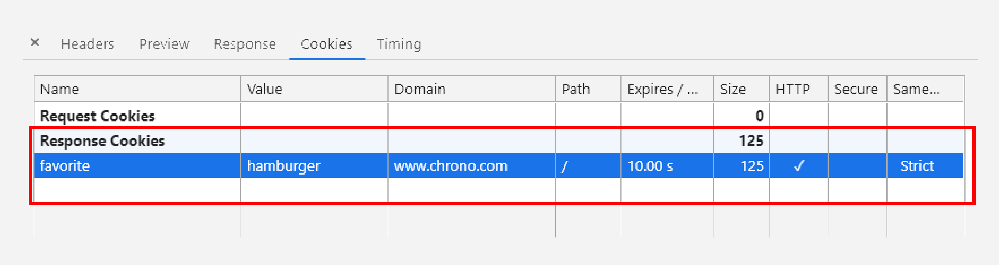
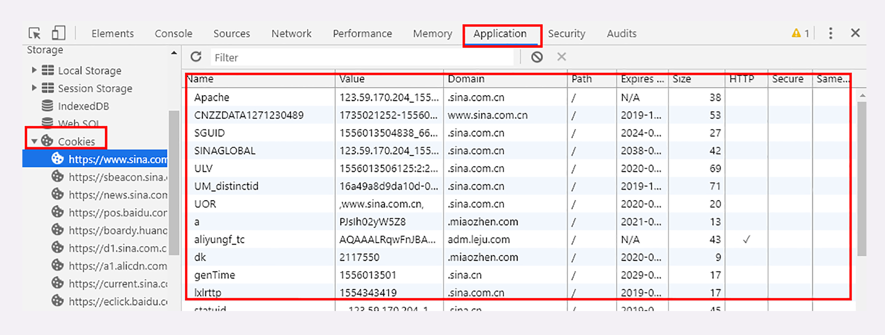

# 05 | 让我知道你是谁：HTTP 的 Cookie 机制

前面说到 HTTP 是 「无状态」的，这既是优点也是缺点。优点是服务器没有状态差异，**可以很容易地组成集群** ，而缺点就是无法支持需要记录状态的事务操作。

好在 HTTP 协议是可扩展的，后来发明的 Cookie 技术，给 HTTP 增加了「记忆能力」。

## 什么是 Cookie？

不知道你有没有看过克里斯托弗·诺兰导演的一部经典电影《记忆碎片》（Memento），里面的主角患有短期失忆症，记不住最近发生的事情。

比如，电影里有个场景，某人刚跟主角说完话，大闹了一通，过了几分钟再回来，主角却是一脸茫然，完全不记得这个人是谁，刚才又做了什么，只能任人摆布。

这种情况就很像 HTTP 里 **无状态** 的 Web 服务器，只不过服务器的 「失忆症」比他还要严重，连一分钟的记忆也保存不了，请求处理完立刻就忘得一干二净。即使这个请求会让服务器发生 500 的严重错误，下次来也会依旧「热情招待」。

如果 Web 服务器只是用来管理静态文件还好说，对方是谁并不重要，把文件从磁盘读出来发走就可以了。但随着 HTTP 应用领域的不断扩大，对记忆能力的需求也越来越强烈。比如网上论坛、电商购物，都需要看客下菜，只有记住用户的身份才能执行发帖子、下订单等一系列会话事务。

那该怎么样让原本无记忆能力的服务器拥有记忆能力呢？

看看电影里的主角是怎么做的吧。他通过纹身、贴纸条、立拍得等手段，在外界留下了各种记录，一旦失忆，只要看到这些提示信息，就能够在头脑中快速重建起之前的记忆，从而把因失忆而耽误的事情继续做下去。

HTTP 的 Cookie 机制也是一样的道理，**既然服务器记不住，那就在外部想办法记住** 。相当于是服务器给每个客户端都贴上一张小纸条，上面写了一些只有服务器才能理解的数据，需要的时候客户端把这些信息发给服务器，服务器看到 Cookie，就能够认出对方是谁了。

## Cookie 的工作过程

那么，Cookie 这张小纸条是怎么传递的呢？

这要用到两个字段：响应头字段 **Set-Cookie** 和请求头字段 **Cookie**。

当用户通过浏览器第一次访问服务器的时候，服务器肯定是不知道他的身份的。所以，就要创建一个独特的身份标识数据，格式是 **key=value**，然后放进 Set-Cookie 字段里，随着响应报文一同发给浏览器。

浏览器收到响应报文，看到里面有 Set-Cookie，知道这是服务器给的身份标识，于是就保存起来，下次再请求的时候就自动把这个值放进 Cookie 字段里发给服务器。

因为第二次请求里面有了 Cookie 字段，服务器就知道这个用户不是新人，之前来过，就可以拿出 Cookie 里的值，识别出用户的身份，然后提供个性化的服务。

不过因为服务器的记忆能力实在是太差，一张小纸条经常不够用。所以，服务器有时会在响应头里添加多个 Set-Cookie，存储多个 `key=value`。但浏览器这边发送时不需要用多个 Cookie 字段，只要在一行里用 `;` 隔开就行。

我画了一张图来描述这个过程，你看过就能理解了。



从这张图中我们也能够看到，Cookie 是由浏览器负责存储的，而不是操作系统。所以，它是浏览器绑定的，只能在本浏览器内生效。

如果你换个浏览器或者换台电脑，新的浏览器里没有服务器对应的 Cookie，就好像是脱掉了贴着纸条的衣服，健忘的服务器也就认不出来了，只能再走一遍 Set-Cookie 流程。

在实验环境里，你可以用 Chrome 访问 URI `http://www.chrono.com/19-1`，实地看一下 Cookie 工作过程。

首次访问时服务器会设置两个 Cookie。



然后刷新这个页面，浏览器就会在请求头里自动送出 Cookie，服务器就能认出你了。



如果换成 Firefox 等其他浏览器，因为 Cookie 是存在 Chrome 里的，所以服务器就又蒙圈了，不知道你是谁，就会给 Firefox 再贴上小纸条。

## Cookie 的属性

说到这里，你应该知道了，**Cookie 就是服务器委托浏览器存储在客户端里的一些数据** ，而这些数据通常都会记录用户的关键识别信息。所以，就需要在 `key=value` 外再用一些手段来保护，防止外泄或窃取，这些手段就是 Cookie 的属性。

下面这个截图是实验环境 `http://www.chrono.com/19-2` 的响应头，我来对着这个实际案例讲一下都有哪些常见的 Cookie 属性。



```
Set-Cookie: favorite=hamburger; Max-Age=10; Expires=Sat, 06-Mar-21 09:14:22 GMT; Domain=www.chrono.com; Path=/; HttpOnly; SameSite=Strict
```

### Cookie 的生命周期

首先，我们应该 **设置 Cookie 的生存周期** ，也就是它的有效期，让它只能在一段时间内可用，就像是食品的保鲜期，一旦超过这个期限浏览器就认为是 Cookie 失效，在存储里删除，也不会发送给服务器。

Cookie 的有效期可以使用 `Expires`  和 `Max-Age`  两个属性来设置。

- **Expires** 俗称 **过期时间**，用的是 **绝对时间点** ，可以理解为 **截止日期**（deadline）。

- **Max-Age** 用的是相对时间，单位是秒，浏览器用收到报文的时间点再加上 Max-Age，就可以得到失效的绝对时间。

Expires 和 Max-Age 可以同时出现，两者的失效时间可以一致，也可以不一致，**但浏览器会优先采用 Max-Age 计算失效期** 。

比如在这个例子里，Expires 标记的过期时间是 `GMT 2019 年 6 月 7 号 8 点 19 分`，而 Max-Age 则只有 10 秒，如果现在是 6 月 6 号零点，那么 Cookie 的实际有效期就是 `6 月 6 号零点过 10 秒`。

### Cookie 的作用域

其次，我们需要 **设置 Cookie 的作用域** ，**让浏览器仅发送给特定的服务器和 URI** ，避免被其他网站盗用。

作用域的设置比较简单，**Domain** 和 **Path** 指定了 Cookie 所属的域名和路径，浏览器在发送 Cookie 前会从 URI 中提取出 host 和 path 部分，对比 Cookie 的属性。如果不满足条件，就不会在请求头里发送 Cookie。

使用这两个属性可以为不同的域名和路径分别设置各自的 Cookie，比如 `/19-1` 用一个 Cookie，`/19-2` 再用另外一个 Cookie，两者互不干扰。不过现实中为了省事，通常 Path 就用一个 `/` 或者直接省略，表示域名下的任意路径都允许使用 Cookie，让服务器自己去挑。

### Cookie 的安全性

最后要考虑的就是 **Cookie 的安全性** 了，尽量不要让服务器以外的人看到。

写过前端的同学一定知道，在 JS 脚本里可以用 `document.cookie`  来读写 Cookie 数据，这就带来了安全隐患，有可能会导致 **跨站脚本（XSS）** 攻击窃取数据。

- **HttpOnly** 

  属性 **HttpOnly** 会告诉浏览器，此 Cookie 只能通过浏览器 HTTP 协议传输，**禁止其他方式访问** ，浏览器的 JS 引擎就会禁用 `document.cookie`  等一切相关的 API，脚本攻击也就无从谈起了。

- **SameSite**

  可以防范 **跨站请求伪造（XSRF）攻击** ：设置成

  `SameSite=Strict` ：可以严格限定 Cookie 不能随着跳转链接跨站发送

  `SameSite=Lax`：则略宽松一点，允许 `GET/HEAD`  等安全方法，但禁止 POST 跨站发送。

  还有一个 None，不限制

- **Secure**

  表示这个 Cookie **仅能用 HTTPS 协议加密传输** ，明文的 HTTP 协议会禁止发送。但 Cookie 本身不是加密的，浏览器里还是以明文的形式存在。

Chrome 开发者工具是查看 Cookie 的有力工具，在 `Network-Cookies` 里可以看到单个页面 Cookie 的各种属性，另一个 `Application` 面板里则能够方便地看到全站的所有 Cookie。





## Cookie 的应用

现在回到我们最开始的话题，有了 Cookie，服务器就有了记忆能力，能够保存状态，那么应该如何使用 Cookie 呢？

Cookie 最基本的一个用途就是 **身份识别** ，保存用户的登录信息，实现会话事务。

比如，你用账号和密码登录某电商，登录成功后网站服务器就会发给浏览器一个 Cookie，内容大概是 `name=yourid` ，这样就成功地把身份标签贴在了你身上。

之后你在网站里随便访问哪件商品的页面，浏览器都会自动把身份 Cookie 发给服务器，所以服务器总会知道你的身份，一方面免去了重复登录的麻烦，另一方面也能够自动记录你的浏览记录和购物下单（在后台数据库或者也用 Cookie），实现了 **状态保持** 。

Cookie 的另一个常见用途是 **广告跟踪** 。

你上网的时候肯定看过很多的广告图片，这些图片背后都是广告商网站（例如 Google），它会偷偷地给你贴上 Cookie 小纸条，这样你上其他的网站，别的广告就能用 Cookie 读出你的身份，然后做行为分析，再推给你广告。

这种 Cookie 不是由访问的主站存储的，所以又叫 **第三方 Cookie（third-party cookie）** 。如果广告商势力很大，广告到处都是，那么就比较恐怖了，无论你走到哪里它都会通过 Cookie 认出你来，实现广告 **精准打击** 。

为了防止滥用 Cookie 搜集用户隐私，互联网组织相继提出了 DNT（Do Not Track）和 P3P（Platform for Privacy Preferences Project），但实际作用不大。

## 小结

今天我们学习了 HTTP 里的 Cookie 知识。虽然现在已经出现了多种 `Local Web Storage` 技术，能够比 Cookie 存储更多的数据，但 Cookie 仍然是最通用、兼容性最强的客户端数据存储手段。

简单小结一下今天的内容：

1. Cookie 是服务器委托浏览器存储的一些数据，让服务器有了记忆能力；
2. 响应报文使用 Set-Cookie 字段发送 key=value 形式的 Cookie 值；
3. 请求报文里用 Cookie 字段发送多个 Cookie 值；
4. 为了保护 Cookie，还要给它设置有效期、作用域等属性，常用的有 Max-Age、Expires、Domain、HttpOnly 等；
5. Cookie 最基本的用途是身份识别，实现有状态的会话事务。

还要提醒你一点，因为 Cookie 并不属于 HTTP 标准（RFC6265，而不是 RFC2616/7230），所以语法上与其他字段不太一致，使用的分隔符是  `;` ，与 Accept 等字段的 `,` 不同，小心不要弄错了。

## 课下作业

1. 如果 Cookie 的 Max-Age 属性设置为 0，会有什么效果呢？

   立即失效

    rfc 里有说明，如果 max-age <=0 ，统一按 0 算，立即过期。

2. Cookie 的好处已经很清楚了，你觉得它有什么缺点呢？

   不安全，容易被拦截、有数量和大小限制，传输数据变大、某些客户端不支持 cookie

## 拓展阅读

- Cookie 这个词来源于计算机编程里的术语 「Magic Cookie」，意思是不透明的数据，并不是「小甜甜」的含义

- 早期 Cookie 直接就是磁盘上的一些小文本文件，现在基本上都是以数据库记录的形式存放的（通常使用的是 Sqlite）。浏览器对 Cookie 的数量和大小也都有限制，不允许无限存储，一般总大小不能超过 4K

- 如果不指定 Expires 或 Max-Age 属性，那么 Cookie 仅在浏览器允许时有效，一旦浏览器关闭就会失效，这被称为 **会话 Cookie（session cookie）** 或内存 **Cookie（in-memory cookie）**，在 Chrome 里过期时间会显示为 session 或 N/A

- 历史上还有 `Set-Cookie2` 和 Cookie2 这样的字段，但是现在不再使用了

- 广告追踪

  网站的页面里会嵌入很多广告代码，里面就会访问广告商，在浏览器里存储广告商的 cookie

  你换到其他网站，上面也有这个广告商的广告代码，**因为都是一个广告商网站** ，自然就能够读取之前设置的cookie ，也就获得了你的信息。