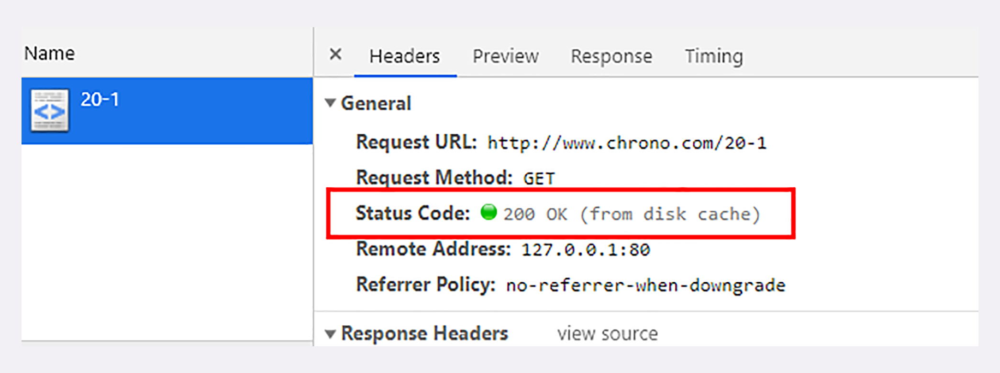
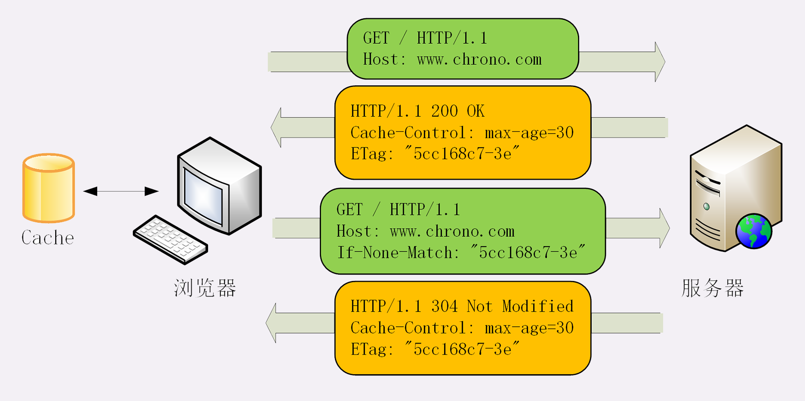
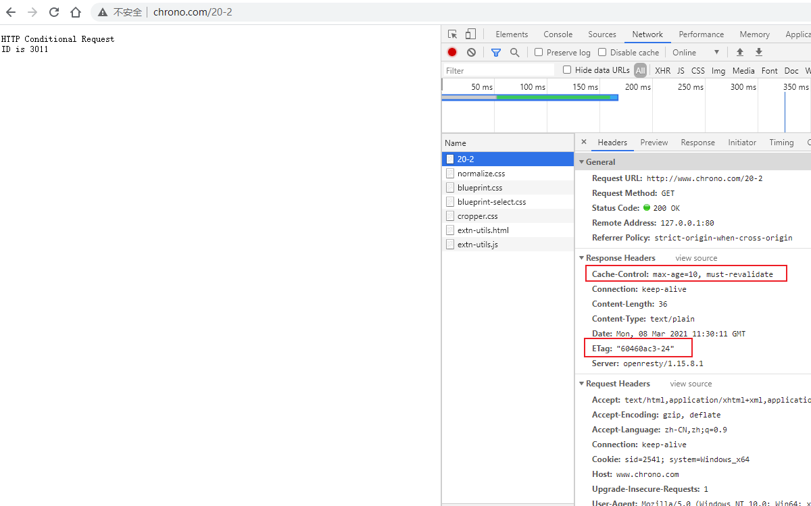
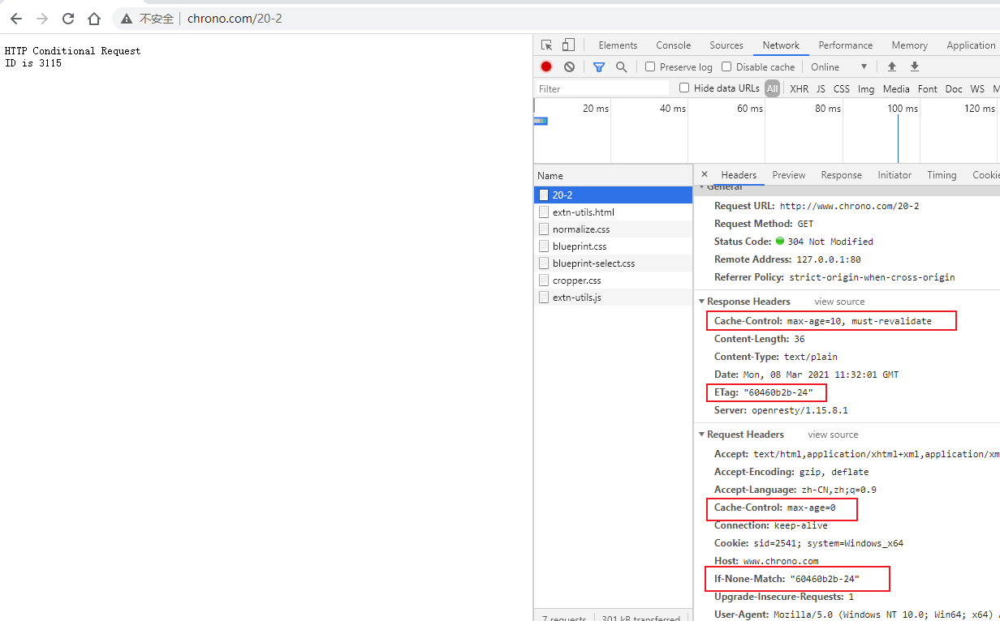
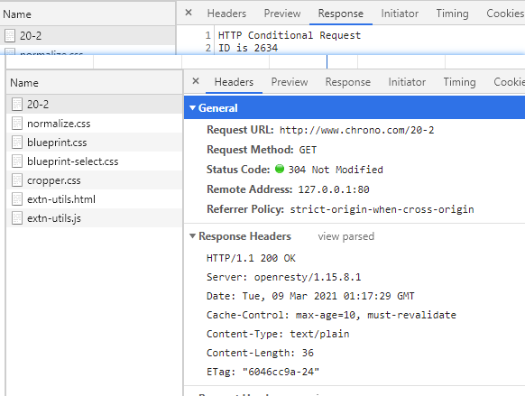
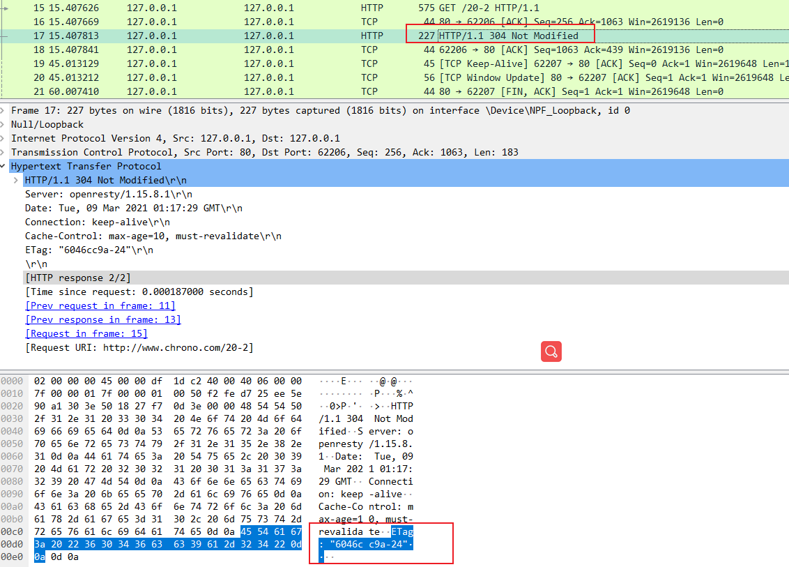

# 06 | 生鲜速递：HTTP 的缓存控制

缓存（Cache）是计算机领域里的一个重要概念，是优化系统性能的利器。

由于链路漫长，网络时延不可控，浏览器使用 HTTP 获取资源的成本较高。所以，非常有必要把来之不易的数据缓存起来，下次再请求的时候尽可能地 **复用** 。这样，就可以 **避免多次请求 - 应答的通信成本，节约网络带宽**  ，也可以加快响应速度。

试想一下，如果有几十 K 甚至几十 M 的数据，不是从网络而是从本地磁盘获取，那将是多么大的一笔节省，免去多少等待的时间。

实际上，HTTP 传输的每一个环节基本上都会有缓存，非常复杂。

基于 「请求 - 应答」模式的特点，可以大致分为 **客户端缓存** 和 **服务器端缓存** ，因为服务器端缓存经常与代理服务「混搭」在一起，所以今天我先讲客户端——也就是 **浏览器的缓存 ** 。

## 服务器的缓存控制

为了更好地说明缓存的运行机制，下面我用「生鲜速递」作为比喻，看看缓存是如何工作的。

夏天到了，天气很热。你想吃西瓜消暑，于是打开冰箱，但很不巧，冰箱是空的。不过没事，现在物流很发达，给生鲜超市打个电话，不一会儿，就给你送来一个 8 斤的沙瓤大西瓜，上面还贴着标签：「**保鲜期 5 天**」。好了，你把它放进冰箱，想吃的时候随时拿出来。

在这个场景里：

- 生鲜超市：就是 Web 服务器

- 你：就是浏览器

- 冰箱：就是浏览器内部的缓存

整个流程翻译成 HTTP 就是：

1. 浏览器发现缓存无数据，于是发送请求，向服务器获取资源；
2. 服务器响应请求，返回资源，同时标记资源的有效期；
3. 浏览器缓存资源，等待下次重用。


你可以访问实验环境的 `http://www.chrono.com/20-1` 看看具体的请求应答过程


服务器标记资源有效期使用的头字段是 **Cache-Control** ，里面的值 **max-age=30** 就是资源的有效时间，相当于告诉浏览器，「这个页面只能缓存 30 秒，之后就算是过期，不能用。」

你可能要问了，让浏览器直接缓存数据就好了，为什么要加个有效期呢？

这是因为网络上的数据随时都在变化，不能保证它稍后的一段时间还是原来的样子。就像生鲜超市给你快递的西瓜，只有 5 天的保鲜期，过了这个期限最好还是别吃，不然可能会闹肚子。

`Cache-Control` 字段里的 `max-age` 和上一讲里 Cookie 有点像，都是标记资源的有效期。

但我必须提醒你注意，这里的 max-age 是 **生存时间** （又叫 新鲜度、缓存寿命，类似 TTL，Time-To-Live），时间的计算起点是响应报文的创建时刻（ **即 Date 字段，也就是离开服务器的时刻** ），而不是客户端收到报文的时刻，也就是说包含了在链路传输过程中所有节点所停留的时间。

比如，服务器设定 `max-age=5`，但因为网络质量很糟糕，等浏览器收到响应报文已经过去了 4 秒，那么这个资源在客户端就最多能够再存 1 秒钟，之后就会失效。

`max-age` 是 HTTP 缓存控制最常用的属性，此外在响应报文里还可以用其他的属性来更精确地指示浏览器应该如何使用缓存：

- `no_store` ：**不允许缓存** ，用于某些变化非常频繁的数据，例如秒杀页面；
- `no_cache` ：它的字面含义容易与 no_store 搞混，实际的意思并不是不允许缓存，而是 **可以缓存** ，但在使用之前必须要去服务器验证是否过期，是否有最新的版本；
- `must-revalidate` ：又是一个和 no_cache 相似的词，它的意思是 **如果缓存不过期就可以继续使用** ，**但过期了如果还想用就必须去服务器验证** 。

听的有点糊涂吧。没关系，我拿生鲜速递来举例说明一下：

- `no_store`：买来的西瓜不允许放进冰箱，要么立刻吃，要么立刻扔掉；
- `no_cache`：可以放进冰箱，但吃之前必须问超市有没有更新鲜的，有就吃超市里的；
- `must-revalidate`：可以放进冰箱，保鲜期内可以吃，过期了就要问超市让不让吃。

你看，这超市管的还真多啊，西瓜到了家里怎么吃还得听他。不过没办法，在 HTTP 协议里服务器就是这样的霸气。

我把服务器的缓存控制策略画了一个流程图，对照着它你就可以在今后的后台开发里明确 `Cache-Control` 的用法了。


## 客户端的缓存控制

现在冰箱里已经有了 **缓存** 的西瓜，是不是就可以直接开吃了呢？

你可以在 Chrome 里点几次「刷新」按钮，估计你会失望，页面上的 ID 一直在变，根本不是缓存的结果，明明说缓存 30 秒，怎么就不起作用呢？

其实不止服务器可以发 `Cache-Control` 头，浏览器也可以发 `Cache-Control` ，也就是说请求 - 应答的双方都可以用这个字段进行缓存控制，互相协商缓存的使用策略。

当你点 「刷新」按钮的时候，浏览器会在请求头里加一个 **Cache-Control: max-age=0** 。因为 max-age 是 **生存时间** ，`max-age=0`  的意思就是「我要一个最最新鲜的西瓜」，而本地缓存里的数据至少保存了几秒钟，所以浏览器就不会使用缓存，而是向服务器发请求。服务器看到 max-age=0，也就会用一个最新生成的报文回应浏览器。

Ctrl+F5 的「强制刷新」又是什么样的呢？

它其实是发了一个 **Cache-Control: no-cache** ，含义和 `max-age=0` 基本一样，就看后台的服务器怎么理解，通常两者的效果是相同的。


那么，浏览器的缓存究竟什么时候才能生效呢？

别着急，试着点一下浏览器的「前进」、「后退」按钮，再看开发者工具，你就会惊喜地发现 `from disk cache` 的字样，意思是没有发送网络请求，而是读取的磁盘上的缓存。

另外，使用重定向的话，也可以发现使用了缓存

```
# 前面讲解重定向功能
http://www.chrono.com/18-1?dst=20-1
```



这几个操作与刷新有什么区别呢？

其实也很简单，在前进、后退、跳转这些重定向动作中浏览器不会「夹带私货」，只用最基本的请求头，没有 `Cache-Control` ，所以就会检查缓存，直接利用之前的资源，不再进行网络通信。

这个过程你也可以用 Wireshark 抓包，看看是否真的没有向服务器发请求。

`/20-1` 的后端代码中也仅仅只写了一个 `Cache-Control: max-age=0`

## 条件请求

浏览器用 `Cache-Control` 做缓存控制只能是刷新数据，不能很好地利用缓存数据，又因为缓存会失效，使用前还必须要去服务器验证是否是最新版。

那么该怎么做呢？

浏览器可以用两个连续的请求组成 **验证动作** ：

1. 先是一个 HEAD，获取资源的修改时间等元信息，然后与缓存数据比较，如果没有改动就使用缓存，节省网络流量
2. 否则就再发一个 GET 请求，获取最新的版本。

但这样的两个请求网络成本太高了（获取元信息），所以 HTTP 协议就定义了一系列  **If**  开头的  **条件请求** 字段，专门用来检查验证资源是否过期，**把两个请求才能完成的工作合并在一个请求里做** 。而且，**验证的责任也交给服务器** （不获取元数据自己校验了），浏览器只需坐享其成。

条件请求一共有 5 个头字段：

- **if-Modified-Since**：和 `Last-modified` 比较

  和 Last-modified  对比，是否已经修改了

- **If-None-Match** ：和 ETag 比较

  和 ETag 比较是否不匹配

- If-Unmodified-Since

  和 Last-modified  对比，是否已未修改

- If-Match

  和 ETag 比较是否匹配

- If-Range

我们最常用的是 **if-Modified-Since** 和 **If-None-Match** 这两个。需要第一次的响应报文预先提供 **Last-modified** 和 **ETag** ，然后第二次请求时就可以带上缓存里的原值，验证资源是否是最新的。

如果资源没有变，服务器就回应一个 **304 Not Modified** ，表示缓存依然有效，浏览器就可以更新一下有效期，然后放心大胆地使用缓存了。



`Last-modified` 很好理解，就是文件的最后修改时间。ETag 是什么呢？

ETag 是 **实体标签（Entity Tag）** 的缩写，**是资源的一个唯一标识** ，主要是用来解决修改时间无法准确区分文件变化的问题。

比如，一个文件在一秒内修改了多次，但因为修改时间是秒级，所以这一秒内的新版本无法区分。

再比如，一个文件定期更新，但有时会是同样的内容，实际上没有变化，用修改时间就会误以为发生了变化，传送给浏览器就会浪费带宽。

使用 ETag 就可以精确地识别资源的变动情况，让浏览器能够更有效地利用缓存。

**ETag 还有 强、弱 之分**。

**强 ETag 要求资源在字节级别必须完全相符** ，**弱 ETag 在值前有个 `W/` 标记** ，只要求资源在语义上没有变化，但内部可能会有部分发生了改变（例如 HTML 里的标签顺序调整，或者多了几个空格）。

还是拿生鲜速递做比喻最容易理解：

你打电话给超市，「我这个西瓜是 3 天前买的，还有最新的吗？」。超市看了一下库存，说：「没有啊，我这里都是 3 天前的。」于是你就知道了，再让超市送货也没用，还是吃冰箱里的西瓜吧。这就是 **if-Modified-Since** 和 **Last-modified** 。

但你还是想要最新的，就又打电话：「有不是沙瓤的西瓜吗？」，超市告诉你都是沙瓤的（Match），于是你还是只能吃冰箱里的沙瓤西瓜。这就是 **If-None-Match** 和 **弱 ETag** 。

第三次打电话，你说「有不是 8 斤的沙瓤西瓜吗？」，这回超市给了你满意的答复：「有个 10 斤的沙瓤西瓜」。于是，你就扔掉了冰箱里的存货，让超市重新送了一个新的大西瓜。这就是 **If-None-Match** 和 **强 ETag** 。

再来看看实验环境的 URI  `/20-2` 。它为资源增加了 ETag 字段，刷新页面时浏览器就会同时发送缓存控制头 `max-age=0` 和条件请求头 `If-None-Match` ，如果缓存有效服务器就会返回 304：

首次请求：请求头中没有 Cache-Control ，本地没有缓存



未超过 10 秒刷新页面：

- 请求头：`Cache-Control: max-age=0 `  和 `If-None-Match: "60460b2b-24"`
- 响应式：`Cache-Control: max-age=10, must-revalidate` 和 `ETag: "60460b2b-24"`

含义是：服务器响应时，给了 must-revalidate（不过期可以使用，过期了要用就要去服务器验证），但是这里的操作是浏览器 **刷新**，所以会直接去服务器验证，携带上了 `If-None-Match: "60460b2b-24"`，注意看这个请求的响应，因为没有过期，所以返回的 ETag 是一样的



超过 10 秒刷新页面：

- 请求头：`Cache-Control: max-age=0 `  和 `If-None-Match: "60460b2b-24"`
- 响应式：`Cache-Control: max-age=10, must-revalidate` 和 `ETag: "60460c94-24"`

注意：响应的 ETag 已经变了，表示资源发生了改变，并且响应也是 200 而不是 304


这里笔者唯一不能理解的是后端的这个代码

```lua
-- Copyright (C) 2019 by chrono

local misc = ngx.shared.misc

local key = ngx.var.http_host .. "time"
local time = misc:get(key)

-- 申请了一块缓存，放入内存中，有效期为 30 秒
if not time then
    time = ngx.time()
    misc:set(key, time, 30)   -- seconds
end

local str = "HTTP Conditional Request \n" ..
            "ID is " .. string.sub(time, -4, -1)
            --"Now is " .. ngx.http_time(time)

ngx.header['Content-Length'] = #str
--ngx.header['Content-Type'] = 'text/plain'

--ngx.header['Cache-Control'] = 'public, max-age=10'
ngx.header['Cache-Control'] = 'max-age=10, must-revalidate'

--ngx.header['Last-Modified'] = ngx.http_time(time)

-- see ngx_http_set_etag() in ngx_http_core_module.c
ngx.header['ETag'] = string.format('"%x-%x"', time, #str)

-- checked by ngx_http_not_modified_filter_module

--local http_time = ngx.var.http_if_modified_since
--if time == ngx.parse_http_time(http_time or "") then
--    ngx.exit(304)
--end

ngx.print(str)

```

看到它的逻辑是：

1. 生成了一个时间，放入了内存中
2. 从 时间中构造一个 ETag
3. 返回数据内容

这里笔者测试一直刷新，测试出来的结果，它的代码是有问题的，每次都返回了内容（30 秒后，内容会变化，因为服务器端缓存的内容为 30 秒）。



但是通过抓包显示状态为 304 的包，并没有内容被返回，所以就不清楚到底是 nginx 做了处理？还是程序做的处理？



笔者记忆中，在使用 [spring etag 的时候](https://zq99299.github.io/note-combat/spring/#%E8%A7%A3%E5%86%B3%E6%96%B9%E6%A1%88-4)，明确的表示，需要我们自己判断 Etag 是否改变，正确的伪代码应该如下所示

```java
// 获取资源的 ETag
// 这里可以使用一条数据的版本号来做 etag
int etagParam = request.getHeader("ETag")
int etag = db.getEtag
if(etag == etagParam){
    response.status = 302
    response.etag = etag
    response.addHeader('Cache-Control','max-age=10')
    return
}
// 否则返回新的内容
```

大致意思是：

1. 获取文件内容，计算 etag
2. 判定传递过来需要我们验证的 etag 是否有变更，如果有，则返回新的内容和 etag 相关头
3. 如果没有变更，直接返回，不用返回数据
4. `'Cache-Control','max-age=10'`：不是使用浏览器刷新等功能直接导致该地址加载的话，将会遵守在 10 秒内不会发起请求（一个页面里面有 这个 `'Cache-Control','max-age=10'` 的图片，直接按 F5 刷新当前页面，这个图片是不会使用 `'Cache-Control','max-age=0'` 去服务器拉取数据的）

**有一个比较容易混淆的是 304 状态码和 200 状态码：**

- `200  (from memory cache)`：这个表示没有向服务器发起请求，使用的是浏览器本地的缓存数据

- `304 Not Modified`：这个是表示向服务器发起了请求，但是服务器响应该文件没有变化，没有传回数据内容，使用浏览器的缓存

  

  

上图是单独在浏览器地址栏中访问该图片，浏览器使用了  `'Cache-Control','max-age=10'` ，去服务端请求了，服务器验证 ETag 发现并没有变化，则响应 304，并不会响应数据，这个图才是正确的响应方式。 也就是说 `Cache-Control:max-age=10` 只是控制 「资源有效时间」，但是不会删除缓存，百度上有一个说明个人是和现在遇到的情况符合「通常，浏览器不会删除过期的缓存条目，除非它们在浏览器缓存已满时为新内容回收空间。 使用 no-store，no-cache 允许显式删除缓存条目。」

## 小结

今天我们学习了 HTTP 的缓存控制和条件请求，用好它们可以减少响应时间、节约网络流量，一起小结一下今天的内容吧：

1. 缓存是优化系统性能的重要手段，HTTP 传输的每一个环节中都可以有缓存；
2. 服务器使用 `Cache-Control` 设置缓存策略，常用的是 `max-age` ，表示资源的有效期；
3. 浏览器收到数据就会存入缓存，如果没过期就可以直接使用，过期就要去服务器验证是否仍然可用；
4. 验证资源是否失效需要使用「条件请求」，常用的是 `if-Modified-Since` 和 `If-None-Match` ，**收到 304 就可以复用缓存里的资源** ；
5. 验证资源是否被修改的条件有两个：`Last-modified` 和 `ETag` ，需要服务器预先在响应报文里设置，搭配条件请求使用；
6. 浏览器也可以发送 `Cache-Control` 字段，使用 `max-age=0` 或 `no_cache` 刷新数据。

HTTP 缓存看上去很复杂，但基本原理说白了就是一句话：没有消息就是好消息，没有请求的请求，才是最快的请求。

## 课下作业

1. Cache 和 Cookie 都是服务器发给客户端并存储的数据，你能比较一下两者的异同吗？

   相同点：都会保存数据在浏览器端

   不同点：

   携带数据到服务端：

   - Cookie 存储的数据，在路径匹配的情况下，匹配的请求都会携带所有的 cookie 到服务端
   - Cache 针对不同的请求，进行缓存，只有访问和资源匹配的链接，才会触发缓存相关的检测和重用

   数据的获取：

   - Cookie 可以通过脚本获取（无 HttpOnly），也可以在浏览器中看到有哪些 cookie
   - Cache 无法查看到相关列表，只能通过对应访问触发

   用途不同：

   - Cookie：用于身份识别
   - Cache：用于节省带宽和加快响应速度

   有效时间的计算：

   - Cookie：max-age 是从浏览器拿到响应报文时开始计算
   - Cache：max-age 是从响应报文的生成时间（Date 字段）开始计算的

2. 即使有 `Last-modified` 和 `ETag` ，强制刷新（Ctrl+F5）也能够从服务器获取最新数据（返回 200 而不是 304），请你在实验环境里试一下，观察请求头和响应头，解释原因。

   强制刷新会增加 `Cache-Control: no-cache` 请求头来告知服务器，我需要最新的数据，但是请求头时不会携带 ETag，那么服务器端其实没有对比 ETag 的数据，就按正常的数据返回了

   

## 拓展阅读

- 较早版本的 Chrome(66 之前) 可以使用 URL `chrome://cache` 检查本地缓存，但因为存在安全隐患，现在已经不能使用了

- `no-cache` 属性可以理解为 `max-age=0,must-revalidate`  

  **如果缓存不过期就可以继续使用** ，**但过期了如果还想用就必须去服务器验证** 。设置为 0 ，则表示过期，需要去服务器验证

- 除了 `Cache-Control`，服务器也可以用 `Expires` 字段来标记资源的有效期，它的形式和 Cookie 的差不多，同样属于 **过时** 的属性，优先级低于 `Cache-Control` 。还有一个历史遗留字段 `Pragma: no-cache` ，它相当于 `Cache-Control: no-cache`，除非为了兼容 HTTP/1.0 否则不建议使用

- 如果响应报文里提供了 `Last-modified`，但是没有 `Cache-Control` 或 `Expires` ，浏览器会使用 **启发（Heuristic）算法** 计算一个缓存时间，在 RFC 里的建议是 `(Date - Last-modified) * 10%`

- 每个 Web 服务器对 ETag 的计算方式都不一样，只要保证数据变化后值不一样就好，但复制的计算会增加服务器的负担。 Nginx 的算法是 `修改时间 + 长度`，实际上和 `Last-modified` 基本等价

-  强 etag 和 etag 的的区别？

  只是计算 etag 的方式不一样，流程是一样的

- no-cache 每次使用前都需要去浏览器问一下有没有过期，这不也是一次请求吗？那不和没有缓存一个意思吗

  笔者前面特别强调过，304 和 `200  (from memory cache)` 的含义。

- 如果响应头里什么缓存字段都没有，客户端对缓存是采取什么策略呢？

  按照规范是无法缓存

- 在 pwa 应用中，使用浏览器的「刷新」功能，从表现上看 max-age 并未设置为 0 ，这个笔者也不清楚是怎么回事

