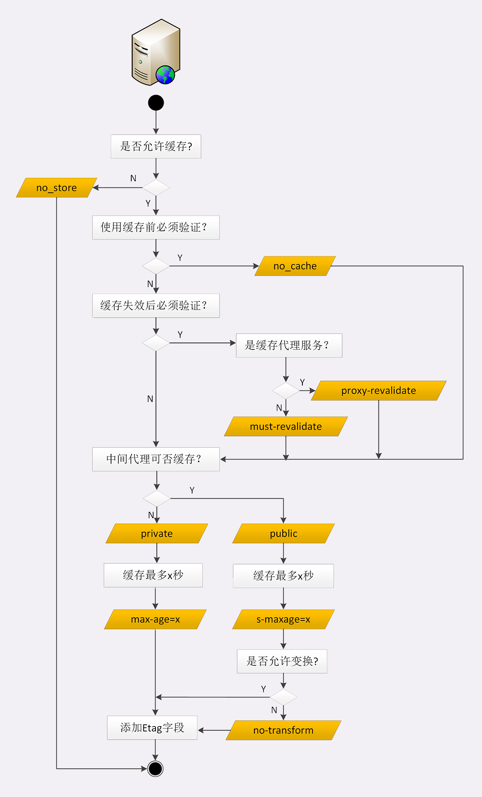
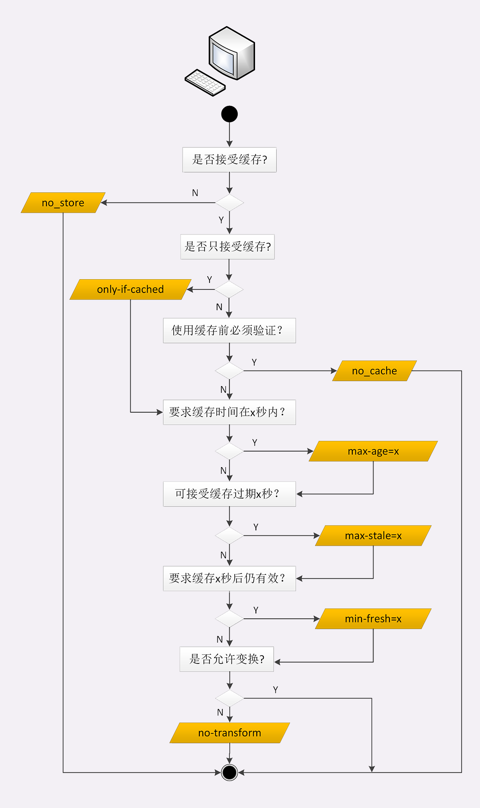

# 08 | 冷链周转：HTTP 的缓存代理

前面讲解了 [HTTP 的缓存控制](./06.md) 和 [HTTP 的代理服务](./07.md)。那么，把这两者结合起来就是这节课所要说的 **缓存代理**，也就是支持缓存控制的代理服务。

之前谈到缓存时，主要讲了客户端（浏览器）上的缓存控制，**它能够减少响应时间、节约带宽，提升客户端的用户体验** 。

但 HTTP 传输链路上，不只是客户端有缓存，服务器上的缓存也是非常有价值的，可以让请求不必走完整个后续处理流程，**就近** 获得响应结果。

特别是对于那些 **读多写少** 的数据，例如突发热点新闻、爆款商品的详情页，一秒钟内可能有成千上万次的请求。即使仅仅缓存数秒钟，也能够把巨大的访问流量挡在外面，让 RPS（request per second）降低好几个数量级，减轻应用服务器的并发压力，对性能的改善是非常显著的。

HTTP 的服务器缓存功能主要由代理服务器来实现（即缓存代理），而源服务器系统内部虽然也经常有各种缓存（如 Memcache、Redis、Varnish 等），但与 HTTP 没有太多关系，所以这里暂且不说。

## 缓存代理服务

我还是沿用「生鲜速递 + 便利店」的比喻，看看缓存代理是怎么回事。

便利店作为超市的代理，生意非常红火，顾客和超市双方都对现状非常满意。但时间一长，超市发现还有进一步提升的空间，因为每次便利店接到顾客的请求后都要专车跑一趟超市，还是挺麻烦的。

干脆这样吧，给便利店配发一个大冰柜。水果海鲜什么的都可以放在冰柜里，**只要产品在保鲜期内，就允许顾客直接从冰柜提货**。这样便利店就可以一次进货多次出货，省去了超市之间的运输成本。


通过这个比喻，你可以看到：在没有缓存的时候，代理服务器每次都是直接转发客户端和服务器的报文，中间不会存储任何数据，只有最简单的中转功能。

加入了缓存后就不一样了。

代理服务收到源服务器发来的响应数据后需要做两件事:

- 第一个当然是把报文转发给客户端
- 而第二个就是把报文存入自己的 Cache 里。

下一次再有相同的请求，代理服务器就可以直接发送 304 或者缓存数据，不必再从源服务器那里获取。这样就降低了客户端的等待时间，同时节约了源服务器的网络带宽。

在 HTTP 的缓存体系中，缓存代理的身份十分特殊，它「既是客户端，又是服务器」，同时也「既不是客户端，又不是服务器」。

说它即是客户端又是服务器，是因为它 **面向源服务器时是客户端** ，**在面向客户端时又是服务器** ，所以它即可以用客户端的缓存控制策略也可以用服务器端的缓存控制策略，也就是说它可以同时使用前面讲解的各种 `Cache-Control` 属性。

但缓存代理也「即不是客户端又不是服务器」，因为它只是一个数据的 **中转站** ，并不是真正的数据消费者和生产者，所以还需要有一些新的 `Cache-Control` 属性来对它做特别的约束。

## 源服务器的缓存控制

前面介绍了 4 种服务器端的 `Cache-Control` 属性：max-age、no_store、no_cache 和 must-revalidate，你应该还有印象吧？

这 4 种缓存属性 **可以约束客户端，也可以约束代理** 。

但客户端和代理是不一样的，客户端的缓存只是用户自己使用，而代理的缓存可能会为非常多的客户端提供服务。所以，需要对它的缓存再多一些限制条件。

首先，我们 **要区分客户端上的缓存和代理上的缓存** ，可以使用两个新属性 **private** 和 **public** 。

- `private` 表示缓存只能在客户端保存，是用户 **私有** 的，不能放在代理上与别人共享。
-  `public` 的意思就是缓存完全开放，谁都可以存，谁都可以用。

比如你登录论坛，返回的响应报文里用 `Set-Cookie` 添加了论坛 ID，这就属于私人数据，不能存在代理上。不然，别人访问代理获取了被缓存的响应就麻烦了。

其次，**缓存失效后的重新验证也要区分开**（即使用条件请求 `Last-modified` 和 `ETag` ），**must-revalidate** 是只要过期就必须回源服务器验证，而新的 **proxy-revalidate** 只要求代理的缓存过期后必须验证，客户端不必回源，只验证到代理这个环节就行了。

再次，**缓存的生存时间** 可以使用新的 **s-maxage** （s 是 share 的意思，注意 maxage 中间没有 `-` ），只限定在代理上能够存多久，而客户端仍然使用 `max_age` 。

还有一个代理专用的属性 **no-transform** 。代理有时候会对缓存下来的数据做一些优化，比如把图片生成 png、webp 等几种格式，方便今后的请求处理，而 `no-transform` 就会禁止这样做，不许偷偷摸摸搞小动作。


这些新的缓存控制属性比较复杂，还是用便利店冷柜来举例好理解一些。

水果上贴着标签 `private, max-age=5` 。这就是说水果不能放进冷柜，必须直接给顾客，保鲜期 5 天，过期了还得去超市重新进货。

冻鱼上贴着标签 `public, max-age=5, s-maxage=10` 。这个的意思就是可以在冰柜里存 10 天，但顾客那里只能存 5 天，过期了可以来便利店取，只要在 10 天之内就不必再找超市。

排骨上贴着标签 `max-age=30, proxy-revalidate, no-transform` 。因为缓存默认是 public（这里有争议，很多地方写的 private） 的，那么它在便利店和顾客的冰箱里就都可以存 30 天，过期后便利店必须去超市进新货，而且不能擅自把大排改成小排。

下面的流程图是完整的服务器端缓存控制策略，可以同时控制客户端和代理。



我还要提醒你一点，源服务器在设置完 `Cache-Control` 后必须要为报文加上 `Last-modified` 或 `ETag` 字段。否则，客户端和代理后面就无法使用条件请求来验证缓存是否有效，也就不会有 304 缓存重定向。

**稍微总结下新增的对代理的请求头**

数据是否允许代理缓存：

- `private`：不允许
- `public`：允许

缓存失效后重新验证：`proxy-revalidate` 代理缓存过期后必须验证，对应的是客户端的（`must-revalidate`）

缓存的生存时间：`s-maxage` 限制在代理服务器上能缓存多久

使用方式如下：

```bash
private, max-age=5
public, max-age=5, s-maxage=10
max-age=30, proxy-revalidate, no-transform
```

## 客户端的缓存控制

客户端在 HTTP 缓存体系里要面对的是代理和源服务器，也必须区别对待，这里我就直接上图了，来个看图说话。



max-age、no_store、no_cache 这三个属性在前面已经介绍过了，它们也是同样作用于代理和源服务器。

关于缓存的生存时间，多了两个新属性 **max-stale** 和 **min-fresh** 。

- max-stale：可以接受的过期时间

  意思是如果代理上的缓存过期了也可以接受，但不能过期太多，超过 x 秒也会不要
  
- min-fresh：可以接受的新鲜时间

  意思是缓存必须有效，而且必须在 x 秒后依然有效

比如，草莓上贴着标签 `max-age=5` ，现在已经在冰柜里存了 7 天。如果有请求 `max-stale=2` ，意思是过期两天也能接受，所以刚好能卖出去。

但要是 `min-fresh=1` ，这是绝对不允许过期的，就不会买走。这时如果有另外一个菠萝是 `max-age=10` ，那么 `7+1<10` ，在一天之后还是新鲜的，所以就能卖出去。

  有的时候客户端还会发出一个特别的 **only-if-cached** 属性，表示 **只接受代理缓存的数据** ，不接受源服务器的响应。如果代理上没有缓存或者缓存过期，就应该给客户端返回一个 504（Gateway Timeout）。

## 实验环境

信息量有些大，到这里你是不是有点头疼了，好在我们还有实验环境，用 URI  `http://www.chrono.com/22-1` 试一下吧。

它设置了 `Cache-Control: public, max-age=10, s-maxage=30` ，数据可以在浏览器里存 10 秒，在代理上存 30 秒，你可以反复刷新，看看代理和源服务器是怎么响应的，同样也可以配合 Wireshark 抓包。

代理在响应报文里还额外加了 `X-Cache`、`X-Hit` 等自定义头字段，表示缓存是否命中和命中率，方便你观察缓存代理的工作情况。


::: tip

关于实验室里面的环境，代理这一块，笔者感觉是有问题的，自己测试的时候和老师的对不上

:::

直接来看看后端代码的实现

```lua
-- http://www.chrono.com/22-1
local path = "/proxy/"
--ngx.log(ngx.ERR, "exec " .. path)

-- redirect to internal /proxy
-- 这里是内部重定向了
return ngx.exec(path)
```

```lua
    # proxy cache
    location  /proxy_cache/ {
        internal;

        #enable cache
        proxy_cache www_cache;
        proxy_cache_use_stale error timeout;

        proxy_pass http://origin.io;

        #add_header  X-Cache $upstream_cache_status;
        #add_header  X-Accel $server_name;
        header_filter_by_lua_file lua/cache_filter.lua;
    }
```

cache_filter.lua 代码

```lua
-- Copyright (C) 2019 by chrono

if ngx.get_phase() ~= 'header_filter' then
    return
end

local cache_status = ngx.var.upstream_cache_status
local accel = ngx.var.http_host or ngx.var.server_name

ngx.header['X-Cache'] = cache_status
ngx.header['X-Accel'] = accel


-- hit rate
local misc = ngx.shared.misc

local total = misc:incr('total_req', 1, 0)
local hit = misc:get('hit') or 0

if cache_status == 'HIT' then
    hit = misc:incr('hit', 1, 0)
end

local rate = hit * 100 / total
ngx.header['X-Hit'] = string.format('%.2f%%', rate)

```

后端代码上并没有什么特别的做法，只是增加了几个自定义头，所以说，感觉和文章上所讲解的不一样。

## 其他问题

缓存代理的知识就快讲完了，下面再简单说两个相关的问题。

第一个是 **Vary** 字段，在 [HTTP 的实体数据](./01.md) 曾经说过，它是内容协商的结果，相当于报文的一个版本标记。

同一个请求，经过内容协商后可能会有不同的字符集、编码、浏览器等版本。比如，`Vary: Accept-Encoding` 、`Vary: User-Agent` ，缓存代理必须要存储这些不同的版本。

当再收到相同的请求时，代理就读取缓存里的 `Vary` ，对比请求头里相应的 `Accept-Encoding` 、`User-Agent` 等字段，如果和上一个请求的完全匹配，比如都是 `gzip` 、`Chrome` ，就表示版本一致，可以返回缓存的数据。

另一个问题是 **Purge** ，也就是 **缓存清理** ，它对于代理也是非常重要的功能，例如：

- 过期的数据应该及时淘汰，避免占用空间；
- 源站的资源有更新，需要删除旧版本，主动换成最新版（即刷新）；
- 有时候会缓存了一些本不该存储的信息，例如网络谣言或者危险链接，必须尽快把它们删除。

清理缓存的方法有很多，比较常用的一种做法是使用自定义请求方法 `PURGE` ，发给代理服务器，要求删除 URI 对应的缓存数据。

## 小结

1. 计算机领域里最常用的性能优化手段是时空转换，也就是时间换空间或者空间换时间，HTTP 缓存属于后者；
2. 缓存代理是增加了缓存功能的代理服务，缓存源服务器的数据，分发给下游的客户端；
3. `Cache-Control` 字段也可以控制缓存代理，常用的有 `private`、`s-maxage` 、`no-transform` 等，同样必须配合 `Last-modified`、`ETag` 等字段才能使用；
4. 缓存代理有时候也会带来负面影响，缓存不良数据，需要及时刷新或删除。

## 课下作业

1. 加入了代理后 HTTP 的缓存复杂了很多，试着用自己的语言把这些知识再整理一下，画出有缓存代理时浏览器的工作流程图，加深理解。
2. 缓存的时间策略很重要，太大太小都不好，你觉得应该如何设置呢？

## 拓展阅读

- 常用的缓存代理软件有 Squid、 Varnish、ATS( Apache Traffic Server) 等，而 Nginx 不仅是 Web 服务器、代理服务器，也是一个出色的缓存代理服务器，堪称全能。
- 有的缓存代理在  `Cache Hit` 的时候会在响应报文里加一个 Age 头字段，表示报文的生存时间，即已经在缓存里存了多久，通常它会小于 `Cache- Control` 里的 max-age 值，如果大于就意味着数据是陈旧的( stale)。
- 判断缓存是否命中 (Hit) 类似于查询 hash 表，使用的 key 通常就是 URI ，在 Nginx 里可以用指令  `proxy_cache_ key` 自定义。
- Nginx 对 vary 的处理实际上是做了 MD5，把 vary 头摘要后写入缓存，请求时不仅比较 URI，也比较摘要。