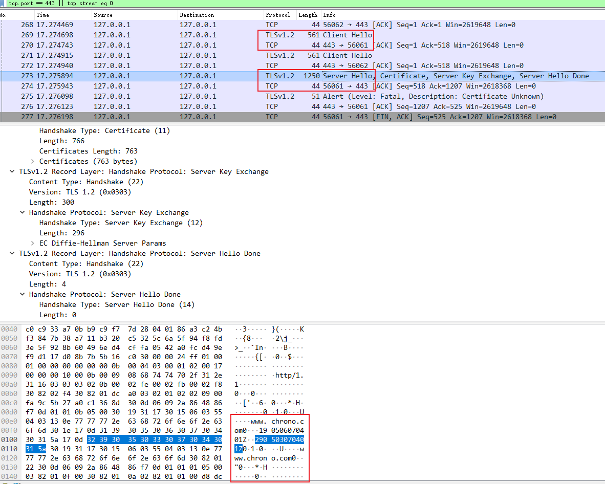
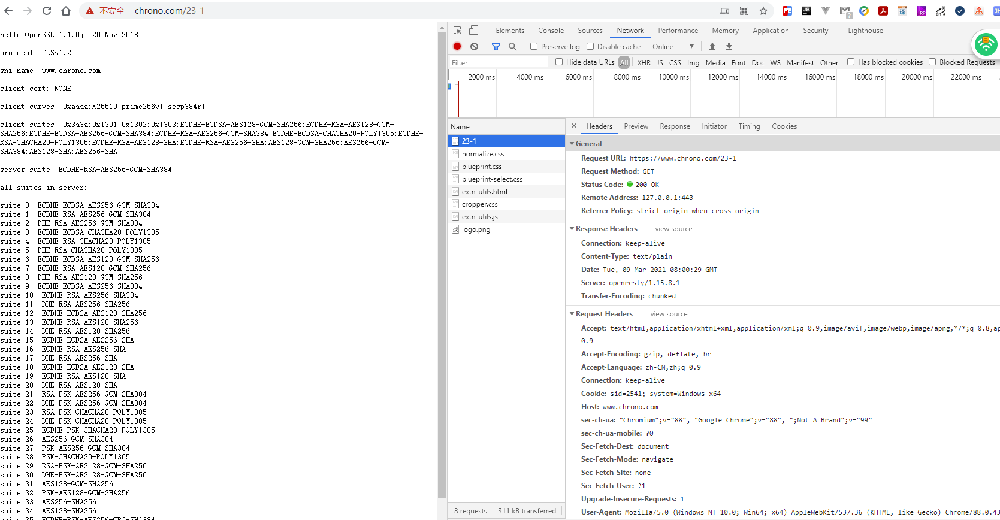

# 01 | TLS 又是什么？

在 [HTTP有哪些优点？又有哪些缺点？](../03/07.md)  曾经谈到过 HTTP 的一些缺点，其中的「无状态」在加入 Cookie 后得到了解决，而另两个缺点—— **明文** 和 **不安全** 仅凭 HTTP 自身是无力解决的，需要引入新的 HTTPS 协议。

## 为什么要有 HTTPS？

简单的回答是 **因为 HTTP 不安全** 。

由于 HTTP **天生明文** 的特点，整个传输过程完全透明，任何人都能够在链路中截获、修改或者伪造请求 / 响应报文，数据不具有可信性。

比如，前几讲中说过的 **代理服务** 。它作为 HTTP 通信的中间人，在数据上下行的时候可以添加或删除部分头字段，也可以使用黑白名单过滤 body 里的关键字，甚至直接发送虚假的请求、响应，而浏览器和源服务器都没有办法判断报文的真伪。

这对于网络购物、网上银行、证券交易等需要高度信任的应用场景来说是非常致命的。如果没有基本的安全保护，使用互联网进行各种电子商务、电子政务就根本无从谈起。

对于安全性要求不那么高的新闻、视频、搜索等网站来说，由于互联网上的恶意用户、恶意代理越来越多，也很容易遭到 **流量劫持** 的攻击，在页面里强行嵌入广告，或者分流用户，导致各种利益损失。

对于你我这样的普通网民来说，HTTP 不安全的隐患就更大了，上网的记录会被轻易截获，网站是否真实也无法验证，黑客可以伪装成银行网站，盗取真实姓名、密码、银行卡等敏感信息，威胁人身安全和财产安全。

总的来说，今天的互联网已经不再是早期的田园牧歌时代，而是进入了黑暗森林状态。上网的时候必须步步为营、处处小心，否则就会被不知道埋伏在哪里的黑客所猎杀

## 什么是安全？

既然 HTTP 不安全，那什么样的通信过程才是安全的呢？

通常认为，如果通信过程具备了四个特性，就可以认为是 「安全」的，这四个特性是：**机密性、完整性，身份认证和不可否认** 。

- **机密性**（Secrecy/Confidentiality）

  是指对数据的「保密」，只能由可信的人访问，对其他人是不可见的秘密，简单来说就是不能让不相关的人看到不该看的东西。

  比如小明和小红私下聊天，但隔墙有耳，被小强在旁边的房间里全偷听到了，这就是没有机密性。我们之前一直用的 Wireshark ，实际上也是利用了 HTTP 的这个特点，捕获了传输过程中的所有数据。

- **完整性**（Integrity，也叫一致性）

  是指数据在传输过程中 **没有被窜改** ，不多也不少，完完整整地保持着原状。

  **机密性虽然可以让数据成为秘密** ，但不能防止黑客对数据的修改，黑客可以替换数据，调整数据的顺序，或者增加、删除部分数据，破坏通信过程。

  比如，小明给小红写了张纸条：明天公园见。小强把「公园」划掉，模仿小明的笔迹把这句话改成了「明天广场见」。小红收到后无法验证完整性，信以为真，第二天的约会就告吹了。

- **身份认证**（Authentication）

  是指确认对方的真实身份，也就是「证明你真的是你」，保证消息只能发送给可信的人。

  如果通信时另一方是假冒的网站，那么数据再保密也没有用，黑客完全可以使用冒充的身份套出各种信息，加密和没加密一样。

  比如，小明给小红写了封情书：我喜欢你，但不留心发给了小强。小强将错就错，假冒小红回复了一个「白日做梦」，小明不知道这其实是小强的话，误以为是小红的，后果可想而知。

- **不可否认**（Non-repudiation/Undeniable）

  也叫不可抵赖，意思是不能否认已经发生过的行为，不能「说话不算数、耍赖皮」。

使用前三个特性，可以解决安全通信的大部分问题，但如果缺了不可否认，那通信的事务真实性就得不到保证，有可能出现老赖。

比如，小明借了小红一千元，没写借条，第二天矢口否认，小红也确实拿不出借钱的证据，只能认倒霉。另一种情况是小明借钱后还了小红，但没写收条，小红于是不承认小明还钱的事，说根本没还，要小明再掏出一千元。

所以，只有同时具备了机密性、完整性、身份认证、不可否认这四个特性，通信双方的利益才能有保障，才能算得上是真正的安全。

## 什么是 HTTPS？

说到这里，终于轮到今天的主角 HTTPS 出场了，它为 HTTP 增加了刚才所说的四大安全特性。

HTTPS 其实是一个「非常简单」的协议，RFC 文档很小，只有短短的 7 页，里面规定了 **新的协议名「https」，默认端口号 443** ，至于其他的什么请求 - 应答模式、报文结构、请求方法、URI、头字段、连接管理等等都完全沿用 HTTP，没有任何新的东西。

也就是说，除了协议名 `http` 和端口号 80 这两点不同，HTTPS 协议在语法、语义上和 HTTP 完全一样，优缺点也照单全收（当然要除去「明文」和「不安全」）。

不信你可以用 URI `https://www.chrono.com`  访问之前 08 至 21 讲的所有示例，看看它的响应报文是否与 HTTP 一样。

```http
https://www.chrono.com
https://www.chrono.com/11-1
https://www.chrono.com/15-1?name=a.json
https://www.chrono.com/16-1
```


你肯定已经注意到了，在用 HTTPS 访问实验环境时 Chrome 会有不安全提示，必须点击 `高级 - 继续前往` 才能顺利显示页面。而且如果用 Wireshark 抓包，也会发现与 HTTP 不一样，不再是简单可见的明文，多了 `Client Hello`、`Server Hello` 等新的数据包。



通过抓包，确实不太容易分清楚数据内容了

这就是 HTTPS 与 HTTP 最大的区别，它能够鉴别危险的网站，并且尽最大可能保证你的上网安全，防御黑客对信息的窃听、窜改或者钓鱼、伪造。

你可能要问了，既然没有新东西，HTTPS 凭什么就能做到机密性、完整性这些安全特性呢？

秘密就在于 HTTPS 名字里的 `S` ，它把 HTTP 下层的传输协议由 TCP/IP 换成了 SSL/TLS，由 **HTTP over TCP/IP** 变成了 **HTTP over SSL/TLS** ，让 HTTP 运行在了安全的 SSL/TLS 协议上（可参考 [与 HTTP 相关的各种协议](../02/04.md)  、 [常说的四层和七层到底是什么？五层、六层哪去了？](../02/05.md)），收发报文不再使用 Socket API，而是调用专门的安全接口。

::: tip 

上面表述有误，不是将 TCP/IP 换成了 SSL/TLS，另外下面的图是正确的，只是上面表述不对

传输还是使用的 TCP/IP 协议，只是 SSL/TLS 把 HTTP 协议再包装了一下

:::


所以说，HTTPS 本身并没有什么惊世骇俗的本事，全是靠着后面的 SSL/TLS 撑腰。只要学会了 SSL/TLS，HTTPS 自然就手到擒来。

## SSL/TLS

现在我们就来看看 SSL/TLS，它到底是个什么来历。

SSL 即安全套接层（Secure Sockets Layer），在 OSI 模型中处于第 5 层（会话层），由网景公司于 1994 年发明，有 v2 和 v3 两个版本，而 v1 因为有严重的缺陷从未公开过。

SSL 发展到 v3 时已经证明了它自身是一个非常好的安全通信协议，于是互联网工程组 IETF 在 1999 年把它改名为 TLS（**传输层安全，Transport Layer Security**），正式标准化，版本号从 1.0 重新算起，所以 TLS1.0 实际上就是 SSLv3.1。

到今天 TLS 已经发展出了三个版本，分别是 2006 年的 1.1、2008 年的 1.2 和去年（2018）的 1.3，每个新版本都紧跟密码学的发展和互联网的现状，持续强化安全和性能，已经成为了信息安全领域中的权威标准。

目前应用的最广泛的 TLS 是 1.2，而之前的协议（TLS1.1/1.0、SSLv3/v2）都已经被认为是不安全的，各大浏览器即将在 2020 年左右停止支持，所以接下来的讲解都针对的是 TLS1.2。

TLS 由记录协议、握手协议、警告协议、变更密码规范协议、扩展协议等几个子协议组成，综合使用了对称加密、非对称加密、身份认证等许多密码学前沿技术。

浏览器和服务器在使用 TLS 建立连接时需要选择一组恰当的加密算法来实现安全通信，这些算法的组合被称为 **密码套件（cipher suite，也叫加密套件）** 。

你可以访问实验环境的 URI `https://www.chrono.com/23-1`，对 TLS 和密码套件有个感性的认识。

响应内容为

```
hello OpenSSL 1.1.0j  20 Nov 2018

protocol: TLSv1.2

sni name: www.chrono.com

client cert: NONE

client curves: 0xaaaa:X25519:prime256v1:secp384r1

client suites: 0x3a3a:0x1301:0x1302:0x1303:ECDHE-ECDSA-AES128-GCM-SHA256:ECDHE-RSA-AES128-GCM-SHA256:ECDHE-ECDSA-AES256-GCM-SHA384:ECDHE-RSA-AES256-GCM-SHA384:ECDHE-ECDSA-CHACHA20-POLY1305:ECDHE-RSA-CHACHA20-POLY1305:ECDHE-RSA-AES128-SHA:ECDHE-RSA-AES256-SHA:AES128-GCM-SHA256:AES256-GCM-SHA384:AES128-SHA:AES256-SHA

server suite: ECDHE-RSA-AES256-GCM-SHA384

all suites in server:

suite 0: ECDHE-ECDSA-AES256-GCM-SHA384
suite 1: ECDHE-RSA-AES256-GCM-SHA384
suite 2: DHE-RSA-AES256-GCM-SHA384
suite 3: ECDHE-ECDSA-CHACHA20-POLY1305
suite 4: ECDHE-RSA-CHACHA20-POLY1305
suite 5: DHE-RSA-CHACHA20-POLY1305
suite 6: ECDHE-ECDSA-AES128-GCM-SHA256
suite 7: ECDHE-RSA-AES128-GCM-SHA256
suite 8: DHE-RSA-AES128-GCM-SHA256
suite 9: ECDHE-ECDSA-AES256-SHA384
suite 10: ECDHE-RSA-AES256-SHA384
suite 11: DHE-RSA-AES256-SHA256
suite 12: ECDHE-ECDSA-AES128-SHA256
suite 13: ECDHE-RSA-AES128-SHA256
suite 14: DHE-RSA-AES128-SHA256
suite 15: ECDHE-ECDSA-AES256-SHA
suite 16: ECDHE-RSA-AES256-SHA
suite 17: DHE-RSA-AES256-SHA
suite 18: ECDHE-ECDSA-AES128-SHA
suite 19: ECDHE-RSA-AES128-SHA
suite 20: DHE-RSA-AES128-SHA
suite 21: RSA-PSK-AES256-GCM-SHA384
suite 22: DHE-PSK-AES256-GCM-SHA384
suite 23: RSA-PSK-CHACHA20-POLY1305
suite 24: DHE-PSK-CHACHA20-POLY1305
suite 25: ECDHE-PSK-CHACHA20-POLY1305
suite 26: AES256-GCM-SHA384
suite 27: PSK-AES256-GCM-SHA384
suite 28: PSK-CHACHA20-POLY1305
suite 29: RSA-PSK-AES128-GCM-SHA256
suite 30: DHE-PSK-AES128-GCM-SHA256
suite 31: AES128-GCM-SHA256
suite 32: PSK-AES128-GCM-SHA256
suite 33: AES256-SHA256
suite 34: AES128-SHA256
suite 35: ECDHE-PSK-AES256-CBC-SHA384
suite 36: ECDHE-PSK-AES256-CBC-SHA
suite 37: SRP-RSA-AES-256-CBC-SHA
suite 38: SRP-AES-256-CBC-SHA
suite 39: RSA-PSK-AES256-CBC-SHA384
suite 40: DHE-PSK-AES256-CBC-SHA384
suite 41: RSA-PSK-AES256-CBC-SHA
suite 42: DHE-PSK-AES256-CBC-SHA
suite 43: AES256-SHA
suite 44: PSK-AES256-CBC-SHA384
suite 45: PSK-AES256-CBC-SHA
suite 46: ECDHE-PSK-AES128-CBC-SHA256
suite 47: ECDHE-PSK-AES128-CBC-SHA
suite 48: SRP-RSA-AES-128-CBC-SHA
suite 49: SRP-AES-128-CBC-SHA
suite 50: RSA-PSK-AES128-CBC-SHA256
suite 51: DHE-PSK-AES128-CBC-SHA256
suite 52: RSA-PSK-AES128-CBC-SHA
suite 53: DHE-PSK-AES128-CBC-SHA
suite 54: AES128-SHA
suite 55: PSK-AES128-CBC-SHA256
suite 56: PSK-AES128-CBC-SHA
```



看看后端代码是如何实现这个的

```lua
-- Copyright (C) 2019 by chrono
-- ssl/tls cipher suites

--local ssl = require "ngx.ssl"

local bit = require "bit"
local band = bit.band

local ffi = require "ffi"
local ffi_new = ffi.new
local ffi_gc = ffi.gc
local ffi_copy = ffi.copy
local ffi_str = ffi.string
local C = ffi.C

ffi.cdef[[
typedef struct ssl_method_st SSL_METHOD;
typedef struct ssl_st SSL;
typedef struct ssl_ctx_st SSL_CTX;

const char *OpenSSL_version(int type);
const SSL_METHOD *TLS_method(void);
SSL_CTX *SSL_CTX_new(const SSL_METHOD *meth);
void SSL_CTX_free(SSL_CTX *ctx);
SSL *SSL_new(SSL_CTX *ctx);
void SSL_free(SSL *ssl);

const char *SSL_get_cipher_list(const SSL *s, int n);
char *SSL_get_shared_ciphers(const SSL *s, char *buf, int len);
]]

local scheme = ngx.var.scheme
if scheme ~= 'https' then
    --ngx.log(ngx.ERR, scheme)
    return ngx.redirect(
        'https://'..ngx.var.host..ngx.var.request_uri, 301)
end

-- workaround on ubuntu 1604 OpenSSL 1.0.1f
--if not pcall(ffi.typeof, 'OpenSSL_version') then
--    return ngx.say('read openssl error.')
--end

local openssl_ver = ffi_str(C.OpenSSL_version(0))

ngx.log(ngx.INFO, "hello openssl")

ngx.say('hello ', openssl_ver)

--ngx.say('\nver: ', ssl.get_tls1_version_str())
-- 打印客户端请求传递的 ssl 相关信息
ngx.say('\nprotocol: ', ngx.var.ssl_protocol)
ngx.say('\nsni name: ', ngx.var.ssl_server_name)

ngx.say('\nclient cert: ', ngx.var.ssl_client_verify)
ngx.say('\nclient curves: ', ngx.var.ssl_curves)
ngx.say('\nclient suites: ', ngx.var.ssl_ciphers)

ngx.say('\nserver suite: ', ngx.var.ssl_cipher)

local ssl_ctx = C.SSL_CTX_new(C.TLS_method())
local ssl = C.SSL_new(ssl_ctx)

--local cipher_list = C.SSL_get_cipher_list(ssl, 0)
--ngx.say('list 0: ', ffi_str(cipher_list))

--local buf = ffi_new('char[?]', 4096)
--C.SSL_get_shared_ciphers(ssl, buf, 4096)
--ngx.say('list: ', ffi_str(buf))

-- 打印服务器中支持的所有套件
ngx.say('\nall suites in server:\n')

for i=0,60 do
    local cipher_list = C.SSL_get_cipher_list(ssl, i)

    if cipher_list == ffi.null then
        break
    end

    ngx.say('suite ', i, ': ', ffi_str(cipher_list))
end

C.SSL_free(ssl)
C.SSL_CTX_free(ssl_ctx)
```

你可以看到，实验环境使用的 TLS 是 1.2，客户端和服务器都支持非常多的密码套件，而最后协商选定的是 `ECDHE-RSA-AES256-GCM-SHA384` 。

这么长的名字看着有点晕吧，不用怕，其实 TLS 的密码套件命名非常规范，格式很固定。基本的形式是

```
密钥交换算法 + 签名算法 + 对称加密算法 + 摘要算法
```

比如刚才的密码套件 `ECDHE-RSA-AES256-GCM-SHA384` 的意思就是：

- 握手时使用 ECDHE 算法进行密钥交换
- 用 RSA 签名和身份认证，
- 握手后的通信使用 AES 对称算法，密钥长度 256 位
- 分组模式是 GCM
- 摘要算法 SHA384 用于消息认证和产生随机数

## OpenSSL

说到 TLS，就不能不谈到 OpenSSL，它是一个著名的 **开源密码学程序库和工具包**，几乎支持所有公开的加密算法和协议，已经成为了事实上的标准，许多应用软件都会使用它作为底层库来实现 TLS 功能，包括常用的 Web 服务器 Apache、Nginx 等。

OpenSSL 是从另一个开源库 SSLeay 发展出来的，曾经考虑命名为 `OpenTLS`，但当时（1998 年）TLS 还未正式确立，而 SSL 早已广为人知，所以最终使用了 `OpenSSL` 的名字。

OpenSSL 目前有三个主要的分支，1.0.2 和 1.1.0 都将在今年（2019）年底不再维护，最新的长期支持版本是 1.1.1，我们的实验环境使用的 OpenSSL 是 `1.1.0j` 。

由于 OpenSSL 是开源的，所以它还有一些代码分支，比如 Google 的 BoringSSL、OpenBSD 的 LibreSSL，这些分支在 OpenSSL 的基础上删除了一些老旧代码，也增加了一些新特性，虽然背后有大金主，但离取代 OpenSSL 还差得很远。

## 小结

1. 因为 HTTP 是明文传输，所以不安全，容易被黑客窃听或窜改；
2. 通信安全必须同时具备机密性、完整性，身份认证和不可否认这四个特性；
3. HTTPS 的语法、语义仍然是 HTTP，但把下层的协议由 TCP/IP 换成了 SSL/TLS；
4. SSL/TLS 是信息安全领域中的权威标准，采用多种先进的加密技术保证通信安全；
5. OpenSSL 是著名的开源密码学工具包，是 SSL/TLS 的具体实现。

## 课下作业

1. 你能说出 HTTPS 与 HTTP 有哪些区别吗？

   HTTPS 相对于 HTTP 具有机密性，完整性，身份认证和不可否认的特性

   HTTPS 是HTTP over SSL/TLS，HTTP 是 HTTP over TCP/IP

2. 你知道有哪些方法能够实现机密性、完整性等安全特性呢？

   实现机密性可以采用加密手段，接口签名实现完整性，数字签名用于身份认证

## 拓展阅读

- 一个有趣的事实，当前所有 TLS 的 RFC 文档末尾数字都是 46（2246、4346、5246、8846）
- 除了 HTTP，SSL/TLS 也可以承载其他的应用协议，例如 `FTP=>FTP`、`LDAP= LDAPS` 等
- OpenSSL 前身 SSLeay 的名字来源于其作者之的 `EriC A. Young`
- 关于 OpenSSL 有一个著名的「心脏出血( Heart Bleed)」漏洞,出现在 1.0.1 版里
- OpenSSL 里的密码套件定义与 TLS 略有不同，TLS 里的形式是 `TLS_ECDHE_RSA_WITH_AES256_GCM_SHA384`，加了前缀 `TLS`，并用 `WTH` 分开了握手和通信的算法
- 另一个比较著名的开源密码库是 NSS（ Network Security Services），由 Mozilla 开发