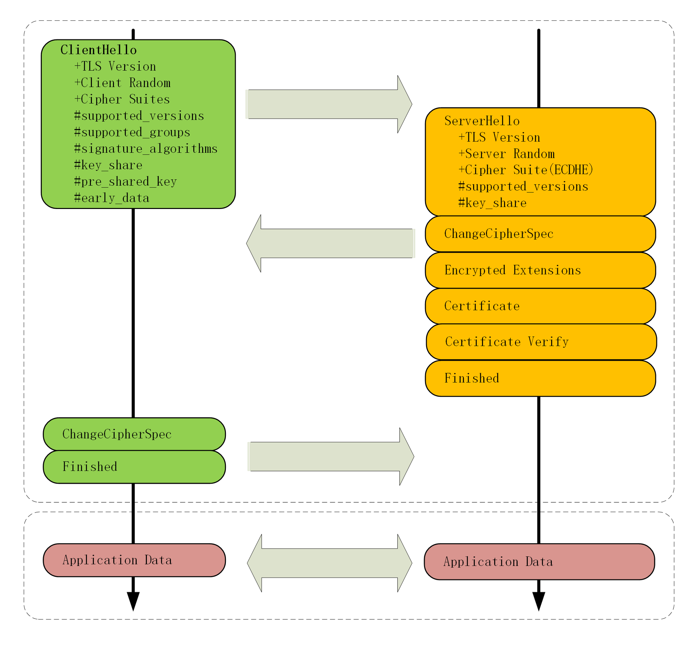
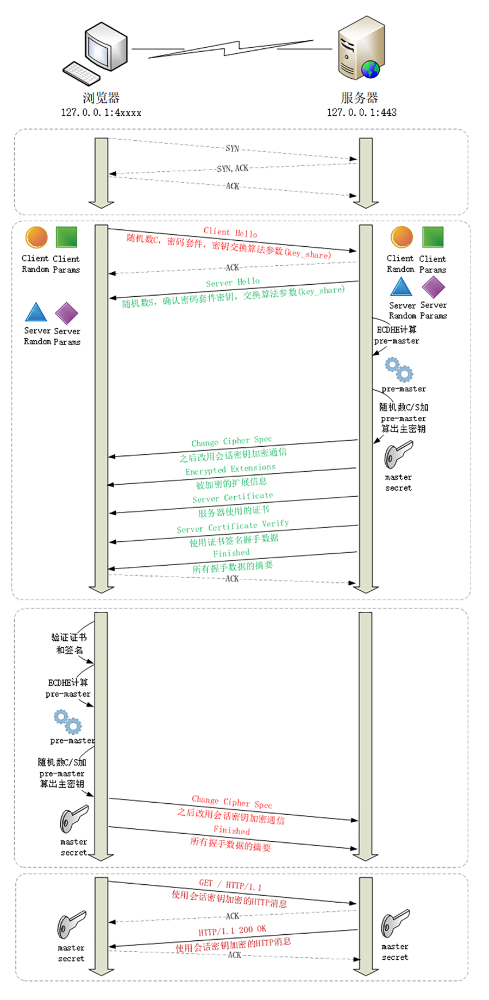

# 05 | 更好更快的握手: TLS 1.3 特性解析

上一讲中我讲了 TLS1.2 的握手过程，你是不是已经完全掌握了呢？

不过 TLS1.2 已经是 10 年前（2008 年）的老协议了，虽然历经考验，但毕竟岁月不饶人，在安全、性能等方面已经跟不上如今的互联网了。

于是经过四年、近 30 个草案的反复打磨，TLS1.3 终于在去年（2018 年）粉墨登场，再次确立了信息安全领域的新标准。

在抓包分析握手之前，我们先来快速浏览一下 TLS1.3 的三个主要改进目标：**兼容**、**安全与性能** 。

## 最大化兼容性

由于 1.1、1.2 等协议已经出现了很多年，很多应用软件、中间代理（官方称为`MiddleBox`）只认老的记录协议格式，更新改造很困难，甚至是不可行（设备僵化）。

在早期的试验中发现，一旦变更了记录头字段里的版本号，也就是由 0x303（TLS1.2）改为 0x304（TLS1.3）的话，大量的代理服务器、网关都无法正确处理，最终导致 TLS 握手失败。

为了保证这些被广泛部署的 「老设备」 能够继续使用，避免新协议带来的冲击，TLS1.3 不得不做出妥协，保持现有的记录格式不变，通过伪装来实现兼容，使得 TLS1.3 看上去像是 TLS1.2。

那么，该怎么区分 1.2 和 1.3 呢？

这要用到一个新的 **扩展协议**（Extension Protocol），它有点补充条款的意思，通过在记录末尾添加一系列的「扩展字段」来增加新的功能，老版本的 TLS 不认识它可以直接忽略，这就实现了「后向兼容」。

在记录头的 Version 字段被兼容性「固定」的情况下，只要是 TLS1.3 协议，握手的 `Hello` 消息后面就必须有 **supported_versions** 扩展，它标记了 TLS 的版本号，使用它就能区分新旧协议。

其实上一讲 Chrome 在握手时发的就是 TLS1.3 协议，你可以看一下 `Client Hello` 消息后面的扩展，只是因为服务器不支持 1.3，所以就 **后向兼容** 降级成了 1.2。

```http
Handshake Protocol: Client Hello
    Version: TLS 1.2 (0x0303)
    Extension: supported_versions (len=11)
        Supported Version: TLS 1.3 (0x0304)
        Supported Version: TLS 1.2 (0x0303)
```

```
复制代码
```

TLS1.3 利用扩展实现了许多重要的功能，比如 `supported_groups`、`key_share`、`signature_algorithms`、`server_name` 等，这些等后面用到的时候再说。

## 强化安全

TLS1.2 在十来年的应用中获得了许多宝贵的经验，陆续发现了很多的漏洞和加密算法的弱点，所以 TLS1.3 就在协议里修补了这些不安全因素。

比如：

- 伪随机数函数由 PRF 升级为 HKDF（HMAC-based Extract-and-Expand Key Derivation Function）；
- 明确禁止在记录协议里使用压缩；
- 废除了 RC4、DES 对称加密算法；
- 废除了 ECB、CBC 等传统分组模式；
- 废除了 MD5、SHA1、SHA-224 摘要算法；
- 废除了 RSA、DH 密钥交换算法和许多命名曲线。

经过这一番「减肥瘦身」之后，TLS1.3 里只保留了 AES、ChaCha20 对称加密算法，分组模式只能用 AEAD 的 GCM、CCM 和 Poly1305，摘要算法只能用 SHA256、SHA384，密钥交换算法只有 ECDHE 和 DHE，椭圆曲线也被“砍”到只剩 P-256 和 x25519 等 5 种。

减肥可以让人变得更轻巧灵活，TLS 也是这样。

算法精简后带来了一个意料之中的好处：原来众多的算法、参数组合导致密码套件非常复杂，难以选择，而现在的 TLS1.3 里只有 5 个套件，无论是客户端还是服务器都不会再犯“选择困难症”了。


这里还要特别说一下废除 RSA 和 DH 密钥交换算法的原因。

上一讲用 Wireshark 抓包时你一定看到了，浏览器默认会使用 ECDHE 而不是 RSA 做密钥交换，这是因为它不具有 **前向安全**（Forward Secrecy）。

假设有这么一个很有耐心的黑客，一直在长期收集混合加密系统收发的所有报文。如果加密系统使用服务器证书里的 RSA 做密钥交换，一旦私钥泄露或被破解（使用社会工程学或者巨型计算机），那么黑客就能够使用私钥解密出之前所有报文的 `Pre-Master` ，再算出会话密钥，破解所有密文。

这就是所谓的 **今日截获，明日破解** 。

而 ECDHE 算法在每次握手时都会生成一对临时的公钥和私钥，每次通信的密钥对都是不同的，也就是 **一次一密**，即使黑客花大力气破解了这一次的会话密钥，也只是这次通信被攻击，之前的历史消息不会受到影响，仍然是安全的。

所以现在主流的服务器和浏览器在握手阶段都已经不再使用 RSA，改用 ECDHE，而 TLS1.3 在协议里明确废除 RSA 和 DH 则在标准层面保证了 **前向安全** 。

## 提升性能

HTTPS 建立连接时除了要做 TCP 握手，还要做 TLS 握手，在 1.2 中会多花两个消息往返（2-RTT），可能导致几十毫秒甚至上百毫秒的延迟，在移动网络中延迟还会更严重。

现在因为密码套件大幅度简化，也就没有必要再像以前那样走复杂的协商流程了。TLS1.3 压缩了以前的 `Hello` 协商过程，删除了 `Key Exchange` 消息，把握手时间减少到了 `1-RTT` ，效率提高了一倍。

那么它是怎么做的呢？

其实具体的做法还是利用了扩展。客户端在 `Client Hello` 消息里直接用 **supported_groups** 带上支持的曲线，比如 P-256、x25519，用 **key_share** 带上曲线对应的客户端公钥参数，用 **signature_algorithms** 带上签名算法。

服务器收到后在这些扩展里选定一个曲线和参数，再用 `key_share` 扩展返回服务器这边的公钥参数，就实现了双方的密钥交换，后面的流程就和 1.2 基本一样了。

我为 1.3 的握手过程画了一张图，你可以对比 1.2 看看区别在哪里。



除了标准的 `1-RTT` 握手，TLS1.3 还引入了 `0-RTT` 握手，用 `pre_shared_key` 和 `early_data` 扩展，在 TCP 连接后立即就建立安全连接发送加密消息，不过这需要有一些前提条件，今天暂且不说。

## 握手分析

目前 Nginx 等 Web 服务器都能够很好地支持 TLS1.3，但要求底层的 OpenSSL 必须是 1.1.1，而我们实验环境里用的 OpenSSL 是 1.1.0，所以暂时无法直接测试 TLS1.3。

不过我在 Linux 上用 OpenSSL1.1.1 编译了一个支持 TLS1.3 的 Nginx，用 Wireshark 抓包存到了 GitHub 上，用它就可以分析 TLS1.3 的握手过程。



在 TCP 建立连接之后，浏览器首先还是发一个 **Client Hello** 。

因为 1.3 的消息兼容 1.2，所以开头的版本号、支持的密码套件和随机数（Client Random）结构都是一样的（不过这时的随机数是 32 个字节）。

```
Handshake Protocol: Client Hello
    Version: TLS 1.2 (0x0303)
    Random: cebeb6c05403654d66c2329…
    Cipher Suites (18 suites)
        Cipher Suite: TLS_AES_128_GCM_SHA256 (0x1301)
        Cipher Suite: TLS_CHACHA20_POLY1305_SHA256 (0x1303)
        Cipher Suite: TLS_AES_256_GCM_SHA384 (0x1302)
    Extension: supported_versions (len=9)
        Supported Version: TLS 1.3 (0x0304)
        Supported Version: TLS 1.2 (0x0303)
    Extension: supported_groups (len=14)
        Supported Groups (6 groups)
            Supported Group: x25519 (0x001d)
            Supported Group: secp256r1 (0x0017)
    Extension: key_share (len=107)
        Key Share extension
            Client Key Share Length: 105
            Key Share Entry: Group: x25519
            Key Share Entry: Group: secp256r1
```

注意 `Client Hello` 里的扩展，**supported_versions** 表示这是 TLS1.3，**supported_groups** 是支持的曲线，**key_share** 是曲线对应的参数。

这就好像是说：

还是照老规矩打招呼，这边有这些这些信息。但我猜你可能会升级，所以再多给你一些东西，也许后面用的上，咱们有话尽量一口气说完。

服务器收到 `Client Hello` 同样返回 `Server Hello` 消息，还是要给出一个 **随机数**（Server Random）和选定密码套件。

```
Handshake Protocol: Server Hello
    Version: TLS 1.2 (0x0303)
    Random: 12d2bce6568b063d3dee2…
    Cipher Suite: TLS_AES_128_GCM_SHA256 (0x1301)
    Extension: supported_versions (len=2)
        Supported Version: TLS 1.3 (0x0304)
    Extension: key_share (len=36)
        Key Share extension
            Key Share Entry: Group: x25519, Key Exchange length: 32

```

表面上看和 TLS1.2 是一样的，重点是后面的扩展。**supported_versions** 里确认使用的是 TLS1.3，然后在 **key_share** 扩展带上曲线和对应的公钥参数。

服务器的 `Hello` 消息大概是这个意思：

还真让你给猜对了，虽然还是按老规矩打招呼，但咱们来个‘旧瓶装新酒’。刚才你给的我都用上了，我再给几个你缺的参数，这次加密就这么定了。

这时只交换了两条消息，客户端和服务器就拿到了四个共享信息：**Client Random** 和 **Server Random** 、**Client Params** 和 **Server Params** ，两边就可以各自用 ECDHE 算出 **Pre-Master** ，再用 HKDF 生成主密钥 **Master Secret** ，效率比 TLS1.2 提高了一大截。

在算出主密钥后，服务器立刻发出 **Change Cipher Spec** 消息，比 TLS1.2 提早进入加密通信，后面的证书等就都是加密的了，减少了握手时的明文信息泄露。

这里 TLS1.3 还有一个安全强化措施，多了个 **Certificate Verify** 消息，用服务器的私钥把前面的曲线、套件、参数等握手数据加了签名，作用和 **Finished** 消息差不多。但由于是私钥签名，所以强化了身份认证和和防窜改。

这两个 `Hello` 消息之后，客户端验证服务器证书，再发 `Finished` 消息，就正式完成了握手，开始收发 HTTP 报文。

虽然我们的实验环境暂时不能抓包测试 TLS1.3，但互联网上很多网站都已经支持了 TLS1.3，比如[Nginx](https://www.nginx.com/)、[GitHub](https://github.com/)，你可以课后自己用 Wireshark 试试。

在 Chrome 的开发者工具里，可以看到这些网站的 TLS1.3 应用情况。


## 小结

今天我们一起学习了 TLS1.3 的新特性，用抓包研究了它的握手过程，不过 TLS1.3 里的内容很多，还有一些特性没有谈到，后面会继续讲。

1. 为了兼容 1.1、1.2 等“老”协议，TLS1.3 会“伪装”成 TLS1.2，新特性在“扩展”里实现；
2. 1.1、1.2 在实践中发现了很多安全隐患，所以 TLS1.3 大幅度删减了加密算法，只保留了 ECDHE、AES、ChaCha20、SHA-2 等极少数算法，强化了安全；
3. TLS1.3 也简化了握手过程，完全握手只需要一个消息往返，提升了性能。

## 课下作业

1. TLS1.3 里的密码套件没有指定密钥交换算法和签名算法，那么在握手的时候会不会有问题呢？

   TLS1.3 精简了加密算法，通过 support_groups、key_share、signature_algorithms 这些参数就能判断出密钥交换算法和签名算法，不用在 cipher suite 中协商了

2. 结合上一讲的 RSA 握手过程，解释一下为什么 RSA 密钥交换不具有 **前向安全**。

   RSA 握手时，client key exchage 会使用 RSA 公钥加密 pre master 后传给服务端，一旦私钥被破解，那么之前的信息都会被破译，根本原因还是在于 RSA 的这一对公钥私钥并不是临时的

3. TLS1.3 的握手过程与 TLS1.2 的 False Start 有什么异同？

   相同点：都在未收到 Finished 确认消息时就已经向对方发送加密信息了，不同点：TLS1.3 将 change cipher spec 合并到了 hello 中

## 拓展阅读

- 对 TLS12 已知的攻击有 BEAST、 BREACH、CRME、 FREAK、 LUCKY13、 POODLE、ROBOT 等
- 虽然 TLS1.3 到今天刚满一岁，但由于有之前多个草案的实践，各大浏览器和服务器基本都
  已经实现了支持，整个互联网也正在快速向 TLS1.3 迁移。
- 关于前向安全最著名的案例就是斯诺登于 2013 年爆出的棱镜计划
- 在 TLS1.3 的 RFC 文档里已经删除了 `Change Cipher Spec` 子协议，但用 Wireshark 抓包
  却还能看到，这里以抓包为准
- TLS1.3 还提供了降级保护机制，如果 「中间人」恶意降级到 1.2，服务器的随机数最后 8 个字节会被设置为 `44 4F 57 4E 47 52 44 01`，即 `DOWNGRD01`，支持 TLS1.3 的客户端就可以检查发现被降级，然后发出警报终止连接

::: tip

这一章节，其实从上一章节开始，笔者就已经不太能看懂了，只当讲了个故事，知道 TSL1.3 进行了优化，安全方面更强悍了...

:::