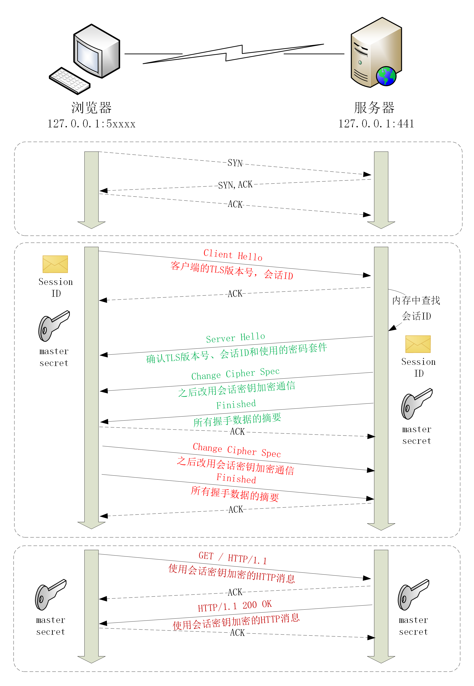
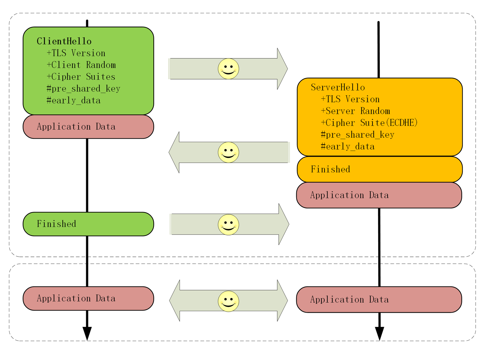

# 06 | 连接太慢该怎么办 HTTPS 的优化

你可能或多或少听别人说过，`HTTPS 的连接很慢` 。那么慢的原因是什么呢？

通过前两讲的学习，你可以看到，HTTPS 连接大致上可以划分为两个部分，第一个是建立连接时的 **非对称加密握手** ，第二个是握手后的 **对称加密报文传输** 。

由于目前流行的 AES、ChaCha20 性能都很好，还有硬件优化，报文传输的性能损耗可以说是非常地小，小到几乎可以忽略不计了。所以，通常所说的 HTTPS 连接慢指的就是 **刚开始建立连接的那段时间** 。

在 TCP 建连之后，正式数据传输之前，HTTPS 比 HTTP 增加了一个 TLS 握手的步骤，这个步骤最长可以花费两个消息往返，也就是 2-RTT。而且在握手消息的网络耗时之外，还会有其他的一些「隐形」消耗，比如：

- 产生用于密钥交换的临时公私钥对（ECDHE）；
- 验证证书时访问 CA 获取 CRL 或者 OCSP；
- 非对称加密解密处理 `Pre-Master` 。

在最差的情况下，也就是不做任何的优化措施，HTTPS 建立连接可能会比 HTTP 慢上几百毫秒甚至几秒，这其中既有网络耗时，也有计算耗时，就会让人产生“打开一个 HTTPS 网站好慢啊”的感觉。

不过刚才说的情况早就是过去时了，现在已经有了很多行之有效的 HTTPS 优化手段，运用得好可以把连接的额外耗时降低到几十毫秒甚至是「零」。

我画了一张图，把 TLS 握手过程中影响性能的部分都标记了出来，对照着它就可以「有的放矢」地来优化 HTTPS。


## 硬件优化

在计算机世界里的优化可以分成 **硬件优化** 和 **软件优化** 两种方式，先来看看有哪些硬件的手段。

硬件优化，说白了就是花钱。但花钱也是有门道的，要有钱用在刀刃上，不能大把的银子撒出去只听见响。

**HTTPS 连接是 CPU 计算密集型** ，而不是 I/O 密集型。所以，如果你花大价钱去买网卡、带宽、SSD 存储就是南辕北辙了，起不到优化的效果。

那该用什么样的硬件来做优化呢？

首先，你可以选择 **更快的 CPU** ，最好还内建 AES 优化，这样即可以加速握手，也可以加速传输。

其次，你可以选择 **SSL 加速卡** ，加解密时调用它的 API，让专门的硬件来做非对称加解密，分担 CPU 的计算压力。

不过 SSL 加速卡也有一些缺点，比如升级慢、支持算法有限，不能灵活定制解决方案等。

所以，就出现了第三种硬件加速方式：**SSL 加速服务器** ，用专门的服务器集群来彻底 「卸载」TLS 握手时的加密解密计算，性能自然要比单纯的「加速卡」要强大的多。

## 软件优化

不过硬件优化方式中除了 CPU，其他的通常可不是靠简单花钱就能买到的，还要有一些开发适配工作，有一定的实施难度。比如，「加速服务器」中关键的一点是通信必须是「异步」的，不能阻塞应用服务器，否则加速就没有意义了。

所以，软件优化的方式相对来说更可行一些，性价比高，能够少花钱，多办事。

软件方面的优化还可以再分成两部分：一个是 **软件升级** ，一个是 **协议优化** 。

软件升级实施起来比较简单，就是把现在正在使用的软件尽量升级到最新版本，比如把 Linux 内核由 2.x 升级到 4.x，把 Nginx 由 1.6 升级到 1.16，把 OpenSSL 由 1.0.1 升级到 1.1.0/1.1.1。

由于这些软件在更新版本的时候都会做性能优化、修复错误，只要运维能够主动配合，这种软件优化是最容易做的，也是最容易达成优化效果的。

但对于很多大中型公司来说，硬件升级或软件升级都是个棘手的问题，有成千上万台各种型号的机器遍布各个机房，逐一升级不仅需要大量人手，而且有较高的风险，可能会影响正常的线上服务。

所以，在软硬件升级都不可行的情况下，我们最常用的优化方式就是在现有的环境下挖掘协议自身的潜力。

## 协议优化

从刚才的 TLS 握手图中你可以看到影响性能的一些环节，协议优化就要从这些方面着手，先来看看核心的密钥交换过程。

如果有可能，应当尽量采用 TLS1.3，它大幅度简化了握手的过程，完全握手只要 1-RTT，而且更加安全。

如果暂时不能升级到 1.3，只能用 1.2，那么握手时使用的密钥交换协议应当尽量选用椭圆曲线的 ECDHE 算法。它不仅运算速度快，安全性高，还支持 `False Start` ，能够把握手的消息往返由 2-RTT 减少到 1-RTT，达到与 TLS1.3 类似的效果。

另外，椭圆曲线也要选择高性能的曲线，最好是 x25519，次优选择是 P-256。对称加密算法方面，也可以选用 `AES_128_GCM` ，它能比 `AES_256_GCM` 略快一点点。

在 Nginx 里可以用 `ssl_ciphers`、`ssl_ecdh_curve` 等指令配置服务器使用的密码套件和椭圆曲线，把优先使用的放在前面，例如：

```
ssl_ciphers   TLS13-AES-256-GCM-SHA384:TLS13-CHACHA20-POLY1305-SHA256:EECDH+CHACHA20；
ssl_ecdh_curve              X25519:P-256;
```

## 证书优化

除了密钥交换，握手过程中的证书验证也是一个比较耗时的操作，服务器需要把 **自己的证书链** 全发给客户端，然后客户端接收后再逐一验证。

这里就有两个优化点，一个是 **证书传输** ，一个是 **证书验证** 。

服务器的证书可以选择椭圆曲线（ECDSA）证书而不是 RSA 证书，因为 224 位的 ECC 相当于 2048 位的 RSA，所以椭圆曲线证书的「个头」要比 RSA 小很多，即能够节约带宽也能减少客户端的运算量，可谓一举两得。

客户端的证书验证其实是个很复杂的操作，除了要公钥解密验证多个证书签名外，因为证书还有可能会被撤销失效，客户端有时还会再去访问 CA，下载 CRL 或者 OCSP 数据，这又会产生 DNS 查询、建立连接、收发数据等一系列网络通信，增加好几个 RTT。

CRL（Certificate revocation list，证书吊销列表）由 CA 定期发布，里面是所有被撤销信任的证书序号，查询这个列表就可以知道证书是否有效。

但 CRL 因为是「定期」发布，就有「时间窗口」的安全隐患，而且随着吊销证书的增多，列表会越来越大，一个 CRL 经常会上 MB。想象一下，每次需要预先下载几 M 的「无用数据」才能连接网站，实用性实在是太低了。

所以，现在 CRL 基本上不用了，取而代之的是 OCSP（在线证书状态协议，Online Certificate Status Protocol），向 CA 发送查询请求，让 CA 返回证书的有效状态。

但 OCSP 也要多出一次网络请求的消耗，而且还依赖于 CA 服务器，如果 CA 服务器很忙，那响应延迟也是等不起的。

于是又出来了一个补丁，叫 `OCSP Stapling`（OCSP 装订），它可以让服务器预先访问 CA 获取 OCSP 响应，然后在握手时随着证书一起发给客户端，免去了客户端连接 CA 服务器查询的时间。

## 会话复用

到这里，我们已经讨论了四种 HTTPS 优化手段（硬件优化、软件优化、协议优化、证书优化），那么，还有没有其他更好的方式呢？

我们再回想一下 HTTPS 建立连接的过程：先是 TCP 三次握手，然后是 TLS 一次握手。这后一次握手的重点是算出主密钥 `Master Secret` ，而主密钥每次连接都要重新计算，未免有点太浪费了，如果能够把辛辛苦苦算出来的主密钥缓存一下重用，不就可以免去了握手和计算的成本了吗？

这种做法就叫 **会话复用** （TLS session resumption），和 HTTP Cache 一样，也是提高 HTTPS 性能的大杀器，被浏览器和服务器广泛应用。

会话复用分两种，第一种叫 **Session ID** ，就是客户端和服务器首次连接后各自保存一个会话的 ID 号，内存里存储主密钥和其他相关的信息。当客户端再次连接时发一个 ID 过来，服务器就在内存里找，找到就直接用主密钥恢复会话状态，跳过证书验证和密钥交换，只用一个消息往返就可以建立安全通信。

实验环境的端口 441 实现了 `Session ID` 的会话复用，你可以访问 URI `https://www.chrono.com:441/28-1`，刷新几次，用 Wireshark 抓包看看实际的效果。

```html
ssl handshake by TLSv1.2

ssl session id is [c2fee619ff6ea89cc7dc38e1bc5e3750f30f6213e4846ac861a1991fa1befe5e]

reused? true
```

来看看这后端代码是如何实现的

```lua
-- Copyright (C) 2019 by chrono
-- test ssl handshake

local ssl = require "ngx.ssl"

local scheme = ngx.var.scheme
if scheme ~= 'https' then
    --ngx.log(ngx.ERR, scheme)
    return ngx.redirect(
        'https://'..ngx.var.host..ngx.var.request_uri, 301)
end

local strs = {}

strs[#strs + 1] = 'ssl handshake by ' ..  ssl.get_tls1_version_str()
strs[#strs + 1] = 'ssl session id is [' .. (ngx.var.ssl_session_id or '') .. ']'
strs[#strs + 1] = 'reused? ' .. (ngx.var.ssl_session_reused == 'r' and 'true' or 'false')

local str = table.concat(strs, '\n\n')

ngx.header['Content-Length'] = #str

ngx.print(str)

```

直接从模块中获取的，貌似也没有看到哪里有特殊的设置

```
Handshake Protocol: Client Hello
    Version: TLS 1.2 (0x0303)
    Session ID: 13564734eeec0a658830cd…
    Cipher Suites Length: 34
 
 
Handshake Protocol: Server Hello
    Version: TLS 1.2 (0x0303)
    Session ID: 13564734eeec0a658830cd…
    Cipher Suite: TLS_ECDHE_RSA_WITH_AES_256_GCM_SHA384 (0xc030)

```

通过抓包可以看到，服务器在 `ServerHello` 消息后直接发送了 `Change Cipher Spec` 和 `Finished` 消息，复用会话完成了握手。



## 会话票证

`Session ID` 是最早出现的会话复用技术，也是应用最广的，但它也有缺点，服务器必须保存每一个客户端的会话数据，对于拥有百万、千万级别用户的网站来说存储量就成了大问题，加重了服务器的负担。

于是，又出现了第二种 **Session Ticket** 方案。

它有点类似 HTTP 的 Cookie，存储的责任由服务器转移到了客户端，服务器加密会话信息，用 `New Session Ticket` 消息发给客户端，让客户端保存。

重连的时候，客户端使用扩展 **session_ticket** 发送 `Ticket` 而不是 `Session ID` ，服务器解密后验证有效期，就可以恢复会话，开始加密通信。

这个过程也可以在实验环境里测试，端口号是 442，URI 是 `https://www.chrono.com:442/28-1` 。

不过 `Session Ticket` 方案需要使用一个固定的密钥文件（ticket_key）来加密 Ticket，为了防止密钥被破解，保证前向安全，密钥文件需要定期轮换，比如设置为一小时或者一天。

## 预共享密钥

`False Start`、`Session ID`、`Session Ticket` 等方式只能实现 1-RTT，而 TLS1.3 更进一步实现了 **0-RTT** ，原理和 `Session Ticket` 差不多，但在发送 Ticket 的同时会带上应用数据（Early Data），免去了 1.2 里的服务器确认步骤，这种方式叫 **Pre-shared Key** ，简称为 `PSK` 。



但 `PSK` 也不是完美的，它为了追求效率而牺牲了一点安全性，容易受到 重放攻击（Replay attack）的威胁。黑客可以截获 `PSK` 的数据，像复读机那样反复向服务器发送。

解决的办法是只允许安全的 GET/HEAD 方法，在消息里加入时间戳、`nonce` 验证，或者「一次性票证」限制重放。

## 小结

1. 可以有多种硬件和软件手段减少网络耗时和计算耗时，让 HTTPS 变得和 HTTP 一样快，最可行的是软件优化；
2. 应当尽量使用 ECDHE 椭圆曲线密码套件，节约带宽和计算量，还能实现 `False Start` ；
3. 服务器端应当开启 `OCSP Stapling` 功能，避免客户端访问 CA 去验证证书；
4. 会话复用的效果类似 Cache，前提是客户端必须之前成功建立连接，后面就可以用 `Session ID`、`Session Ticket` 等凭据跳过密钥交换、证书验证等步骤，直接开始加密通信。

## 课下作业

1. 你能比较一下 `Session ID`、`Session Ticket`、`PSK` 这三种会话复用手段的异同吗？

   -  `Session ID`

      类似网站开发中用来验证用户的 cookie，服务器会保存 Session ID对应的主密钥，需要用到服务器的存储空间

   - `Session Ticket`

     类似网站开发中的 JWT（JSON Web Token），JWT 的做法是服务器将必要的信息（主密钥和过期时间）加上密钥进行 HMAC 加密，然后将生成的密文和原文相连得到 JWT 字符串，交给客户端。当客户端发送 JWT 给服务端后，服务器会取出其中的原文和自己的密钥进行 HMAC 运算，如果得到的结果和 JWT 中的密文一样，就说明是服务端颁发的 JWT，服务器就会认为 JWT 存储 的主密钥和有效时间是有效的。另外，JWT 中不应该存放用户的敏感信息，明文部分任何人可见

   - `PSK`

     psk 实际上是 Session Ticket 的强化版，本身也是缓存，但它简化了 Session Ticket 的协商过程，省掉了一次 RTT

2. 你觉得哪些优化手段是你在实际工作中能用到的？应该怎样去用？


## 拓展阅读

- 使用 `SSL加速卡` 的一个案例是阿里的 Tengine，它基于 Intel QAT 加速卡，定制了 Nginx 和 OpenSSL

- 因为 OCSP 会增加额外的网络连接成本，所以 Chrome 等浏览器的策略是只对 EV 证书使用 OCSP 检查有效性，普通网站使用 DV、OV 证书省略了这个操作，就会略微快一点

- 在 Ngnx 里可以用指令 `ssl_stapling on` 开启 `OCSP Stapling`，而在 OpenResty 里更
  可以编写 Lua 代码灵活定制

- `Session ID` 和 `Session Ticket` 这两种会话复用技术在 TLS1.3 中均已经被废除，只能使用 PSK 实现会话复用

- 常见的对信息安全系统的攻击手段有 **重放攻击**( Replay attack)和 **中间人攻击** (Man-nthe- middle attack)，还有一种叫 **社会工程学** ( Social engineering attack)，它不属于计算机科学或密码学，而是利用了人性的弱点

- 预共享密钥的 0-RTT 不是真的 0-RTT 吧

  当然是 0-rtt，不过是指在建立 tcp 连接后的 0-rtt，也就是 tcp 握手之后立即发送应用数据，不需要再次 tls 握手