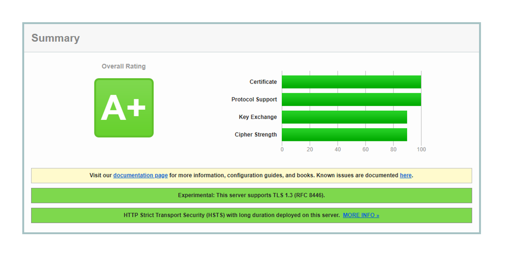

# 07 | 我应该迁移到 HTTPS 吗？

今天是安全篇的最后一讲，我们已经学完了 HTTPS、TLS 相关的大部分知识。不过，或许你心里还会有一些困惑：

HTTPS 这么复杂，我是否应该迁移到 HTTPS 呢？它能带来哪些好处呢？具体又应该怎么实施迁移呢？

这些问题不单是你，也是其他很多人，还有当初的我的真实想法，所以今天我就来跟你聊聊这方面的事情。

## 迁移的必要性

如果你做移动应用开发的话，那么就一定知道，Apple、Android、某信等开发平台在 2017 年就相继发出通知，要求所有的应用必须使用 HTTPS 连接，禁止不安全的 HTTP。

在台式机上，主流的浏览器 Chrome、Firefox 等也早就开始强推 HTTPS，把 HTTP 站点打上不安全的标签，给用户以心理压力。

Google 等搜索巨头还利用自身的话语权优势，降低 HTTP 站点的排名，而给 HTTPS 更大的权重，力图让网民只访问到 HTTPS 网站。

这些手段都逐渐挤压了纯明文 HTTP 的生存空间，迁移到 HTTPS已经不是要不要做的问题，而是要怎么做的问题了。HTTPS 的大潮无法阻挡，如果还是死守着 HTTP，那么无疑会被冲刷到互联网的角落里。

目前国内外的许多知名大站都已经实现了 **全站 HTTPS** ，打开常用的某宝、某东、某浪，

都可以在浏览器的地址栏里看到「小锁头」，如果你正在维护的网站还没有实施 HTTPS，那可要抓点紧了。

## 迁移的顾虑

据我观察，阻碍 HTTPS 实施的因素还有一些这样、那样的顾虑，我总结出了三个比较流行的观点：慢、贵、难

- 慢

  是指惯性思维，拿以前的数据来评估 HTTPS 的性能，认为 HTTPS 会增加服务器的成本，增加客户端的时延，影响用户体验。

  其实现在服务器和客户端的运算能力都已经有了很大的提升，性能方面完全没有担心的必要，而且还可以应用很多的优化解决方案。根据 Google 等公司的评估，在经过适当优化之后，HTTPS 的额外 CPU 成本小于 1%，额外的网络成本小于 2%，可以说是与无加密的 HTTP 相差无几

- 贵

  主要是指证书申请和维护的成本太高，网站难以承担。

  这也属于惯性思维，在早几年的确是个问题，向 CA 申请证书的过程不仅麻烦，而且价格昂贵，每年要交几千甚至几万元。

  但现在就不一样了，为了推广 HTTPS，很多云服务厂商都提供了一键申请、价格低廉的证书，而且还出现了专门颁发免费证书的 CA，其中最著名的就是 **Let’s Encrypt** 。

- 难

  是指 HTTPS 涉及的知识点太多、太复杂，有一定的技术门槛，不能很快上手。

  这第三个顾虑比较现实，HTTPS 背后关联到了密码学、TLS、PKI 等许多领域，不是短短几周、几个月就能够精通的。但实施 HTTPS 也并不需要把这些完全掌握，只要抓住少数几个要点就好，下面我就来帮你逐个解决一些关键的难点 。

## 申请证书

要把网站从 HTTP 切换到 HTTPS，首先要做的就是为网站申请一张证书。

大型网站出于信誉、公司形象的考虑，通常会选择向传统的 CA 申请证书，例如 DigiCert、GlobalSign，而中小型网站完全可以选择使用 `Let’s Encrypt` 这样的免费证书，效果也完全不输于那些收费的证书。

**Let’s Encrypt** 一直在推动证书的自动化部署，为此还实现了专门的 ACME 协议（RFC8555）。有很多的客户端软件可以完成申请、验证、下载、更新的一条龙操作，比如 Certbot、acme.sh 等等，都可以在 Let’s Encrypt 网站上找到，用法很简单，相关的文档也很详细，几分钟就能完成申请，所以我在这里就不细说了。

不过我必须提醒你几个注意事项。

- 第一，申请证书时应当同时申请 RSA 和 ECDSA 两种证书，在 Nginx 里配置成 **双证书验证** ，这样服务器可以自动选择快速的椭圆曲线证书，同时也兼容只支持 RSA 的客户端。

- 第二，如果申请 RSA 证书，私钥至少要 2048 位，摘要算法应该选用 SHA-2，例如 SHA256、SHA384 等。

- 第三，出于安全的考虑，Let’s Encrypt 证书的有效期很短，只有 90 天，时间一到就会过期失效，所以必须要定期更新。你可以在 crontab 里加个每周或每月任务，发送更新请求，不过很多 ACME 客户端会自动添加这样的定期任务，完全不用你操心

## 配置 HTTPS

搞定了证书，接下来就是配置 Web 服务器，在 443 端口上开启 HTTPS 服务了。

这在 Nginx 上非常简单，只要在 `listen` 指令后面加上参数 `ssl` ，再配上刚才的证书文件就可以实现最基本的 HTTPS

```bash
listen                443 ssl;
 
ssl_certificate       xxx_rsa.crt;  # rsa2048 cert
ssl_certificate_key   xxx_rsa.key;  # rsa2048 private key
 
ssl_certificate       xxx_ecc.crt;  # ecdsa cert
ssl_certificate_key   xxx_ecc.key;  # ecdsa private ke
```

为了提高 HTTPS 的安全系数和性能，你还可以强制 Nginx 只支持 TLS1.2 以上的协议，打开 `Session Ticket` 会话复用：

```bash
ssl_protocols               TLSv1.2 TLSv1.3;
 
ssl_session_timeout         5m;
ssl_session_tickets         on;
ssl_session_ticket_key      ticket.key;
```

密码套件的选择方面，我给你的建议是以服务器的套件优先。这样可以避免恶意客户端故意选择较弱的套件、降低安全等级，然后密码套件向 TLS1.3 看齐，只使用 ECDHE、AES 和 ChaCha20，支持 `False Start` 。

```bash
ssl_prefer_server_ciphers   on;
 
ssl_ciphers   ECDHE-ECDSA-AES256-GCM-SHA384:ECDHE-RSA-AES256-GCM-SHA384:ECDHE-RSA-AES128-GCM-SHA256:ECDHE-RSA-CHACHA20-POLY1305:ECDHE+AES128:!MD5:!SHA1;
```

如果你的服务器上使用了 OpenSSL 的分支 BorringSSL，那么还可以使用一个特殊的 等价密码组（Equal preference cipher groups）特性，它可以让服务器配置一组等价的密码套件，在这些套件里允许客户端优先选择，比如这么配置：

```bash
ssl_ciphers 
[ECDHE-ECDSA-AES128-GCM-SHA256|ECDHE-ECDSA-CHACHA20-POLY1305];
```

如果客户端硬件没有 AES 优化，服务器就会顺着客户端的意思，优先选择与 AES 等价的 ChaCha20 算法，让客户端能够快一点。

全部配置完成后，你可以访问 [SSLLabs](https://www.ssllabs.com/) 网站，测试网站的安全程度，它会模拟多种客户端发起测试，打出一个综合的评分。

下图就是 GitHub 网站的评分结果：



## 服务器名称指示

配置 HTTPS 服务时还有一个“虚拟主机”的问题需要解决。

在 HTTP 协议里，多个域名可以同时在一个 IP 地址上运行，这就是 **虚拟主机**，Web 服务器会使用请求头里的 Host 字段来选择。

但在 HTTPS 里，**因为请求头只有在 TLS 握手之后才能发送** ，**在握手时就必须选择虚拟主机对应的证书** ，TLS 无法得知域名的信息，就只能用 IP 地址来区分。所以，最早的时候每个 HTTPS 域名必须使用独立的 IP 地址，非常不方便。

那么怎么解决这个问题呢？

这还是得用到 TLS 的「扩展」，给协议加个 **SNI**（Server Name Indication）的补充条款 。它的作用和 Host 字段差不多，客户端会在 `Client Hello` 时带上域名信息，这样服务器就可以根据名字而不是 IP 地址来选择证书。

```bash
Extension: server_name (len=19)
    Server Name Indication extension
        Server Name Type: host_name (0)
        Server Name: www.chrono.com
```

Nginx 很早就基于 SNI 特性支持了 HTTPS 的虚拟主机，但在 OpenResty 里可还以编写 Lua 脚本，利用 Redis、MySQL 等数据库更灵活快速地加载证书。

## 重定向跳转

现在有了 HTTPS 服务，但原来的 HTTP 站点也不能马上弃用，还是会有很多网民习惯在地址栏里直接敲域名（或者是旧的书签、超链接），默认使用 HTTP 协议访问。

所以，之前讲解过的的 **重定向跳转** 技术了，把不安全的 HTTP 网址用 301 或 302 重定向到新的 HTTPS 网站，这在 Nginx 里也很容易做到，使用 return 或 rewrite 都可以。

```bash
return 301 https://$host$request_uri;             # 永久重定向
rewrite ^  https://$host$request_uri permanent;   # 永久重定向
```

但这种方式有两个问题。一个是重定向增加了网络成本，多出了一次请求；另一个是存在安全隐患，重定向的响应可能会被中间人窜改，实现 **会话劫持** ，跳转到恶意网站。

不过有一种叫 **HSTS**（HTTP 严格传输安全，HTTP Strict Transport Security）的技术可以消除这种安全隐患。HTTPS 服务器需要在发出的响应头里添加一个 **Strict-Transport-Security** 的字段，再设定一个有效期，例如：

```bash
Strict-Transport-Security: max-age=15768000; includeSubDomains
```

这相当于告诉浏览器：我这个网站必须严格使用 HTTPS 协议，在半年之内（182.5 天）都不允许用 HTTP，你以后就自己做转换吧，不要再来麻烦我了。

有了 HSTS 的指示，以后浏览器再访问同样的域名的时候就会自动把 URI 里的 `http` 改成 `https` ，直接访问安全的 HTTPS 网站。这样中间人就失去了攻击的机会，而且对于客户端来说也免去了一次跳转，加快了连接速度。

比如，如果在实验环境的配置文件里用 `add_header` 指令添加 HSTS 字段：

```bash
add_header Strict-Transport-Security max-age=15768000; #182.5days
```

那么 Chrome 浏览器只会在第一次连接时使用 HTTP 协议，之后就会都走 HTTPS 协议。

## 小结

今天我介绍了一些 HTTPS 迁移的技术要点，掌握了它们你就可以搭建出一个完整的 HTTPS 站点了。

但想要实现大型网站的 「全站 HTTPS」还是需要有很多的细枝末节的工作要做，比如使用 CSP（Content Security Policy）的各种指令和标签来配置安全策略，使用反向代理来集中「卸载」SSL，话题太大，以后有机会再细谈吧。

简单小结一下今天的内容：

1. 从 HTTP 迁移到 HTTPS 是大势所趋，能做就应该尽早做；
2. 升级 HTTPS 首先要申请数字证书，可以选择免费好用的 Let’s Encrypt；
3. 配置 HTTPS 时需要注意选择恰当的 TLS 版本和密码套件，强化安全；
4. 原有的 HTTP 站点可以保留作为过渡，使用 301 重定向到 HTTPS。

## 课下作业

1. 结合你的实际工作，分析一下迁移 HTTPS 的难点有哪些，应该如何克服？
2. 参考上一讲，你觉得配置 HTTPS 时还应该加上哪些部分？

## 拓展阅读

- 也有少数知名网站仍然坚持使用 HTTP，例如 nginx. org、 apache.org

- SN 使用明文表示域名，也就提前暴露了一部分 Https 的信息，有安全隐患，容易被中间人 **发起拒绝攻击**，被认为是 TLS 盔甲上最后的一个缝隙，目前正在起草 ESN 规范

- HSTS 无法防止黑客对第一次访问的攻击，所以 Chrome 等浏览器还内置了一个 HSTS preload 的列表(`chrome://net-internals/#hsts` )，只要域名在这个列表里，无论何时都会强制使用 Https 访问

- HPKP ( Http Public Key Pinning) 是另一种 Https 安全技术，指示客户端固定网站使用的公钥，防止中间人攻击，但因为接受程度过低，现在已经被放弃

- 如果要支持老的 WindowsXP 和 IE6，可以选择开启 SSLv3 和 RSA、RC4、SHA

- 之前在实验环境访问 HTTP 协议时可以看到请求头里有 `Upgrade- nsecure- Requests:1`，它就是 CSP 的一种，表示浏览器支持升级到 Https 协议

- 文中提到的虚拟主机，跟正向代理，反向代理，有什么区别？

  虚拟主机与代理没有关系，是 http 服务器里的概念，在一个 ip 地址上存在多个域名（即主机），所以叫「虚拟主机」

  因为不能用 ip 地址区分，所以就要用 host 字段，区分不同的主机（域名、网站）。

## Let’s Encrypt 证书 certbot 启动续期

笔者是在 CentOS7 上测试的，[可以参考 certbot CentOS7 官方安装文档](https://certbot.eff.org/lets-encrypt/centosrhel7-nginx)，他的安装文档步骤很详细，简单说有以下两步：

1. 安装 snapd，文档中给出了 snapd 的官方安装文档，照着命令做即可
2. 安装 certbot

安装好 Certbot 后，可以使用 Certbot，步骤如下：

1. 先配置 nginx.conf 文件，主要配置是 server_name 也就是你的域名，不然 Certbot 找不到你的配置

   ```
       server {
           # 配置好域名
           server_name  mrcode.cn;
           root /usr/servers/notework/release/mrcode-book/;
           # Load configuration files for the default server block.
           include /etc/nginx/default.d/*.conf;
   
           location / {
           }
   
   
           error_page 404 /404.html;
               location = /40x.html {
           }
   
           error_page 500 502 503 504 /50x.html;
               location = /50x.html {
           }
   ```

   笔者这里比较简单，是一个静态网页

2. 运行 certbot

   ```bash
   certbot --nginx
   ```

   这一步会有两种情况：

   1. 当你没有配置域名的时候，会提示你输入你的域名，然后继续后面的步骤
   2. 当你配置了域名，会自动进行后面的步骤

   当配置成功后，后打印出你的证书和私钥路径等信息，笔者这里没有保留下来

3. 测试自动续期程序

   ```
   certbot renew --dry-run
   ```

   ```bash
   Cert not due for renewal, but simulating renewal for dry run
   Plugins selected: Authenticator nginx, Installer nginx
   Simulating renewal of an existing certificate for mrcode.cn
   Performing the following challenges:
   http-01 challenge for mrcode.cn
   Waiting for verification...
   Cleaning up challenges
   
   - - - - - - - - - - - - - - - - - - - - - - - - - - - - - - - - - - - - - - - -
   new certificate deployed with reload of nginx server; fullchain is
   /etc/letsencrypt/live/mrcode.cn/fullchain.pem
   - - - - - - - - - - - - - - - - - - - - - - - - - - - - - - - - - - - - - - - -
   
   - - - - - - - - - - - - - - - - - - - - - - - - - - - - - - - - - - - - - - - -
   Congratulations, all simulated renewals succeeded: 
     /etc/letsencrypt/live/mrcode.cn/fullchain.pem (success)
   - - - - - - - - - - - - - - - - - - - - - - - - - - - - - - - - - - - - - - - -
   
   ```

   上述自己翻译下，大概意思是，证书还未到期，提供模拟信息给你预览。说明后续自动续期的时候应该没有什么问题

4. 自动续期任务确定

   ```bash
   # certbot 安装 https 后，会将定时任务写入以下目录之一
   /etc/crontab/
   /etc/cron.*/*
   
   # 可以使用如下命令查看任务列表
   systemctl list-timers
   ```

   ```bash
   [root]# systemctl list-timers
   NEXT                         LEFT          LAST                         PASSED  UNIT                         ACTIVATES
   Thu 2021-03-11 11:48:00 CST  1h 28min left n/a                          n/a     snap.certbot.renew.timer     snap.certbot.renew.service
   Thu 2021-03-11 23:06:09 CST  12h left      Wed 2021-03-10 23:06:09 CST  11h ago systemd-tmpfiles-clean.timer systemd-tmpfiles-clean.service
   # 第一个任务就是续期的任务，证明也没有问题
   ```

笔者这里生成的配置文件如下

```bash
# For more information on configuration, see:
#   * Official English Documentation: http://nginx.org/en/docs/
#   * Official Russian Documentation: http://nginx.org/ru/docs/

user nginx;
worker_processes auto;
error_log /var/log/nginx/error.log;
pid /run/nginx.pid;

# Load dynamic modules. See /usr/share/nginx/README.dynamic.
include /usr/share/nginx/modules/*.conf;

events {
    worker_connections 1024;
}

http {
    log_format  main  '$remote_addr - $remote_user [$time_local] "$request" '
                      '$status $body_bytes_sent "$http_referer" '
                      '"$http_user_agent" "$http_x_forwarded_for"';

    access_log  /var/log/nginx/access.log  main;

    sendfile            on;
    tcp_nopush          on;
    tcp_nodelay         on;
    keepalive_timeout   65;
    types_hash_max_size 2048;

    include             /etc/nginx/mime.types;
    default_type        application/octet-stream;

    # Load modular configuration files from the /etc/nginx/conf.d directory.
    # See http://nginx.org/en/docs/ngx_core_module.html#include
    # for more information.
    include /etc/nginx/conf.d/*.conf;

    server {
        server_name  mrcode.cn;
        root /usr/servers/notework/release/mrcode-book/;
        # Load configuration files for the default server block.
        include /etc/nginx/default.d/*.conf;

        location / {
        }
        error_page 404 /404.html;
            location = /40x.html {
        }

        error_page 500 502 503 504 /50x.html;
            location = /50x.html {
        }
    # 最主要的是增加了下面的配置
    listen [::]:443 ssl ipv6only=on; # managed by Certbot
    listen 443 ssl; # managed by Certbot
    ssl_certificate /etc/letsencrypt/live/mrcode.cn/fullchain.pem; # managed by Certbot
    ssl_certificate_key /etc/letsencrypt/live/mrcode.cn/privkey.pem; # managed by Certbot
    # 注意这里的配置文件，上面文章中说到的一些配置参数，在这个文件中基本都有配置了
    include /etc/letsencrypt/options-ssl-nginx.conf; # managed by Certbot
    ssl_dhparam /etc/letsencrypt/ssl-dhparams.pem; # managed by Certbot

}


	# 还有这里的配置，将 http 转发到  https
    server {
    if ($host = mrcode.cn) {
        return 301 https://$host$request_uri;
    } # managed by Certbot


        listen       80 default_server;
        listen       [::]:80 default_server;
        server_name  mrcode.cn;
    return 404; # managed by Certbot
}}


```

最后一个是关于效果的确认


该信息是点击小锁头里面有一个证书信息选项，打开后，就是该界面，另外前面说到的证书链如上图所示，mrcode.cn 的证书是 R3 也就是 Let’s Encrypt 签名的，而 Let’s Encrypt 的证书是 ROOT CAT X3 签名的