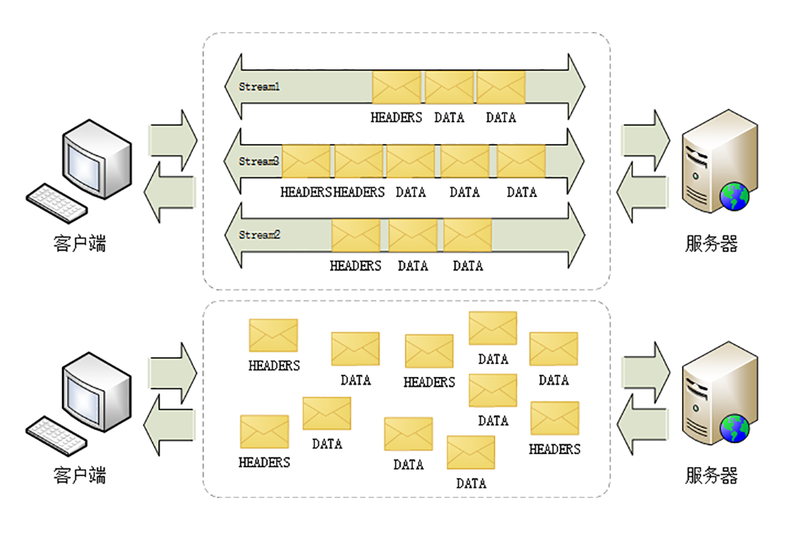

# 01 | 时代之风：HTTP/2 特性概览

在 [HTTP有哪些优点？又有哪些缺点？](../03/07.md) 中，我们看到 HTTP 有两个主要的缺点：**安全不足和性能不高**

刚结束的安全篇里的 HTTPS，通过引入 SSL/TLS 在安全上达到了「极致」，但在性能提升方面却是乏善可陈，只优化了握手加密的环节，对于整体的数据传输没有提出更好的改进方案，还只能依赖于「长连接」这种「落后」的技术

所以，在 HTTPS 逐渐成熟之后，HTTP 就向着性能方面开始发力，走出了另一条进化的道路。

在 HTTP 历史中你也看到了，「秦失其鹿，天下共逐之」，Google 率先发明了 SPDY 协议，并应用于自家的浏览器 Chrome，打响了 HTTP 性能优化的「第一枪」

随后互联网标准化组织 IETF 以 SPDY 为基础，综合其他多方的意见，终于推出了 HTTP/1 的继任者，也就是今天的主角 `HTTP/2` ，在性能方面有了一个大的飞跃。

## 为什么不是 HTTP/2.0

你一定很想知道，为什么 HTTP/2 不像之前的 `1.0`、`1.1` 那样叫 `2.0` 呢？

这个也是很多初次接触 HTTP/2 的人问的最多的一个问题，对此 HTTP/2 工作组特别给出了解释。

他们认为以前的 `1.0`、`1.1` 造成了很多的混乱和误解，让人在实际的使用中难以区分差异，所以就决定 HTTP 协议不再使用小版本号（minor version），只使用大版本号（major version），从今往后 HTTP 协议不会出现 HTTP/2.0、2.1，只会有 `HTTP/2`、`HTTP/3` ……

这样就可以明确无误地辨别出协议版本的「跃进程度」，让协议在一段较长的时期内保持稳定，每当发布新版本的 HTTP 协议都会有本质的不同，绝不会有零敲碎打的小改良。

## 兼容 HTTP/1

由于 HTTPS 已经在安全方面做的非常好了，所以 HTTP/2 的唯一目标就是改进性能。

但它不仅背负着众多的期待，同时还背负着 HTTP/1 庞大的历史包袱，所以协议的修改必须小心谨慎，兼容性是首要考虑的目标，否则就会破坏互联网上无数现有的资产，这方面 TLS 已经有了先例（为了兼容 TLS1.2 不得不进行伪装）。

那么，HTTP/2 是怎么做的呢？

因为必须要保持功能上的兼容，所以 HTTP/2 把 HTTP 分解成了 **语义** 和 **语法** 两个部分，语义层不做改动，与 HTTP/1 完全一致（即 RFC7231）。比如请求方法、URI、状态码、头字段等概念都保留不变，这样就消除了再学习的成本，基于 HTTP 的上层应用也不需要做任何修改，可以无缝转换到 HTTP/2。

特别要说的是，与 HTTPS 不同，HTTP/2 没有在 URI 里引入新的协议名，仍然用 `http` 表示明文协议，用 `https` 表示加密协议。

这是一个非常了不起的决定，可以让浏览器或者服务器去自动升级或降级协议，免去了选择的麻烦，让用户在上网的时候都意识不到协议的切换，实现平滑过渡。

在语义保持稳定之后，HTTP/2 在语法层做了天翻地覆的改造，**完全变更了 HTTP 报文的传输格式**

## 头部压缩

首先，HTTP/2 对报文的头部做了一个大手术。

通过进阶篇的学习你应该知道，HTTP/1 里可以用头字段 `Content-Encoding` 指定 Body 的编码方式，比如用 gzip 压缩来节约带宽，但报文的另一个组成部分—— **Header 却被无视了，没有针对它的优化手段** 。

由于报文 Header 一般会携带 `User Agent`、`Cookie`、`Accept`、`Server` 等许多固定的头字段，多达几百字节甚至上千字节，但 Body 却经常只有几十字节（比如 GET 请求、204/301/304 响应），成了不折不扣的大头儿子。更要命的是，成千上万的请求响应报文里有很多字段值都是重复的，非常浪费，长尾效应导致大量带宽消耗在了这些冗余度极高的数据上。

所以，HTTP/2 把 **头部压缩** 作为性能改进的一个重点，优化的方式你也肯定能想到，还是 **压缩** 。

不过 HTTP/2 并没有使用传统的压缩算法，而是开发了专门的 **HPACK** 算法，在客户端和服务器两端建立「字典」，用索引号表示重复的字符串，还釆用哈夫曼编码来压缩整数和字符串，可以达到 50%~90% 的高压缩率。

## 二进制格式

你可能已经很习惯于 HTTP/1 里纯文本形式的报文了，它的优点是 **一目了然** ，用最简单的工具就可以开发调试，非常方便。

但 HTTP/2 在这方面没有妥协，决定改变延续了十多年的现状，不再使用肉眼可见的 ASCII 码，而是向下层的 TCP/IP 协议靠拢，全面采用二进制格式。

这样虽然对人不友好，但却大大方便了计算机的解析。原来使用纯文本的时候容易出现多义性，比如大小写、空白字符、回车换行、多字少字等等，程序在处理时必须用复杂的状态机，效率低，还麻烦。

而二进制里只有 0 和 1 ，可以严格规定字段大小、顺序、标志位等格式，对就是对，错就是错，解析起来没有歧义，实现简单，而且体积小、速度快，做到内部提效。

以二进制格式为基础，HTTP/2 就开始了大刀阔斧的改革。

它把 TCP 协议的部分特性挪到了应用层，把原来的 `Header+Body` 的消息打散为数个小片的 **二进制「帧」**（Frame），用 `HEADERS` 帧存放头数据、`DATA` 帧存放实体数据。

这种做法有点像是 `Chunked` 分块编码的方式（参见 [把大象装进冰箱：HTTP 传输大文件的方法](../04/01.md)），也是化整为零的思路，但 HTTP/2 数据分帧后 `Header+Body` 的报文结构就完全消失了，协议看到的只是一个个的碎片。


## 虚拟的「流」

消息的「碎片」到达目的地后应该怎么组装起来呢？

HTTP/2 为此定义了一个 **流**（Stream）的概念，**它是二进制帧的双向传输序列** ，同一个消息往返的帧会分配一个唯一的流 ID。你可以想象把它成是一个虚拟的「数据流」，在里面流动的是一串有先后顺序的数据帧，这些数据帧按照次序组装起来就是 HTTP/1 里的请求报文和响应报文。

因为流是虚拟的，实际上并不存在，所以 HTTP/2 就可以在一个 TCP 连接上用 **流** 同时发送多个「碎片化」的消息，这就是常说的 **多路复用**（ Multiplexing）——多个往返通信都复用一个连接来处理。

在流的层面上看，消息是一些有序的帧序列，而在连接的层面上看，消息却是乱序收发的帧。多个请求 / 响应之间没有了顺序关系，不需要排队等待，也就不会再出现队头阻塞问题，降低了延迟，大幅度提高了连接的利用率。



为了更好地利用连接，加大吞吐量，HTTP/2 还添加了一些控制帧来管理虚拟的流，实现了优先级和流量控制，这些特性也和 TCP 协议非常相似。

HTTP/2 还在一定程度上改变了传统的请求 - 应答工作模式，服务器不再是完全被动地响应请求，也可以新建流主动向客户端发送消息。比如，在浏览器刚请求 HTML 的时候就提前把可能会用到的 JS、CSS 文件发给客户端，减少等待的延迟，这被称为 **服务器推送**（Server Push，也叫 Cache Push）。

## 强化安全

出于兼容的考虑，HTTP/2 延续了 HTTP/1 的明文特点，可以像以前一样使用明文传输数据，不强制使用加密通信，不过格式还是二进制，只是不需要解密。

但由于 HTTPS 已经是大势所趋，而且主流的浏览器 Chrome、Firefox 等都公开宣布只支持加密的 HTTP/2，所以事实上的 HTTP/2 是加密的。也就是说，互联网上通常所能见到的 HTTP/2 都是使用 `https` 协议名，跑在 TLS 上面。

为了区分加密和明文这两个不同的版本，HTTP/2 协议定义了两个字符串标识符：`h2` 表示加密的 HTTP/2，`h2c` 表示明文的 HTTP/2，多出的那个字母 `c` 的意思是 `clear text` 。

在 HTTP/2 标准制定的时候（2015 年）已经发现了很多 SSL/TLS 的弱点，而新的 TLS1.3 还未发布，所以加密版本的 HTTP/2 在安全方面做了强化，要求下层的通信协议必须是 TLS1.2 以上，还要支持前向安全和 SNI，并且把几百个弱密码套件列入了黑名单，比如 DES、RC4、CBC、SHA-1 都不能在 HTTP/2 里使用，相当于底层用的是 `TLS1.25` 。

## 协议栈

下面的这张图对比了 HTTP/1、HTTPS 和 HTTP/2 的协议栈，你可以清晰地看到，HTTP/2 是建立在 `HPack`、`Stream`、`TLS1.2` 基础之上的，比 HTTP/1、HTTPS 复杂了一些。


虽然 HTTP/2 的底层实现很复杂，但它的语义还是简单的 HTTP/1，之前学习的知识不会过时，仍然能够用得上。

我们的实验环境在新的域名 `www.metroid.net` 上启用了 HTTP/2 协议，你可以把之前进阶篇、安全篇的测试用例都走一遍，再用 Wireshark 抓一下包，实际看看 HTTP/2 的效果和对老协议的兼容性（例如 `http://www.metroid.net/11-1` ）。

来看下 http2 是如何配置的

```lua
# Copyright (C) 2019 by chrono

# http www.metroid.net
# redirect to https
server {
    listen 80;
    listen 8080;
    server_name  www.metroid.net;

    #rewrite ^ https://$host:8443$request_uri permanent;
    return 301 https://$host:8443$request_uri;

    #location / {
    #    rewrite ^(.*)$ https://$host$1 permanent;
    #}
}

# http2 www.metroid.net
server {
    listen 443 ssl;
    listen 8443 ssl http2; # 可以看到，只是在这里使用两天 http2 其他的还是一样

    server_name  www.metroid.net;
    #server_name  *.*;

    access_log  logs/http2_access.log
                main buffer=2k flush=1s;

    allow 127.0.0.1;
    deny all;

    default_type text/html;

    # rsa2048 cert
    ssl_certificate             ssl/metroid.crt;
    ssl_certificate_key         ssl/metroid.key;

    # ecdsa p-256 cert
    ssl_certificate             ssl/metroid_ecc.crt;
    ssl_certificate_key         ssl/metroid_ecc.key;

    ssl_session_timeout         1m;

    ssl_session_tickets         off;
    #ssl_session_ticket_key      ssl/ticket.key;

    ssl_prefer_server_ciphers   on;
    ssl_protocols TLSv1.2 TLSv1.3;

    include http/servers/locations.inc;

    # redirect to 8443
    if ($server_port != 8443) {
        return 301 https://$host:8443$request_uri;
    }

    location / {
        #return 200 "hello world by http2";

        root   html;
        index  index.html index.htm;
    }
}


```

在今天这节课专用的 URI `/30-1` 里，你还可以看到服务器输出了 HTTP 的版本号 `2` 和标识符 `h2` ，表示这是加密的 HTTP/2，如果改用 `https://www.chrono.com/30-1` 访问就会是 `1.1` 和空。

```
https://www.metroid.net:8443/30-1
https://www.chrono.com/30-1
```


你可能还会注意到 URI 里的一个小变化，端口使用的是 `8443` 而不是  `443` 。这是因为 443 端口已经被 `www.chrono.com` 的 HTTPS 协议占用，Nginx 不允许在同一个端口上根据域名选择性开启 HTTP/2，所以就不得不改用了 `8443` 。

## 小结

今天我简略介绍了 HTTP/2 的一些重要特性，比较偏重理论，下一次我会用 Wireshark 抓包，具体讲解 HTTP/2 的头部压缩、二进制帧和流等特性。

1. HTTP 协议取消了小版本号，所以 HTTP/2 的正式名字不是 2.0；
2. HTTP/2 在语义上兼容 HTTP/1，保留了请求方法、URI 等传统概念；
3. HTTP/2 使用 `HPACK` 算法压缩头部信息，消除冗余数据节约带宽；
4. HTTP/2 的消息不再是 `Header+Body` 的形式，而是分散为多个二进制帧；
5. HTTP/2 使用虚拟的流传输消息，解决了困扰多年的队头阻塞问题，同时实现了多路复用，提高连接的利用率；
6. HTTP/2 也增强了安全性，要求至少是 TLS1.2，而且禁用了很多不安全的密码套件。

## 课下作业

1. 你觉得明文形式的 HTTP/2（h2c）有什么好处，应该如何使用呢？

   笔者：感觉没有太大好处吧，header 和 body 都序列化成 byte 了

2. 你觉得应该怎样理解 HTTP/2 里的流，为什么它是虚拟的？

   笔者：header 和 body 都用 Frame 封装投递，同一个消息使用逻辑 id 来区分，按照 id 聚合出一个消息，那么就可以乱序发送，笔者想不明白的是，接收方如何接受呢？需要等待吗？乱序？

3. 你能对比一下 HTTP/2 与 HTTP/1、HTTPS 的相同点和不同点吗？

   在语义上是相同的，报文格式发生了变化、请求头也可以被压缩、服务器还可以主动推送

## 拓展阅读

- 在早期还有一个 `HTTP-NG` (HttpNext Generation) 项目，最终失败了

- HTTP/2 的前身 SPDY 在压缩头部时使用了 gzip，但发现会受到 CRME 攻击，所以开发了专用的压缩算法 HPACK

- HTTP/2 里的流可以实现 HTTP/1 里的管道（pipeline）功能，而且综合性能更好，所以「管道」在 HTTP/2 里就被废弃了

- 如果你写过 Linux 程序，用过 epol，就应该知道 epo 也是一种多路复用，不过它是 `I/O Multiplexing`

- HTTP/2 要求必须实现的密码套件是 `TLS_ECDHE_RSA_WITH_AES_128_GCM_SHA256` ，比 TLS12 默认的 `TLS_RSA_WITH_AES_128_CBC_SHA` 的安全强度高了很多

- 实验环境的 `www.metroid.net` 启用了 RSA 和 ECC 双证书，在浏览器里可以看到实际连接时用的会是 ECC 书。另外，这个域名还用到了重定向跳转技术，使用 301 跳转，把 `80/443` 端口的请求重定向到 HTTP/2 的 8443

  ```lua
  server {
      listen 443 ssl;
      listen 8443 ssl http2;
      
      # redirect to 8443
      if ($server_port != 8443) {
          return 301 https://$host:8443$request_uri;
      }
  ```

  