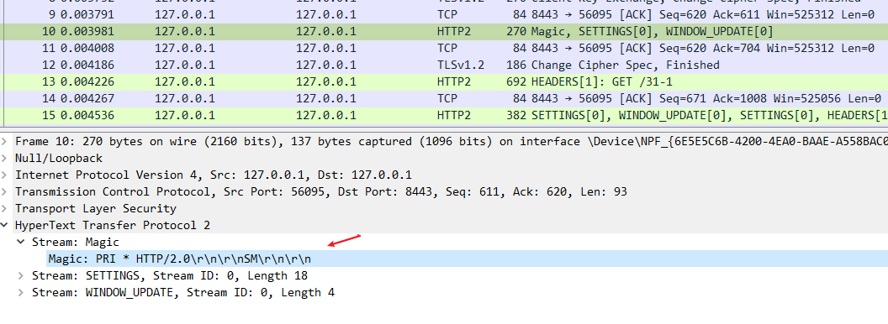
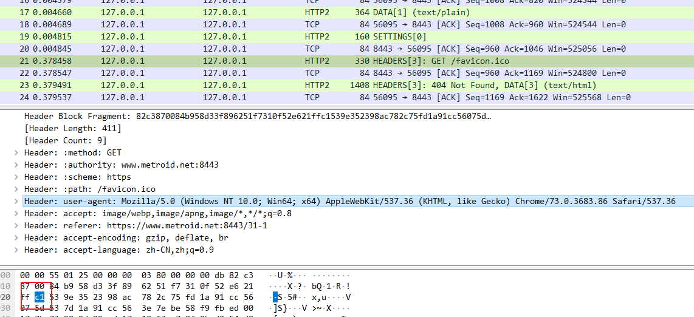
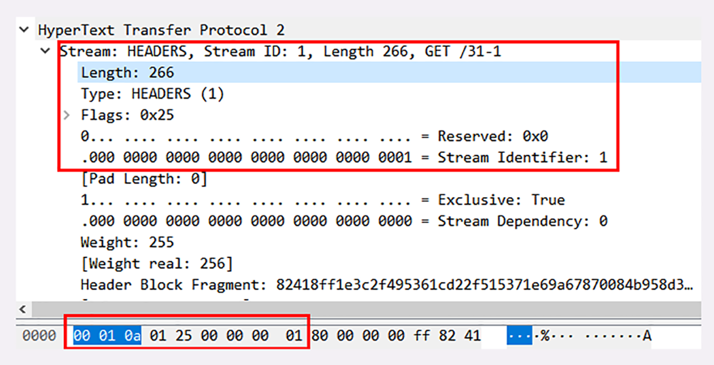
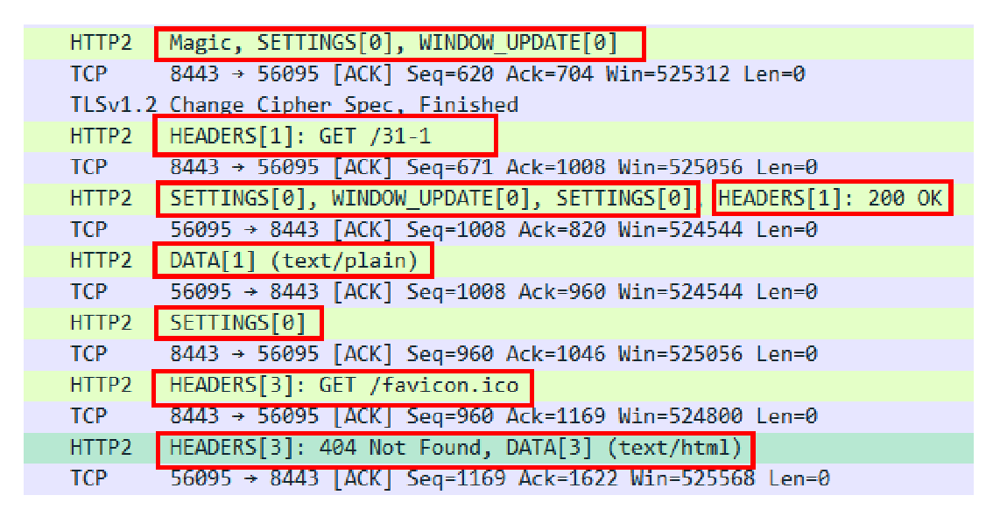
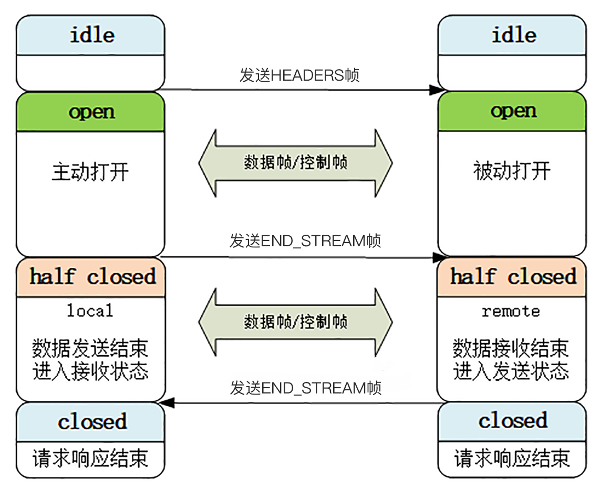

# 02 | 时代之风：HTTP/2 内核剖析

今天我们继续上一讲的话题，深入 HTTP/2 协议的内部，看看它的实现细节。


这次实验环境的 URI 是 `https://www.metroid.net:8443/31-1` ，我用 Wireshark 把请求响应的过程抓包存了下来，文件放在 GitHub 的 `wireshark` 目录。今天我们就对照着抓包来实地讲解 HTTP/2 的头部压缩、二进制帧等特性。

::: tip

上面的链接访问异常，并且配置的 SSLKEYLOGFILE 导入后也不怎么生效，不知道是啥原因

但是配配套的抓包日志中的 log 是有效果的，也就是上图绿色背景的是导入日志后出现的

:::

## 连接前言

由于 HTTP/2 事实上是基于 TLS，所以在正式收发数据之前，会有 TCP 握手和 TLS 握手，这两个步骤相信你一定已经很熟悉了，所以这里就略过去不再细说。

TLS 握手成功之后，客户端必须要发送一个 **连接前言**（connection preface），用来确认建立 HTTP/2 连接。

这个连接前言是标准的 HTTP/1 请求报文，使用纯文本的 ASCII 码格式，请求方法是特别注册的一个关键字 `PRI` ，全文只有 24 个字节：

```
PRI * HTTP/2.0\r\n\r\nSM\r\n\r\n
```

在 Wireshark 里，HTTP/2 的“连接前言”被称为 **Magic**，意思就是不可知的魔法。

所以，就不要问为什么会是这样了，只要服务器收到这个有魔力的字符串，就知道客户端在 TLS 上想要的是 HTTP/2 协议，而不是其他别的协议，后面就会都使用 HTTP/2 的数据格式。



## 头部压缩

确立了连接之后，HTTP/2 就开始准备请求报文。

因为语义上它与 HTTP/1 兼容，所以报文还是由 `Header+Body` 构成的，但在请求发送前，必须要用 **HPACK** 算法来压缩头部数据。

`HPACK` 算法是专门为压缩 HTTP 头部定制的算法，与 gzip、zlib 等压缩算法不同，它是一个有状态的算法，需要客户端和服务器各自维护一份索引表，也可以说是字典（这有点类似 brotli），压缩和解压缩就是查表和更新表的操作。

为了方便管理和压缩，HTTP/2 废除了原有的起始行概念，把起始行里面的请求方法、URI、状态码等统一转换成了头字段的形式，并且给这些“不是头字段的头字段起了个特别的名字—— **伪头字段** （pseudo-header fields）。而起始行里的版本号和错误原因短语因为没什么大用，顺便也给废除了。

为了与真头字段区分开来，这些伪头字段会在名字前加一个 `:` ，比如 `:authority`、`:method`、 `:status`，分别表示的是域名、请求方法和状态码。

现在 HTTP 报文头就简单了，全都是 `Key-Value` 形式的字段，于是 HTTP/2 就为一些最常用的头字段定义了一个只读的 **静态表**（Static Table）。

下面的这个表格列出了静态表的一部分，这样只要查表就可以知道字段名和对应的值，比如数字 `2` 代表 `GET` ，数字 `8` 代表状态码 200。


像请求方法，在里面只占用一位


但如果表里只有 Key 没有 Value，或者是自定义字段根本找不到该怎么办呢？

这就要用到 **动态表**（Dynamic Table），它添加在静态表后面，结构相同，但会在编码解码的时候随时更新。

比如说，第一次发送请求时的 `user-agent` 字段长是一百多个字节，用哈夫曼压缩编码发送之后，客户端和服务器都更新自己的动态表，添加一个新的索引号 `65` 。那么下一次发送的时候就不用再重复发那么多字节了，只要用一个字节发送编号就好。




在第二次请求的时候，的确是缓存起来了。

你可以想象得出来，随着在 HTTP/2 连接上发送的报文越来越多，两边的字典也会越来越丰富，最终每次的头部字段都会变成一两个字节的代码，原来上千字节的头用几十个字节就可以表示了，压缩效果比 gzip 要好得多。

## 二进制帧

头部数据压缩之后，HTTP/2 就要把报文拆成二进制的帧准备发送。

HTTP/2 的帧结构有点类似 TCP 的段或者 TLS 里的记录，但报头很小，只有 9 字节，非常地节省（可以对比一下 TCP 头，它最少是 20 个字节）。

二进制的格式也保证了不会有歧义，而且使用位运算能够非常简单高效地解析。


帧开头是 3 个字节的 **长度**（但不包括头的 9 个字节），默认上限是 2^14，最大是 2^24，也就是说 HTTP/2 的帧通常不超过 16K，最大是 16M。

长度后面的一个字节是 **帧类型** ，大致可以分成 **数据帧** 和 **控制帧** 两类，HEADERS 帧和 DATA 帧属于数据帧，存放的是 HTTP 报文，而 SETTINGS、PING、PRIORITY 等则是用来管理流的控制帧。

HTTP/2 总共定义了 10 种类型的帧，但一个字节可以表示最多 256 种，所以也允许在标准之外定义其他类型实现功能扩展。这就有点像 TLS 里扩展协议的意思了，比如 Google 的 gRPC 就利用了这个特点，定义了几种自用的新帧类型。

第 5 个字节是非常重要的 **帧标志** 信息，可以保存 8 个标志位，携带简单的控制信息。常用的标志位有 **END_HEADERS** 表示头数据结束，相当于 HTTP/1 里头后的空行（`\r\n`），**END_STREAM** 表示单方向数据发送结束（即 EOS，End of Stream），相当于 HTTP/1 里 Chunked 分块结束标志（ `0\r\n\r\n` ）。

报文头里最后 4 个字节是 **流标识符** ，也就是帧所属的 `流` ，接收方使用它就可以从乱序的帧里识别出具有相同流 ID 的帧序列，按顺序组装起来就实现了虚拟的“流”。

流标识符虽然有 4 个字节，但最高位被保留不用，所以只有 31 位可以使用，也就是说，流标识符的上限是 2^31，大约是 21 亿。

好了，把二进制头理清楚后，我们来看一下 Wireshark 抓包的帧实例：



在这个帧里，开头的三个字节是 `00010a` ，表示数据长度是 266 字节。

帧类型是 1，表示 HEADERS 帧，负载（payload）里面存放的是被 HPACK 算法压缩的头部信息。

标志位是 0x25，转换成二进制有 3 个位被设置为 1。PRIORITY 表示设置了流的优先级，END_HEADERS 表示这一个帧就是完整的头数据，END_STREAM 表示单方向数据发送结束，后续再不会有数据帧（即请求报文完毕，不会再有 DATA 帧 /Body 数据）。


最后 4 个字节的流标识符是整数 1，表示这是客户端发起的第一个流，后面的响应数据帧也会是这个 ID，也就是说在 stream[1] 里完成这个请求响应。

## 流与多路复用

弄清楚了帧结构后我们就来看 HTTP/2 的流与多路复用，它是 HTTP/2 最核心的部分。

在上一讲里我简单介绍了流的概念，不知道你“悟”得怎么样了？这里我再重复一遍：**流是二进制帧的双向传输序列**。

要搞明白流，关键是要理解帧头里的流 ID。

在 HTTP/2 连接上，虽然帧是乱序收发的，但只要它们都拥有相同的流 ID，就都属于一个流，而且在这个流里帧不是无序的，而是有着严格的先后顺序。

比如在这次的 Wireshark 抓包里，就有 `0、1、3` 一共三个流，实际上就是分配了三个流 ID 号，把这些帧按编号分组，再排一下队，就成了流。



可以看到，笔者感觉上，从这里看来，直接就是发的帧，感觉像是每一次会传输一批帧，类似与短时间的刷新缓冲区一样

在概念上，一个 HTTP/2 的流就等同于一个 HTTP/1 里的 `请求 - 应答` 。在 HTTP/1 里一个请求 - 响应报文来回是一次 HTTP 通信，在 HTTP/2 里一个流也承载了相同的功能。

你还可以对照着 TCP 来理解。TCP 运行在 IP 之上，其实从 MAC 层、IP 层的角度来看，TCP 的连接概念也是虚拟的。但从功能上看，无论是 HTTP/2 的流，还是 TCP 的连接，都是实际存在的，所以你以后大可不必再纠结于流的“虚拟”性，把它当做是一个真实存在的实体来理解就好。

HTTP/2 的流有哪些特点呢？我给你简单列了一下：

1. 流是可并发的，一个 HTTP/2 连接上可以同时发出多个流传输数据，也就是并发多请求，实现多路复用；
2. 客户端和服务器都可以创建流，双方互不干扰；
3. 流是双向的，一个流里面客户端和服务器都可以发送或接收数据帧，也就是一个请求 - 应答来回；
4. 流之间没有固定关系，彼此独立，但流内部的帧是有严格顺序的；
5. 流可以设置优先级，让服务器优先处理，比如先传 HTML/CSS，后传图片，优化用户体验；
6. 流 ID 不能重用，只能顺序递增，客户端发起的 ID 是奇数，服务器端发起的 ID 是偶数；
7. 在流上发送 RST_STREAM 帧可以随时终止流，取消接收或发送；
8. 第 0 号流比较特殊，不能关闭，也不能发送数据帧，只能发送控制帧，用于流量控制。

这里我又画了一张图，把上次的图略改了一下，显示了连接中无序的帧是如何依据流 ID 重组成流的。


从这些特性中，我们还可以推理出一些深层次的知识点。

比如说，HTTP/2 在一个连接上使用多个流收发数据，那么它本身默认就会是长连接，所以永远不需要“Connection”头字段（keepalive 或 close）。

你可以再看一下 Wireshark 的抓包，里面发送了两个请求 `/31-1` 和 `favicon.ico` ，始终用的是 `56095<->8443` 这个连接，对比一下  [键入网址再按下回车，后面究竟发生了什么？](../03/01.md) ，你就能够看出差异了。

又比如，下载大文件的时候想取消接收，在 HTTP/1 里只能断开 TCP 连接重新 **三次握手** ，成本很高，而在 HTTP/2 里就可以简单地发送一个 `RST_STREAM` 中断流，而长连接会继续保持。

再比如，因为客户端和服务器两端都可以创建流，而流 ID 有奇数偶数和上限的区分，所以大多数的流 ID 都会是奇数，而且客户端在一个连接里最多只能发出 2^30，也就是 10 亿个请求。

所以就要问了：ID 用完了该怎么办呢？这个时候可以再发一个控制帧 `GOAWAY` ，真正关闭 TCP 连接。

## 流状态转换

流很重要，也很复杂。为了更好地描述运行机制，HTTP/2 借鉴了 TCP，根据帧的标志位实现流状态转换。当然，这些状态也是虚拟的，只是为了辅助理解。

HTTP/2 的流也有一个状态转换图，虽然比 TCP 要简单一点，但也不那么好懂，所以今天我只画了一个简化的图，对应到一个标准的 HTTP 请求 - 应答。



最开始的时候流都是 **空闲**（idle）状态，也就是「不存在」，可以理解成是待分配的号段资源。

当客户端发送 HEADERS 帧后，有了流 ID，流就进入了 **打开** 状态，两端都可以收发数据，然后客户端发送一个带 `END_STREAM` 标志位的帧，流就进入了 **半关闭** 状态。

这个 **半关闭** 状态很重要，意味着客户端的请求数据已经发送完了，需要接受响应数据，而服务器端也知道请求数据接收完毕，之后就要内部处理，再发送响应数据。

响应数据发完了之后，也要带上 `END_STREAM` 标志位，表示数据发送完毕，这样流两端就都进入了 **关闭** 状态，流就结束了。

刚才也说过，流 ID 不能重用，所以流的生命周期就是 HTTP/1 里的一次完整的请求 - 应答，流关闭就是一次通信结束。

下一次再发请求就要开一个新流（而不是新连接），流 ID 不断增加，直到到达上限，发送 `GOAWAY` 帧开一个新的 TCP 连接，流 ID 就又可以重头计数。

你再看看这张图，是不是和 HTTP/1 里的标准请求 - 应答过程很像，只不过这是发生在虚拟的流上，而不是实际的 TCP 连接，又因为流可以并发，所以 HTTP/2 就可以实现无阻塞的多路复用。

## 小结

HTTP/2 的内容实在是太多了，为了方便学习，我砍掉了一些特性，比如流的优先级、依赖关系、流量控制等。

但只要你掌握了今天的这些内容，以后再看 RFC 文档都不会有难度了。

1. HTTP/2 必须先发送一个连接前言字符串，然后才能建立正式连接；
2. HTTP/2 废除了起始行，统一使用头字段，在两端维护字段 `Key-Value` 的索引表，使用 `HPACK` 算法压缩头部；
3. HTTP/2 把报文切分为多种类型的二进制帧，报头里最重要的字段是流标识符，标记帧属于哪个流；
4. 流是 HTTP/2 虚拟的概念，是帧的双向传输序列，相当于 HTTP/1 里的一次请求 - 应答；
5. 在一个 HTTP/2 连接上可以并发多个流，也就是多个“请求 - 响应”报文，这就是多路复用。

## 课下作业

1. HTTP/2 的动态表维护、流状态转换很复杂，你认为 HTTP/2 还是「无状态」的吗？

   还是无状态，流状态只是表示流是否建立，单次请求响应的状态。并非会话级的状态保持

2. HTTP/2 的帧最大可以达到 16M，你觉得大帧好还是小帧好？

   小帧好，少量多次，万一拥堵重复的的少。假设大帧好，只要分流不用分帧了。

3. 结合这两讲，谈谈 HTTP/2 是如何解决队头阻塞问题的。

   每一个请求响应都是一个流，流和流之间可以并行，流内的帧还是有序串行

## 拓展阅读

- 你一定很好奇 HTTP/2 连接前言的来历吧，其实把里面的字符串连起来就是 `PRSM`，也就是 2013 年斯诺登爆岀的棱镜计划。

- 在 HTTP/1 里头字段是不区分大小写的，这在实践中造成了一些混乱，写法很随意，所以 HTTP/2 做出了明确的规定，要求所有的头字段必须全小写，大写会认为是格式错误。

- HPACK 的编码规则比较复杂，使用了一些特殊的标志位，所以在 Wireshark 抓包里不会直接看到字段的索引号，需要按照规则解码。

- HEADERS 帧后还可以接特殊的「CONTINUATION」帧，发送特别大的头，最后一个「CONTNUATION」需要设置标志位 `END HEADERS` 表示头结束。

- 服务器端发起推送流需要使用 `PUSH_PROMSE` 帧，状态转换与客户端流基本类似，只是方向不同。

- 在 RST_STREAM 和 GOAWAY 帧里可以携带 32 位的错误代码，表示终止流的原因，它是真正的「错误」，与状态码的含义是不同的。

- 服务端是不是要为每一个客户端都单独维护一份索引表？连接的客户端多了的话内存不就 OOM 了

  是的，不过动态表也有淘汰机制，服务器可以自己定制策略，不会过度占用内存。