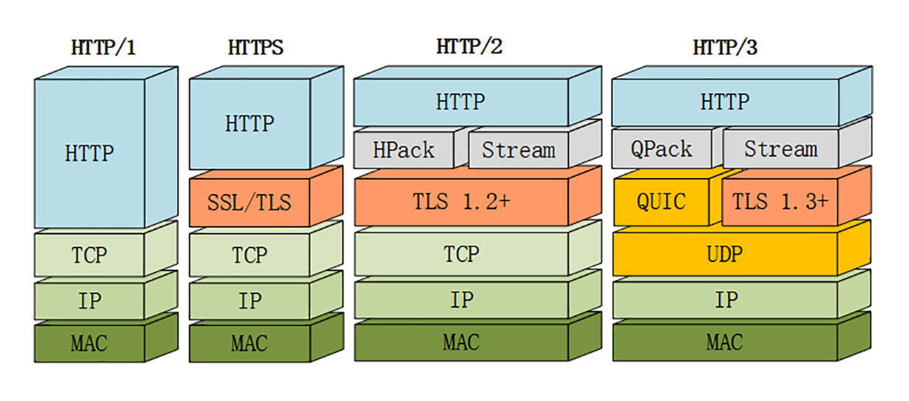
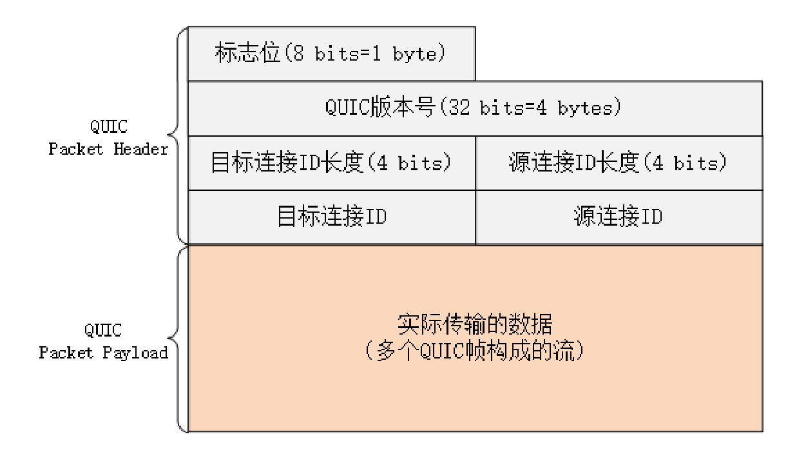
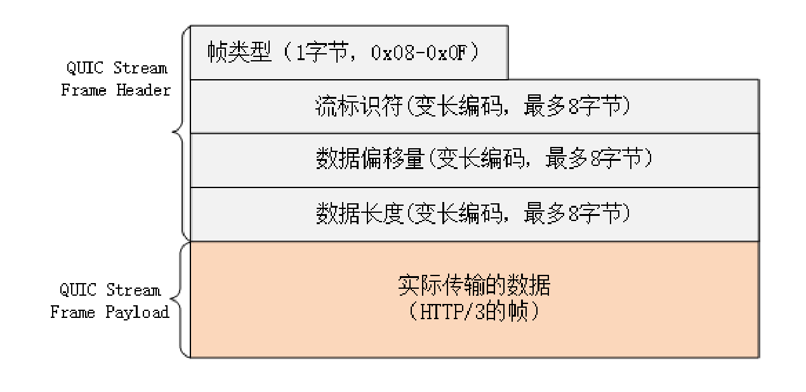

# 03 | 未来之路：HTTP/3 展望

在前面的两讲里，我们一起学习了 HTTP/2，你也应该看到了 HTTP/2 做出的许多努力，比如头部压缩、二进制分帧、虚拟的流与多路复用，性能方面比 HTTP/1 有了很大的提升，基本上解决了队头阻塞这个老大难问题。

## HTTP/2 的队头阻塞

等等，你可能要发出疑问了：为什么说是 **基本上** ，而不是完全解决了呢？

这是因为 HTTP/2 虽然使用帧、流、多路复用，没有了队头阻塞，**但这些手段都是在应用层里** ，而在下层，也就是 TCP 协议里，还是会发生队头阻塞。

这是怎么回事呢？

让我们从协议栈的角度来仔细看一下。在 HTTP/2 把多个请求 - 响应分解成流，交给 TCP 后，TCP 会再拆成更小的包依次发送（其实在 TCP 里应该叫 segment，也就是段）。

在网络良好的情况下，包可以很快送达目的地。但如果网络质量比较差，像手机上网的时候，就有可能会丢包。而 TCP 为了保证可靠传输，有个特别的 **丢包重传** 机制，丢失的包必须要等待重新传输确认，其他的包即使已经收到了，也只能放在缓冲区里，上层的应用拿不出来，只能干着急。

我举个简单的例子：

客户端用 TCP 发送了三个包，但服务器所在的操作系统只收到了后两个包，第一个包丢了。那么内核里的 TCP 协议栈就只能把已经收到的包暂存起来，**停下等着客户端重传那个丢失的包，这样就又出现了队头阻塞** 。

由于这种队头阻塞是 TCP 协议固有的，所以 HTTP/2 即使设计出再多的花样也无法解决。

Google 在推 SPDY 的时候就已经意识到了这个问题，于是就又发明了一个新的 `QUIC` 协议，让 HTTP 跑在 QUIC 上而不是 TCP 上。

而这个 `HTTP over QUIC` 就是 HTTP 协议的下一个大版本，**HTTP/3** 。它在 HTTP/2 的基础上又实现了质的飞跃，真正完美地解决了队头阻塞问题。

不过 HTTP/3 目前还处于草案阶段，正式发布前可能会有变动，所以今天我尽量不谈那些不稳定的细节。

这里先贴一下 HTTP/3 的协议栈图，让你对它有个大概的了解。

## QUIC 协议

从这张图里，你可以看到 HTTP/3 有一个关键的改变，那就是它把下层的 TCP 抽掉了，换成了 UDP。**因为 UDP 是无序的，包之间没有依赖关系** ，所以就从根本上解决了队头阻塞。

你一定知道，UDP 是一个简单、不可靠的传输协议，只是对 IP 协议的一层很薄的包装，和 TCP 相比，它实际应用的较少。

不过正是因为它简单，不需要建连和断连，通信成本低，也就非常灵活、高效，可塑性很强。

所以，QUIC 就选定了 UDP，在它之上把 TCP 的那一套连接管理、拥塞窗口、流量控制等搬了过来，去其糟粕，取其精华，打造出了一个全新的可靠传输协议，可以认为是 **新时代的 TCP** 。

QUIC 最早是由 Google 发明的，被称为 gQUIC。而当前正在由 IETF 标准化的 QUIC 被称为 iQUIC。两者的差异非常大，甚至比当年的 SPDY 与 HTTP/2 的差异还要大。

gQUIC 混合了 UDP、TLS、HTTP，是一个应用层的协议。而 IETF 则对 gQUIC 做了清理，把应用部分分离出来，形成了 HTTP/3，原来的 UDP 部分下放到了传输层，所以 iQUIC 有时候也叫 `QUIC-transport` 。

接下来要说的 QUIC 都是指 iQUIC，要记住，它与早期的 gQUIC 不同，是一个传输层的协议，和 TCP 是平级的。

## QUIC 的特点

QUIC 基于 UDP，而 UDP 是无连接的，根本就不需要握手和挥手，所以天生就要比 TCP 快。

就像 TCP 在 IP 的基础上实现了可靠传输一样，QUIC 也基于 UDP 实现了可靠传输，保证数据一定能够抵达目的地。它还引入了类似 HTTP/2 的流和多路复用，单个流是有序的，可能会因为丢包而阻塞，但其他流不会受到影响。

为了防止网络上的中间设备（Middle Box）识别协议的细节，QUIC 全面采用加密通信，可以很好地抵御窜改和协议僵化（ossification）。

而且，因为 TLS1.3 已经在去年（2018）正式发布，所以 QUIC 就直接应用了 TLS1.3，顺便也就获得了 0-RTT、1-RTT 连接的好处。

但 QUIC 并不是建立在 TLS 之上，而是内部“包含”了 TLS。它使用自己的帧接管了 TLS 里的记录，握手消息、警报消息都不使用 TLS 记录，直接封装成 QUIC 的帧发送，省掉了一次开销。

## QUIC 内部细节

由于 QUIC 在协议栈里比较偏底层，所以我只简略介绍两个内部的关键知识点。

QUIC 的基本数据传输单位是 **包**（packet）和 **帧**（frame），一个包由多个帧组成，包面向的是 **连接** ，帧面向的是 **流** 。

QUIC 使用不透明的 **连接 ID** 来标记通信的两个端点，客户端和服务器可以自行选择一组 ID 来标记自己，这样就解除了 TCP 里连接对 `IP 地址 + 端口`（即常说的四元组）的强绑定，支持 **连接迁移**（Connection Migration）。

比如你下班回家，手机会自动由 4G 切换到 WiFi。这时 IP 地址会发生变化，TCP 就必须重新建立连接。而 QUIC 连接里的两端连接 ID 不会变，所以连接在“逻辑上”没有中断，它就可以在新的 IP 地址上继续使用之前的连接，消除重连的成本，实现连接的无缝迁移。

QUIC 的帧里有多种类型，PING、ACK 等帧用于管理连接，而 STREAM 帧专门用来实现流。

QUIC 里的流与 HTTP/2 的流非常相似，也是帧的序列，你可以对比着来理解。但 HTTP/2 里的流都是双向的，而 QUIC 则分为双向流和单向流。

QUIC 帧普遍采用变长编码，最少只要 1 个字节，最多有 8 个字节。流 ID 的最大可用位数是 62，数量上比 HTTP/2 的 2^31 大大增加。

流 ID 还保留了最低两位用作标志，第 1 位标记流的发起者，0 表示客户端，1 表示服务器；第 2 位标记流的方向，0 表示双向流，1 表示单向流。

所以 QUIC 流 ID 的奇偶性质和 HTTP/2 刚好相反，客户端的 ID 是偶数，从 0 开始计数。

## HTTP/3 协议

了解了 QUIC 之后，再来看 HTTP/3 就容易多了。

因为 QUIC 本身就已经支持了加密、流和多路复用，所以 HTTP/3 的工作减轻了很多，把流控制都交给 QUIC 去做。调用的不再是 TLS 的安全接口，也不是 Socket API，而是专门的 QUIC 函数。不过这个“QUIC 函数”还没有形成标准，必须要绑定到某一个具体的实现库。

HTTP/3 里仍然使用流来发送请求 - 响应，但它自身不需要像 HTTP/2 那样再去定义流，而是直接使用 QUIC 的流，相当于做了一个“概念映射”。

HTTP/3 里的“双向流”可以完全对应到 HTTP/2 的流，而“单向流”在 HTTP/3 里用来实现控制和推送，近似地对应 HTTP/2 的 0 号流。

由于流管理被下放到了 QUIC，所以 HTTP/3 里帧的结构也变简单了。

帧头只有两个字段：类型和长度，而且同样都采用变长编码，最小只需要两个字节。

HTTP/3 里的帧仍然分成数据帧和控制帧两类，HEADERS 帧和 DATA 帧传输数据，但其他一些帧因为在下层的 QUIC 里有了替代，所以在 HTTP/3 里就都消失了，比如 RST_STREAM、WINDOW_UPDATE、PING 等。

头部压缩算法在 HTTP/3 里升级成了 **QPACK** ，使用方式上也做了改变。虽然也分成静态表和动态表，但在流上发送 HEADERS 帧时不能更新字段，只能引用，索引表的更新需要在专门的单向流上发送指令来管理，解决了 HPACK 的“队头阻塞”问题。

另外，QPACK 的字典也做了优化，静态表由之前的 61 个增加到了 98 个，而且序号从 0 开始，也就是说 `:authority` 的编号是 0。

## HTTP/3 服务发现

讲了这么多，不知道你注意到了没有：HTTP/3 没有指定默认的端口号，也就是说不一定非要在 UDP 的 80 或者 443 上提供 HTTP/3 服务。

那么，该怎么发现 HTTP/3 呢？

这就要用到 HTTP/2 里的扩展帧了。浏览器需要先用 HTTP/2 协议连接服务器，然后服务器可以在启动 HTTP/2 连接后发送一个 **Alt-Svc** 帧，包含一个 `h3=host:port` 的字符串，告诉浏览器在另一个端点上提供等价的 HTTP/3 服务。

浏览器收到 `Alt-Svc` 帧，会使用 QUIC 异步连接指定的端口，如果连接成功，就会断开 HTTP/2 连接，改用新的 HTTP/3 收发数据。

## 小结

HTTP/3 综合了我们之前讲的所有技术（HTTP/1、SSL/TLS、HTTP/2），包含知识点很多，比如队头阻塞、0-RTT 握手、虚拟的流、多路复用，算得上是集大成之作，需要多下些功夫好好体会。

1. HTTP/3 基于 QUIC 协议，完全解决了队头阻塞问题，弱网环境下的表现会优于 HTTP/2；
2. QUIC 是一个新的传输层协议，建立在 UDP 之上，实现了可靠传输；
3. QUIC 内含了 TLS1.3，只能加密通信，支持 0-RTT 快速建连；
4. QUIC 的连接使用不透明的连接 ID，不绑定在 IP 地址 + 端口上，支持连接迁移；
5. QUIC 的流与 HTTP/2 的流很相似，但分为双向流和单向流；
6. HTTP/3 没有指定默认端口号，需要用 HTTP/2 的扩展帧 `Alt-Svc` 来发现。

## 课下作业

1. IP 协议要比 UDP 协议省去 8 个字节的成本，也更通用，QUIC 为什么不构建在 IP 协议之上呢？

   传输层 TCP 和 UDP 就够了，在多加会提高复杂度，基于 UDP 向前兼容会好一些

2. 说一说你理解的 QUIC、HTTP/3 的好处。

   在传输层解决了队首阻塞，基于 UDP 协议，在网络拥堵的情况下，提高传输效率，原生封装 TLS，实现安全加密、连接迁移、多路复用

3. 对比一下 HTTP/3 和 HTTP/2 各自的流、帧，有什么相同点和不同点。

   http3 在传输层基于 UDP 真正解决了队头阻塞。http2 只是部分解决。

## 拓展阅读

- 根据当前的标准草案，QUC 已经不再是 `Quick UDP Internet Connections` （快速 UDP 互联网连接）的缩写了，`QUC` 就是 `QUIC` 。
- QUC 早期还有一个前向纠错( Forward Error Correction) 的特性，通过发送 xor 冗余数据来实现数据校验和恢复，但目前此特性已经被搁置，也许会在以后的版本里出现。
- QUC 虽然是个传输层协议，但它并不由操作系统内核实现，而是运行在用户空间，所以能够不受操作系统的限制，快速迭代演化，有点像 Inte 的 DPDK
- QUC 里的包分为长包和短包两类，长包的第一个字节高位是 1，格式比较完整，而短包只有目标连接 ID
- QUC 和 HTTP/3 的变长编码使用第一个字节的高两位决定整数的长度，最多是 8 个字节( 64 位)，所以最大值是 2^62
- HTTP/3 的帧不再需要 ENDHEADERS 标志位和 CONTINUATION 帧，因为帧的长度足够大(2^62)，无论是多大的头都可以用一个帧传输。