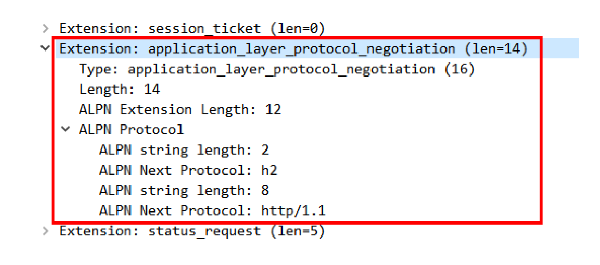

# 04 | 我应该迁移到 HTTP/2 吗？

这一讲是飞翔篇的最后一讲，而 HTTP 的所有知识也差不多快学完了。

前面你已经看到了新的 HTTP/2 和 HTTP/3 协议，了解了它们的特点和工作原理，如果再联系上前几天安全篇的 HTTPS，你可能又会发出疑问：

刚费了好大的力气升级到 HTTPS，这又出了一个 HTTP/2，还有再次升级的必要吗？

与各大浏览器强推 HTTPS 的待遇不一样，HTTP/2 的公布可谓是波澜不惊。虽然它是 HTTP 协议的一个重大升级，但 Apple、Google 等科技巨头并没有像 HTTPS 那样给予大量资源的支持。

直到今天，HTTP/2 在互联网上还是处于“不温不火”的状态，虽然已经有了不少的网站改造升级到了 HTTP/2，但普及的速度远不及 HTTPS。

所以，你有这样的疑问也是很自然的，升级到 HTTP/2 究竟能给我们带来多少好处呢？到底值不值呢？

## HTTP/2 的优点

前面的几讲主要关注了 HTTP/2 的内部实现，今天我们就来看看它有哪些优点和缺点。

首先要说的是，HTTP/2 最大的一个优点是 **完全保持了与 HTTP/1 的兼容** ，在语义上没有任何变化，之前在 HTTP 上的所有投入都不会浪费。

因为兼容 HTTP/1，所以 HTTP/2 也具有 HTTP/1 的所有优点，并且基本解决了 HTTP/1 的所有缺点，安全与性能兼顾，**可以认为是更安全的 HTTP、更快的 HTTPS** 。

在安全上，HTTP/2 对 HTTPS 在各方面都做了强化。下层的 TLS 至少是 1.2，而且只能使用前向安全的密码套件（即 ECDHE），这同时也就默认实现了 `TLS False Start` ，支持 1-RTT 握手，所以不需要再加额外的配置就可以自动实现 HTTPS 加速。

安全有了保障，再来看 HTTP/2 在性能方面的改进。

你应该知道，影响网络速度的两个关键因素是 **带宽** 和 **延迟** ，HTTP/2 的头部压缩、多路复用、流优先级、服务器推送等手段其实都是针对这两个要点。

所谓的带宽就是网络的传输速度。从最早的 56K/s，到如今的 100M/s，虽然网速已经是今非昔比，比从前快了几十倍、几百倍，但仍然是稀缺资源，图片、视频这样的多媒体数据很容易会把带宽用尽。

节约带宽的基本手段就是压缩，在 HTTP/1 里只能压缩 body，而 HTTP/2 则可以用 HPACK 算法压缩 header，这对高流量的网站非常有价值，有数据表明能节省大概 5%~10% 的流量，这是实实在在的真金白银。

与 HTTP/1 并发多个连接不同，HTTP/2 的多路复用特性要求对 **一个域名（或者 IP）只用一个 TCP 连接** ，所有的数据都在这一个连接上传输，这样不仅节约了客户端、服务器和网络的资源，还可以把带宽跑满，让 TCP 充分吃饱。

这是为什么呢？

我们来看一下在 HTTP/1 里的长连接，**虽然是双向通信，但任意一个时间点实际上还是单向的** ：上行请求时下行空闲，下行响应时上行空闲，再加上 **队头阻塞** ，实际的带宽打了个对折还不止。

而在 HTTP/2 里，多路复用则让 TCP 开足了马力，全速狂奔，多个请求响应并发，每时每刻上下行方向上都有流在传输数据，没有空闲的时候，带宽的利用率能够接近 100% 。所以，HTTP/2 只使用一个连接，就能抵得过 HTTP/1 里的五六个连接。

不过流也可能会有依赖关系，可能会存在等待导致的阻塞，这就是 **延迟** ，所以 HTTP/2 的其他特性就派上了用场。

**优先级** 可以让客户端告诉服务器，哪个文件更重要，更需要优先传输，服务器就可以调高流的优先级，合理地分配有限的带宽资源，让高优先级的 HTML、图片更快地到达客户端，尽早加载显示。

**服务器推送** 也是降低延迟的有效手段，它不需要客户端预先请求，服务器直接就发给客户端，这就省去了客户端解析 HTML 再请求的时间。

## HTTP/2 的缺点

说了一大堆 HTTP/2 的优点，再来看看它有什么缺点吧。

听过上一讲 HTTP/3 的介绍，你就知道 HTTP/2 在 TCP 级别还是存在“队头阻塞”的问题。所以，如果网络连接质量差，发生丢包，那么 TCP 会等待重传，传输速度就会降低。

另外，在移动网络中发生 IP 地址切换的时候，下层的 TCP 必须重新建连，要再次握手，经历慢启动，而且之前连接里积累的 HPACK 字典也都消失了，必须重头开始计算，导致带宽浪费和时延。

刚才也说了，HTTP/2 对一个域名只开一个连接，所以一旦这个连接出问题，那么整个网站的体验也就变差了。

而这些情况下 HTTP/1 反而不会受到影响，因为它本来就慢，而且还会对一个域名开 6~8 个连接，顶多其中的一两个连接会更慢，其他的连接不会受到影响。

## 应该迁移到 HTTP/2 吗？

说到这里，你对迁移到 HTTP/2 是否已经有了自己的判断呢？

在我看来，HTTP/2 处于一个略尴尬的位置，前面有老前辈 HTTP/1，后面有新来者 HTTP/3，即有老前辈的打压，又有新来者的追赶，也就难怪没有获得市场的大力吹捧了。

但这绝不是说 HTTP/2 一无是处，实际上 HTTP/2 的性能改进效果是非常明显的，Top 1000 的网站中已经有超过 40% 运行在了 HTTP/2 上，包括知名的 Apple、Facebook、Google、Twitter 等等。仅用了四年的时间，HTTP/2 就拥有了这么大的市场份额和巨头的认可，足以证明它的价值。

因为 HTTP/2 的侧重点是性能，所以是否迁移就需要在这方面进行评估。如果网站的流量很大，那么 HTTP/2 就可以带来可观的收益；反之，如果网站流量比较小，那么升级到 HTTP/2 就没有太多必要了，只要利用现有的 HTTP 再优化就足矣。

不过如果你是新建网站，我觉得完全可以跳过 HTTP/1、HTTPS，直接一步到位，上 HTTP/2，这样不仅可以获得性能提升，还免去了老旧的历史包袱，日后也不会再有迁移的烦恼。

顺便再多嘴一句，HTTP/2 毕竟是下一代HTTP 协议，它的很多特性也延续到了 HTTP/3，提早升级到 HTTP/2 还可以让你在 HTTP/3 到来时有更多的技术积累和储备，不至于落后于时代。

## 配置 HTTP/2

假设你已经决定要使用 HTTP/2，应该如何搭建服务呢？

因为 HTTP/2 事实上是加密的，所以如果你已经在安全篇里成功迁移到了 HTTPS，那么在 Nginx 里启用 HTTP/2 简直可以说是不费吹灰之力，只需要在 server 配置里再多加一个参数就可以搞定了。

```
server {
    listen       443 ssl http2; # 这里再加上一个 http2 就可以了
 
 
    server_name  www.xxx.net;
 
 
    ssl_certificate         xxx.crt;
    ssl_certificate_key     xxx.key;
```

这就表示在 443 端口上开启了 SSL 加密，然后再启用 HTTP/2。

配置服务器推送特性可以使用指令 `http2_push` 和 `http2_push_preload` ：

```
http2_push         /style/xxx.css;
http2_push_preload on;
```

不过如何合理地配置推送是个难题，如果推送给浏览器不需要的资源，反而浪费了带宽。

这方面暂时没有一般性的原则指导，你必须根据自己网站的实际情况去猜测客户端最需要的数据。

优化方面，HTTPS 的一些策略依然适用，比如精简密码套件、ECC 证书、会话复用、HSTS 减少重定向跳转等等。

但还有一些优化手段在 HTTP/2 里是不适用的，而且还会有反效果，比如说常见的精灵图（Spriting）、资源内联（inlining）、域名分片（Sharding）等，至于原因是什么，我把它留给你自己去思考（提示，与缓存有关）。

还要注意一点，HTTP/2 默认启用 header 压缩（HPACK），但并没有默认启用 body 压缩，所以不要忘了在 Nginx 配置文件里加上 gzip 指令，压缩 HTML、JS 等文本数据。

## 应用层协议协商（ALPN）

最后说一下 HTTP/2 的 **服务发现** 吧。

你有没有想过，在 URI 里用的都是 HTTPS 协议名，没有版本标记，浏览器怎么知道服务器支持 HTTP/2 呢？为什么上来就能用 HTTP/2，而不是用 HTTP/1 通信呢？

答案在 TLS 的扩展里，有一个叫 **ALPN**（Application Layer Protocol Negotiation）的东西，用来与服务器就 TLS 上跑的 **应用协议进行协商** 。

客户端在发起 Client Hello 握手的时候，后面会带上一个 ALPN 扩展，里面按照优先顺序列出客户端支持的应用协议。

就像下图这样，最优先的是 h2，其次是 `http/1.1` ，以前还有 `spdy` ，以后还可能会有 `h3` 。



服务器看到 ALPN 扩展以后就可以从列表里选择一种应用协议，在 `Server Hello` 里也带上 ALPN 扩展，告诉客户端服务器决定使用的是哪一种。因为我们在 Nginx 配置里使用了 HTTP/2 协议，所以在这里它选择的就是 `h2` 。


这样在 TLS 握手结束后，客户端和服务器就通过“ALPN”完成了应用层的协议协商，后面就可以使用 HTTP/2 通信了。

## 小结

今天我们讨论了是否应该迁移到 HTTP/2，还有应该如何迁移到 HTTP/2。

1. HTTP/2 完全兼容 HTTP/1，是更安全的 HTTP、更快的 HTTPS，头部压缩、多路复用等技术可以充分利用带宽，降低延迟，从而大幅度提高上网体验；
2. TCP 协议存在队头阻塞，所以 HTTP/2 在弱网或者移动网络下的性能表现会不如 HTTP/1；
3. 迁移到 HTTP/2 肯定会有性能提升，但高流量网站效果会更显著；
4. 如果已经升级到了 HTTPS，那么再升级到 HTTP/2 会很简单；
5. TLS 协议提供 ALPN 扩展，让客户端和服务器协商使用的应用层协议，发现 HTTP/2 服务。

## 课下作业

1. 结合自己的实际情况，分析一下是否应该迁移到 HTTP/2，有没有难点？

   分情况吧，在 HTTPS 的基础上，迁移很简单。

2. 精灵图（Spriting）、资源内联（inlining）、域名分片（Sharding）这些手段为什么会对 HTTP/2 的性能优化造成反效果呢？

   因为 HTTP/2 中使用小颗粒化的资源，优化了缓存，而使用精灵图就相当于传输大文件，但是大文件会延迟客户端的处理执行，并且缓存失效的开销很昂贵，很少数量的数据更新就会使整个精灵图失效，需要重新下载(http1 中使用精灵图是为了减少请求)

   HTTP1 中使用内联资源也是为了减少请求，内联资源没有办法独立缓存，破坏了 HTTP/2 的多路复用和优先级策略；

   域名分片在 HTTP1 中是为了突破浏览器每个域名下同时连接数，但是这在 HTTP/2 中使用多路复用解决了这个问题，如果使用域名分片反而会限制 HTTP2 的自由发挥

## 拓展阅读

- Nginx 也支持明文形式的 HTP/2(即 `h2c` )，在配置 listen 指令时不添加 `ss` 参数即可，但无法使用 Chrome 等浏览器直接测试，因为浏览器只支持 `h2` 
- HTTP/2 的优先级只使用一个字节，优先级最低是 0，最高是 255，一些过时的书刊和网上资料中把 HTTP/2 的优先级写成了 2^31，是非常错误的。
- ALPN 的前身是 Google 的 NPN(Next Protocol Negotiation)，它与 ALPN 的协商过程刚好相反，服务器提供支持的协议列表，由客户端决定最终使用的协议
- 明文的 HTTP/2( `h2c` ) 不使用 TLS，也就无法使用 ALPN 进行协议协商，所以需要使用头字段  `Connection: Upgrade` 升级到 HTTP/2，服务器返回状态码 101 切换协议
- 目前国内已经有不少大网站迁移到了 HTTP/2，比如 www.qg.com、www.tmal.com，你可以用 Chrome 的开发者工具检查它们的 Protocol

