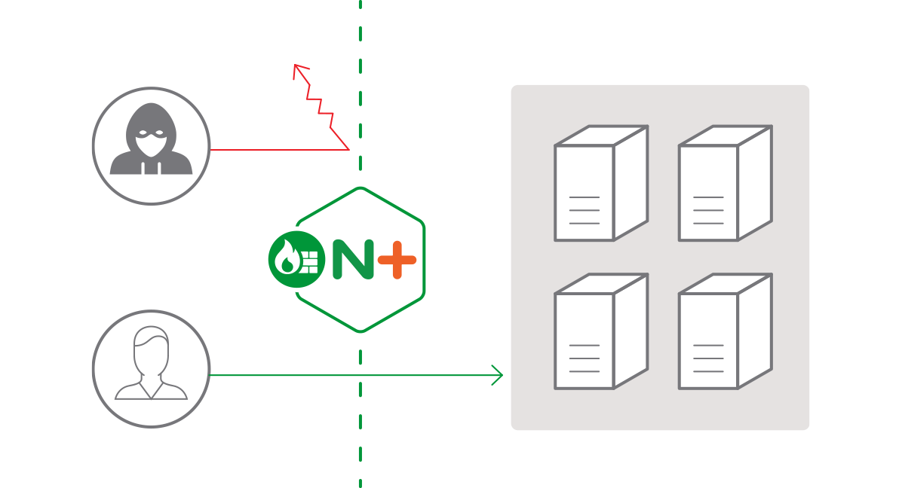

# 03 | WAF：保护我们的网络服务

在前些天的安全篇里，我谈到了 HTTPS，它使用了 SSL/TLS 协议，加密整个通信过程，能够防止恶意窃听和窜改，保护我们的数据安全。

但 HTTPS 只是网络安全中很小的一部分，**仅仅保证了「通信链路安全」** ，让第三方无法得知传输的内容。在通信链路的两端，**也就是客户端和服务器，它是无法提供保护的** 。

因为 HTTP 是一个开放的协议，Web 服务都运行在公网上，任何人都可以访问，所以天然就会成为黑客的攻击目标。

而且黑客的本领比我们想象的还要大得多。虽然不能在传输过程中做手脚，但他们还可以“假扮”成合法的用户访问系统，然后伺机搞破坏。

## Web 服务遇到的威胁

黑客都有哪些手段来攻击 Web 服务呢？我给你大概列出几种常见的方式。

第一种叫 **DDoS** 攻击（distributed denial-of-service attack），有时候也叫「洪水攻击」。

黑客会控制许多僵尸计算机，向目标服务器发起大量无效请求。因为服务器无法区分正常用户和黑客，只能照单全收，这样就挤占了正常用户所应有的资源。如果黑客的攻击强度很大，就会像洪水一样对网站的服务能力造成冲击，耗尽带宽、CPU 和内存，导致网站完全无法提供正常服务。

`DDoS` 攻击方式比较简单粗暴，虽然很有效，但不涉及 HTTP 协议内部的细节，技术含量比较低，不过下面要说的几种手段就不一样了。

网站后台的 Web 服务经常会提取出 HTTP 报文里的各种信息，应用于业务，有时会缺乏严格的检查。因为 HTTP 报文在语义结构上非常松散、灵活，URI 里的 query 字符串、头字段、body 数据都可以任意设置，这就带来了安全隐患，给了黑客 **代码注入** 的可能性。

黑客可以精心编制 HTTP 请求报文，发送给服务器，服务程序如果没有做防备，就会上当受骗，执行黑客设定的代码。

**SQL 注入**（SQL injection）应该算是最著名的一种 **代码注入** 攻击了，它利用了服务器字符串拼接形成 SQL 语句的漏洞，构造出非正常的 SQL 语句，获取数据库内部的敏感信息。

另一种 **HTTP 头注入** 攻击的方式也是类似的原理，它在 `Host`、`User-Agent`、`X-Forwarded-For` 等字段里加入了恶意数据或代码，服务端程序如果解析不当，就会执行预设的恶意代码。

在之前的 [让我知道你是谁：HTTP 的 Cookie 机制](../04/05.md) 里，也说过一种利用 Cookie 的攻击手段，**跨站脚本**（XSS）攻击，它属于 **JS 代码注入** ，利用 JavaScript 脚本获取未设防的 Cookie。

## 网络应用防火墙

面对这么多的黑客攻击手段，我们应该怎么防御呢？

这就要用到 **网络应用防火墙**（Web Application Firewall）了，简称为 **WAF** 。

你可能对传统的防火墙比较熟悉。传统防火墙工作在三层或者四层，隔离了外网和内网，使用预设的规则，只允许某些特定 IP 地址和端口号的数据包通过，拒绝不符合条件的数据流入或流出内网，实质上是 **一种网络数据过滤设备** 。

WAF 也是一种防火墙，但它工作在七层，看到的不仅是 IP 地址和端口号，还能看到整个 HTTP 报文，所以就能够对报文内容做更深入细致的审核，使用更复杂的条件、规则来过滤数据。

说白了，WAF 就是一种 **HTTP 入侵检测和防御系统** 。



WAF 都能干什么呢？

通常一款产品能够称为 WAF，要具备下面的一些功能：

- IP 黑名单和白名单，拒绝黑名单上地址的访问，或者只允许白名单上的用户访问；
- URI 黑名单和白名单，与 IP 黑白名单类似，允许或禁止对某些 URI 的访问；
- 防护 DDoS 攻击，对特定的 IP 地址限连限速；
- 过滤请求报文，防御“代码注入”攻击；
- 过滤响应报文，防御敏感信息外泄；
- 审计日志，记录所有检测到的入侵操作。

听起来 WAF 好像很高深，但如果你理解了它的工作原理，其实也不难。

它就像是平时编写程序时必须要做的函数入口参数检查，拿到 HTTP 请求、响应报文，用字符串处理函数看看有没有关键字、敏感词，或者用正则表达式做一下模式匹配，命中了规则就执行对应的动作，比如返回 403/404。

如果你比较熟悉 Apache、Nginx、OpenResty，可以自己改改配置文件，写点 JS 或者 Lua 代码，就能够实现基本的 WAF 功能。

比如说，在 Nginx 里实现 IP 地址黑名单，可以利用 `map` 指令，从变量 `$remote_addr` 获取 IP 地址，在黑名单上就映射为值 1，然后在 `if` 指令里判断：

```lua
map $remote_addr $blocked {
    default       0;
    "1.2.3.4"     1;
    "5.6.7.8"     1;
}
 
 
if ($blocked) {
    return 403 "you are blocked.";  
}
```

Nginx 的配置文件只能静态加载，改名单必须重启，比较麻烦。如果换成 OpenResty 就会非常方便，在 access 阶段进行判断，IP 地址列表可以使用 cosocket 连接外部的 Redis、MySQL 等数据库，实现动态更新：

```lua
local ip_addr = ngx.var.remote_addr
 
local rds = redis:new()
if rds:get(ip_addr) == 1 then 
    ngx.exit(403) 
end
```

看了上面的两个例子，你是不是有种跃跃欲试的冲动了，想自己动手开发一个 WAF？

不过我必须要提醒你，在网络安全领域必须时刻记得 **木桶效应** （也叫短板效应）。网站的整体安全不在于你加固的最强的那个方向，而是在于你可能都没有意识到的短板。黑客往往会避重就轻，只要发现了网站的一个弱点，就可以一点突破，其他方面的安全措施也就都成了无用功。

所以，使用 WAF 最好 **不要重新发明轮子** ，而是使用现有的、比较成熟的、经过实际考验的 WAF 产品。

## 全面的 WAF 解决方案

这里我就要隆重介绍一下 WAF 领域里的最顶级产品了：ModSecurity，它可以说是 WAF 界 **事实上的标准** 。

ModSecurity 是一个开源的、生产级的 WAF 工具包，历史很悠久，比 Nginx 还要大几岁。它开始于一个私人项目，后来被商业公司 Breach Security 收购，现在则是由 TrustWave 公司的 SpiderLabs 团队负责维护。

ModSecurity 最早是 Apache 的一个模块，只能运行在 Apache 上。因为其品质出众，大受欢迎，后来的 2.x 版添加了 Nginx 和 IIS 支持，但因为底层架构存在差异，不够稳定。

所以，这两年 SpiderLabs 团队就开发了全新的 3.0 版本，移除了对 Apache 架构的依赖，使用新的“连接器”来集成进 Apache 或者 Nginx，比 2.x 版更加稳定和快速，误报率也更低。

ModSecurity 有两个核心组件。第一个是 **规则引擎** ，它实现了自定义的 `SecRule` 语言，有自己特定的语法。但 `SecRule` 主要基于正则表达式，还是不够灵活，所以后来也引入了 Lua，实现了脚本化配置。

ModSecurity 的规则引擎使用 C++11 实现，可以从 [GitHub](https://github.com/SpiderLabs/ModSecurity) 上下载源码，然后集成进 Nginx。因为它比较庞大，编译很费时间，所以最好编译成动态模块，在配置文件里用指令 `load_module` 加载：

```lua
load_module modules/ngx_http_modsecurity_module.so;
```

只有引擎还不够，要让引擎运转起来，还需要完善的防御规则，所以 ModSecurity 的第二个核心组件就是它的 **规则集** 。

ModSecurity 源码提供一个基本的规则配置文件 **modsecurity.conf-recommended** ，使用前要把它的后缀改成 `conf` 。

有了规则集，就可以在 Nginx 配置文件里加载，然后启动规则引擎：

```lua
modsecurity on;
modsecurity_rules_file /path/to/modsecurity.conf;
```

`modsecurity.conf` 文件默认只有检测功能，不提供入侵阻断，这是为了防止误杀误报，把 `SecRuleEngine` 后面改成 `On` 就可以开启完全的防护：

```lua
#SecRuleEngine DetectionOnly
SecRuleEngine  On
```

基本的规则集之外，ModSecurity 还额外提供一个更完善的规则集，为网站提供全面可靠的保护。这个规则集的全名叫 **OWASP ModSecurity 核心规则集**（Open Web Application Security Project ModSecurity Core Rule Set），因为名字太长了，所以有时候会简称为「核心规则集」或者 `CRS` 。


CRS 也是完全开源、免费的，可以从 GitHub 上下载：

```
git clone https://github.com/SpiderLabs/owasp-modsecurity-crs.git
```

其中有一个 **crs-setup.conf.example** 的文件，它是 CRS 的基本配置，可以用 `Include` 命令添加到 `modsecurity.conf` 里，然后再添加 `rules` 里的各种规则。

```lua
Include /path/to/crs-setup.conf
Include /path/to/rules/*.conf
```

你如果有兴趣可以看一下这些配置文件，里面用 `SecRule` 定义了很多的规则，基本的形式是 `SecRule 变量 运算符 动作` 。不过 ModSecurity 的这套语法自成一体，比较复杂，要完全掌握不是一朝一夕的事情，我就不详细解释了。

另外，ModSecurity 还有强大的审计日志（Audit Log）功能，记录任何可疑的数据，供事后离线分析。但在生产环境中会遇到大量的攻击，日志会快速增长，消耗磁盘空间，而且写磁盘也会影响 Nginx 的性能，所以一般建议把它关闭：

```
SecAuditEngine off  #RelevantOnly
SecAuditLog /var/log/modsec_audit.log
```

## 小结

今天我们一起学习了“网络应用防火墙”，也就是 WAF，使用它可以加固 Web 服务。

1. Web 服务通常都运行在公网上，容易受到 DDoS、代码注入等各种黑客攻击，影响正常的服务，所以必须要采取措施加以保护；
2. WAF 是一种 HTTP 入侵检测和防御系统，工作在七层，为 Web 服务提供全面的防护；
3. ModSecurity 是一个开源的、生产级的 WAF 产品，核心组成部分是 **规则引擎** 和 **规则集** ，两者的关系有点像杀毒引擎和病毒特征库；
4. WAF 实质上是模式匹配与数据过滤，所以会消耗 CPU，增加一些计算成本，降低服务能力，使用时需要在安全与性能之间找到一个平衡点。

## 课下作业

1. HTTPS 为什么不能防御 DDoS、代码注入等攻击呢？
2. 你还知道有哪些手段能够抵御网络攻击吗？