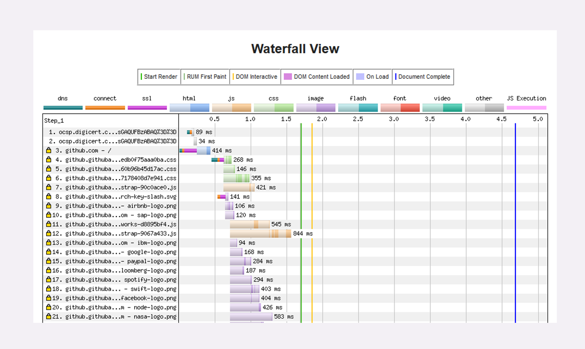

# 08 | 总结篇: HTTP 性能优化面面观

在最后的这两讲里，我将把散落在前面各个章节的零散知识点整合起来，做一个总结，和你一起聊聊 HTTP 的性能优化。

由于 HTTPS（SSL/TLS）的优化已经在 [连接太慢该怎么办：HTTPS的优化](../05/06.md) 里介绍的比较详细了，所以这次就暂时略过不谈，你可以课后再找机会复习。

既然要做性能优化，那么，我们就需要知道：什么是性能？它都有哪些指标，又应该如何度量，进而采取哪些手段去优化？

性能其实是一个复杂的概念。不同的人、不同的应用场景都会对它有不同的定义。对于 HTTP 来说，它又是一个非常复杂的系统，里面有非常多的角色，所以很难用一两个简单的词就能把性能描述清楚。

还是从 HTTP 最基本的 `请求 - 应答` 模型来着手吧。在这个模型里有两个角色：客户端和服务器，还有中间的传输链路，考查性能就可以看这三个部分。


## HTTP 服务器

我们先来看看服务器，它一般运行在 Linux 操作系统上，用 Apache、Nginx 等 Web 服务器软件对外提供服务，所以，性能的含义就是它的服务能力，也就是尽可能多、尽可能快地处理用户的请求。

衡量服务器性能的主要指标有三个：**吞吐量**（requests per second）、**并发数**（concurrency）和 **响应时间**（time per request）。

吞吐量就是我们常说的 RPS，每秒的请求次数，也有叫 TPS、QPS，它是服务器最基本的性能指标，RPS 越高就说明服务器的性能越好。

并发数反映的是服务器的负载能力，也就是服务器能够同时支持的客户端数量，当然也是越多越好，能够服务更多的用户。

响应时间反映的是服务器的处理能力，也就是快慢程度，响应时间越短，单位时间内服务器就能够给越多的用户提供服务，提高吞吐量和并发数。

除了上面的三个基本性能指标，服务器还要考虑 CPU、内存、硬盘和网卡等系统资源的占用程度，利用率过高或者过低都可能有问题。

在 HTTP 多年的发展过程中，已经出现了很多成熟的工具来测量这些服务器的性能指标，开源的、商业的、命令行的、图形化的都有。

在 Linux 上，最常用的性能测试工具可能就是 ab（Apache Bench）了，比如，下面的命令指定了并发数 100，总共发送 10000 个请求：

```
ab -c 100 -n 10000 'http://www.xxx.com'
```

系统资源监控方面，Linux 自带的工具也非常多，常用的有 uptime、top、vmstat、netstat、sar 等等，可能你比我还要熟悉，我就列几个简单的例子吧：

```
top             # 查看 CPU 和内存占用情况
vmstat  2       # 每 2 秒检查一次系统状态
sar -n DEV 2    # 看所有网卡的流量，定时 2 秒检查
```

理解了这些性能指标，我们就知道了服务器的性能优化方向：合理利用系统资源，提高服务器的吞吐量和并发数，降低响应时间。

## HTTP 客户端

看完了服务器的性能指标，我们再来看看如何度量客户端的性能。

客户端是信息的消费者，一切数据都要通过网络从服务器获取，所以它最基本的性能指标就是 **延迟**（latency）。

之前在讲 HTTP/2 的时候就简单介绍过延迟。**所谓的延迟其实就是等待** ，等待数据到达客户端时所花费的时间。但因为 HTTP 的传输链路很复杂，所以延迟的原因也就多种多样。

首先，我们必须谨记有一个不可逾越的障碍—— **光速**，因为地理距离而导致的延迟是无法克服的，访问数千公里外的网站显然会有更大的延迟。

其次，第二个因素是 **带宽**，它又包括接入互联网时的电缆、WiFi、4G 和运营商内部网络、运营商之间网络的各种带宽，每一处都有可能成为数据传输的瓶颈，降低传输速度，增加延迟。

第三个因素是 **DNS 查询** ，如果域名在本地没有缓存，就必须向 DNS 系统发起查询，引发一连串的网络通信成本，而在获取 IP 地址之前客户端只能等待，无法访问网站，

第四个因素是 **TCP 握手** ，你应该对它比较熟悉了吧，必须要经过 SYN、SYN/ACK、ACK 三个包之后才能建立连接，它带来的延迟由光速和带宽共同决定。

建立 TCP 连接之后，就是正常的数据收发了，后面还有解析 HTML、执行 JavaScript、排版渲染等等，这些也会耗费一些时间。不过它们已经不属于 HTTP 了，所以不在今天的讨论范围之内。

之前讲 HTTPS 时介绍过一个专门的网站 [SSLLabs](https://www.ssllabs.com/) ，而对于 HTTP 性能优化，也有一个专门的测试网站 [WebPageTest](https://www.webpagetest.org) 。它的特点是在世界各地建立了很多的测试点，可以任意选择地理位置、机型、操作系统和浏览器发起测试，非常方便，用法也很简单。

网站测试的最终结果是一个直观的瀑布图（Waterfall Chart），清晰地列出了页面中所有资源加载的先后顺序和时间消耗，比如下图就是对 GitHub 首页的一次测试。



Chrome 等浏览器自带的开发者工具也可以很好地观察客户端延迟指标，面板左边有每个 URI 具体消耗的时间，面板的右边也是类似的瀑布图。

点击某个 URI，在 Timing 页里会显示出一个小型的“瀑布图”，是这个资源消耗时间的详细分解，延迟的原因都列的清清楚楚，比如下面的这张图：


图里面的这些指标都是什么含义呢？我给你解释一下：

- 因为有队头阻塞，浏览器对每个域名最多开 6 个并发连接（HTTP/1.1），当页面里链接很多的时候就必须排队等待（Queued、Queueing），这里它就等待了 1.62 秒，然后才被浏览器正式处理；
- 浏览器要预先分配资源，调度连接，花费了 11.56 毫秒（Stalled）;
- 连接前必须要解析域名，这里因为有本地缓存，所以只消耗了 0.41 毫秒（DNS Lookup）；
- 与网站服务器建立连接的成本很高，总共花费了 270.87 毫秒，其中有 134.89 毫秒用于 TLS 握手，那么 TCP 握手的时间就是 135.98 毫秒（Initial connection、SSL）；
- 实际发送数据非常快，只用了 0.11 毫秒（Request sent）；
- 之后就是等待服务器的响应，专有名词叫 TTFB（Time To First Byte），也就是“首字节响应时间”，里面包括了服务器的处理时间和网络传输时间，花了 124.2 毫秒；
- 接收数据也是非常快的，用了 3.58 毫秒（Content Dowload）。

从这张图你可以看到，一次 HTTP 请求 - 响应 的过程中延迟的时间是非常惊人的，总时间 415.04 毫秒里占了差不多 99%。

所以，客户端 HTTP 性能优化的关键就是：降低延迟。

## HTTP 传输链路

以 HTTP 基本的“请求 - 应答”模型为出发点，刚才我们得到了 HTTP 性能优化的一些指标，现在，我们来把视角放大到“真实的世界”，看看客户端和服务器之间的传输链路，它也是影响 HTTP 性能的关键。

还记得 [键入网址再按下回车，后面究竟发生了什么？](../03/01.md) 里的互联网示意图吗？我把它略微改了一下，划分出了几个区域，这就是所谓的 **第一公里**、**中间一公里** 和 **最后一公里**（在英语原文中是 mile，英里）。


**第一公里：是指网站的出口** ，也就是服务器接入互联网的传输线路，它的带宽直接决定了网站对外的服务能力，也就是吞吐量等指标。显然，优化性能应该在这“第一公里”加大投入，尽量购买大带宽，接入更多的运营商网络。

**中间一公里：就是由许多小网络组成的实际的互联网** ，其实它远不止一公里，而是非常非常庞大和复杂的网络，地理距离、网络互通都严重影响了传输速度。好在这里面有一个 HTTP 的好帮手——CDN，它可以帮助网站跨越千山万水，让这段距离看起来真的就好像只有一公里。

**最后一公里：是用户访问互联网的入口** ，对于固网用户就是光纤、网线，对于移动用户就是 WiFi、基站。以前它是客户端性能的主要瓶颈，延迟大带宽小，但随着近几年 4G 和高速宽带的普及，最后一公里的情况已经好了很多，不再是制约性能的主要因素了。

除了这三公里，我个人认为还有一个第零公里， 就是网站内部的 Web 服务系统。它其实也是一个小型的网络（当然也可能会非常大），中间的数据处理、传输会导致延迟，增加服务器的响应时间，也是一个不可忽视的优化点。

在上面整个互联网传输链路中，末端的最后一公里我们是无法控制的，所以我们只能在第零公里、第一公里和中间一公里这几个部分下功夫，增加带宽降低延迟，优化传输速度。

## 小结

1. 性能优化是一个复杂的概念，在 HTTP 里可以分解为服务器性能优化、客户端性能优化和传输链路优化；
2. 服务器有三个主要的性能指标：吞吐量、并发数和响应时间，此外还需要考虑资源利用率；
3. 客户端的基本性能指标是延迟，影响因素有地理距离、带宽、DNS 查询、TCP 握手等；
4. 从服务器到客户端的传输链路可以分为三个部分，我们能够优化的是前两个部分，也就是第一公里和中间一公里；
5. 有很多工具可以测量这些指标，服务器端有 ab、top、sar 等，客户端可以使用测试网站，浏览器的开发者工具。

## 拓展阅读

- HTTP 性能优化是 Web 性能优化的一部分，后者涉及的范围更广，除了 HTTP 协议，还包含 HTML、CSS、 JavaScript 等方面的优化。例如为了优化页面渲染顺序，CSS 应该放在 HTML 顶部，而  JavaScript 应该放在 HTML 的底部
- 更高级的服务器性能测试工具有 Load Runner、JMeter 等，很多云服务商也会提供专业的测试平台。
- 在 Chrome 开发者工具的瀑布图里可以看到有两条蓝色和红色的竖线。蓝线表示的是 `DOM Ready`，也就是说浏览器已经解析完 HTML 文档的 DOM 结构；红线表示的是 `Load Complete`，即已经下载完页面包含的所有资源(JS、CSS、图片等)
- 还记得几年前的 **光进铜退** 吗?以前都是用电话线里的铜上网，用的是 ADSL，网速只有 10M 左右，现在都变成了光纤入户，网速通常都是 100M 起步。

## 下篇

在整个 HTTP 系统里有三个可优化的环节，分别是 **服务器**、**客户端**和**传输链路**（第一公里和中间一公里）。但因为我们是无法完全控制客户端的，所以实际上的优化工作通常是在服务器端。这里又可以细分为后端和前端，后端是指网站的后台服务，而前端就是 HTML、CSS、图片等展现在客户端的代码和数据。

知道了大致的方向，HTTP 性能优化具体应该怎么做呢？

总的来说，任何计算机系统的优化都可以分成这么几类：硬件软件、内部外部、花钱不花钱。

**投资购买现成的硬件** 最简单的优化方式，比如换上更强的 CPU、更快的网卡、更大的带宽、更多的服务器，效果也会立竿见影，直接提升网站的服务能力，也就实现了 HTTP 优化。

另外，**花钱购买外部的软件或者服务** 也是一种行之有效的优化方式，最物有所值的应该算是 CDN 了。CDN 专注于网络内容交付，帮助网站解决中间一公里的问题，还有很多其他非常专业的优化功能。把网站交给 CDN 运营，就好像是让网站坐上了喷气飞机，能够直达用户，几乎不需要费什么力气就能够达成很好的优化效果。

不过这些花钱的手段实在是太没有技术含量了，属于懒人（无贬义）的做法，所以我就不再细说，接下来重点就讲讲在网站内部、不花钱的软件优化。

我把这方面的 HTTP 性能优化概括为三个关键词：**开源**、**节流**、**缓存** 。

## 开源

这个开源可不是 Open Source，而是指抓源头，开发网站服务器自身的潜力，在现有条件不变的情况下尽量挖掘出更多的服务能力。

首先，我们应该选用高性能的 Web 服务器，最佳选择当然就是 Nginx/OpenResty 了，尽量不要选择基于 Java、Python、Ruby 的其他服务器，它们用来做后面的业务逻辑服务器更好。利用 Nginx 强大的反向代理能力实现动静分离，动态页面交给 Tomcat、Django、Rails，图片、样式表等静态资源交给 Nginx。

Nginx 或者 OpenResty 自身也有很多配置参数可以用来进一步调优，举几个例子，比如说禁用负载均衡锁、增大连接池，绑定 CPU 等等，相关的资料有很多。

特别要说的是，对于 HTTP 协议一定要 **启用长连接** 。TCP 和 SSL 建立新连接的成本是非常高的，有可能会占到客户端总延迟的一半以上。长连接虽然不能优化连接握手，但可以把成本“均摊”到多次请求里，这样只有第一次请求会有延迟，之后的请求就不会有连接延迟，总体的延迟也就降低了。

另外，在现代操作系统上都已经支持 TCP 的新特性 **TCP Fast Open**（Win10、iOS9、Linux 4.1），它的效果类似 TLS 的 `False Start` ，可以在初次握手的时候就传输数据，也就是 0-RTT，所以我们应该尽可能在操作系统和 Nginx 里开启这个特性，减少外网和内网里的握手延迟。

下面给出一个简短的 Nginx 配置示例，启用了长连接等优化参数，实现了动静分离：

```lua
server {
  listen 80 deferred reuseport backlog=4096 fastopen=1024; 
 
 
  keepalive_timeout  60;
  keepalive_requests 10000;
  
  location ~* \.(png)$ {
    root /var/images/png/;
  }
  
  location ~* \.(php)$ {
    proxy_pass http://php_back_end;
  }
}
```

## 节流

节流是指减少客户端和服务器之间收发的数据量，在有限的带宽里传输更多的内容。

节流最基本的做法就是使用 HTTP 协议内置的“数据压缩”编码，不仅可以选择标准的 gzip，还可以积极尝试新的压缩算法 br，它有更好的压缩效果。

不过在数据压缩的时候应当注意选择适当的压缩率，不要追求最高压缩比，否则会耗费服务器的计算资源，增加响应时间，降低服务能力，反而会得不偿失。

gzip 和 br 是通用的压缩算法，对于 HTTP 协议传输的各种格式数据，我们还可以有针对性地采用特殊的压缩方式。

HTML/CSS/JS 属于纯文本，就可以采用特殊的压缩，去掉源码里多余的空格、换行、注释等元素。这样压缩之后的文本虽然看起来很混乱，对人类不友好，但计算机仍然能够毫无障碍地阅读，不影响浏览器上的运行效果。

图片在 HTTP 传输里占有非常高的比例，虽然它本身已经被压缩过了，不能被 gzip、br 处理，但仍然有优化的空间。比如说，去除图片里的拍摄时间、地点、机型等元数据，适当降低分辨率，缩小尺寸。图片的格式也很关键，尽量选择高压缩率的格式，有损格式应该用 JPEG，无损格式应该用 Webp 格式。

对于小文本或者小图片，还有一种叫做 **资源合并（Concatenation）** 的优化方式，就是把许多小资源合并成一个大资源，用一个请求全下载到客户端，然后客户端再用 JS、CSS 切分后使用，好处是节省了请求次数，但缺点是处理比较麻烦。

刚才说的几种数据压缩都是针对的 HTTP 报文里的 body，在 HTTP/1 里没有办法可以压缩 header，但我们也可以采取一些手段来减少 header 的大小，不必要的字段就尽量不发（例如 Server、X-Powered-By）。

网站经常会使用 Cookie 来记录用户的数据，浏览器访问网站时每次都会带上 Cookie，冗余度很高。所以应当少使用 Cookie，减少 Cookie 记录的数据量，总使用 domain 和 path 属性限定 Cookie 的作用域，尽可能减少 Cookie 的传输。如果客户端是现代浏览器，还可以使用 HTML5 里定义的 Web Local Storage，避免使用 Cookie。

压缩之外，节流还有两个优化点，就是 **域名** 和 **重定向** 。

DNS 解析域名会耗费不少的时间，如果网站拥有多个域名，那么域名解析获取 IP 地址就是一个不小的成本，所以应当适当“收缩”域名，限制在两三个左右，减少解析完整域名所需的时间，让客户端尽快从系统缓存里获取解析结果。

重定向引发的客户端延迟也很高，它不仅增加了一次请求往返，还有可能导致新域名的 DNS 解析，是 HTTP 前端性能优化的大忌。除非必要，应当尽量不使用重定向，或者使用 Web 服务器的“内部重定向”。

## 缓存

缓存它不仅是 HTTP，也是任何计算机系统性能优化的法宝，把它和上面的开源节流搭配起来应用于传输链路，就能够让 HTTP 的性能再上一个台阶。

在第零公里，也就是网站系统内部，可以使用 Memcache、Redis、Varnish 等专门的缓存服务，把计算的中间结果和资源存储在内存或者硬盘里，Web 服务器首先检查缓存系统，如果有数据就立即返回给客户端，省去了访问后台服务的时间。

在中间一公里，缓存更是性能优化的重要手段，CDN 的网络加速功能就是建立在缓存的基础之上的，可以这么说，如果没有缓存，那就没有 CDN。

利用好缓存功能的关键是理解它的工作原理，为每个资源都添加 ETag 和 Last-modified 字段，再用 Cache-Control、Expires 设置好缓存控制属性。

其中最基本的是 max-age 有效期，标记资源可缓存的时间。对于图片、CSS 等静态资源可以设置较长的时间，比如一天或者一个月，对于动态资源，除非是实时性非常高，也可以设置一个较短的时间，比如 1 秒或者 5 秒。

这样一旦资源到达客户端，就会被缓存起来，在有效期内都不会再向服务器发送请求，也就是：**没有请求的请求，才是最快的请求。**

## HTTP/2

在开源节流和缓存这三大策略之外，HTTP 性能优化还有一个选择，那就是把协议由 HTTP/1 升级到 HTTP/2。

通过飞翔篇的学习，你已经知道了 HTTP/2 的很多优点，它消除了应用层的队头阻塞，拥有头部压缩、二进制帧、多路复用、流量控制、服务器推送等许多新特性，大幅度提升了 HTTP 的传输效率。

实际上这些特性也是在开源和节流这两点上做文章，但因为这些都已经内置在了协议内，所以只要换上 HTTP/2，网站就能够立刻获得显著的性能提升。

不过你要注意，一些在 HTTP/1 里的优化手段到了 HTTP/2 里会有“反效果”。

对于 HTTP/2 来说，一个域名使用一个 TCP 连接才能够获得最佳性能，如果开多个域名，就会浪费带宽和服务器资源，也会降低 HTTP/2 的效率，所以 **域名收缩** 在 HTTP/2 里是必须要做的。

**资源合并** 在 HTTP/1 里减少了多次请求的成本，但在 HTTP/2 里因为有头部压缩和多路复用，传输小文件的成本很低，所以合并就失去了意义。而且资源合并还有一个缺点，就是降低了缓存的可用性，只要一个小文件更新，整个缓存就完全失效，必须重新下载。

所以在现在的大带宽和 CDN 应用场景下，应当尽量少用资源合并（JS、CSS 图片合并，数据内嵌），让资源的粒度尽可能地小，才能更好地发挥缓存的作用。

## 小结

1. 花钱购买硬件、软件或者服务可以直接提升网站的服务能力，其中最有价值的是 CDN；
2. 不花钱也可以优化 HTTP，三个关键词是开源节流和缓存；
3. 后端应该选用高性能的 Web 服务器，开启长连接，提升 TCP 的传输效率；
4. 前端应该启用 gzip、br 压缩，减小文本、图片的体积，尽量少传不必要的头字段；
5. 缓存是无论何时都不能忘记的性能优化利器，应该总使用 Etag 或 Last-modified 字段标记资源；
6. 升级到 HTTP/2 能够直接获得许多方面的性能提升，但要留意一些 HTTP/1 的反模式。

## 拓展阅读

- 关于 TCP 的性能优化也是个很大的话题，相关研究有很多，常用的优化手段有增大初始拥塞窗口、启用窗口缩放、慢启动重启等。
- Nginx 默认不支持 br 压缩算法，需要安裝一个第三方模块 ngx_broth。
- 文本、图片的优化可以使用 Google 开发的个工具: PageSpeed，它最初是 Apache 的个模块，后来也推出了 Nginx 版本(ngx_ pagespeed)。
- 在 HTML 里可以使用一些特殊的指令，例如 dns- prefetch、 preconnect 等，来预先执行 DNS 解析、TCP 连接,減少客户端的等待时间。此外，还可以使用一些 JS 黑魔法，用 JavaScript 来动态下载页面内容，而不是完全使用 HTTP 协议。
