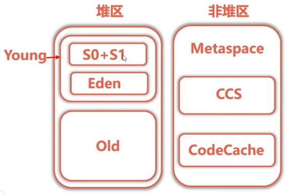
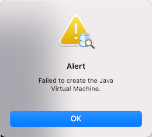
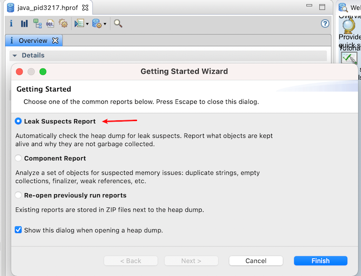
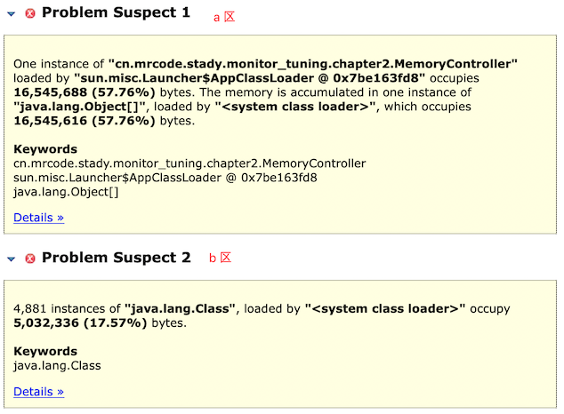
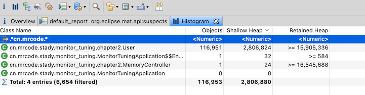
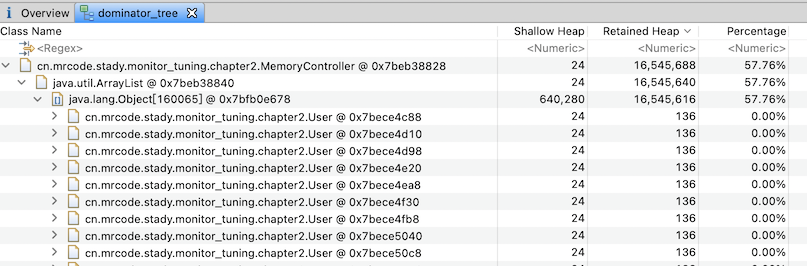
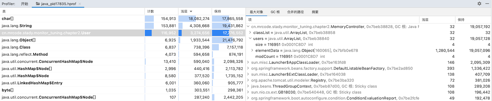

# jmap + MAT 实战内存溢出

本课程找重点会关注内存与线程相关的东西。

回顾下 JVM 的内存结构



本节会产生一个 **堆区** 和 **非堆区** 的内存溢出，然后使用工具来定位内存溢出的原因

## 准备工作

首先创建一个项目，使用 https://start.spring.io/ 创建一个 spring  boot 项目，要求：

- spring boot 版本 ：`2.0.2.RELEASE` 

  防止版本不同，看到的实现不同。

- 依赖：Web 模块

也就是说是一个简单的 Spring boot Web 项目，[这是笔者准备好的仓库](https://github.com/zq99299/monitor-tuning)

### 制造堆内存溢出

思路很简单，我们通过参数限制堆内存大小，然后不断创建新的对象来达到内存溢出

```java
package cn.mrcode.stady.monitor_tuning.chapter2;

import org.springframework.web.bind.annotation.GetMapping;
import org.springframework.web.bind.annotation.RestController;

import java.util.ArrayList;
import java.util.List;
import java.util.UUID;

@RestController
public class MemoryController {
    private List<User> users = new ArrayList<>();

    /**
     * 堆内存溢出
     * <pre>
     *   为了更快的看到效果，限制最大和最小内存：
     *   -Xmx32M -Xms32M
     *   记得需要在启动的时候添加启动参数
     * </pre>
     */
    @GetMapping("/heap")
    public void heap() {
        int i = 0;
        while (true) {
            users.add(new User(i++, UUID.randomUUID().toString()));
        }
    }
}

```

配置虚拟机参数


然后访问这个地址，控制台不一会就出现内存溢出了，如下

```java
Exception in thread "http-nio-8080-exec-1" java.lang.OutOfMemoryError: GC overhead limit exceeded
Exception in thread "ContainerBackgroundProcessor[StandardEngine[Tomcat]]" java.lang.OutOfMemoryError: GC overhead limit exceeded
```

### 制造非堆内存溢出

非堆内存也就是 Metaspace 区，我们可以往里面存储 Class 信息，来达到这个效果。

动态生成 Class 的方式有很多种，这里使用 asm 来生成，先引入依赖

```groovy
 implementation 'asm:asm:3.3.1'
```

使用 asm 来动态生成不同的类

```java
package cn.mrcode.stady.monitor_tuning.chapter2;

import java.util.ArrayList;
import java.util.List;

import org.objectweb.asm.ClassWriter;
import org.objectweb.asm.MethodVisitor;
import org.objectweb.asm.Opcodes;

/*
 * https://blog.csdn.net/bolg_hero/article/details/78189621
 * 继承 ClassLoader 是为了方便调用 defineClass 方法，因为该方法的定义为 protected
 * */
public class Metaspace extends ClassLoader {

    public static List<Class<?>> createClasses() {
        // 类持有
        List<Class<?>> classes = new ArrayList<>();
        // 循环 1000w 次生成 1000w 个不同的类。
        for (int i = 0; i < 10000000; ++i) {
            ClassWriter cw = new ClassWriter(0);
            // 定义一个类名称为 Class{i}，它的访问域为 public，父类为 java.lang.Object，不实现任何接口
            cw.visit(Opcodes.V1_1, Opcodes.ACC_PUBLIC, "Class" + i, null,
                    "java/lang/Object", null);
            // 定义构造函数 <init> 方法
            MethodVisitor mw = cw.visitMethod(Opcodes.ACC_PUBLIC, "<init>",
                    "()V", null, null);
            // 第一个指令为加载 this
            mw.visitVarInsn(Opcodes.ALOAD, 0);
            // 第二个指令为调用父类 Object 的构造函数
            mw.visitMethodInsn(Opcodes.INVOKESPECIAL, "java/lang/Object",
                    "<init>", "()V");
            // 第三条指令为 return
            mw.visitInsn(Opcodes.RETURN);
            mw.visitMaxs(1, 1);
            mw.visitEnd();
            Metaspace test = new Metaspace();
            byte[] code = cw.toByteArray();
            // 定义类
            Class<?> exampleClass = test.defineClass("Class" + i, code, 0, code.length);
            classes.add(exampleClass);
        }
        return classes;
    }
}
```

上面的 asm 使用不是本课程重点，了解即可。

制造非堆内存溢出

```java
    private List<Class> classList = new ArrayList<>();

    /**
     * 非堆内存溢出
     * <pre>
     *   为了更快的看到效果，限制非堆最大和最小内存：
     *   -XX:MetaspaceSize=32M -XX:MaxMetaspaceSize=32M
     *   记得需要在启动的时候添加启动参数
     * </pre>
     */
    @GetMapping("/nonheap")
    public void nonheap() {
        while (true) {
            // 持有创建好的类是为了防止被垃圾回收器回收掉
            classList.addAll(Metaspace.createClasses());
        }
    }
```

测试输出

```java
Exception in thread "http-nio-8080-exec-1" java.lang.OutOfMemoryError: Metaspace
Exception in thread "ContainerBackgroundProcessor[StandardEngine[Tomcat]]" java.lang.OutOfMemoryError: Metaspace
```

## 如何导出内存映像文件

上面演示了两种内存溢出，如何来解决这一的问题？我们一般通过 **分析内存映像文件** 来找出到底是 **哪些类一直占用没有被释放？**，内存溢出有可能是内存泄露，也有可能是内存 CPU 不足

假如是内存泄露：我们需要找到是哪个地方导致的没有被释放？

- C 语言中的内存泄露指的是：new 了一个对象，你把这个对象指针丢了，这块内存就永远得不到释放了

- 而 Java 中的内存泄露指的是：new 了一个对象，**被一直持有**，得不到释放。

他们两个刚好是相反的。

::: tip

注意：我们这里首先导出的是 heap 堆内存溢出的内存映像文件，导出这个的时候就不要添加非堆的参数限制，否则很有可能非堆限制先异常。

:::

### 内存溢出自动导出

我们不可能一直去监控内存信息，一般是当发生内存溢出的时候，**自动导出** 这些信息以供我们查询，可以通过如下参数达到

- `-XX:+HeapDumpOnOutOfMemoryError`：启用内存溢出自动导出功能
- `-XX:HeapDumpPath=./`：配置导出的文件存放在哪里

在程序启动时添加到 jvm 参数，然后去重现内存溢出的场景，就能看到导出的文件了，如下

```java
2021-01-17 12:24:50.291  INFO 3217 --- [           main] c.m.s.m.MonitorTuningApplication         : Started MonitorTuningApplication in 2.951 seconds (JVM running for 3.741)
java.lang.OutOfMemoryError: Metaspace
Dumping heap to ./java_pid3217.hprof ...
Heap dump file created [24901421 bytes in 0.188 secs]
Exception in thread "http-nio-8080-exec-1" java.lang.OutOfMemoryError: Metaspace
```

导出了一个 `java_pid3217.hprof` 的文件

### 使用 jmap 命令手动导出

还有一种是手动方式使用 [jmap](https://docs.oracle.com/javase/8/docs/technotes/tools/unix/jmap.html#CEGCECJB) 工具导出，对于我们随时都能获取 heap 信息非常方便。

它的语法如下

```bash
jmap [ options ] pid

jmap [ options ] executable core

jmap [ options ] [ pid ] server-id@ ] remote-hostname-or-IP
```

下面使用它导出我们上面启动的程序

```bash
# 先找到我们要导出的程序
mrcode:chapter2 mrcode$ jps -l
3217 cn.mrcode.stady.monitor_tuning.MonitorTuningApplication
2930 org.gradle.launcher.daemon.bootstrap.GradleDaemon
4085 sun.tools.jps.Jps
1944 
1705 
1694 

# 使用 jmap 导出到文件中
mrcode:chapter2 mrcode$ jmap -dump:format=b,file=heap.hprof 3217
Dumping heap to /Users/mrcode/Desktop/temp/monitor-tuning/chapter2/heap.hprof ...
Heap dump file created

# 如果上面演示自动导出信息文件后，你对程序没有访问过，又用 jmap 导出了，他们的文件大小是差不多的
```

## MAT 分析内存溢出

内存分析器（MAT） 是内存分析工具

比如可以使用 [Eclipse Memory Analyzer](http://www.eclipse.org/mat/) 是一种快速且功能丰富的 **Java 堆分析器**，可帮助您查找内存泄漏并减少内存消耗。

### 安装 Eclipse 的 MAT 工具

笔者的电脑是 Mac 下载了 [Mac 版本的独立 MAT 工具](https://iso.mirrors.ustc.edu.cn/eclipse/mat/1.11.0/rcp/MemoryAnalyzer-1.11.0.20201202-macosx.cocoa.x86_64.dmg)

下载完成安装后，打开 mat ，显示如下，不能打开：



打开该 app 包下的 MemoryAnalyzer 文件，在终端中打开提示如下错误

```
mrcode@mrcode ~ % /Volumes/mat/mat.app/Contents/MacOS/MemoryAnalyzer ; exit;
JavaVM: Failed to load JVM: /Library/Java/JavaVirtualMachines/jdk1.8.0_201.jdk/Contents/Home/lib/libserver.dylib
JavaVM FATAL: Failed to load the jvm library.
Saving session...
...saving history...truncating history files...
...completed.
Deleting expired sessions...none found.
```

经过百度之后尝试成功的方案如下：

在配置文件 `Contents/Eclipse/MemoryAnalyzer.ini` 中第一行增加如下配置

```
-vm
/Library/Java/JavaVirtualMachines/jdk1.8.0_201.jdk/Contents/Home/bin/java
```

添加后的配置文件

```ini
-vm
/Library/Java/JavaVirtualMachines/jdk1.8.0_201.jdk/Contents/Home/bin/java
# 后面的是原始文件内容
-startup
../Eclipse/plugins/org.eclipse.equinox.launcher_1.5.700.v20200207-2156.jar
--launcher.library
../Eclipse/plugins/org.eclipse.equinox.launcher.cocoa.macosx.x86_64_1.1.1100.v20190907-0426
-vmargs
-Xmx1024m
-Dorg.eclipse.swt.internal.carbon.smallFonts
-XstartOnFirstThread
```

看解决方案和报错的信息，貌似是找错了路径。

### 开始分析

使用 mat 工具打开我们导出的文件



选择下面的一个常见报告（这里选择的只是默认打开的报告）：

- 怀疑泄漏的报告： Leak Suspects Report
  自动检查堆转储是否存在泄漏疑点。报告保存了哪些对象活着，为什么他们不被垃圾收集
- 组件报告：Component Report
  分析一组对象以发现可疑的内存问题:重复的字符串，空集合、终结器、弱引用等
- 重新打开先前运行的报告：Re-open previously run reports
  现有报告存储在堆转储旁边的ZiP文件中

我们这里选择「怀疑泄露的报告」




- A 区的描述：`MemoryController` 这个实例类，占用了 57.76% 的内存，一下就定位到了我们的问题发生地区
- B 区的描述：有 1881 个实例是 Class，是被 system class loader 加载的，占用了 17.57% 的内存。 这里是正常的

### 工具功能介绍


- Actions

  - Histogram：柱状图

    列出每个类的实例数

  - Dominator Tree：统治者树

    列出最大的物体和它们存活的东西。

  - Top Consumers：顶级消费者

    打印按类和包分组的最昂贵的对象。
    
  - Duplicate Classes：重复的类

    检测由多个类装入器装入的类。

- Reports：报告
  - Leak Suspects：怀疑泄露

    包括泄漏疑点和系统概述

  - Top Components：顶部组件
     列出大于堆总数 1% 的组件的报告
     
  - Leak Suspects by Snapshot Comparison：通过快照比较来怀疑泄漏
    包括泄漏疑点和比较两个快照的系统概述。

- Step By Step：一步一步？

  - Component Report：组件的报告

    分析属于普通根包或类装入器的对象

### Histogram

以柱状图的形式 **列出每个类的实例数**



- Class Name：类名

- Objects：对象个数

- Shallow Heap：直译就是浅层堆，其实就是这个对象实际占用的堆大小。

  这个比较难理解，有兴趣可以去查阅相关资料

- Retained Heap：直译过来是保留堆，一般会大于或者等于shallow heap

  如果这个对象被删除了（GC 回收掉），能节省出多少内存，我们一般看这个值

如上图，搜索我们自己的类，会发现 User 类有 11 万多个对象实例，占用的内存大概有 15M

可以通过查看该类是通过哪一个 GC ROOT 引用的，这里选择了排除软引用，只看强引用


通过上图可以看到：tomcat 的一个线程引用了 MemoryController，里面有一个  users 的 ArrayList，该 list 中有 11 万多个 User 实例，每个实例的占用内存大小为 138 byte

另外选中其中的类，还能看到他的一些属性，比如这个 User 中的一个实例


### Dominator Tree

以对象栈的方式查看，可以看到和上面的类似



### 小结

主要常用的两个模块是：

- Histogram
- Dominator Tree

首先定位可能性大的类，然后查看他的强引用信息，最后去定位。这里由于代码简单，很容易，在生产环境中可能就很复杂，需要使用好这个工具去查找

##  IDEA 分析 dump 文件

通过 eclipse 的 mat 分析工具，可以看到很详细的图标之类的，就是安装上稍微有点麻烦，idea 其实也自带分析工具，如下图，直接打开 `.hprof` 文件即可



可以看到上图显示的一些信息与我们所学的两个常用模块是很类似的。所以直接看这个分析工具也是可以的。