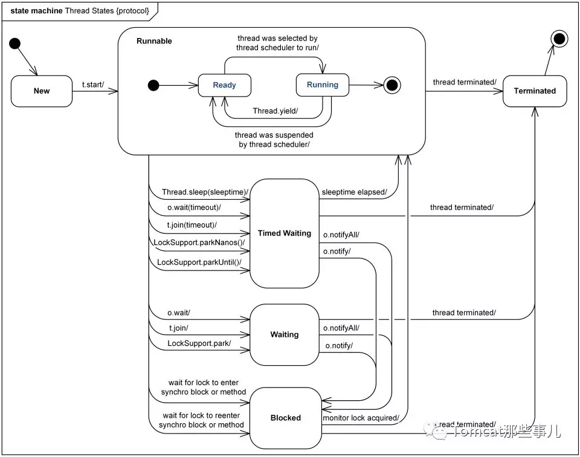
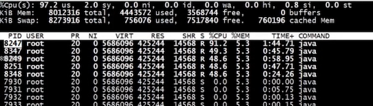

# jstack 实战死循环与死锁

打印 Java 进程，核心文件或远程调试服务器的 Java 线程堆栈跟踪。

比如我们观察到 CPU 利用率彪高，这个时候就很有可能发生了死循环之类的

语法如下：

```bash
jstack [ options ] pid

jstack [ options ] executable core

jstack [ options ] [ server-id@ ] remote-hostname-or-IP
```

来看看打印的信息内容

```bash
mrcode:chapter2 mrcode$ jstack 17835
2021-01-17 16:30:28
Full thread dump Java HotSpot(TM) 64-Bit Server VM (25.201-b09 mixed mode):

"http-nio-8080-exec-11" #51 daemon prio=5 os_prio=31 tid=0x00007fbc3c104000 nid=0xa40f waiting on condition [0x000070000e161000]
   java.lang.Thread.State: WAITING (parking)
	at sun.misc.Unsafe.park(Native Method)
	- parking to wait for  <0x00000007bec7c6f0> (a java.util.concurrent.locks.AbstractQueuedSynchronizer$ConditionObject)
	at java.util.concurrent.locks.LockSupport.park(LockSupport.java:175)
	at java.util.concurrent.locks.AbstractQueuedSynchronizer$ConditionObject.await(AbstractQueuedSynchronizer.java:2039)
	at java.util.concurrent.LinkedBlockingQueue.take(LinkedBlockingQueue.java:442)
	at org.apache.tomcat.util.threads.TaskQueue.take(TaskQueue.java:103)
	at org.apache.tomcat.util.threads.TaskQueue.take(TaskQueue.java:31)
	at java.util.concurrent.ThreadPoolExecutor.getTask(ThreadPoolExecutor.java:1074)
	at java.util.concurrent.ThreadPoolExecutor.runWorker(ThreadPoolExecutor.java:1134)
	at java.util.concurrent.ThreadPoolExecutor$Worker.run(ThreadPoolExecutor.java:624)
	at org.apache.tomcat.util.threads.TaskThread$WrappingRunnable.run(TaskThread.java:61)
	at java.lang.Thread.run(Thread.java:748)

"DestroyJavaVM" #44 prio=5 os_prio=31 tid=0x00007fbc3ba5f800 nid=0xe03 waiting on condition [0x0000000000000000]
   java.lang.Thread.State: RUNNABLE
...
"VM Thread" os_prio=31 tid=0x00007fbc3983e000 nid=0x2e03 runnable 

"GC task thread#0 (ParallelGC)" os_prio=31 tid=0x00007fbc3c009000 nid=0x1c07 runnable 

"GC task thread#1 (ParallelGC)" os_prio=31 tid=0x00007fbc3b008800 nid=0x2003 runnable 

"GC task thread#2 (ParallelGC)" os_prio=31 tid=0x00007fbc3b009800 nid=0x1e03 runnable 
```

##  JAVA 线程状态

> [官方文档](https://docs.oracle.com/javase/8/docs/technotes/guides/troubleshoot/tooldescr034.html#BABJFBFI)

- NEW：新建

  该线程尚未启动。

- RUNNABLE：运行

  线程正在 JVM 中执行。

- BLOCKED：阻塞

  线程被阻塞，等待监视器锁定。

- WAITING：等待

  线程无限期地等待另一个线程执行特定操作。

- TIMED_WAITING：限时等待

  线程正在等待另一个线程执行操作，直到指定的等待时间。

- TERMINATED：终止

  线程已退出。

关于以上的状态含义从官方而来，也在官网里面有。

可以看下他们具体的转换状态，有一篇文章：[怎样了解你的线程在干嘛?](https://mp.weixin.qq.com/s/GsxeFM7QWuR--Kbpb7At2w)



## 死循环导致 CPU 彪高问题

```java
package cn.mrcode.stady.monitor_tuning.chapter2;

import org.springframework.web.bind.annotation.RequestMapping;
import org.springframework.web.bind.annotation.RestController;

import java.util.ArrayList;
import java.util.List;

@RestController
public class CpuController {
    /**
     * 死循环
     */
    @RequestMapping("/loop")
    public List<Long> loop() {
        // 由于提取 json 的方法中有 bug ，边界没有考虑清楚
        // 遇到这种错误的 json 串，就会导致死循环
        String data = "{\"data\":[{\"partnerid\":]";
        return getPartneridsFromJson(data);
    }

    /**
     * 一段模拟业务代码，导致死循环的产生。
     *
     * @param data
     * @return
     */
    public static List<Long> getPartneridsFromJson(String data) {
        //{\"data\":[{\"partnerid\":982,\"count\":\"10000\",\"cityid\":\"11\"},{\"partnerid\":983,\"count\":\"10000\",\"cityid\":\"11\"},{\"partnerid\":984,\"count\":\"10000\",\"cityid\":\"11\"}]}
        //上面是正常的数据
        List<Long> list = new ArrayList<Long>(2);
        if (data == null || data.length() <= 0) {
            return list;
        }
        int datapos = data.indexOf("data");
        if (datapos < 0) {
            return list;
        }
        int leftBracket = data.indexOf("[", datapos);
        int rightBracket = data.indexOf("]", datapos);
        if (leftBracket < 0 || rightBracket < 0) {
            return list;
        }
        String partners = data.substring(leftBracket + 1, rightBracket);
        if (partners == null || partners.length() <= 0) {
            return list;
        }
        while (partners != null && partners.length() > 0) {
            int idpos = partners.indexOf("partnerid");
            if (idpos < 0) {
                break;
            }
            int colonpos = partners.indexOf(":", idpos);
            // 在这里会导致死循环，
            int commapos = partners.indexOf(",", idpos);
            if (colonpos < 0 || commapos < 0) {
                //partners = partners.substring(idpos+"partnerid".length());//1
                continue;
            }
            String pid = partners.substring(colonpos + 1, commapos);
            if (pid == null || pid.length() <= 0) {
                //partners = partners.substring(idpos+"partnerid".length());//2
                continue;
            }
            try {
                list.add(Long.parseLong(pid));
            } catch (Exception e) {
                //do nothing
            }
            partners = partners.substring(commapos);
        }
        return list;
    }
}

```

访问 `/loop` 服务，就会进入死循环

使用 top 命令查看 CPU 负载

```bash
mrcode:chapter2 mrcode$ top
Processes: 709 total, 4 running, 705 sleeping, 3498 threads                                                                               17:58:22
Load Avg: 2.44, 3.02, 3.09 ...
# 主要看 Load AVG ，如果变化不大，那么就多开几个窗口请求 loop 方法

PID    COMMAND      %CPU TIME     #TH   #WQ  #PORT MEM    PURG   CMPRS  PGRP  PPID  STATE    BOOSTS            %CPU_ME %CPU_OTHRS UID  FAULTS
33225  java         99.3 04:48.51 45/1  1    131   ...
```

通过输出信息可以看到，PID 为 33225 这个进程 ID CPU 占用 99.3%

通过 jstack 打出到文件

```bash
mrcode:chapter2 mrcode$ jstack 33225 > 33225.txt
```

我们还可以通过 top 命令找出指定进程里面的所有 **线程**

```bash
# 可以打印出该进程中的所有线程
$ top -H -p 33225
# 但是 mac 上 top 没有 -H 参数，看不到
```



就是如上图所示，不过这个 PID 是 **十进制** 的，jstack 中打印出来的信息线程 ID 是 **十六进制的**，也就是 `nid=0x2037` 这种。 

下面可以通过 printf 把十进制转成十六进制

```bash
mrcode:chapter2 mrcode$ printf "%x\n" 8247
2037
```

那么拿到这个线程 ID 去刚刚打印出来的内容

```bash
# 笔者这里就假装上面找到的线程 id 和实际是一致的
# 也确实是这个线程导致的死循环
"http-nio-8080-exec-1" #31 daemon prio=5 os_prio=31 tid=0x00007fe3491df000 nid=0x9d03 runnable [0x000070000ff82000]
   java.lang.Thread.State: RUNNABLE
	at java.lang.String.indexOf(String.java:1780)
	at java.lang.String.indexOf(String.java:1718)
	at java.lang.String.indexOf(String.java:1698)
	at cn.mrcode.stady.monitor_tuning.chapter2.CpuController.getPartneridsFromJson(CpuController.java:49)
	at cn.mrcode.stady.monitor_tuning.chapter2.CpuController.loop(CpuController.java:19)
	at sun.reflect.NativeMethodAccessorImpl.invoke0(Native Method)
	at sun.reflect.NativeMethodAccessorImpl.invoke(NativeMethodAccessorImpl.java:62)
```

首先它的运行状态是 RUNNABLE 的，正在运行中，并且如果你搜索这个 `getPartneridsFromJson` 的话，会发现有 5 个线程，这里对应的是上面 top 找线程时那个图，排在最前面的最耗 CPU 的线程。这就很容易就定位到了出问题的代码

## 死锁问题

```java
 private Object lock1 = new Object();
    private Object lock2 = new Object();

    /**
     * 死锁
     */
    @RequestMapping("/deadlock")
    public String deadlock() {
        new Thread(() -> {
            synchronized (lock1) {
                try {
                    Thread.sleep(1000);
                } catch (Exception e) {
                }
                synchronized (lock2) {
                    System.out.println("Thread1 over");
                }
            }
        }).start();
        new Thread(() -> {
            synchronized (lock2) {
                try {
                    Thread.sleep(1000);
                } catch (Exception e) {
                }
                synchronized (lock1) {
                    System.out.println("Thread2 over");
                }
            }
        }).start();
        return "deadlock";
    }
```

定义两个线程：

1. 第一个线程先锁 lock1，休眠 1 秒，再获取 lock2
2. 另一个线程先锁 lock2，休眠 1 秒，再获取 lock1

也就是说，当线程 1 从睡眠中醒来时，lock2 已经被获取过了，就一直等待，而另一个线程一直等待 lock1 的释放。两个线程就互相等待起来了，造成了死锁


访问 `/deadlock` 服务后，虽然返回了数据，但是程序中其实已经有一个死锁了。

这种情况下使用 top 命令查看消耗资源的进程 ID 就不合适了，因为死锁的话，它是等待状态，不怎么耗资源的。

```bash
# 直接找出我们的程序的进程 ID
mrcode:chapter2 mrcode$ jps -l
33902 cn.mrcode.stady.monitor_tuning.MonitorTuningApplication

# 再拉取到进程内容
mrcode:chapter2 mrcode$ jstack 33902 > 33902.txt
```

打开文件，直接拉到最后

```bash
...
JNI global references: 18082


Found one Java-level deadlock:
=============================
"Thread-15":    # 这里说线程 15 等待一个 0x00007fcbd424e9e8 的监视器
  waiting to lock monitor 0x00007fcbd424e9e8 (object 0x00000007beb40f88, a java.lang.Object),
  which is held by "Thread-14"		# 这个监视器是线程 14 持有的
"Thread-14":
  waiting to lock monitor 0x00007fcbd48587b8 (object 0x00000007beb40f98, a java.lang.Object),
  which is held by "Thread-15"

Java stack information for the threads listed above:
===================================================
"Thread-15":
	at cn.mrcode.stady.monitor_tuning.chapter2.CpuController.lambda$deadlock$1(CpuController.java:101)
	- waiting to lock <0x00000007beb40f88> (a java.lang.Object)
	- locked <0x00000007beb40f98> (a java.lang.Object)
	at cn.mrcode.stady.monitor_tuning.chapter2.CpuController$$Lambda$326/1187591911.run(Unknown Source)
	at java.lang.Thread.run(Thread.java:748)
"Thread-14":
	at cn.mrcode.stady.monitor_tuning.chapter2.CpuController.lambda$deadlock$0(CpuController.java:90)
	- waiting to lock <0x00000007beb40f98> (a java.lang.Object)
	- locked <0x00000007beb40f88> (a java.lang.Object)
	at cn.mrcode.stady.monitor_tuning.chapter2.CpuController$$Lambda$325/1874685286.run(Unknown Source)
	at java.lang.Thread.run(Thread.java:748)

Found 1 deadlock.
```

`Found one Java-level deadlock:` 直接提示发现一个 java 级死锁，并且有相关的 **锁互相持有说明**，还有相关的堆栈信息。

由于该场景是我们主动模拟的，比较容易找到，真实的线上场景代码很复杂，可能没有这么容易找出来，但是有了这样的工具，还是比较容易定位到的。

