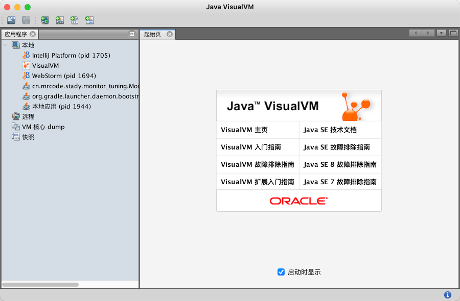
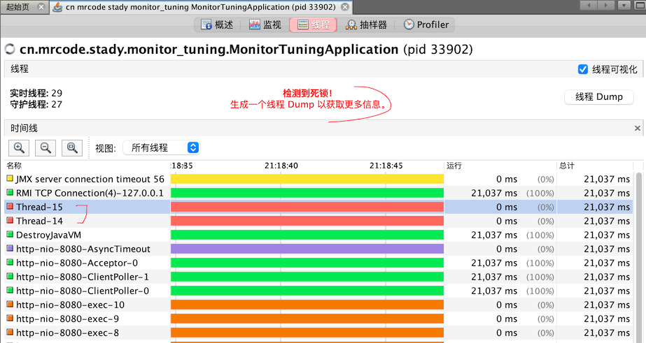
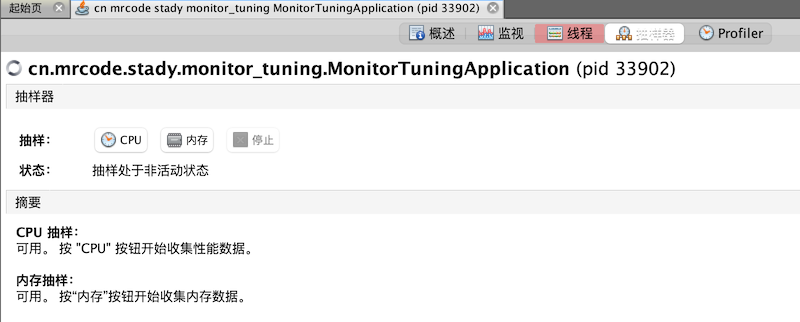
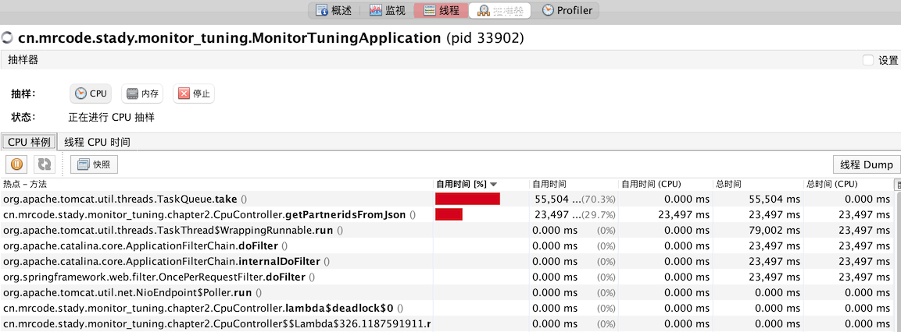
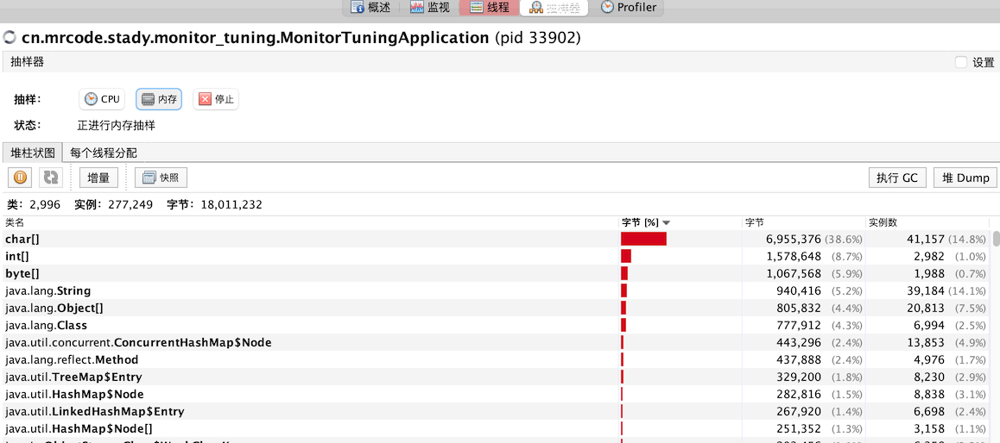
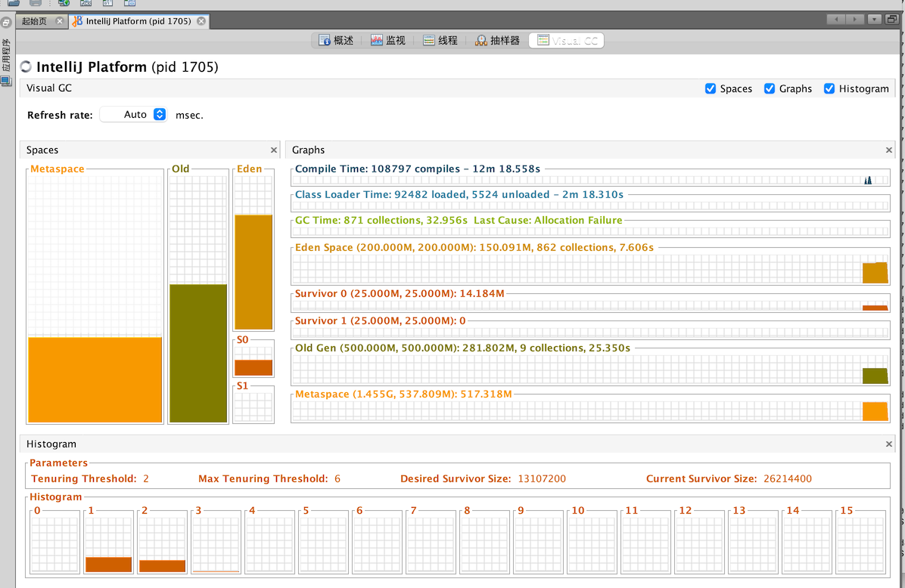
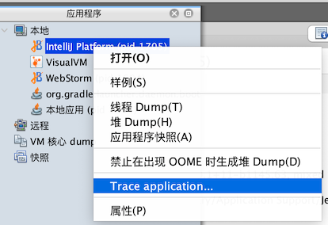

# 监控本地 JAVA 进程

相当于是前面那些命令的一个集成

JVisualVM 是 java 自带的工具，一般在 jdk 安装目录下的 bin 目录下

```bash
# 笔者这里是 mac 系统，查找这个文件名
mrcode:chapter2 mrcode$ mdfind -name 'jvisualvm'
/usr/bin/jvisualvm   # 这里有一个指令，可以直接在中断中运行 jvisualvm 就打开了
/Library/Java/JavaVirtualMachines/jdk1.8.0_201.jdk/Contents/Home/bin/jvisualvm
```

打开这个软件后的截图如下



可以看到上面直接就列出来了，入门指南、故障排除指南等文档。

在左边「本地」，会直接列出本机的 JAVA 进程虚拟机程序。

这里讲解其中一些，另外一些和前面讲解的差不多，比如这个线程

## 线程



它有一个线程可视化，右侧还有一个 「线程 Dump」这个就是使用 jstack 输出信息。

这个线程可视化还是很方便，很清晰的就能找到产生死锁的两个线程。

## 抽样器



我们最关注的两个性能数据都在这里了

### CPU 抽样器

它可以显示方法使用 CPU 时间，一般用于发现热点方法。



比如上图中上一节课我们做的死循环方法，这里就能直接看到。特别是定位程序慢的时候，非常好用

### 内存抽样器

差不多类似 gc 数据，不过这里更详细更直观，能实时动态的展示每个对象的信息

 

## 插件管理

### Visual GC

比如这个界面，名为 Visual GC 的界面



该功能默认是没有的，是通过插件安装的。

插件功能通过：顶部菜单「工具」→「插件」打开插件管理中心


笔者这里是可以直接操作安装的，安装完成之后，需要勾选插件，然后重启 JVisualVM 就会出现这个功能了。

如果说，你打开之后直接操作安装无效，则查看下设置里面


需要添加插件中心地址，这个需要添加与你 jdk 版本一样的，里面的地址在 [官网这个页面](https://visualvm.github.io/pluginscenters.html)

### BTrace Workbench

这一个是后面课程中要用到的 BTrace 图形化界面。

安装后，是通过右键的方式进入，如下图




就可以直接编辑 BTrace 脚本了。