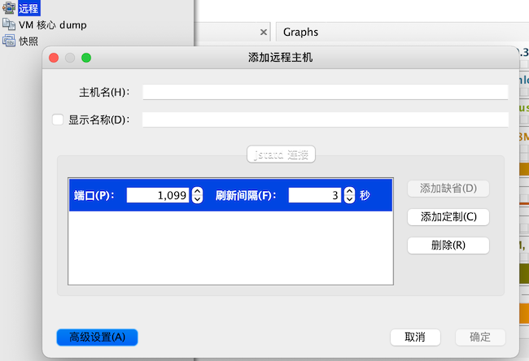
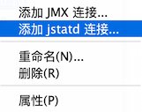
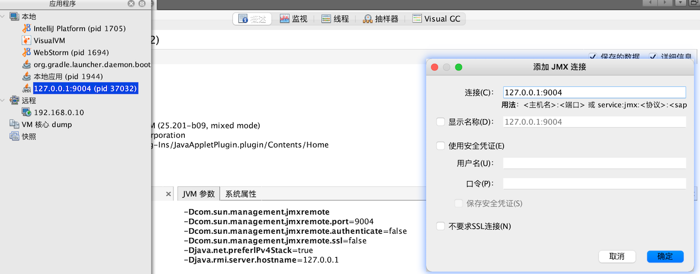

# 监控远程 JAVA 进程

## Tomcat

可以通过「远程」功能来添加远程的 Tomcat 进程，不只是 Tomcat，只要是 Java 进程都可以



但是连接远程进程是需要在远端进行配置的。拿 Tomcat 来说，需要修改 `Catalina.sh` 配置文件，也就是增加 JMX 相关参数

```
JAVA OPTS="$JAVA OPTS -Dcom.sun.management.jmxremote
-Dcom.sun.management.jmxremote.port=9004
-Dcom.sun.management.jmxremote.authenticate=false
-Dcom.sun.management.jmxremote.ssl=false
-Djava.net.preferlPv4Stack=true
-Djava.rmi.server.hostname=10.110.3.62"
```

- port：访问到 jmx 服务的端口
- authenticate：是否认证
- ssl
- preferlPv4Stack：优先使用 iPv4Stack
- hostname：访问到该服务的 IP 地址，外部通过哪个 IP 能访问到本服务


它是可以添加 JMX 和  jstatd 链接的




上图这样就可以连接上了，链接之后的就和上一节本地连接中的是一样的了


## Spring boot Jar

由于笔者手里没有 tomcat 程序，就使用我们练习的 spring boot 程序，打成 jar 包后，来启动

```bash
mrcode@mrcode libs % java -Dcom.sun.management.jmxremote -Dcom.sun.management.jmxremote.port=9004 -Dcom.sun.management.jmxremote.authenticate=false -Dcom.sun.management.jmxremote.ssl=false -Djava.net.preferlPv4Stack=true -Djava.rmi.server.hostname=127.0.0.1 -jar monitor-tuning-0.0.1-SNAPSHOT.jar
错误: 找不到口令文件: /Library/Internet Plug-Ins/JavaAppletPlugin.plugin/Contents/Home/lib/management/jmxremote.password
sun.management.AgentConfigurationError
	at sun.management.jmxremote.ConnectorBootstrap.checkPasswordFile(ConnectorBootstrap.java:563)
	at sun.management.jmxremote.ConnectorBootstrap.startRemoteConnectorServer(ConnectorBootstrap.java:426)
	at sun.management.Agent.startAgent(Agent.java:262)
	at sun.management.Agent.startAgent(Agent.java:452)
```

在 mac 下发现报错了，于是去该路径看看，发现有一个 password 的模板文件，我们这里复制一份修改一下

```bash
mrcode:chapter2 mrcode$ cd /Library/Internet\ Plug-Ins/JavaAppletPlugin.plugin/Contents/Home/lib/management/jmxremote.
jmxremote.access             jmxremote.password.template

# mac 上要切换到 root  用户下才有权限
mrcode:management mrcode$ su -
Password:

mrcode:management root# cp jmxremote.password.template jmxremote.password

# 再次运行还是报错
错误: 必须限制口令文件读取访问权限: /Library/Internet Plug-Ins/JavaAppletPlugin.plugin/Contents/Home/lib/management/jmxremote.password

# 那么这个里面就说了，由于安全问题，该文件必须要限制它的权限，而且是文件的所有者才能进行访问
# 这里看看它的权限
mrcode:management root# ls -l
total 64
-rw-r--r--  1 root  wheel   3998 Dec 16  2018 jmxremote.access
-rw-r--r--  1 root  wheel   2854 Jan 17 23:01 jmxremote.password
-rw-r--r--  1 root  wheel   2856 Dec 16  2018 jmxremote.password.template
-rw-r--r--  1 root  wheel  14630 Dec 16  2018 management.properties
-rw-r--r--  1 root  wheel   3376 Dec 16  2018 snmp.acl.template

# 修改文件权限为 600 也就是，只有文件拥有者有读写权限
mrcode:management root$ chmod 600 jmxremote.password
mrcode:management root$ ls -l jmxremote.password
-rw-------  1 root  wheel  2854 Jan 17 23:01 jmxremote.password

# 解决所有的问题之后，再次运行就成功了
mrcode:libs root$ java -Dcom.sun.management.jmxremote -Dcom.sun.management.jmxremote.port=9004 -Dcom.sun management.jmxremote.authenticate=false -Dcom.sun management.jmxremote.ssl=false -Djava.net.preferlPv4Stack=true-Djava.rmi.server.hostname=127.0.0.1 -jar monitor-tuning-0.0.1-SNAPSHOT.jar
```



由于不能写 localhost 或则 127.0.0.1 这种的，写了之后也会归类到本地，为什么会这样，你看看本地这个属性就明白了


可以看到这个就是一个内置的方式。通过自己添加的 Visual GC 这个插件显示不支持此 JVM，可能还是有哪里有问题把。

### 远程 jmx 用户名密码访问

如果你怕你远程应用不设置用户密码，不安全的话，可以使用用户名密码进行访问，也就是前面说到过的 jmxremote.password 文件中，一行一个，比如

```
# 用户名   密码
jmxuser   111111
```

