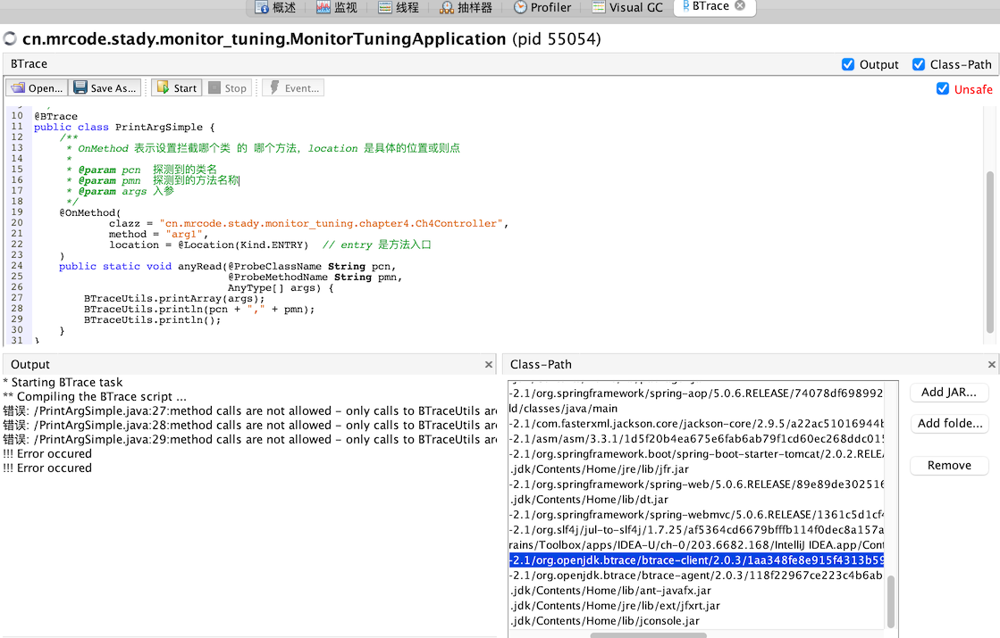

# Btrace 安装使用入门

去 [Btrace GitHub](https://github.com/btraceio/btrace) 下载 zip 的压缩包，笔者这里是 Mac，然后解压后配置几个变量：

- JAVA_HOME：需要配置你当前正在使用的 JAVA 
- JAVA_VERSION：这个 JAVA 对应的版本
- BTRACE_HOME：btrace 目录

```bash
vim ~/.bash_profile 
export JAVA_HOME=/Library/Java/JavaVirtualMachines/jdk1.8.0_201.jdk/Contents/Home/
export JAVA_VERSION="1.8.0_201"
export BTRACE_HOME=/usr/local/btrace
export PATH=$PATH:$BTRACE_HOME/bin

source ~/.bash_profile 
```

由于笔者的 JAVA 是安装程序安装的，不需要在这里再 export path 中了。

```bash
mrcode@mrcode Home % btrace --version
BTrace v.2.0.3 (825719b6633988cb0e867d895b8e062e5e9e1ff7)
```

查看 btrace 版本号，显示成功，则表示安装成功了。

## 两种运行脚本的方式

- 在 JVisuaLVM 中添加 Btrace 插件，添加 classpath
- 使用命令行 `btrace <pid> <trace_script>`

## 准备工作

准备一段模拟线上的生产代码

```java
package cn.mrcode.stady.monitor_tuning.chapter4;

import org.springframework.web.bind.annotation.RequestMapping;
import org.springframework.web.bind.annotation.RequestParam;
import org.springframework.web.bind.annotation.RestController;

@RestController
@RequestMapping("/ch4")
public class Ch4Controller {
    /**
     * Btrace 获取参数
     *
     * @param name
     * @return
     */
    @RequestMapping("arg1")
    public String arg1(@RequestParam("name") String name) {
        return "hello," + name;
    }
}

```

下面我们使用 Btrace 在不重启程序的情况下，获取入参内容。

## 编写 btrace 脚本

Btrace 也是用 JAVA 编写的，那么需要引入一下几个依赖包

```groovy
implementation 'org.openjdk.btrace:btrace-agent:2.0.3'
implementation 'org.openjdk.btrace:btrace-boot:2.0.3'
implementation 'org.openjdk.btrace:btrace-client:2.0.3'
// 注意：以上依赖包没有在中央仓库，而是在      maven { url "https://dl.bintray.com/btraceio/maven" }  仓库中才有
// 你需要配置上这个仓库上，才能拉取到该 jar 包
```

但是需要注意你依赖的版本号

```bash
mrcode@mrcode chapter4 % btrace --version
BTrace v.2.0.3 (825719b6633988cb0e867d895b8e062e5e9e1ff7)
```

比如，你的 BTrace 是 `v.2.0.3` 那么这里依赖的脚本包也需要是这个版本，否则在运行脚本的时候就有可能报错，另外新版本的 BTrace 依赖包的 group 名变更了，和视频中的不一样了。

编写 btrace 脚本

```java
package cn.mrcode.stady.monitor_tuning.chapter4;

import org.openjdk.btrace.core.BTraceUtils;
import org.openjdk.btrace.core.annotations.*;
import org.openjdk.btrace.core.types.AnyType;

/**
 * Btrace 打印入参例子; 可以单独创建一个脚本项目来写 btrace 脚本
 */
@BTrace
public class PrintArgSimple {
    /**
     * OnMethod 表示设置拦截哪个类 的 哪个方法，location 是具体的位置或则点
     *
     * @param pcn  探测到的类名
     * @param pmn  探测到的方法名称
     * @param args 入参
     */
    @OnMethod(
            clazz = "cn.mrcode.stady.monitor_tuning.chapter4.Ch4Controller",
            method = "arg1",
            location = @Location(Kind.ENTRY)  // entry 是方法入口
    )
    public static void anyRead(@ProbeClassName String pcn,
                               @ProbeMethodName String pmn,
                               AnyType[] args) {
        BTraceUtils.printArray(args);
        BTraceUtils.println(pcn + "," + pmn);
        BTraceUtils.println();
    }
}

```

## 运行 btrace 脚本

有以下三种方式：

- `<btrace>/bin/btrace <PID> <trace_script>` 

  将使用给定的 **PID** 附加到 **Java** 应用程序，并编译并提交跟踪脚本

- `<btrace>/bin/btracec <trace_script>`  将编译提供的跟踪脚本

- `<btrace>/bin/btracer <compiled_script> <args to launch a java app>` 将在运行 btrace 代理并加载先前由 *btracec* 编译的脚本的情况下启动指定的 Java 应用程序

一般是使用第一种方式：

```bash
# 我们当前所在路径在：这个脚本文件的目录下
mrcode@mrcode chapter4 % pwd             
/Users/mrcode/IdeaProjects/monitor-tuning/src/main/java/cn/mrcode/stady/monitor_tuning/chapter4
mrcode@mrcode chapter4 % ls -l                           
total 16
-rw-r--r--  1 mrcode  staff   519  1 20 22:43 Ch4Controller.java
-rw-r--r--  1 mrcode  staff  1040  1 25 11:16 PrintArgSimple.java

# 查看运行的实例代码端口
mrcode@mrcode chapter4 % jps -l                          
53106 org.gradle.launcher.daemon.bootstrap.GradleDaemon
53558 cn.mrcode.stady.monitor_tuning.MonitorTuningApplication
54614 sun.tools.jps.Jps
1944 
1705 
54108 org.gradle.launcher.daemon.bootstrap.GradleDaemon
1694 

# 运行该脚本监控该端口
mrcode@mrcode chapter4 % btrace 53558 PrintArgSimple.java
Attaching BTrace to PID: 53558
```

这个时候就已经开始监控拦截该方法了，访问下 `GET http://localhost:8080/ch4/arg1?name=mrcode`，再看控制台，已经出现了如下信息

```
[mrcode, ]
cn.mrcode.stady.monitor_tuning.chapter4.Ch4Controller,arg1

```

## 在 jvisualvm 中运行 BTrace 脚本

前面已经讲解过，需要安装 [BTrace Workbench](../02/01.md#btrace-workbench)

只需要将写好的脚本复制过来，添加好依赖包即可



但是笔者这里的 mac 系统，单独添加 jar 包路径的时候，选择器里面无法显示 `.gradle` 包，右下角这个是自动引入进来的 jar 包，但是运行还是报错，不知道是什么原因。

总的体验来说，并不好用。