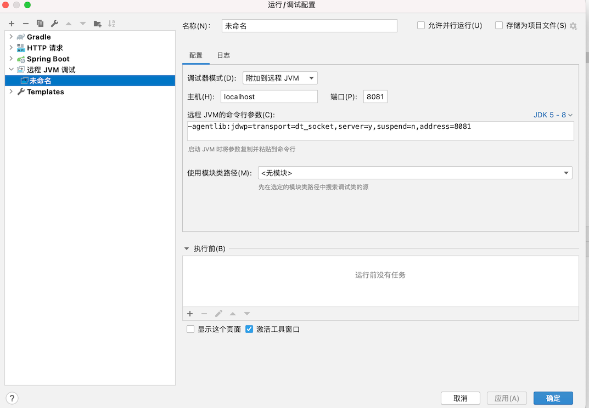

# Tomcat 远程 debug

使用本地 idea 调试远程部署的项目。它使用了 JDWP 协议来达到此功能

[JDWP](https://developer.ibm.com/zh/articles/j-lo-jpda3/) 是 Java Debug Wire Protocol 的缩写，它定义了调试器（debugger）和被调试的 Java 虚拟机（target vm）之间的通信协议。

笔者这里只记录 spring boot 的启用 jdwp 方法，在运行 jar 包的时候，设置启动变量配置：

```
-Xdebug -Xrunjdwp:server=y,transport=dt_socket,address=8081,suspend=n
```

- `server`：

  y 表示启动的 JVM 是被调试者。如果为 n，则表示启动的 JVM 是调试器。

- `suspend`：

  y 表示启动的 JVM 会暂停等待，直到调试器连接上。

  如果你想从 Tomcat 启动的一开始就进行调试，那么就必须设置 suspend=y。

## 准备工作

准备一段业务代码，后面来调试这个业务代码

```java
package cn.mrcode.stady.monitor_tuning.chapter5;

import org.springframework.web.bind.annotation.RequestMapping;
import org.springframework.web.bind.annotation.RestController;

@RestController
@RequestMapping("/ch5")
public class Chapter5Controller {
    @RequestMapping("hello")
    public String hello() {
        String str = "";
        for (int i = 0; i < 10; i++) {
            str += i;
        }
        return str;
    }
}

```

在本地运行打包好的 bootJar

```bash
mrcode@mrcode libs % java -jar -Xdebug -Xrunjdwp:server=y,transport=dt_socket,address=8081,suspend=n monitor-tuning-0.0.1-SNAPSHOT.jar
```

## Idea 配置调试



其他的都说默认的，我只是修改了下端口号，保存后启动，链接成功，在控制台则会打印如下信息

```
已连接到目标 VM, 地址: ''localhost:8081'，传输: '套接字''
```

可以看到，不只是 tomcat 可以远程调试，只要是 java 程序就可以添加启动参数达到这个效果。

::: tip

此技能在开发阶段，进行远程调试是很有用的，不适合上线阶段。

:::