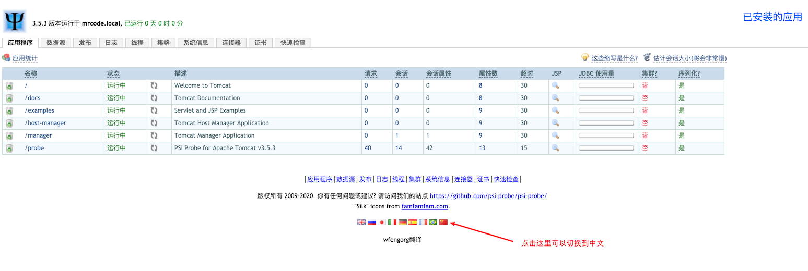

# psi-probe 监控 Tomcat

[psi-probe GitHUb](https://github.com/psi-probe/psi-probe) ，可以下载 [已经打包好的 war](https://repo1.maven.org/maven2/com/github/psi-probe/psi-probe-web/)，还可以 clone 项目下来自己编译打包。

这里笔者下载 [psi-probe-web 3.5.3 的 war 包](https://repo1.maven.org/maven2/com/github/psi-probe/psi-probe-web/3.5.3/)，并修改包名为 `probe.war`，然后放到 tomcat 的 `webapps` 目录下。

等待启动完成后，访问：`http://127.0.0.1:8080/probe/`

:::tip

注意：访问该地址，也是需要前面讲解的 tomcat manager 配置的两个文件，配置用户和访问地址来保证管理界面的安全性

:::

