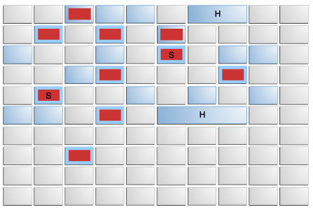

# 垃圾收集器

常见的垃圾收集器有三种：

- 串行收集器 Serial：Serial、Serial Old
- 并行收集器 Parallel：Parallel Scavenge、Parallel Old 以吞吐量优先
- 并发收集器 Concurrent：
  - CMS
  - G1
  
  停顿时间优先，也就是响应时间有限

## 串行收集器

单线程的，发现 jvm 内存不够用，暂停应用程序的执行，执行垃圾回收，回收完成之后，再继续执行应用程序

主要用于嵌入式的小型内存场景中。

## 并行 VS 并发

垃圾收集器中的并行并发并不是平时高并发中的并发。

- 并行（Parallel）

  指多条垃圾收集线程并行工作，但此时 **用户线程仍然处于等待状态**。

  适合科学计算、后台处理等弱交互场景。

- 并发（Concurrent）

  指用户线程与垃圾收集器线程同时执行（但不定是并行的，可能会交替执行），垃圾收集线程在执行的时候不会停顿用户程序的运行。

  适合对响应时间有要求的场景，比如 Web

## 停顿时间 VS 吞吐量

垃圾收集器中的吞吐量也不是平时高并发中的吞吐量

- 停顿时间

  垃圾收集器做垃圾回收中断应用执行的时间。 `-XX:MaxGCPauseMillis`

- 吞吐量

  花在 **垃圾收集** 的时间和花在 **应用时间** 的占比。

  `-XX:GCTimeRatio=<n>`，垃圾收集时间占 `1/1 + n`

评判一个垃圾收集器的好坏：在吞吐量最佳的时候，停顿时间最少。但是在现实中，这两个指标很难同时做到都优秀，一般都是互斥的。

## 串行收集器

开启串行收集器：

- `-XX:+UseSerialGC `：这个是对新生代开启串行，但是会将老生代默认启用下面的参数，也就是老生代的串行 GC

- `-XX:+UseSerialOldGC`

## 并行收集器

它是以 **吞吐量优先** 的垃圾收集器，开启方式：

- `-XX:+UseParallelGC`
- `-XX:+UseParallelOldGC`

该收集器在 Server 模式下是默认的收集器。

::: tip 什么是 Server 模式？

jvm 会根据当前机器的配置判定开启 server 模式还是 client 模式，一般来说，机器内存大于 2G，就会启用 server 模式

:::

下面可以来看下我们启动的应用程序默认启用的垃圾收集器

```bash
mrcode@mrcode ~ % jps -l
20572 org.gradle.launcher.daemon.bootstrap.GradleDaemon
20575 cn.mrcode.stady.monitor_tuning.MonitorTuningApplication

mrcode@mrcode ~ % jinfo -flag UseParallelGC 20575
-XX:+UseParallelGC
```

## 并发收集器

是以响应时间有限的垃圾收集器。在 JDK 中有两种并行的收集器，开启方法如下：

### CMS

- `-XX:+UseConcMarkSweepGC`

- `-XX:+UseParNewGC`

  

```bash
# 首先看现在的应用，该收集器并没有开启
mrcode@mrcode ~ % jinfo -flag UseConcMarkSweepGC 20575 
-XX:-UseConcMarkSweepGC

# 添加启动参数，并重启程序后，再次观察
mrcode@mrcode ~ % jinfo -flag UseConcMarkSweepGC 20801
-XX:+UseConcMarkSweepGC
```

### G1

开启方式：`-XX:+UseG1GC`

## 垃圾收集器搭配

在不同的区里面使用的垃圾收集器不同，前面讲过，JDK 使用的是分代垃圾回收方式


两个区里面的收集器不一样，但是上线有连线的是成对搭配使用的。在 JDK8+ 中，建议使用 G1 收集器，性能较高

其中虚线是在某些情况下，CMS 会退化成 SerialOld 收集器。我们课程的终点是  G1 收集器。

## 如何选择垃圾收集器

一般有如下建议：

- 优先调整堆的大小，让服务器自己来选择
- 如果内存小于 100M，使用串行收集器
- 如果是单核，并且没有停顿时间的要求，串行或则 JVM 自己选择
- 如果允许停顿时间超过 1 秒，选择并行或则 JVM 自己选择
- 如果响应时间最重要，并且不能超过 1 秒，使用并发收集器

官方文档中有讲解，在 [JDK8](https://docs.oracle.com/javase/8/) 页面中的 [**HotSpot Virtual Machine Garbage Collection Tuning Guide**](https://docs.oracle.com/javase/8/docs/technotes/guides/vm/gctuning) 中，专门讲解如何进行 GC 调优。非常详细

## Parallel Collector

- `-XX:+UseParallelGC`  手动开启

  Server 模式默认开启

- `-XX:ParallelGCThreads=<N>` 使用 n 个 GC 线程

  默认 n 为以下计算方式：

  - `CPU > 8`：`N=5/8`
  - `CPU < 8`：`N=CPU`

垃圾收集器有一个自适应功能（Ergonomics），比如设置以下三个参数：

- `-XX:MaxGCPauseMillis=<N>`
- `-xx:GCTimeRatio=<N>`
- `-Xmx<N>`

它会按照顺序平衡前两个。也就是会进行动态的调整各个区的大小

### 动态内存调整

- `-XX:YoungGenerationSizelncrement=<Y>`：增加 Young 区内存大小，默认值为 20%

- `-XX:TenuredGenerationSizelncrement=<Y>`：增加 Old 区内存大小，默认值为 20%
- `-XX:AdaptiveSizeDecrementScaleFactor=<Y>`：：减少内存大小，默认值为 4%

## CMS Collector

它是一个 **并发收集**，低停顿、低延迟，是一个老年代收集器

### CMS 垃圾收集过程

1. CMS initial mark：初始标记 Root，STW （停止应用程序）

2. CMS concurrent mark：并发标记

3. CMS-concurrent-preclean：并发预清理

4. CMS remark：重新标记，STW（停止应用程序）

   此时应用程序还在运行，有可能又有垃圾了，所以重新标记

5. CMS concurrent sweep：并发清除

6. CMS concurrent reset：并发重置

### CMS 缺点

- CPU 敏感

  比如设置一个并发线程，那么只有双核的时候，垃圾收集器就会占用其中一个，这个时候就只有一个核心为应用工作了

- 浮动垃圾：会产生浮动垃圾

  因为程序还在运行，一边回收，一边分配，就会产生浮动垃圾

- 空间碎片

### CMS 的相关参数

- `-XX:ConcGCThreads`：并发的 GC 线程数

- `-XX:+UseCMSCompactAtFullCollection`：FullGC 之后做压缩

  上面说会产生碎片，所内存压缩就相当于在清除空间碎片

- `-XX:CMSFullGCsBeforeCompaction`：多少次 FUllGC 之后压缩一次

- `-XX:CMSInitiatingOccupancyFraction`：触发 FullGC

  Old 区在填满多少存活对象的时候触发一次 FullGC，该值默认值应该是 90%+

- `-XX:+UseCMSInitatingOccupancyOnly`：是否动态调整

- `-XX:+CMSScavengeBeforeRemark`：FullGC 之前先做 YGC

  因为在 YGC 之后，会回收一部分垃圾，再做 Old GC 的时候就会减少很多工作。

  笔者疑问：但是不是说是分代垃圾回收吗？怎么还会跨区影响？

- `-XX:CMSClassUnloadingEnabled`：启用回收 Perm 区

  JDK7 以前有该区

如果没有设置，显示 -1，在文档中有说明它的默认值是多少。

```
mrcode@mrcode ~ % jinfo -flag CMSInitiatingOccupancyFraction 20572 
-XX:CMSInitiatingOccupancyFraction=-1
```

CMS 还有一个 iCMS，适用于单核或则双核，因为核数少时，垃圾比较多，回收一次占用时间过长，就会影响应用程序，iCMS 就是为了优化这一点，分多次回收。

## G1 Collector

JDK8 中支持的垃圾回收器，不断的在进化，在 JDK11 中又有了其他的垃圾回收器

[Garbage-First（G1）](https://docs.oracle.com/javase/8/docs/technotes/guides/vm/gctuning/g1_gc.html#garbage_first_garbage_collection) 垃圾收集器是一种服务器样式的垃圾收集器，适用于具有大内存的多处理器计算机。它试图以高概率满足垃圾收集（GC）暂停时间目标，同时实现高吞吐量。全堆操作（例如全局标记）与应用程序线程同时执行。这样可以防止与堆或活动数据大小成比例的中断。

G1 收集器通过多种技术实现了高性能和暂停时间目标。

G1 的首要重点是为运行需要大堆且 GC 延迟有限的应用程序的用户提供解决方案。这意味着堆大小约为 6 GB 或更大，并且稳定且可预测的暂停时间低于 0.5 秒。

它同时是新生代和老生代收集器



它是将堆划分成一块一块的，在逻辑上某些块组成了各种数据区，比如 Old 区。

### G1 的概念

- Region：比如上图中的 H，几个块组成的一个区

- SATB：Snapshot-At-The-Beginning

  它是通过 Root Tracing 得到的，GC 开始时候存活对象的快照，后面再做垃圾回收的时候，会以此基础作为回收

- Rset：记录了其他 Region 中的对应引用本 Region 中对象的关系，属于 points-into 结构（谁引用了我的对象）

###  YoungGC

- 新对象进入 Eden 区
- 存活对象拷贝到 Survivor 区
- 存活时间到达年龄阈值时，对象晋升到 Old 区

### MixedGC

- 回收所有的 Young 和 **部分 Old**，所以不是 FullGC

  这一部分可以通过某些参数设置

- global concurrent marking：全局并发标记

  1. Initial marking phase：标记 GC Root，STW
  2. Root region scanning phase：标记存活 Region
  3. Concurrent marking phase：标记存活的对象
  4. Remark phase：重新标记，STW
  5. Cleanup phase：部分 STW

- MixedGC 时机，通过以下参数控制

  - `InitiatingHeapOccupancyPercent`：堆占有率达到这个数值则触发 global concurrent marking ，默认 45%
  - `G1HeapWastePercent`：在 global concurrent marking 结束之后，可以知道区有多少空间要被回收，在每次 YGC 之后和再次发生 Mixed GC 之前，会检查垃圾占比是否达到此参数，只有达到了，下次才会发生 Mixed GC。

### MixedGC 相关参数

- `G1MixedGCLiveThresholdPercent`

  Old 区的 region 被回收时候的存活对象占比

- `G1MixedGCCountTarget`

  一次 global concurrent marking 之后，最多执行 Mixed GC 的次数

- `G1OldCSetRegionThresholdPercent`

  一次 Mixed GC 中能被选入 CSet 的最多 old 区的 region 数量

### 常用参数

- `-XX:+UseG1GC`：开启 G1
- `-XX:G1HeapRegionSize=n`：region 的大小，1-32M，最多 2048 个
- `-XX:MaxGCPauseMillis=200`：最大停顿时间
- `-XX:G1NewSizePercent`
- `-XX:G1MaxNewSizePercent`
- `-XX:G1ReservePercent=10` ：保留防止 to space 溢出，默认是百分之 10
- `-XX:ParallelGCThreads=n` ：SWT 线程数
- `-XX:ConcGCThreads=n` ：并发线程数= `1/4*并行`

### 最佳实践

- 年轻代大小：

  避免使用 `-Xmn`、`-XX:NewRatio` 等显示设置 Young 区大小，会覆盖暂停时间目标

- 暂停时间目标：

  暂停时间不要太严苛，其吞吐量目标是 90% 的应用程序时间和 10% 的垃圾回收时间，太严苛会直接影响到吞吐量

MixGC 调优：

- `-XX:InitiatingHeapOccupancyPercent`
- `-XX:G1MixedGCLiveThresholdPercent`、`-XX:G1HeapWastePercent`
- `-XX:G1MixedGCCountTarget`
- `-XX:G1OldCSetRegionThresholdPercent`


::: tip

本章笔者是第一次接触，看得有点懵逼，记录也只是硬着头皮记录下来，某些并没有看懂

后续有此需求，还是需要去阅读官方文档的调优指南来理解。

:::

### 是否需要切换到 G1

- 50% 以上的堆被存活对象占用
- 对象分配和晋升的速度变化非常大
- 垃圾回收时间特别长，超过了 1 秒

